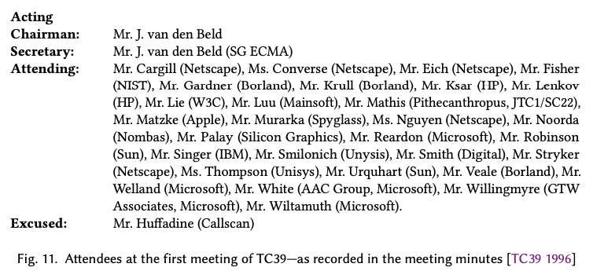
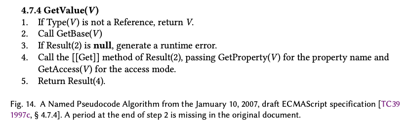
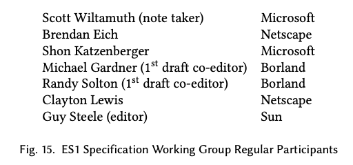
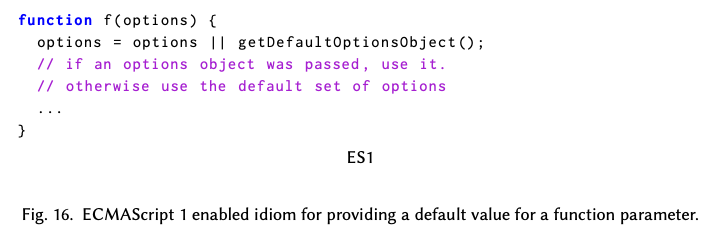
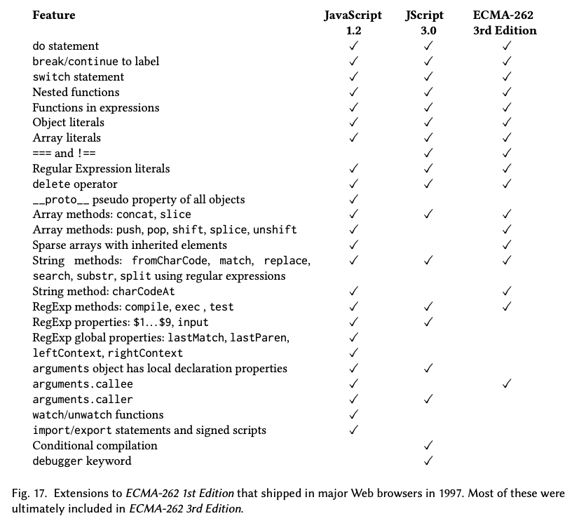
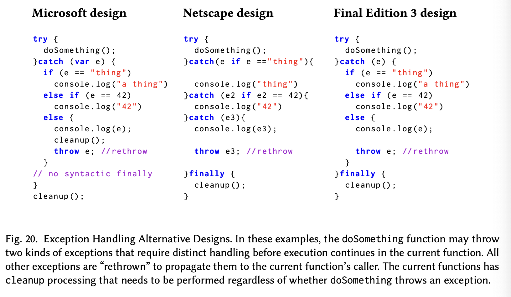
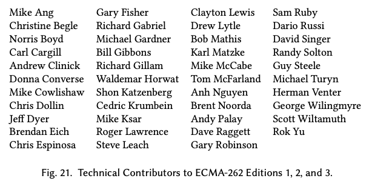

# Part 2: 표준을 만들다(Creating a Standard)

# 7. 장소 찾기(Finding a venue)

1995년 모카 프로젝트가 시작했을 때도 표준이 필요하다는 것은 이미 명백했다. 서로 다른 웹 브라우저들에서 웹 페이지들이 호환될 수 있도록 하기 위해서였다. 이는 넷스케이프와 선의 Javascript 발표[1995]에서 공식적으로 인정되었다.

넷스케이프와 선은 Javascript를 인터넷의 스크립트 언어 표준으로 만들기 위해 W3 Consortium (W3C)와 Internet Engineering Task Force (IETF)에 Javascript를 제안했다.

하지만 W3C나 IETF 모두 벤더 독립적인 Javascript 사양을 만드는 데에 적합한 장소는 아니었다. IETF는 프로그래밍 언어보다는 인터넷 프로토콜과 데이터 포맷에 더 초점을 맞추고 있었다. W3C는 새로운 조직이었는데 그곳의 기술적인 대표단은 웹 기술 생태계에 새로운 명령형 프로그래밍 언어를 추가하는 것에 관심이 없었다. 버너스 리와 협업한 로버트 카이유는 인터뷰에서 이렇게 회상했다. [Wikinews 2007]

---

나는 프로그래밍 언어를 만들어야 한다고 확신했다. 하지만 팀(버너스 리) 등의 개발자들은 매우 반대했다. 그건 완전히 선언적으로 남아 있어야 했다.

---

1996년 초에 브라우저 기술은 "인터넷 시간"[^30] [Iansiti and MacCormack 1997]에 따라서 빠르게 진행되고 있었다. 하지만 언어 표준화는 느리고 자주 논쟁이 있기로 유명했다. 마이크로소프트가 브라우저 경쟁에 진지해지면서, 넷스케이프와 선은 마이크로소프트가 웹 스크립팅 표준의 개발을 주도하려 하는 것, 그리고 표준의 초점을 다시 비주얼 베이직 기반 언어로 맞추려는 것을 우려했다. 그래서 1996년 봄 넷스케이프와 선은 Javascript 표준을 보호하면서 빠르게 초안을 만들 수 있는 공인된 표준 개발 조직을 찾아야 했다. 그 조직은 마이크로소프트의 참여는 있지만 지배는 없어야 했다. 넷스케이프에서 일하던 표준 전문가 칼 카길은 Ecma International의 사무총장인 얀 반 덴 벨드를 알고 있었고, 자바스크립트 표준화를 Ecma 쪽으로 유도했다. Ecma는 사업에 초점을 맞추는 표준 조직이라고 스스로를 정의한다. Ecma는 표준 개발 시간을 최소화하기 위해 관료적인 과정을 최소화한다. 국제 표준 기구(International Standards Organization)는 Ecma를 인정하기에 Ecma 표준은 ISO 표준이 되기 위한 패스트트랙 과정을 사용할 수 있다. 그리고 카길의 연결뿐만 아니라 선(Sun)또한 Ecma 회원이었다. 그리고 마이크로소프트의 이의에도 불구하고 윈도우 API 표준을 발행한 것으로 Ecma의 독립성이 입증되었다고 Sun에서는 간주했다. [LaMonica 1995]

1996년 봄과 여름 동안 넷스케이프, 썬, 그리고 얀 반 덴 벨드 간의 비공식적인 접촉과 논의가 이루어졌다. 9월에 Ecma 조정[^31] 위원회(1996b)는 넷스케이프의 Javascript 표준화 활동 시작 요청을 고려하여 1996년 11월 4-5일 실리콘 밸리에서 프로젝트 개시 회의를 개최하기로 결정했다. 넷스케이프는 공식적으로 Ecma 준회원[^32] 멤버십을 신청했다[Sampath 1996]. 10월 30일에는 "자바스크립트 프로젝트 개시 회의"에 대한 공개 초대장 [Ecma International 1996a]이 발행되었다. 만약 그게 충분한 관심을 받으면 새로운 Ecma 기술 위원회가 조직될 예정이었다. Ecma는 소속된 기술 위원회들에 숫자 번호를 붙이는데, 사용 가능한 다음 번호는 39였다. 1996년 12월 Ecma 총회는 반기 회의에서 TC39 창설과 업무 기술서 제작을 승인했다. 동시에 마이크로소프트가 일반 회원으로 Ecma에 가입했다.

# 8. 첫 TC39 회의(The First TC39 meeting)

TC39를 조직하는 회의는 1996년 11월 21-22일 캘리포니아 마운틴뷰의 넷스케이프 사무실에서 열렸다. 회의록 [TC39 1996]에 따르면 참석자는 총 30명이었다(그림 11). 회의는 Ecma를 대표하여 참석한 Jan van den Beld와 넷스케이프의 코어 기술 부사장인 David Stryker의 환영사로 시작되었다. Stryker는 위원회가 당시의 구현에서 최소한의 변화만 있는 명세를 만들기를 희망하며 그 이상의 언어 확장은 미래로 미루어지길 바란다고 했다. 



마이크로소프트 인터넷 익스플로러 개발팀 리더 Thomas Reardon은 위원회가 HTML 객체 모델에 대한 내장 라이브러리 작업을 W3C에 맡기는 것이 좋다고 권했다. 작업 중복을 피하기 위해서였다. 위원회는 이 권고를 받아들였다. 이는 위원회의 초기 성공에 핵심적인 역할을 했다. 넷스케이프와 마이크로소프트의 핵심 언어 기능은 매우 유사했지만 HTML API는 크게 달랐기 때문이다. TC39가 오직 플랫폼/호스트 환경에 독립적인 표준만 개발하기로 한 결정은 일관적인 TC39의 핵심 운영 원칙 중 하나가 되었다. Reardon은 마이크로소프트가 JScript를 넷스케이프와 완전히 호환되도록 하기 위해 겪었던 어려움들을 이야기하며 언어 명세의 공식화 필요성을 강하게 주장했다. 하지만 경쟁 구현체들이 가치를 더할 수 있는 여지를 남겨두어야 한다고도 이야기했다.

제안된 의제에는 먼저 넷스케이프, 선, 마이크로소프트, Nombas Inc.의 기술 발표가 있었다. 그뿐만 아니라 새로운 Ecma 기술 위원회를 설립하고 표준 언어 명세를 작성하는 작업을 시작하는 데 필요한 실제 조직 활동도 의제에 있었다. 그러나 회의에서 선은 아무것도 발표할 필요가 없다고 말했고, Borland International의 발표가 추가로 포함되었다.

넷스케이프와 불랜드는 회의가 시작할 때 기술 명세의 초안을 배포하였다. 마이크로소프트는 그렇지 않았다. Thomas Reardon의 발표 중에, 마이크로소프트가 자체적으로 초안 명세를 개발했다며 문서를 들어 보였다. Reardon은 아직 복사본을 준비하지 못했지만 다음 날 복사본을 제공할 것이라고 주장했으므로, 마이크로소프트의 기술 발표는 회의 둘째 날로 이동되었다.

넷스케이프와 Borland는 회의 시작 시 기술 명세 초안을 배포했다. 마이크로소프트는 그러지 않았다. Thomas Reardon이 발표 중에 마이크로소프트가 초안 명세를 개발했다고 언급하며 문서를 들어 보였다. Reardon은 아직 시간이 부족해서 복사본을 준비하지 못했고 다음 날 복사본을 제공할 거라고 했다. 그래서 마이크로소프트의 기술 발표는 회의 둘째 날로 미뤄졌다.

Brendan Eich도 그 자리에 참석했지만, 넷스케이프의 기술 발표는 Anh Nguyen이 진행했다. 그 발표에서는 Eich와 C. Rand McKinny가 작성한 JavaScript 1.1의 JavaScript 언어 명세 초안을 소개했다 [1996]. 넷스케이프는 이를 Ecma에 기여하여 표준화 노력의 기초 문서 중 하나가 되도록 했다. Nguyen은 넷스케이프 Navigator 3의 JavaScript 1.1이 넷스케이프 2의 초기 JavaScript 버전과 몇 가지 차이가 있다고 설명했다. 넷스케이프의 명세는 ANSI C 언어 표준 [ANSI X3 1989]에서 사용된 것과 유사한 BNF 표기법을 사용하여 언어 구문을 기술했다. 대부분의 시맨틱을 비공식적인 산문체로 썼고 언어의 강제 형변환 규칙을 기술하기 위해서는 표 형식을 사용했다.

볼랜드는 Javascript의 서버 구현과 Javascript IDE를 만들었다[Lazar 1997]. 볼랜드의 발표는 그들이 이미 구현했거나 구현할 예정인 여러가지 확장들에 중점을 두었다[Borland International 1996]. 그들의 주요 확장은 클래스 정의, try/catch/finally 예외 처리, C 언어 스타일 switch 문, 코드 블록을 일급 값으로 사용하기, 배열 리터럴, C 언어 스타일 전처리기, 그리고 내장 라이브러리에 추가된 몇 가지 I/O 기능 등이었다. 볼랜드도 넷스케이프의 구현과 호환성을 갖도록 하기 위해 겪었던 어려움을 강조하며 상호 호환 가능한 구현을 위해 더 공식적인 명세가 필요하다고 말했다.

Nombas Inc.의 Brent Noorda는 Nombas Inc.가 Cmm("C minus minus")을 스크립팅 언어로 시장에 출시한 경험에 대해 발표했다. Cmm의 표면적인 문법과 몇몇 시맨틱은 Javascript 1.0과 상당히 비슷했다. Nombas는 이후 Cmm 구현을 임베디드 애플리케이션용 ECMAScript 구현으로 발전시켰다[Noorda 2012].

회의 첫 날이 끝나자마자, 마이크로소프트의 Robert Welland는 할 일이 있었다 [Welland et al. 2018, at +8:30]. Thomas Reardon이 발표에서 복사본을 만들 시간이 없었다고 주장한 건 Welland에게 마이크로소프트 명세 작업에 더 많은 시간을 주기 위한 지연 전술이었다. 회의를 위해 명세 문서를 작성하는 건 마이크로소프트의 테크니컬 라이터에게 맡겨졌었다. 그런데 Welland는 회의에 참석하기 직전 이 문서를 받았을 때 그 문서가 초기 언어 명세로조차 부적합하다고 판단했다. 그는 그 문서를 위원회에 제출하고 싶지 않았다. 하지만 그가 회의 시작 전 넷스케이프의 문서를 보았을 때 Welland는 넷스케이프가 작성한 문서도 언어 명세로 부족하다고 느꼈다. 그는 넷스케이프의 문서가 표준 개발을 위한 유일한 기초 문서가 되는 것을 원하지 않았다. 그래서 Welland와 Reardon은 하루를 지연시켜서 더 나은 문서를 준비하고 회의 둘째 날이 시작할 때 제시하기로 결정했다.

회의가 끝난 후 Robert Welland는 Walter Smith의 집을 방문했다. Walter Smith는 마이크로소프트에서 일하고 있었지만 여전히 Bay Area에 거주하고 있는, Welland와 NewtonScript 작업을 함께했던 동료였다. 그들은 밤새도록 마이크로소프트의 문서를 핵심 Javascript 언어의 그럴듯한 초기 명세로 바꾸는 작업을 했다. 그들의 명세는 ANSI C 표준의 많은 문법을 빌려왔고 형변환 규칙에 표를 사용했다. 하지만 Welland는 나머지 시맨틱이 더 형식적으로 명시되기를 원했다. 그는 LISP 1.5 Programmer’s Manual[McCarthy and Levin 1965]이 Lisp 인터프리터의 시맨틱을 설명할 때 먼저 해당 문법이 어떻게 평가되어야 하는지를 엄밀하게 기술하고 그 문법적 형태가 바로 따라 나오는 방식을 쓴 것을 기억해냈다 [Welland et al. 2018, at +10:10]. 어떤 경우 시맨틱은 의사코드를 사용하여 제시되었다[^33]. Welland는 Javascript의 평가 시맨틱을 설명하기 위해 단계별로 번호가 매겨진 비슷한 스타일의 의사코드를 사용하기로 결정했다.

Welland와 Smith는 당시의 JScript 구현을 바탕으로 문서에 의미론을 추가했다. 확신이 서지 않는 부분이 있으면 그들의 Self와 NewtonScript 경험으로 돌아가서, 그 관점에서 보고 타당한 것들을 기술했다. 문서에는 Array의 객체 다이어그램도 있었는데 이것은 매우 Self와 비슷한 방식으로 속성 상속을 모델링했다. 다음날 아침까지 그들은 출발점으로 사용하기에는 충분히 좋다고 느껴지는 문서를 만들었다. 그들은 문서를 복사했고 Welland는 회의 둘째날이 시작할 때 그것을 배포했다. 그 문서의 제목은 "The JScript Language Specification, Version 0.1 [Welland et al. 1996]"이었고, Ecma의 표 대한 마이크로소프트의 기초 문서 기여가 되었다.

회의 참석자들은 Welland의 문서를 일반적으로 좋아했고 상호 호환이 가능한 구현을 보장하기 위해서는 더 형식적인 명세가 필요하다는 데에 동의했다. 그리고 Robert Welland는 발표를 하면서 이 사실에 기뻐했다. 하지만 아직 없는 공식 명세를 기다리는 쪽으로 합의되지는 않았다. 대신 넷스케이프, 마이크로소프트, 볼랜드가 기여한 명세들을 통합하여 표준의 초기 초안을 만들고 그 초안을 더 완전하고 정확하게 만드는 작업을 하는 쪽으로 합의되었다. 그 첫번째 단계로 위원회는 표준의 첫 번째 버전에서 해결하거나 명확히 해야 할 사항들의 목록 [부록 G]을 생성했다. 기초 문서 제출이 2개 있었기 때문에 어떤 문서에서 편집을 시작할지 둘 중 하나를 골라야 했다. 넷스케이프의 문서는 FrameMaker를 사용하여 작성되었고, 마이크로소프트의 문서는 Word를 사용하여 작성되었다. Ecma 대표들은 그들의 내부 편집 과정이 Word를 사용한다고 설명하며 위원회에서 마이크로소프트의 기여를 기초 문서로 사용하기로 합의했다. Welland는 이 사실에 놀랐다.

> Chairman: Mr. G. Robinson (Sun)
> Vice-Chairman: Mr. C. Cargill (Netscape)
> Vice-Chairman: Mr. S. Wiltamuth (Microsoft)
> Principal editor: Mr. M. Gardner (Borland) (to be confirmed)
> Assistant editor: Mr. A. Murarka (Spyglass) (to be confirmed)
>
> Fig. 12. Officers Elected at First TC39 Meeting [TC39 1996]

위원회는 초기 임원진(그림 12)을 선출하고 매우 공격적인 목표를 설정했다. 1997년 1월 다음 회의까지 첫 번째 초안 작성, 1997년 4월 최종 초안 작성 후 1997년 6월의 Ecma 총회에서 표준 승인을 목표로 했다. 위원회는 약 6주 간격으로 다음 회의 일정을 잡고 사설 메일링 리스트와 ftp 서버를 설정하기 위한 조치를 시작했다[^34].

TC39의 두 번째 회의 [1997e]는 1997년 1월 14일과 15일에 열렸다. 회의에는 Ecma 회원이 아닌 5명의 게스트를 포함해서 22명이 참석했다. Jan van den Beld는 Ecma 총회에서 TC39의 설립이 확정되었다고 발표했다. 그는 TC39가 가능한 한 빨리 Ecma의 회원 자격과 참여에 관한 규칙을 따르기 시작해야 한다고 강조했다. Ecma 표준의 개발에 기여하는 자들은 Ecma 회원인 기관의 대표들이어야 한다고 말이다.

회의에서 다루어진 주요한 기술 사안은 표준의 첫번째 초안[TC39 1997c]의 검토와 토의였다. Borland의 Michael Gardner와 Randy Solton은 Netscape, Microsoft, Borland의 기여를 통합하여 문서를 만들었다. Spyglass는 Ecma에 가입하지 않았기 때문에 Anup Murarka는 첫 번째 초안 개발에 참여하지 않았다. 세 가지 구현에서 완전히 동일한 기능은 논쟁의 여지가 없는 것으로 간주했다. 그리고 구현 간에 기능이 달랐던 부분은 조정되어야 하는 것으로 분류했다.

특정 구현에만 있었던 기능은 "제안된 확장" 부록에 정리되었다. 위원회는 어떻게 확장들을 처리할지 논의했다. 그 결과 확장보다는 모든 당시의 구현에서 공통적이었던 핵심 기능들을 구현하는 것을 우선시하기로 합의했다. 그리고 명세는 기존 애플리케이션을 수정해야 하도록 만드는 변경사항(역주: 즉 breaking change)을 피해야 한다는 합의도 있었다. 이는 표준의 모든 후속 개정들에서도 중요한 설계 지침이 되었다.

촉박한 일정을 맞추기 위해 위원회는 편집자들과 함께 명세의 빠진 부분을 보충하고 중요한 기술적 이슈를 고치는 작업을 할 즉석의 기술 작업 그룹(ad hoc technical working group)을 만들었다. 이 그룹은 전자상으로 소통하고 한 주는 대면 회의, 한 주는 원격 회의로 번갈아가면서 주간 회의를 진행하기로 했다. Scott Wiltamuth가 조사 위원으로 활동할 예정이었다. TC39 회의는 1월 15일 오전 10시 30분에 끝났고 나머지 시간은 즉석 기술 작업 그룹의 회의에 사용되었다.

회의 이후 Borland는 Ecma에 가입하지 않기로 결정했다. 그래서 Michael Gardner는 편집자로 계속 활동할 수 없었다. Sun은 Guy Steele을 보냈고 그는 1997년 1월 말부터 표준의 첫 번째 판이 나오는 1997년 9월 초까지 편집자로 활동했다.

# 9. 명세를 향한 여정(Crafting the Specification)

Michael Gardner와 Randy Solton은 11월 회의 직후 첫번째 명세 초안의 작업을 시작했다. 그리고 이후 6주간 놀라운 진전을 이뤘다. Gardner와 Solton 외에도 첫번째 초안에는 다음과 같은 기술 기여자들이 적혀 있다. Brendan Eich(넷스케이프), C. Rand McKinney(넷스케이프), Donna Converse(넷스케이프), Shon Katzenberger(마이크로소프트), Robert Welland (마이크로소프트).

Robert Welland는 Redmond로 돌아가서 자신이 만든 JScript 0.1 명세를 Shon Katzenberger에게 맡겨 계속 개발하도록 하였다 [Welland et al. 2018, at 12:02]. 수학 박사였던 Katzenberger는 형식적인 표기법에 익숙했고, Javascript 시맨틱을 기술하는 데에 의사 코드 개념(부록 P)이 잘 맞다고 판단했다. 의사 코드는 Katzenberger가 생각하기에 상호 호환성을 보장할 만큼의 충분한 세부사항을 제공했다. Katzenberger는 표준 개발에 있어서 마이크로소프트의 주요한 기술 기여자가 되었다. Katzenberger는 Welland와 Smith가 늦은 밤 작업한 것을 실행 중인 구현과 비교 검토하고, 그들이 다루지 않았던 부분들에 대한 추가적인 의사 코드 알고리즘을 작성하여 확장하였다. 그 다음 그렇게 새로 수정된 자료를 공식 초안에 포함시키기 위해 Borland 편집자들에게 전달하였다. 2018년 인터뷰에서 Katzenberger [Welland et al. 2018, at 21:16]는 명세 편집 과정에서 종종 자신의 알고리즘이 의도치 않게 망가졌다는 사실에 불만이 있었다고 회상했다. Guy Steele이 편집자로 활동하게 되자 그는 매우 만족했다.

1997년 1월 10일의 초안 [TC39 1997c]은 명세의 기본 구조(그림 13)를 확립하였다. 그리고 언어의 정의에 사용된 많은 기본적인 기술과 관례와 용어를 정의했다. 이때 만들어진 많은 부분은 20년이 지난 지금의 ECMAScript 표준에서도 여전히 사용되고 있다.

문법 규칙에 대한 설명은 대부분 넷스케이프가 작성한 사양에서 가져온 것이다. 하지만 표현식과 문장 문법의 구조와 생성 규칙은 대부분 마이크로소프트가 작성한 사양에서 사용된 것을 따랐다. 표현식 문법은 두 가지 기여 사항과 모두 달랐는데 함수 호출의 우선순위, 객체 생성(new 연산자), 객체 속성 접근 표현식 등의 세부 사항에서 차이가 있었다.

당시 초안은 자동 세미콜론 삽입(ASI)의 규칙을 파싱 과정의 에러 수정 과정으로 정확하게 정의하려고 시도한다. 문장 문법은 복합 문장이 아닌 문장에 대해서 문장 종결을 위한 세미콜론을 요구한다. 따라서 자동 세미콜론 삽입이 없으면 세미콜론을 빼먹을 시 구문 오류가 발생한다. ASI 명세는 Javascript 파서가 세미콜론이 있다고 가정하고 파싱을 다시 함으로써 구문 오류를 수정해야 할 때가 언제인지를 정의한다. 첫 번째 초안의 ASI 규칙은 불완전했고 이후의 초안과 ECMAScript 명세 판본에서 다시 정의되었다.



1월 10일의 초안에는 그림 14에서 볼 수 있는 것과 같은 Shon Katzenberger의 의사코드 알고리즘들이 포함되어 있다. 이 알고리즘은 여러 언어 구조의 시맨틱을 정의하기 위해서 사용되었다. 알고리즘들은 순차적으로 번호가 매겨진 단계들과 그 단계들 간에 간단한 조건부 제어 흐름으로 구성되어 있다. 각 단계는 명령적인 산문형 문장으로 구성되어 있다. 각 단계를 서술하는 문장들은 자주 발생하는 동작들에 대해서 명세가 정의한 어휘들을 포함한 영어로 작성되었다. 알고리즘은 이름이 지정될 수 있고 명세의 다른 알고리즘에서 "호출"될 수 있다.

이 초안은 또한 알고리즘에서 사용되는 자료형을 정의한다. Number, Boolean, String, Object, Undefined, Null은 ECMAScript 프로그램에서 보이는 값의 종류들이다. Reference, Completion, List 유형의 값은 언어 시맨틱을 정의하는 데 사용되며 ECMAScript 프로그램에 직접적으로 포함되어 있지는 않다.

객체 자료형의 명세는 개별 속성이 어떻게 접근되고 수정되는지를 제어하는 속성 어트리뷰트<sup>g</sup>(attribute)의 개념을 소개한다. 그리고 7가지 어트리뷰트를 정의한다. 그것들은 ReadOnly, ErrorOnWrite, DontEnum, NotImplicit, NotExplicit, Permanent, Internal로 총 7가지였다. 최종적으로는 ErrorOnWrite, NotImplicit, NotExplicit은 제거되었고 Permanent는 DontDelete로 이름이 변경되었다. 객체 속성들은 이런 각각의 내부 속성들을 가지고 있는데 이런 내부 속성들은 ECMAScript 프로그램에서 직접 드러나 있지는 않다. 하지만 이런 내부 속성들(internal properties<sup>g</sup>)는 객체 시맨틱이나 내장 및 호스트 객체의 고유한 동작을 구현하는 데에 필요한 상태를 유지하는 데에 사용된다.

내부 메서드<sup>g</sup> 개념도 도입되었다. 이는 객체의 필수적인 동작들을 정의하는 알고리즘이다. 다양한 종류의 객체들(예를 들어 Array 객체)은 몇몇 내부 메서드를 다르게 정의함으로써 동작의 다양성을 제공할 수 있다. 내부 메서드의 인터페이스는 기본적으로 간단한 메타오브젝트 프로토콜<sup>g</sup>  사양이다 [Kiczales et al. 1991].

명세에서 내부 메소드와 내부 속성은 `[[Foo]]`와 같이 이중 괄호로 둘러싸인 이름을 가진다. 1월 10일 초안은 내부 메소드 `[[Get]]`, `[[Put]]`, `[[HasProperty]]`, `[[Construct]]`, `[[Call]]`과 내부 속성 `[[Prototype]]`을 정의하였다. 이러한 내부 메소드들은 객체 속성 접근, 프로토타입 상속, 그리고 함수 호출의 시맨틱을 처음으로 형식적으로 표현하는 데 사용되었다. ES1이 완성될 때에는 `[[CanPut]]`과 `[[Delete]]` 내부 메소드가 추가되었다.

첫 번째 초안의 목차에는 네이티브(내장된) ECMAScript 객체들과 브라우저 및 웹 서버 호스팅 환경에서 제공되는 객체들에 대한 섹션이 포함되어 있었다. 하지만 이 섹션들은 1월 10일 초안에서는 비어 있었다. 초안 내에서 'Issue'라고 명시적으로 태그된 항목이 스무 개 있었다. 이들은 부록에서 설명하는 언어 확장 외에 추가적인 것들이었다.



1월 10일 초안은 1997년 1월 15일에 열린 첫 번째 기술 작업 그룹 회의의 논의 기반으로 사용되었다. 여기서는 여러 중요한 결정들이 내려졌는데 [Wiltamuth 1997a] 다음과 같은 내용을 포함한다.

- 첫 번째 표준은 브라우저나 웹 서버와 같은 호스트 환경에서 제공하는 라이브러리 객체와 함수들에 대한 명세는 제공하지 않는다. 
- 현재 언어의 확장은 먼저 완전한 초안 명세가 만들어진 후에 고려한다.
- 쉼표와 `?`연산자는 참조값을 전파하지 않는다. 따라서 이들은 할당문의 왼쪽에 쓰일 수 없고 함수 호출에 `this`값을 제공하지 않는다.
- 아스키 코드가 아닌 유니코드 문자는 식별자에 사용하는 것을 허용하지 않는다.
- NUL (U+0000)문자는 문자열 값으로 허용된다.
- 전역 함수와 변수 선언은 enumerable, deletable한 속성을 만든다. 명세에서는 내장 객체의 속성들을 기본적으로 enumerable하지 않고 deletable하지도 않다고 정의한다.

첫번째 작업 그룹 회의에서 해결되지 않은 미해결 이슈는 다중 할당의 평가 순서, 상속된 읽기 전용 속성에 대한 할당의 시맨틱, 1970년 이전의 날짜 값을 어떻게 수용할지 등이 있었다.

작업 그룹(그림 15)은 1997년 4월 중순까지 정기적으로 회의를 가졌다. 그룹은 주요한 문제들과 부차적인 문제들의 목록을 만들고 편집자들이 초안 내용을 작업하고 나면 그것을 검토하는 작업을 했다. 아홉 차례의 작업 회의에 대한 노트가 남아 있다 [Wiltamuth 1997a,b,c,d,e,f,g,h,i]. 작업 그룹 회의 중 일부에 참석한 Richard Gabriel은 회의에서 자주 있었던 개인적인 소통들을 회상했다. Guy Steele는 기능들이 몇몇 엣지케이스에서 어떻게 동작하는지에 대한 질문을 하곤 했다. 때때로 Brendan Eich는 "모르겠다"고 말했고, 때로는 Eich와 Shon Katzenberger가 의심스러워하거나 의견이 달랐다. 그런 경우 그들은 각자의 구현에서 그 테스트 케이스를 시도했다. 만약 각각의 구현에서 같은 동작이 나오면 그것이 명세에 기재된 동작이 되었다. 만약 각 구현 간에 다른 동작이 나오면 그들은 합의에 도달할 때까지 그 문제에 대해 논의했다.

Gardner와 Solton이 작성한 명세 초안에 이어 1997년 2월 27일부터 5월 2일까지 Guy Steele이 작성한 7개의 추가적인 명세 초안이 전체 위원회에 발표되었다. 그리고 작업 그룹 내에서 추가적인 작업 초안이 유통되었다. Ecma 총회를 위한 최종 초안[TC39 1997b]을 제외하면 각 초안은 자세한 문제 해결 로그를 포함하고 있었다 [TC39 1997d].

일부 문제는 Javascript와 그 사용에 장기적인 영향을 미쳤다. 예를 들어 계속해서 논의된 한 가지 주제는 불린 연산자 `&&`와 `||`의 short-circuit 평가에 관한 문제였다. `&&`와 `||` 연산자가 불린으로 형변환 가능한 피연산자를 받았을 때 피연산자 중 하나의 실제 값으로 평가될 것인가("Perl 스타일") 아니면 불린형의 `true` 아니면 `false` 값으로 평가될 것인가("Java 스타일")? Brendan Eich는 대부분의 경우 "Perl 스타일" 시맨틱으로 그것을 구현했지만 몇 가지 경우에는 "Java 스타일"의 동작을 하도록 구현했다. 마이크로소프트와 볼랜드는 모든 경우에 "Java 스타일" 시맨틱을 구현했다. 최종 결정은 "Perl 스타일"을 일관되게 적용하는 것이었다.

그 결정은 몇 년 뒤 널리 사용되는 Javascript 용법을 가능하게 만들었다(역주: `&&`과 `||`이 피연산자의 실제 값을 반환하는 것을 이용해서 `a || b`와 같이 쓰면 `a`가 falsy 값이면 `b`를 사용하는 등의 용법을 말함). null과 undefined는 불린 연산자에 의해 false로 형변환되며 모든 Object 참조는 true로 형변환된다. 이런 문법은 객체 속성과 선택적 함수 매개변수에 대한 기본값을 제공하는 그림 16의 용법을 가능하게 했다.



Brendan Eich는 `==` 연산자가 타입 형변환을 하지 않도록 하는 그의 Javascript 1.2 변경 사항을 포함시키고자 했다고 회상한다. Shon Katzenberger는 그런 변경 사항은 기존의 많은 웹 페이지들을 망가뜨릴 것이므로 너무 늦었다고 성공적으로 반박했다. Eich는 SpiderMonkey의 Javascript 1.3 릴리즈에서 `==` 연산자 동작을 원래대로 되돌렸다.

TC39의 세 번째 회의는 1997년 3월 18일부터 19일까지였다. 이는 6월의 Ecma 총회 전 마지막으로 예정된 공식적인 TC39 회의였다. 그 총회에서 Javascript 표준의 첫번째 판본이 수용되고 승인될 거라고 기대되었다. 이 일정에 맞추기 위해 TC39는 세 번째 회의에서 총회에 표준을 회부하는 것에 대한 투표를 해야 했다.

3월 12일 초안 버전 0.12 [TC39 1997a]가 전체 위원회에 배포되었다. 그리고 3월 14일의 작업 그룹 회의에서 논의되었다[TC39 1997f]. 이 초안은 기술적으로 거의 완성되어 있었다. 하지만 Date 객체의 복잡한 정의 부분은 여전히 각 섹션의 제목들만 적혀 있는 상태였다. Shon Katzenberger는 논의와 검토만 거치면 명세에 통합될 수 있는 수준인, 명세급 수준의 완성된 제안서를 가지고 있었다. 문서는 1월 10일 초안 완성 이후 2달 동안 41페이지에서 96페이지로 늘어났다. 초안 0.12는 Date 객체 명세가 없었고 8개의 "Issue" 태그와 6개의 중요한 문제 추적 부록 항목들을 가지고 있었다. 몇십 개의 다른 문제들이 작업 그룹 회의에서 논의되었고 명세에서 다루어져야 했다.

Scott Wiltamuth는 논쟁의 여지가 있는 문제가 남아 있지 않으며 3월 말까지 완성된 초안을 만들 수 있다고 보증했다. 거기에 따라 TC39는 6월에 승인 투표를 하기 위해 Ecma 총회에 초안을 전달하기로 만장일치로 합의했다. 명세 작업 그룹은 명세 작업을 마무리하고 Ecma 사무국 직원과 협력하여 그들의 일정과 형식적인 요구 사항에 맞는 최종 초안을 제작해야 했다. 초안을 완성하는 것은 Wiltamuth가 예상한 것보다 한 달 더 걸렸다. 1997년 5월 2일 최종 초안[TC39 1997b]이 완성되기 전에 3개의 추가적인 중간 초안이 내부적으로 배포되었다. 그리고 5월 5일에 최종 초안이 Ecma 총회 위원들에게 배포되었다. 최종 초안은 Ecma의 문서 관례를 준수하였고, Richard Gabriel이 작성한 Javascript에 대한 비규범적인<sup>g</sup> 개요를 포함하고 있었다. 1997년 6월 총회는 몇 가지 사소한 편집 변경 사항을 수정한 후 초안을 Ecma 표준 ECMA-262 1판으로 출판하기로 합의했다. 그리고 ISO 패스트트랙 과정에 제출하기로 결정했다. 1997년 9월 10일 편집 변경이 완료되고 TC39에 배포되었다. ECMA-262, 1판은 1997년 9월 16일-17일의 TC39 [1997h] 회의에서 출판을 위해 공개되었다 [Steele 1997].

# 10. 표준 이름 짓기(Naming the Standard)

언어의 이름이 문제가 될 것이라는 사실은 표준화 과정의 시작 단계부터 분명했다. 넷스케이프가 처음에 지은 이름인 'LiveScript'는 Sun과의 전략적 파트너십의 일환으로 'JavaScript'로 변경되었다. Sun은 'JavaScript'라는 이름을 상표로 등록하고 넷스케이프가 그 상표를 사용하도록 허용해 주었다. Sun은 넷스케이프의 스크립팅 언어에 대한 표준화 노력을 지지했지만, 동시에 자바 관련 상표를 적극적으로 보호하고 있었다. Sun이 'JavaScript'라는 상표를 표준 조직이 사용하도록 내어줄 가능성은 희박해 보였다.

TC39의 첫번째 회의의 참석자들은 Sun에게 'JavaScript'라는 이름을 기증할 것을 요청했다. 그리고 더 적당한 이름을 찾을 때까지 'ECMAScript'라는 이름을 임시로 사용하기로 합의했다. Scott Wiltamuth는 이름에 대한 제안을 수집하고 그들의 사용 가능 여부를 확인하는 작업을 맡았다. 

Wiltamuth [1997j]는 16개의 잠재적으로 가능한 이름과, 기존에 존재하는 상표나 중복으로 인해 사용 불가능할 것으로 생각되는 14개의 이름 목록을 제시했다. 간단한 투표를 통해 가장 유력한 후보 이름으로 LiveScript, ScriptJ, EZScript, Xpresso/Expresso/Espresso가 선정되었다. 넷스케이프와 Sun의 대표단은 LiveScript와 JavaScript의 사용 가능성을 조사해 달라는 요청을 받았다. 그동안 'ECMAScript'라는 이름은 명세 초안에서 계속 사용되었다.

Sun은 Ecma에 'JavaScript' 상표를 사용 허가하지 않겠다고 확정했다[TC39 1997f]. 넷스케이프는 표준에 LiveScript 이름을 사용하는 것에 법적인 이의[^35]가 없다고 밝혔다. 그 피드백을 바탕으로 TC39는 넷스케이프와 협력하여 LiveScript의 권리를 확보하고 Ecma가 상표 등록에 대해 조사하기로 합의했다. 그러나 ECMAScript라는 이름은 넷스케이프로부터 서면 확인을 받을 때까지 명세 초안에서 계속 사용될 예정이었다.

Ecma 총회에 제출된 표준 초안은 여전히 언어의 이름으로 ECMAScript를 사용했다. 총회에서는[Ecma International 1997] 상표 등록된 이름을 표준의 제목으로 사용하는 것의 타당성에 대한 우려가 제기되었다. 표준의 목적은 표준을 구현하는 모든 회사를 동등한 선상에 놓는 것이기 때문이다. 또 넷스케이프가 LiveScript라는 이름을 공식적으로 Ecma에 이전해줄 의사가 없다고 결정함에 따라 LiveScript를 언어의 이름으로 사용하는 것은 배제되었다. 총회는 임시 이름인 'ECMAScript'로 표준을 승인하고 TC39에게 9월까지 이름 문제를 해결하도록 지시했다.

이름 문제는 7월의 TC39 [1997g] 회의에서 논의되었다. Scott Wiltamuth는 'RDScript'[^36]라는 이름을 제안했고, Carl Cargill은 'ECMAScript'를 영구적인 이름으로 채택할 것을 제안했다. 어떤 이름이 진짜로 적절한지에 대한 논의가 있었다. 아마도 명세서의 Ecma 문서 번호인 'ECMA-262'가 이름으로 충분할 것으로 보였다. 결국 7월 회의에서는 아무것도 결정되지 않았다. 하지만 9월 TC39 [1997h]는 언어 이름으로 'ECMAScript'를 사용하여 표준을 출판하기로 합의했다.

몇 달 후, 미국의 국가 표준 기구인 ANSI는 ECMA-262를 ISO 표준으로 승인하는 투표에서 다음과 같은 코멘트를 남겼다 [TC39 1998e]. "이 언어의 어떤 구현체건 ECMAScript라고 불릴 가능성은 낮아 보인다. 이는 사용자들에게 표준이 무엇을 의미하는지 그리고 어떤 언어 엔진이 표준을 지원하는지에 대한 혼란을 야기했고 앞으로도 그럴 것이다." 이 예측은 대체로 정확하게 들어맞았다. 대체로 사람들은 브라우저에서 구현된 이 언어를 지칭하는 데에 "Javascript"라는 이름을 계속 사용했고 그 이름은 HTML의 `<script>`요소 명세에도 명시되어 있다. Brendan Eich [2006b]는 나중에 이러한 이름 문제에 대해 자신의 의견을 표현했다: "ECMAScript는 피부병 이름처럼 들리고, 한번도 선호된 적 없는 상표명이었다."

# 11. ISO 패스트트랙(ISO Fast-Track)

Javascript 초기 표준화의 마지막 단계는 Ecma 명세를 국제 표준화 기구(International Standards Organization, ISO) 표준으로 인정받는 것이었다. 1997년 9월 ECMA-262의 첫번째 판이 ISO/IEC 패스트트랙 과정에 제출되었다 [TC39 1997h]. 이후 Guy Steele는 프로젝트 에디터에서 사임했고 IBM의 Mike Cowlishaw가 새로운 프로젝트 에디터가 되었다.

ISO/IEC에서 있었던 무기명 투표는 덴마크, 프랑스, 일본, 네덜란드, 미국의 국가 표준 기구들로부터 27쪽에 달하는 코멘트들 [TC39 1998e]을 끌어냈다. 거기에는 TC39[1998b]가 제출한 코멘트도 포함되어 있었는데, 그 코멘트에는 TC39에서 발견한 오류 목록이 나열되어 있었다. 대부분의 코멘트들은 ECMA-262의 촉박한 제작 과정 중에 놓친 사소한 편집상의 문제들을 지적했다. Date 객체의 2000년 전환 지원과 언어에 유니코드를 통합하는 것과 관련한 몇 가지 중요한 기술적 문제들도 보고되었다.

Mike Cowlishaw는 TC39의 의견을 바탕으로 의견 처리 보고서(Disposition of Comments Report)를 준비했다. 이는 투표 마무리 회의[TC39 1998a]에서 검토되고 승인되었다. 1998년 7월 명세 수정본의 인쇄 원고가 ISO/IEC에 전달되었고 Ecma 일반 회원들에게 우편 투표로 보내졌다. 그들은 수정된 명세를 ECMA-262, 2판 [Cowlishaw 1998]으로 승인했다.

# 12. ES3 정의하기(Defining ECMAScript 3)

TC39의 첫번째 회의에서는 JavaScript 1.0/1.1 언어의 여러 확장이 제안되었다. 그리고 그 중 일부는 언어 명세의 첫번째 초안에 포함되었다. 하지만 TC39는 기본적인 언어의 명세가 완성될 때까지 새로운 기능에 대한 고려는 유예하기로 합의했다. 첫번째 판의 개발 기간 동안, 가능한 확장들은 초안 명세의 부록 부분으로 밀려났다.

1997년 7월의 TC39 회의까지 첫 번째 판의 작업은 거의 완료되었다. 위원회는 이제 명세의 다음 판에 어떤 새로운 기능들을 포함시킬지에 초점을 맞추었다. 넷스케이프는 이미 Javascript 1.2 확장을 포함한 SpiderMonkey 엔진을 탑재한 넷스케이프 4.0을 출시함으로써 자신들의 방향을 제시했다. Scott Wiltamuth는 "ECMAScript 2.0"에 대한 마이크로소프트의 초기 제안[1997]을 발표했는데 여기에는 `switch` 문, `do while` 문, 레이블 문과 레이블이 붙은 `break` 및 `continue`가 포함되어 있었다. 그리고 `===` 및 `!==` 연산자, `arguments` 객체에 `caller` 속성을 추가하는 내용도 포함되었다. 마이크로소프트의 Andrew Clinick [1997]은 조건부 컴파일 지원을 추가하는 별도의 제안을 발표했다. "버전 2"의 시작점은 마이크로소프트가 인터넷 익스플로러 4.0의 구성 요소로 JScript 3.0을 출시했을 때 확고해졌다. 그림 17은 넷스케이프[1997c]와 마이크로소프트[2009b] 브라우저가 1997년 말까지 ECMAScript의 첫 번째 판에 구현한 주요 확장들을 나열하고 있다.

공식 TC39 회의는 각 회원사를 대표하는 그룹과 프로그램 매니저들이 참석하는 관리/전략 세션이 되었다. 위원회의 기술적 작업의 대부분은 비공식적인 기술 작업 그룹에서 진행되었다. 7월 회의에서 TC39는 버전 2를 개발하기 위한 단계들에 대해 합의를 보았다. 그리고 작업 항목, 기능 제안, 수용의 기준을 정하는 것이 기술 작업 그룹의 역할이라는 것에 대한 합의도 있었다. 버전 2에는 첫번째 판에서보다 더 많은 시간이 할당되었다. 초안이 더 성숙해지고 외부 피드백을 받을 수 있도록 하기 위해서였다. 버전 2 명세의 첫 번째 초안은 1997년 12월까지 완성되는 것이 목표였다. 9월 회의에서는 [TC39 1997h] 버전 2 명세가 첫 번째 판의 명세를 따라 작성된 프로그램과의 하위 호환성을 유지해야 한다는 것을 추가적으로 합의했다.


이러한 결정들이 내려졌을 때, ISO의 패스트트랙 과정은 아직 시작되지 않았다. 그리고 ISO 패스트트랙 과정에서 나온 변경 사항으로 인해 ECMA-262의 새로운 판을 ISO 판에 맞게 조정하는 작업이 있을 걸로 예상되지는 않았다. 그러나 1998년 초기는 2개의 작업 그룹이 있었는데 각각의 작업 그룹에서 작업하는 회원들은 중복되었지만 둘은 별개의 명세 초안을 작업하고 있었다. “에디션 2”와 “버전 2”가 같은 출판물이 되지 않을 게 분명해졌다. 하지만 TC39 대표들은 작업 중인 명세 초안이 "제 3판"으로 출판될 거라고 알려졌을 때에도 이 기능 작업들을 계속 "버전 2" 또는 "V2"라고 불렀다. TC39의 내부적인 버전 명명이 최종 출판물의 이름과 충돌하는 경우는 이후에도 또 생기게 된다.



1997년 말 기술 작업 그룹의 참여자들에 큰 변화가 있었다. 그림 18은 1998년을 통틀어서 적어도 두 번의 작업 그룹 회의록에 등장하는 사람들을 나열하고 있다. 명세의 첫번째 판을 개발한 작업 그룹 중에서 Clayton Lewis만이 계속 활동하고 있었다. Brendan Eich는 1998년 2월에 한 회의에 참석한 후 모질라 프로젝트 [Mozilla Organization 1998]의 공동 창립자가 되었다. 이 모질라 프로젝트는 넷스케이프 브라우저의 코드를 오픈소스로 전환하려는 노력이었다. Waldemar Horwat은 TC39에서 넷스케이프의 언어 디자인 리더 역할을 맡았다. 마찬가지로 마이크로소프트의 Katzenberger는 휴직을 하고 다른 프로젝트로 옮겨갔다. 마이크로소프트에서 Katzenberger가 하던 TC39 관련 업무는 Herman Venter 와 Rok Yu가 맡았다.

1997년 10월, 기술 작업 그룹은 버전 2에 포함할 후보 기능들의 목록(부록 H)을 만들었다. 이렇게 명세에 포함하는 것에 대한 합의가 있었던 기능들은 대체로 넷스케이프의 Javascript 1.2와 마이크로소프트 JScript 3.0의 합집합이었다. 그 합집합에서 배제된 것도 몇 가지 있었지만. 이 후보 기능 목록에는 `toSource`도 있었다. 이는 Brendan Eich가 Javascript 1.3[^37]을 위해 개발한 객체 직렬화/지속 스키마에 해당했다. 명세 포함에 대한 합의가 부족한 다른 기능들은 별도로 나열되었다. 첫번째 판에서 그랬던 것과 같이 작업 그룹은 이미 구현된 기능들을 엄밀하게 명세화하고 구현체들 간의 차이를 해결하는 데에 주로 초점을 맞췄다. 하지만 합의된 기능 목록에는 예외 처리 메커니즘, instanceof 연산자, 그리고 다른 기능들 몇몇이 있었는데 이 기능들은 아직 어떤 구현에도 없었다. 이런 기능들은 아직 구현된 적이 없었다. 따라서 이 기능들은 첫번째 판에는 필요하지 않았던 형태의 설계 작업을 요구했다. 그림 19는 1998년 이전 브라우저에는 없었던 기능들 중 최종적으로 ES3에 포함된 기능들을 나열하고 있다.

[^37]: 직렬화 스키마는 개별 객체를 Javascript 소스코드로 직렬화하기 위해 쓰이는 확장 가능한 `toSource` 메서드 집합과 순환 참조를 나타내기 위한 "sharp variables"를 포함했다. 전역 함수 `uneval`은 루트 객체로 시작하는 객체 그래프를 직렬화했다. 그 결과로 생성된 소스코드 문자열은 `eval`을 사용해 역직렬화할 수 있었다. Brendan Eich는 sharp variable 구문 `#n=`과 `#n#`을 커먼 리스프에서 가져왔다[Steele 1990, pages 578–579].

---

기술 작업 그룹은 매월 대면 회의를 하는 것으로 일정을 잡았다. 프로젝트 편집자였던 Mike Cowlishaw[1999b; Appendix I]는 명세 각 섹션의 현재 상태를 추적하는 문서를 유지했다. 상태를 나타내는 용어로는 "V1 이후 변경되지 않음", "준비되지 않음", "논의 필요", "기능 수용됨", "내용 합의됨"이 있었다. "기능 수용됨" 상태는 위원회가 명세에서 기능이 어떻게 정의될지 합의했다는 것을 의미했다. 그리고 "내용 합의됨" 상태는 실제 명세 텍스트가 검토되고 수용되었음을 의미했다.

Bill Gibbons는 새로운 명세의 작업 초안 편집자였다. 각 회의는 제안들과 해결되지 않은 문제들에 대한 발표와 토론들로 구성된 의제가 있었다. 제안들은 일반적으로 새롭거나 개정된 알고리즘적인 명세 텍스트의 형태로 제시되었다.(역주 : ECMA-262 명세를 보면 각 기능들은 알고리즘적으로 정의되어 있다) 회의에는 참가자들이 마지막 회의 이후 발견한 문제들을 논의하는 일반적인 상태 검토 시간도 있었다. 제안이나 문제 해결에 관한 합의가 이루어지면 Gibbons가 이를 작업 초안에 포함시켰다. V2의 첫번째 완전한 초안 [Cowlishaw et al. 1998]은 1998년 4월에 발표되었으며 ECMA-262 Edition 1을 기반으로 했다. 이는 그때 동시에 개발되고 있던 ECMA-262 Edition 2, ISO 판에서 생긴 변경 사항들을 포함하고 있지 않았다. 작업 초안의 제목 페이지에는 넷스케이프와 마이크로소프트가 제출한 변경 사항 제안들을 포함하고 있다고 명시되어 있었다. 9월에 ISO 판이 완성된 후, Bill Gibbons가 ES2의 변경 사항을 현재 V2 작업 초안에 통합했다.

유니코드는 여전히 새로운 기술이었고 언어 설계자들은 유니코드를 프로그래밍 언어에 통합하는 여러 접근 방식을 찾고 있었다. 특히 중요한 문제는 유니코드의 다양한 정규화 형태를 어떻게 다룰지였다. 이런 다양한 정규화 형태는 동작이 동일한 문자 시퀀스를 다른 방식으로 인코딩할 수 있게 했다. ES1은 유니코드에 대해 매우 제한된 지원을 제공했다. Hewlett-Packard의 Tom McFarland는 1998년 5월의 회의에 참석한 후 국제화<sup>g</sup>(I18N) 그리고 ECMAScript와 유니코드를 더 잘 통합하는 것을 포함한 여러 문제들에 대한 자신의 생각을 기록한 메모[McFarland 1998]를 제출했다. 여러 회의에서 논의된 결과 1998년 11월 TC39는 IBM의 Richard Gillam [1998]이 의장을 맡은 “I18N 작업 그룹”을 설립했다. I18N 그룹은 핵심 언어의 몇 가지 기본적인 I18N 기능에 집중하기로 빠르게 결정했다. 국제화와 지역화의 더 복잡한 측면들은 별도로 정의된 옵셔널 라이브러리에 포함시키기로 하고 당장은 연기하기로 결정했다 [Gillam et al. 1999a,b]. 그러나 이런 국제화와 지역화 관련 라이브라러의 명세[Lindenberg 2012]가 완성된 것은 2012년이 되어서였다. I18N 그룹은 언어에 몇 개의 지역-특화(locale-specific)함수를 추가하고 non-Latin 문자를 어떻게 식별자로 포함시킬지에 대한 것도 해결했다. I18N 그룹은 구현에 제시된 소스코드가 유니코드 C 정규화 형식(Unicode Normal Form C)으로 되어 있다고 간주하고 ECMAScript 언어 명세를 작성하도록 권고함으로써 정규화 문제를 대부분 회피했다. 또한 언어 코어에는 유니코드 정규화에 대한 지원을 포함시키지 않고, 정규화에 대한 프로그램적 지원은 옵셔널 라이브러리에 포함시키기로 하고 연기했다.

V2의 주요 과제 중 하나는 언어의 에러 핸들링 메커니즘을 설계하는 것이었다. 1998년 2월 [TC39 1998c], 마이크로소프트의 Herman Venter와 넷스케이프의 Waldemar Horwat는 각자의 설계 스케치를 발표했다. 두 설계 모두 Java의 try-catch-finally 문법을 대략적으로 기반삼아 만들어졌지만 Java와의 사이에 그리고 서로간에도 상당한 문법적 차이와 의미적 차이가 있었다.

마이크로소프트의 설계[Venter 1998b]에서는 어떤 값이든 예외로 던져질 수 있었다. 그리고 `try` 문은 포착된 예외 값으로 초기화된 지역 변수를 선언하는 단일 `catch` 절을 가진다. try 블록에서 전파된 모든 예외는 무조건 포착된다. `finally`는 없었다.

넷스케이프의 설계 [Horwat 1998]도 어떤 값이든 예외로 던져질 수 있었다. 그러나 이 설계에서는 하나의 `try`문이 여러 개의 `catch`절[^38]을 가지고 `instanceof` 연산자를 이용해서 어떤 `catch`절이 실행될지 결정할 수 있는 문법이 있었다. 예외와 일치하는 `catch` 절이 없으면 예외는 `finally` 절의 실행 후에 호출 스택을 따라 계속 전파된다. 어떤 `catch` 절이 실행될지 결정하는 것은 결국 `instanceof` 연산자 대신 `if` 문을 이용하는 것으로 대체되었다[^39]. `if`문에서 표현식을 불리언 값으로 평가하고 그것을 이용해서 해당 `catch`절이 선택될지를 결정하는 방식이었다. 

1998년 2월 회의에서, 위원회는 `try`와 `catch` 키워드를 사용하기로 합의했다. 그리고 `throw`문은 특정 내장 예외 클래스의 인스턴스뿐만 아니라 어떤 값이든 에러로 쓰여서 전파될 수 있도록 했다. 1998년 3월 작업 그룹 회의에서 Waldemar Horwat는 `finally` 절이 포함되어야 한다고 주장하고 그것이 어떻게 구현될 수 있을지에 대한 세부 사항을 더 조사해 오기로 했다. 4월 작업 초안[Cowlishaw et al. 1998]은 Netscape의 설계를 통합했다. 하지만 `finally`의 지원, `catch`변수 바인딩의 범위, `catch` 절 여러 개를 허용할지의 여부, `instanceof`가 `catch`절을 선택하는 데에 쓰일 수 있을지, 선택되지 않은 예외를 자동으로 다시 throw할지 등의 문제들은 아직 해결되지 않은 상태로 남아 있었다. 그림 20은 마이크로소프트의 제안, 넷스케이프의 수정된 제안, 그리고 최종적으로 ES3에서 명세된 문법의 예시를 보여준다. 넷스케이프의 설계에서는 catch 절을 선택하기 위한 별도의 선택을 위한 표현식이 사용되는 반면 마이크로소프트의 설계와 최종 ES3 설계에서는 단일 catch 블록에서 다양한 예외를 구분하기 위한 사용자 로직이 필요하다.

[^38]: Mike Shaver는 2019년의 대화에서 자기가 다중 `catch` 절의 개념을 고안했다고 제보했다. 넷스케이프의 Javascript 1.5[2000]는 이후에 다중 `catch` 절을 ES3의 비표준 확장으로 포함시켰다.
[^39]: 몇몇 작업 문서[Horwat 1998; Venter 1998c]에는 `catch`의 표현식 앞에 붙는 `if`가 콜론으로 대체되어 있다.



언어가 여러 개의 `catch`절을 지원해야 하는지에 대한 문제는 1999년 9월 초안 표준의 최종 기술 검토 [TC39 1999b]에서도 해결되지 않은 채로 남아 있었다. 그리고 해당 리뷰에서 그 기능은 최종적으로 추후 고려 사항으로 연기되었다. 또한 내장 예외 클래스가 표준에 정의되는 데에 대한 합의도 이 최종 검토에서 이루어졌다.

`catch`절의 가드 표현식은 Java와 다른 정적 타입<sup>g</sup> 클래스 기반 언어들의 기능을 Javascript의 동적 타입과 프로토타입 기반 상속에 적용하는 데에 있어서 위원회가 겪은 어려움의 예시이다. Java에서는 사이드 이펙트가 없고 정적으로 선언된 클래스 계층에만 의존하는 서브타입 포함 테스트를 통해서 어떤 catch 절이 던져진 예외를 처리할지 결정한다. 이 테스트는 실제로 호출 스택을 해제하기 전에 수행할 수 있다. 그러나 Javascript는 클래스나 정적 클래스 계층의 공식적인 개념이 없다. 따라서 위원회는 어떤 형태의 값이든 예외로 throw될 수 있도록 허용하기로 했다. Javascript `catch` 절에서 임의의 값을 구분짓는 것은 할당과 함수 호출을 잠재적으로 포함할 수 있는 임의의 가드 표현식을 평가할 것을 요구한다. 하지만 표현식의 평가는 적절한 어휘적이고 동적인 환경의 설정을 요구한다. 그리고 각 가드 표현식의 평가는 이후의 가드 표현식 평가 결과에 영향을 줄 수 있는 사이드 이펙트를 가질 수 있다. 하나의 중간 제안에서 Waldemar Horwat [1998]는 언제 그리고 어떤 순서로 `catch`절의 가드 표현식을 평가할지를 구현체가 결정할 수 있도록 하는 복잡하고 산문적은 명세를 제안했다. 이 중간 제안은 심지어 하나의 가드 표현식이 여러 번 평가되는 것도 허용했다. Horwat은 throw된 예외가 처리되지 않았는지를 스택을 해제하기 전에 디버거가 확인할 수 있도록 하고자 했다. 이 설계가 받아들여지지 않은 것은 다행이었다. 그러한 구현의 다양성은 다양한 브라우저에서 작동해야 하는 웹페이지가 겪는 상호 호환성 문제의 주요한 원인이 될 수 있다는 것을 이후의 경험들이 보여주었기 때문이다.

Java에 있는 개념과 구조를 Javascript로 가져오는 데에 있어서 TC39가 어려움을 겪었던 다른 예시는 `instanceof` 연산자이다. Java에서 `instanceof`는 이항 연산자로 왼쪽 피연산자가 오른쪽 피연산자의 이름을 가지는 클래스의 인스턴스이거나 서브클래스의 인스턴스인지를 테스트한다. Herman Venter의 [1998a] 초기 제안은 instanceof에 대한 Java 문법을 정확히 모방하여 오른쪽 피연산자가 식별자일 것을 요구했다. 하지만 Javascript는 본질적으로 클래스의 개념이 없으며 새 객체를 생성하는 여러 가지 방법을 가지고 있다. Venter의 제안은 `instanceof` 테스트의 기반으로 생성자 함수 패턴의 사용을 가정했다. 따라서 `instanceof`의 오른쪽 피연산자는 동적으로 생성자 객체 즉 일급 함수 값으로 평가되어야 했다. 오른쪽 피연산자가 타입 참조가 아니라 일급 객체 값이었기 때문에 이 제안은 오른쪽 연산자 위치에 표현식을 허용하도록 곧 일반화되었다. `instanceof`의 런타임 시맨틱은 왼쪽 피연산자의 프로토타입 상속 체인을 탐색하면서 오른쪽 피연산자의 `prototype` 속성의 현재 값을 갖는 객체를 찾는 방식으로 정의되었다. 많은 생성자들에 있어서 이런 방식은 해당 생성자 함수에 `new` 연산자를 적용해 생성된 객체들에 대해서 일치를 반환할 것이다.

Java 경험을 가진 신입 Javascript 프로그래머들은 `instanceof`가 다양한 종류의 객체들을 구분하는 데에 있어 믿을 만한 방법이라고 생각한다. 하지만 많은 숙련된 Javascript 프로그래머들은 `instanceof`를 사용하지 않는다. 그 이유는 먼저 생성자에 의해 반환된 객체가 동적인 `instanceof` 테스트를 통과할 거라는 보장이 없기 때문이다. 또한 객체의 메타 구조의 가변성(mutability) 때문에 `instanceof`의 반복적인 적용은 멱등(반복해서 적용했을 때도 같은 결과가 나오는 것)이 아닐 수 있다. 테스트하는 객체가 생성자 함수와 다른 HTML 프레임에서 온 경우에도 테스트가 실패할 수 있다. 마지막으로, 결과가 참이더라도 테스트된 객체는 생성자에 의해 생성된 것과 같은 데이터와 동작 속성을 가지고 있지 않을 수 있다.

ES3은 원래 Javascript 1.2에 도입되었던 것과 비슷한 내부 함수 선언과 함수 표현식을 포함한다. 함수 선언문은 `{}`블록 내부나 서브 문장으로 중첩되지 못하도록 명시적으로 제외되었다. 이후 Waldemar Horwat [2008b]는 그 이유를 다음과 같이 설명했다.

1. `var`에 그랬던 것과 같이 이런 함수 선언문을 스코프 최상위로 끌어올리는 것은 제대로 작동하지 않는다. 왜냐 하면 이런 함수들은 아직 존재하지 않는 변수들을 포함하는 스코프를 캡처할 수 있기 때문이다. ES3에는 지역 스코프가 없었지만 같은 문제를 일으킬 수 있는 예외 스코프가 있었다. 언어에 상수와 동적(런타임) 타입 어노테이션을 추가했을 때 어떻게 될지를 고려하면 이 문제는 더욱 악화된다. 이런 함수들은 아직 생성되지 않은 상수들을 캡처할 수 있었고 심지어는 아직 타입이 계산되지 않은 변수들을 캡처할 수도 있었다!
2. 함수 선언문을 만난 시점에 함수와 다른 선언들을 바인딩하도록 하면 잘 작동했을 것이다. 하지만 함수의 지원을 위해서만 ES3에 이런 로컬 바인딩을 구현하고 싶지는 않았다.
3. 함수 선언문이 `if`문의 서브문장(*if문 조건이 참일 때 실행되는 블록) 위치에 있다고 하자. 그러면 의도는 `if` 표현식이 참일 때(`else`절의 경우 거짓일 때)만 함수를 생성하고 함수를 가장 가까운 블록 스코프에 넣는 것이었다. 이는 일종의 조건부 컴파일 형태를 구성할 것이다. 속성을 가진 블록이 함수 선언문 이전에 나올 경우 이 블록은 블록에 포함된 정의들에서 속성에 접근할 수 있도록 해주는 비-스코핑 블록이 될 것이다. 따라서 하나의 `if`문에 여러 정의를 첨부할 수 있게 된다.

주요 브라우저들은 이러한 우려를 무시하고 블록 내에서의 함수 선언을 구현했다. 하지만 각 구현은 블록 내에서의 함수 선언문의 구현을 위해 자체적인 고유한 시맨틱을 만들어냈다. 이것은 15년 후 ES6의 설계자들에게 상당한 문제를 야기했다 [TC39 2013b, Function In Block Options; §21.3.2].

1999년 봄이 되자 3판이 1999년 6월 총회에서 승인을 받을 수 있을 정도의 기한 내에 완성될 수 없다는 것이 분명해졌다. 하지만 12월에 승인을 받는 건 여전히 가능했다. 그해 3월 작업 그룹은 12월 완성을 위해서 제거되거나 연기되어야 할 기능을 분류하는 작업[Clinick 1999]을 수행했다. `__proto__` 속성, sharp variables, 스택의 구체화를 위한 호출 객체 그리고 명시적인 클로저 객체는 영구적으로 제거되었다. 이후 판에서 포함될 가능성을 가지고 연기된 기능들은 다음과 같다.

- 원자적 연산(atomic operations)
- 예외 `catch` 가드(exception catch guards)
- 조건부 컴파일(conditional compilation)
- 날짜 스칼라(date scalars)
- 십진법 산술(decimal arithmetic)
- 제네릭 시퀀스 연산자(generic sequence operators)
- 선택적 I18N 라이브러리(optional I18N library)
- 외부 함수 인터페이싱(foreign function interfacing)
- toSource를 사용한 객체 지속성(object persistence using `toSource`)
- 수치 단위 문법 및 산술 지원(support for numeric units syntax and arithmetic)
- 리터럴에 대한 확장 가능한 문법(extensible syntax for literals)

작업 그룹은 1999년 5월부터 9월까지 4번의 회의를 가졌다. 3판 명세의 최종 초안 관련 문제들을 해결하기 위해서였다. 이 기간 동안 해결해야 할 중요한 설계 문제들은 정규 표현식 매칭 시맨틱의 알고리즘적 명세 생성, 내장 예외 타입의 종류들을 결정하는 것, 함수 표현식의 바인딩 시맨틱을 확립하는 것, 언어에 유니코드 지원을 통합하는 것의 세부 사항 작업이었다.

1999년 8월 8일 Mike Cowlishaw [1999c]는 최종적인 "E3 초안 상태"를 배포했다. 모든 섹션이 "내용 합의됨" 혹은 "V1 이후 변경되지 않음" 상태였다. 8월 25일 Bill Gibbons[1999]가 "3판 최종 초안"을 배포하고 새로운 작업을 위해 위원회를 떠났다. Herman Venter와 Waldemar Horwat가 남은 변경 사항을 초안에 통합하는 책임을 맡았다.

최종적인 ES3 개발 회의[TC39 1999b]를 위해 Horwat는 사소한 편집 및 기술적 문제에 대한 수정을 기록한 긴 목록을 준비했다. 일반적인 Javascript 프로그래머들에게 중요한 변경사항은 몇 가지밖에 없었다. 내장 예외인 `ConversionError`와 `RegExpError`가 제거되고 `TypeError`와 `SyntaxError`로 대체되었다.

8월의 초안은 FunctionExpression[^40]의 함수명 위치에 올 수 있는 선택적 식별자에 대한 어떤 의미도 명시하지 않았다.(역주: 함수 표현식에서 함수명을 명시할지는 선택할 수 있는데, 이때 명시한 함수명이 어떤 의미를 갖는지에 대한 명세가 없었다는 의미)

```js
function fact(n) {
    throw "wrong fact"
}; // 함수 선언문

var lambdaFact = function fact(n) { // 함수 표현식: 앞서 선언된 `fact`가 여기 바인딩되는가?
    return n <= 1 ? 1 : fact(n - 1);
};

lambdaFact(5); // 이는 재귀적으로 작동해야 하는가 아니면 throw를 해야 하는가?
```

해당 초안에서 `lambdaFact`를 호출하면 throw가 동작했을 것이다. 왜냐 하면 함수 표현식에 명시된 이름 `fact`는 `fact`에 대한 어휘적 바인딩을 생성하지 않았기 때문에다. 9월 회의에서는 이렇게 함수 표현식에 명시된 이름은 해당 함수 표현식의 본문 내에서만 보이는 지역적인 함수명 바인딩을 만들도록 명세를 수정하는 것에 대한 합의가 있었다.

가장 놀라운 마지막 추가 사항은 "joined functions"라는 기능이었다. 이는 Waldemar Horwat가 회의에서 제안한 것이었다. 이 기능은 다음과 같은 상황에서 함수가 동일한 함수 클로저 객체를 반복적으로 반환할 수 있도록 허용했다.

[^40]: `FunctionExpression`은 ECMAScript 문법의 논터미널 심볼이다. 관례적으로 그런 심볼들은 이탤릭체로 쓰인다.

```js
function getClosure() {
    return function() {
        /* 외부 스코프에 의해서 값이 정해지는 free variable이 없다 */
    }
}

var firstTime = getClosure();
var secondTime = getClosure();

// 다음 코드가 true를 출력할지 false를 출력할지는 구현체에 따라 다르다.
console.log(firstTime === secondTime); // 둘이 같은 객체인가?
```

Waldemar Horwat는 클로저 생성의 오버헤드에 대한 우려를 가지고 있었다. 따라서 이런 joined function 기능을 통해 일부 일반적인 상황에서는 구현체가 클로저를 재사용할 수 있도록 재량권을 부여할 수 있을 거라고 주장했다.  Herman Venter는 몇 가지 우려를 표했지만, 회의가 끝날 때는 이 변경을 허용하기로 동의했다. 이는 중대한 설계 실수가 될 수 있었다. joined function 기능에 의해 가능해질 구현의 다양성들은 웹사이트들이 모든 브라우저에서 성공적으로 작동하는 것을 방해할 수 있었기 때문이다. 이는 웹 브라우저의 후속 경험들이 이후 보여주었다. 다행히 어떤 브라우저도 이 joined function 기능을 구현하지 않았다. 그리고 2009년 이 기능은 ES5 명세에서 제거되었다.



앞에 `0`이 붙은 형태로 작성되는 8진수 상수와 문자열 리터럴의 8진수 이스케이프 시퀀스는 권장되지 않았다. 이것들이 표준의 규범적인(normative<sup>g</sup>) 명세에서 비규범적인 부속 문서 B[^41]로 옮겨졌기 때문이다. 같이 부속 문서 B로 옮겨진 개념들은 Y2K를 준수하지 않는 Date 메소드, `escape` 및 `unescape` 문자열 함수, 문자열 메소드 `substr`이 있었다. 이들은 모두 구식이지만 여전히 웹사이트에서 사용되는 기능들이었다. TC39에서는 이렇게 표준의 비규범적 부속 문서 B에 기능들을 옮겨서 나열함으로써 이 기능들이 더 이상 사용되어서는 안 되는 기능이며 구현체가 결국 이를 제거할 수 있는 권한을 갖게 될 것임을 사람들에게 시사하고자 했다. 하지만 이는 순진한 기대였다. TC39 회원들은 브라우저 구현자들이 웹 페이지에서 실제로 사용되고 있을 수 있는 어떤 기능을(그 기능이 표준화되었건 그렇지 않건 간에) 제거하는 것을 굉장히 꺼릴 거라는 걸 아직 깨닫지 못했다. 일부 웹 페이지들은 절대로 사라지지 않는다.

모든 미해결 이슈들을 검토하고 해결한 후 TC39는 회의에서의 변경 사항을 통합하는 것을 전제로 하여 명세가 이의 없이 완성되었다는 것으로 받아들였다. Waldemar Horwat와 Herman Venter는 최종 문서 [TC39 1999e]를 준비하여 1999년 10월 13일에 Ecma 사무국에 제출했다. 최종 초안에는 내용을 저술하거나 기술 회의에 참석하거나 이메일로 기여하는 것을 통해 ECMA-262의 첫 세 판에 기여한 모든 사람들의 목록(그림 21)이 포함되었다.

11월, 최종 초안의 몇몇 사소한 편집 오류와 기술적 오류가 발견되었고 수정되었다[TC39 1999a]. 무엇보다도 중요하게, 마이크로소프트는 정규 표현식을 사용하는 JScript의 `String.replace` 구현을 최종 초안에 맞게 변경했을 때 자사 웹사이트인 `microsoft.com`을 포함한 많은 웹사이트가 제대로 동작하지 않게 된다는 사실을 발견했다. TC39는 마이크로소프트의 이전 구현에 맞추기 위해 명세를 변경하기로 합의했다.

1999년 12월 16일, Ecma 총회 [Ecma International 1999]는 ECMA-262, 3번째 에디션(ECMA-262, 3rd Edition)[Cowlishaw 1999a]으로 명세를 승인했다. 2000년 3월부터 Waldemar Horwat [2003b]는 비공식적인 ES3 정오표를 유지했다. 주요 브라우저들은 2000년 동안 ES3을 준수하는 버전을 출시했다. 마이크로소프트의 JScript 5.5는 2000년 7월 IE 5.5의 일부로 출시되었다. 그리고 넷스케이프는 2000년 11월 Netscape 6의 일부로 JavaScript 1.5를 출시했다. ECMA-262 3번째 에디션은 2009년 12월 새로운 에디션이 나올 때까지 대체되지 않았다. 그 기간 동안 브라우저는 자동으로 업데이트되지 않았고 많은 사용자들은 새 컴퓨터를 사거나 운영 체제의 새 버전을 깔았을 때만 브라우저를 업데이트했다. 웹 개발자들이 '모든 사용자가 ES3 기능을 지원하는 브라우저를 사용하고 있다'고 가정할 수 있게 되기까지는 거의 10년이 걸렸다.

[^41]: 부속 문서 B(Annex B)는 ES3 명세의 부록으로, 구식 ECMAScript 기능의 정의를 제공한다.

# 13. 막간: Javascript는 Java가 필요 없다(Interlude: Javascript Doesn't Need Java)