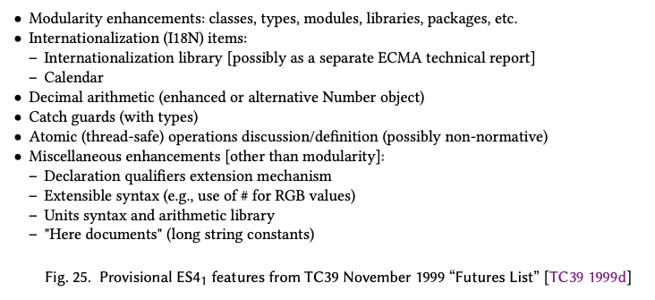
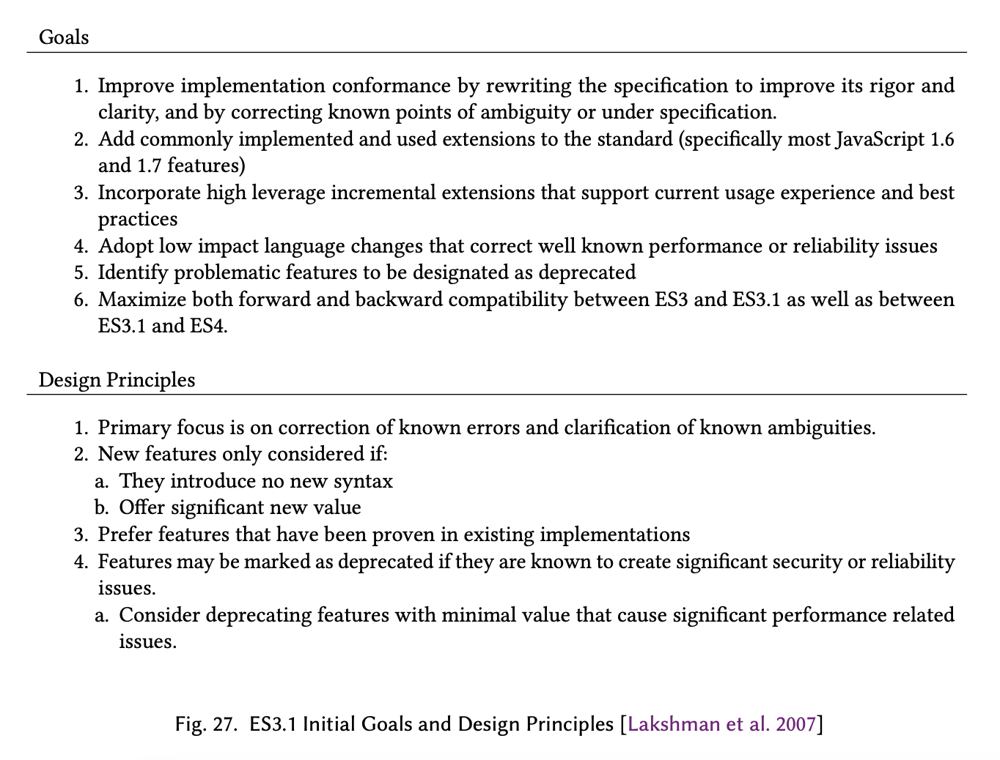

# Part 3: 실패한 개혁(Failed Reformations)

# 14. 성공과 불만(Success with Dissatisfaction)

1990년대 말이 다가오면서 인터넷, 특히 월드 와이드 웹이 세계에 엄청난 영향을 미치고 있다는 것이 명확해졌다 [Miniwatts Marketing Group 2019]. 이러한 웹의 급속한 성장은 넷스케이프, 마이크로소프트 및 기타 브라우저 개발자들이 브라우저 기술을 실용적이고 점진적으로 향상시킴으로써 가능해졌다. 웹의 성공 그 자체, 그리고 지속적인 발전의 조정이 필요하다는 사실은 Ecma TC39와 W3C 작업 그룹과 같은 표준 그룹의 탄생으로 이어졌다. 이러한 그룹의 참가자들 중 일부는 브라우저 개발에 직접적으로 관련되지 않은 주제의 전문가들이었다. 그들의 관심사는 이상적인 미래의 웹에 초점이 맞춰져 있었다. 그 관점에서 볼 때, 실용적으로 개발된 기존의 웹 기술들은 그러한 이상적인 미래에 대한 장애물로 여겨졌다.

1998년 5월, W3C는 'HTML의 미래를 만들기'라는 제목의 워크숍을 개최했다. 워크숍 기록에 있는 결론은 다음과 같다.

> 토론에서는 HTML 4.0을 더 확장하는 것이 어렵고, HTML 4.0이 XML 애플리케이션이 되도록 전환하는 것도 어려울 것이라는 합의가 있었다. 이러한 제약에서 벗어나는 방법으로 제안된 것은 XML 태그 세트들의 묶음을 기반으로 하는 차세대 HTML을 새롭게 시작하는 것이었다. 워크숍은 데이터베이스와 워크플로우 애플리케이션에 더 잘 들어맞는 것의 필요성을 표현했다. 또한 작은 기기나 모바일 기기의 광범위하게 다른 기능들에 들어맞는 것의 필요성도 표현했다. HTML을 모듈화하면 이러한 것들에 필요한 유연성을 제공할 수 있을 것이다. [W3C 1998]


IBM의 David Singer [1998]는 워크숍 발표에서 더 직설적이었다: '우리가 알고 있는 HTML의 미래는 불쾌하고, 야수같고, 짧아야(Nasty, Brutish, and Short) 한다.'

ES3의 완성이 다가오면서, TC39는 비슷한 상황에 처했다. ES3의 출시와 함께, ECMAScript는 넷스케이프와 마이크로소프트 브라우저가 제공하는 Javascript 기능을 따라잡았다. 그리고 브라우저 벤더들은 이제 그 다음으로 무엇을 할지에 대한 많은 지침을 제공하고 있지 않았다. 최소한 초기에는 그랬다. 1995년의 넷스케이프와 달리 TC39는 Java와 비슷한 기능을 피해야 한다는 제약을 받지 않았다. TC39의 일부 참가자들은 원래 Javascript 설계에서의 실수를 바로잡고, 비전문가들보다는 전문 소프트웨어 개발자들의 요구와 감성을 충족시키는 기능들을 제공하는 2세대 브라우저 스크립팅 언어의 필요성을 생각했다 [Raggett 1999b; TC39 1999c; 부록 J]. 이 차세대 ECMAScript는 ECMA-262의 4번째 판이 되는 걸 목표로 했다. 이는 TC39 내에서 처음에는 'E4'라고 불리다가 이후 'ES4'로 불리게 되었다.

# 15. ES4, 1 테이크(ES4, Take 1)

맨 첫번째 TC39 회의에서는 Borland International [1996]이 언어에 클래스 정의를 추가하는 제안을 발표했다. 그때부터 더 큰 프로그램의 복잡성을 관리하는 기능을 Javascript에 추가하는 것에 대한 수요는 있었다. 넷스케이프의 Javascript 1.2는 `import`와 `export`선언을 통해 통합되는 암호화된 스크립트를 지원했다 [Netscape 1997a]. 마이크로소프트의 JScript 3에는 조건부 컴파일 기능이 포함되어 있었다 [Clinick 1997]. 1998년 2월 버전의 ECMAScript의 예정 작업 목록 [TC39 1998c]에는 V2의 가능성 있는 항목으로 "패키지 개념"이 있었다. 이런 대규모 프로그래밍을 위한 기능은 ES3 기능 목록에서 상대적으로 빠르게 제외되었지만 이에 대한 작업은 TC39 내에서 계속 병행해서 이루어지고 있었다.

첫 번째 주요 제안은 휴렛팩커드가 후원하는 W3C 펠로우인 Dave Raggett이 제출했다. W3C에서 Raggett은 HTML, CSS, Javascript의 통합을 개선하기 위한 'Spice'라는 이름의 제안을 개발하고 있었다. 제안의 초기 버전 [Raggett 1998c]은 1998년 2월 TC39에 제출되었다. Raggett의 초기 제안은 HTML과 CSS 통합과 관련된 기능 외에도 Borland의 클래스 선언 제안과 비슷한, 프로토타입 객체를 선언하기 위한 구조를 포함하고 있었다. 이는 프로토타입 객체와 이벤트 핸들러를 선언적으로 연결할 수 있도록 해주었다. 제안에는 "라이브러리"를 정의하고 라이브러리에서 정의들을 가져오기 위한 구조도 포함되어 있었다. 다음과 같이 말이다.

```js
import document, block, Inline from "http://www.w3.org/Style/std.lib";

prototype Link extends Inline 
{
  href = "http://www.w3.org/";
  when onmousedown 
  {
    document.load(this.href);
  }
}
```

1998년 3월 회의 노트 [TC39 1998d]에 따르면 회의에서 Dave Raggett의 초기 Spice 제출물이 논의되었다. 그리고 "초기 피드백은 부정적이다"라고 언급되었다. Raggett은 HP Labs의 두 언어 디자이너인  Chris Dollin, Steve Leach와 함께 그의 제안을 계속 발전시켰다. 1998년 9월 Reggett은 확장된 Spice 제안을 기술하는 새로운 문서 묶음[Raggett et al. 1998]을 제출했다. 그 제안은 사실상 ECMAScript를 대체하는 새로운 언어였고 ECMAScript와 호환되지 않았다. 그 제안은 심지어 중괄호로 단락을 구분하는 C 스타일 문법도 종결 키워드 기반의 문장 문법으로 대체했다. 

Dave Raggett[1998a]은 1998년 11월 TC39 작업 그룹 회의에서 수정된 Spice 제안을 발표했다. 이 회의는 그 달 초 Spice 설계자들과 넷스케이프와 마이크로소프트의 TC39 대표들 간의 비공개 회의에 이어 열렸다. 작업 그룹 회의에서 TC39 멤버들은 기존 구문 문법을 대체하거나 스타일 시트에 대한 선언적인 지원을 즉시 통합하려고 시도하는 데에 관심이 없었다. 그러나 Spice 제안에 있는 클래스, 숫자 단위[^50], 타입, 모듈과 같은 개념으로 ECMAScript를 확장하는 데 관심이 있었다. Raggett에게 물었을 때, 그는 비슷한 기능이 ECMAScript에 추가되면 HP가 Spice 개발을 계속할 가능성이 낮다고 말했다[^51].

[^50]: 숫자 단위(numeric units)는 숫자값에 미터, 킬로그램과 같은 측정 단위를 다는 것을 의미한다. 웹 페이지의 경우, 픽셀과 포인트와 같은 단위가 특히 관심의 대상이었다.

[^51]: Chris Dollin과 Steve Leach는 Javascript에 기반하지 않은 Spice 언어를 계속 개발했다[Dollin 2002]. 그리고 Leach는 이후 이를 Ginger 프로그래밍 언어로 발전시켰다[Leach et al. 2018].

TC39의 새로은 Spice 작업 그룹은 1999년 1월 전체 그룹에 제안을 발표하기 위해 개발할 것을 인가받았다. 위원회의 의견은 이랬다. 새로운 핵심 기능을 지원하는 새로운 기능들은 이미 예약된 Java 키워드를 사용해서 정의되어야 하고 클래스 시맨틱은 Java와 비슷해야 한다는 것이었다. 숫자 단위는 클래스 최상위에 정의되어야 했고 연산자 오버로딩 추가를 필요로 했다.

Spice 작업 그룹의 첫 원격 회의는 1998년 12월의 첫번째 주에 열렸다. 12월 10일, Dave Raggett[1998b]은 그 회의를 기반으로 한 새로운 문서를 배포했다. 이 문서는 패키지와 숫자 단위에 관해서 언급했지만 그보다는 클래스 및 인터페이스 정의를 포함하여 타입 선언에 대해서 더 광범위하게 탐구하였다. 이 문서의 초점은 시맨틱보다는 문법에 맞춰져 있었다. 해당 문서는 이름 기반의 타입 시스템(nominal type system<sup>g</sup>)을 가정하였다. 그리고 그 타입 시스템이 이름이 붙은 내장 원시 타입, 동종 배열 타입, 서브클래스가 이름 기반의 서브타입으로 정의되는 클래스 타입, 인터페이스 타입, 접근이 동적으로 타입 검사되어야 한다는 것을 나타내는 `any` 타입을 가지고 있다고 가정했다. 문법적으로는 변수 바인딩과 타입을 연관짓는 데 대한 대안을 탐구하였다. 문서는 변수 선언에는 여전히 `var`키워드를 사용할 거라고 가정하고 선언된 이름 앞의 접두사로 타입 표현을 사용하는 C 스타일, 그리고 선언된 이름 뒤에 콜론과 타입 표현을 사용하는 Pascal 스타일을 모두 탐구했다. 이러한 대안들의 예시는 그림 24에 있다.

해당 문서의 클래스와 인터페이스 정의 구문은 대략적으로 자바를 따랐다. 그리고 `public`, `private`, `protected`와 기본(패키지) 접근 제한자 수정 방식 전체를 포함했다. 근본적인 메타 객체 구조는 다루어지지 않았지만 기존 Javascript의 프로토타입 기반 상속 모델과는 다른 메타 객체 모델을 가지고 있다는 것은 함축되어 있었다. 문서는 선언된 정적 타입 정보를 사용하는 조기 바운드 멤버 접근과 정적 타입 정보가 없을 시점에 이루어지는 늦은 바운드 멤버 접근을 구별하는 문제를 제기했다. 동적인 속성 추가[^52]가 탐구되었고, 문서는 클래스가 이를 금지하는 것이 바람직할 수도 있다고 제안했다.

[^52]: 마이크로소프트는 이를 "expando properties"라고 불렀다.

주로 클래스, 타입 표기<sup>g</sup>, 스코핑과 관련된 설계 논의들은 Chris Dollin, Waldemar Horwat, Herman Venter를 주요 참가자로 하여 1999년 1월과 2월[Raggett 1999b,c]에 계속되었다. 대부분의 토론은 클래스로 정의된 객체의 본질과 클래스 멤버 접근의 시맨틱에 관한 것이었다. Dollin과 Venter는 클래스 인스턴스의 구조가 클래스 선언에 의해 정적으로 결정되고 클래스 멤버 접근 제한도 참조 지점의 타입 정보에 기반하여 정적으로 결정되는, Java와 비슷한 시맨틱을 일반적으로 선호하였다. Horwat는 타입 표기가 존재하더라도 멤버 접근 시에 동적인 조회(실패할 수도 있는)를 사용하는 더 동적인 모델을 읿반적으로 선호했다. 선택적인 타입 표기, 런타임에 확장 가능한 객체 속성, 기존 Javascript 프로그래머들의 기대, 프로토타입 기반으로 클래스를 흉내내어 만들어진 기준의 코드들과의 호환성 등은 모두 더 동적인 시맨틱을 요구하는 것처럼 보였다. 또한 Horwat는 동적인 시맨틱이 스크립팅의 본질과 더 일치한다고 주장했다. 여기서 말하는 스크립팅의 본질은 여러 출처를 가진 코드를 동적으로 조립하고 라이브러리를 참조하는 스크립트의 버전과 상관없이 라이브러리를 사용하는 것을 포함한다. Horwat[1999b]는 멤버 조회의 대안을 설명하는 문서에서 정적 접근과 동적 접근의 차이를 요약했다.

2월 회의에서 Waldemar Horwat [1999a]는 "Javascript 2.0"에 대한 그의 명세를 밝혔다. 그리고 원래는 넷스케이프[^53]를 위해서 작성된 실험적인 설계이며 TC39에서 최근에 논의된 많은 내용과 일치한다고 이야기했다[^54]. 이 명세는 이름 기반의 타입 시스템과 기계 수준의 많은 숫자 타입, Java와 비슷한 클래스 멤버 접근 제한자 규칙, 명시적인 import가 있는 패키지를 포함하고 있었다. 또한 그 명세는 여러 새로운 기능들도 포함하고 있었다. 클래스 확장 선언, 패키지 멤버의 선언 수준 버전 관리, nullable과 non-nullable 타입, 일급 타입 값 등이다. 이전 Javascript 버전의 선언 호이스팅 시맨틱 대신 Javascript 2.0은 프로그램 실행 중에 선언을 만나기 전까지 해당 선언이 처리되지 않는 "스트리밍 실행 모델" [Raggett 1999d]을 제안했다. 예를 들어 `if`문을 사용하여 조건에 따라 변수를 선언하거나 다른 타입 표기를 가진 선언들 사이에서 하나를 선택할 수 있었다. 일급 타입 값과 선언의 스트리밍 실행의 조합은 일부 경우에 전체적인 정적 타입 검사를 불가능하게 했다.

Javascript 2.0은 원래의 Javascript와 완전히 호환되도록 하려는 시도가 아니었다. 그때 당시에도 아직 완성되지 않았던 ECMAScript 3과도 마찬가지로 호환을 시도하지 않았다. TC39에 Javascript 2.0을 소개하면서 Waldemar Horwat는 "최소한 ECMAScript 1.0과 2.0 [ES4]에서 작동하는 코드를 작성할 수 있어야 합니다. 완전한 후방 호환성은 오히려 골치아플 것입니다." [Raggett 1999c] 예를 들어 선택적인 타입 표기의 문법적인 복잡성은 줄바꿈 시에 자동 세미콜론 삽입을 지원하지 못하게 했다. 후방 호환성에 대한 Howart의 해결책은 구현체가 여러 컴파일러를 제공하는 것이었다. 그는 언어 버전에 따라 컴파일러를 전환하는 것이 엄격한 전방 호환성을 가진 단일 언어보다 바람직하다고 생각했다.

[^53]: 모질라의 소스코드 레포지토리는 에피메테우스(Epimetheus [Horwat et al. 2003])의 코드 [Horwat et al. 2005]를 가지고 있다. 에피메테우스는 넷스케이프의 실험적인 Javascript 2.0 구현이었다.

[^54]: 2018년의 개인적인 대화에서는 Venter는 Raggett의 제안이 Horwat의 설계에 별로 영향을 미치지 않았다고 믿고 있었다.



1999년의 남은 기간 동안 TC39의 주요 관심사는 ES3을 완성하는 데에 집중되었다. 3월에 TC39는 ES3 이후에 생길 가능성이 있는 "예정 작업 목록[TC39 1999c]"을 발행했다. Spice 작업 그룹은 모듈화 하위 그룹으로 변했고 가끔씩 ES4_1에 관한 회의[Raggett 1999a,d; TC39 1999a]를 열었다. 11월에 TC39가 주요 관심사를 "Edition 4"로 전환하고 ES3 이후의 예정 작업 목록을 업데이트하면서 속도가 빨라졌다(그림 25). 1999년 11월의 TC39 의장 보고서 [Lewis 1999a]는 ES4_1의 목표를 다음과 같이 기술한다.

> ECMAScript 2.0[ES4_1]은 [위원회에서] 2000년도에 표준화되기를 바라고 있는 야심차고 크게 향상된 ECMAScript 언어 정의입니다(비록 이것이 지나치게 야심찬 목표일 수도 있겠지만). ECMAScript 2.0의 주요 목표는 '대규모 프로그래밍'을 지원하는 것입니다. 즉, 여러 다른 사람들이 같이 작성하고 사용자의 컴퓨터에서 아마도 처음 조립되는 그런 프로그램의 구축을 지원하는 것입니다.

2000년 1월 회의 [Raggett 2000]에서 마이크로소프트는 2000년 12월에 제4판을 출판하도록 하고 그 기한을 맞추기 위해서 기능을 축소하기를 제안했다. 마이크로소프트의 주요 관심사는 정적 타입 어노테이션의 추가와 자동 세미콜론 삽입의 지원을 포함한 후방 호환성 유지였다. Ventor는 그가 타입 어노테이션을 지원하기 위해 충분하다고 생각한 ES3 명세의 변경사항들을 다른 사람들에게 알렸다. 그러나 아직 많은 불확실성이 남아 있었다. 타입 시스템의 본질, 클래스와 패키지와 네임스페이스의 시맨틱, 하나의 언어에 정적 언어와 동적 언어의 개념을 통합하는 방법 등에 대한 것이었다.

2000년 6월 22일, 마이크로소프트 [2000b]는 .NET 프레임워크를 발표했다. 이건 썬 마이크로시스템즈의 Java 플랫폼에 대한 마이크로소프트의 경쟁적 대응이었다. 마이크로소프트의 .Net은 다중 언어 애플리케이션 개발 플랫폼이었다. .Net의 주요 언어인 C# 외에도 Visual Basic, JavaScript, 그리고 다른 언어들의 방언을 지원했다. 닷넷 발표에 이어 7월에는 마이크로소프트의 전문 개발자 컨퍼런스[Microsoft 2000a]에서 첫 .NET 프리뷰 빌드[^55]가 릴리즈되었다. 이 프리뷰에는 JScript.NET의 초기 버전 [Clinick 2000]이 포함되어 있었다. 브라우저에서의 Javascript와 달리 JScript.NET은 .NET 공용 언어 런타임(CLR)을 대상으로 하는 사건 컴파일 언어(precompiled language)였고 .NET 타입 시스템을 내부적으로 사용했다. 인터넷 익스플로러는 JScript.NET(또는 .NET 일반)을 지원하지 않았다. 대신 JScript.NET은 초기에 다양한 .NET 프레임워크 컴포넌트를 사용하여 데스크탑, 서버, 커맨드라인 어플리케이션을 구축하는 데에 사용될 수 있었다. JScript.NET은 ES3 명세와의 호환성을 주장했지만 이걸 이용해서 브라우저용으로 작성된 Javascript 코드를 실행할 것으로 걸로 예상되지 않았기 때문에 엄격한 후방 호환성은 그다지 중요한 문제가 아니었다. ES3 기능 외에도 JScript.NET은 선택적인 정적 타입 어노테이션, 멤버 접근 제한자 속성을 포함하는 클래스와 인터페이스 선언, 명시적인 import가 있는 패키지를 추가했다. 마이크로소프트의 Andrew Clinick [2000]은 새로운 기능들이 다른 Ecma TC39 회원들과 함께 설계되었다고 했다. 그리고 TC39에서 계속 진행 중인 논의를 기반으로 설계의 세부 사항이 변경될 수 있다고 경고했다.

2000년 6월의 .Net 발표 전까지 마이크로소프트의 Herman Venter는 Waldemar Horwat 등 다른 TC39 멤버들과 .NET이나 JScript.NET에 대해 논의할 수 없었다. 8월에 Horwat과 Venter는 사적으로 만나서 ES4 표준의 완성을 가능하게 할 조정을 찾기 위해 노력했다. Horwat의[2000] 회의록은 문제점 또는 합의되지 못한 부분 43가지에 대한 논의를 기록했다. 그 회의록에서는 논의를 다음과 같이 요약했다.

General: Herman [Venter]는 서버용 JScript의 구현을 준비하고 있다. 그리고 그는 언어를 고정시키고 마이크로소프트의 .NET 런타임과 쉽게 호환될 수 있게 하고자 한다. Waldemar [Horwat]는 언어의 브라우저 적용 가능성과 동적성(dynamism)을 유지하는 것에 대해서 우려하고 있다. Horwat는 그 2가지가 언어의 차별화 요소라고 보기 때문이다. 그는 JScript가 Java나 C#에 가깝게 변화하는 것에 대해 우려하고 있다. 해당 언어들의 영역에 다른 언어의 필요성이 별로 없으며 JScript의 그런 변화의 결과가 어쨌든 정적 프로그래밍에 있어서는 C#에 비해 열등할 것으로 보았기 때문이다. Herman은 또한 새로운 서버 프로젝트는 JScript 대신 C#을 사용할 것을 권장한다. 그는 새로운 JScript를 이미 JScript 프로그래밍에 익숙한 개발자들을 위한 언어로 보고 있다.

[^55]: .NET 플랫폼은 2022년 2월 13일에 나왔다.

Horwat[2003a]는 Javascript 2.0 문서에서 별도의 'ECMAScript 4 넷스케이프 제안' 문서를 분리해냈다. 이 문서는 이후 진행 중인 ES4_1 개발을 위한 작업 초안으로 사용되었다. Javascript 2.0 문서는 TC39가 포함하기로 동의하지 않은 추가 기능을 포함하여 병렬로 유지되었다.

마이크로소프트는 .NET과 그 언어들이 표준을 기반으로 한 기술로 여겨지길 원했다. Ecma는 상표가 있는 기술을 표준 트랙으로 쉽게 옮길 수 있는 기관으로서의 명성이 있었고 마이크로소프트는 TC39가 진행된 방식에 만족했다. 그래서 마이크로소프트는 Ecma에 TC39의 범위를 확장하고 .NET을 그 안에서 표준화할 것을 제안했다. TC39는 '프로그래밍 환경'을 위한 Ecma 기술 위원회로 재인가되었다. 진행 중이었던 ECMAScript 활동은 TC39 내에서 작업 그룹으로 강등되어 TC39-TG1로 알려지게 되었다. CLR 및 C#에 대한 표준을 개발하기 위한 추가적인 TC39 작업 그룹이 형성되었다.

ECMAScript 명세의 제4판을 만들기 위한 작업은 이후 3년간 계속되었다. 하지만 회고해 보면 JScript.NET의 발표가 노력이 끝나기 시작한 시점이었다. 2000년 6월까지 넷스케이프는 시장 점유율이 14% 미만으로 떨어지면서 [Reuters 2000] "브라우저 전쟁" [Borland 2003]에서 패배했다. 그리고 아메리카 온라인에 인수된 후에 넷스케이프는 직원을 잃고, 축소된 자원으로 운영하며, 새로운 브라우저 버전을 출시하는 데 어려움을 겪고 있었다.

인터넷 익스플로러를 가진 마이크로소프트는 승리하여 결국 90% 이상의 시장 점유율을 달성했다. 마이크로소프트는 자신이 독점적으로 통제할 수 없는 웹 프로그래밍 플랫폼을 향상시키는 데 지속적인 관심이 거의 없었다. 내부적으로는 ECMAScript와 같은 개방된 브라우저 기술을 발전시키는 것에서 윈도우 프레젠테이션 프레임워크[^56] [Microsoft 2016] 과 같은 마이크로소프트의 독점 기술들을 개발하는 데로 자원을 전환했다. 마이크로소프트는 이런 자신의 독점 기술들이 개방적인 웹 기술들을 구식으로 만들고 대체하기를 바랐다. 마이크로소프트는 .NET용 프로그래밍 언어 분야에서는 C#과 VisualBasic.NET에 중점을 두었다. 이러한 맥락에서 JScript.NET은 Javascript 프로그래머들이 .NET 플랫폼으로 이동할 수 있게 하는 정도의 의의만 가지고 있었다.

TG1은 계속해서 모여 특정 이슈를 논의하고 초안 명세를 업데이트했다. 마이크로소프트와 넷스케이프 간에는 타입 시스템의 본질에 관한 상당하고 지속적인 의견 불일치가 있었다. Waldemar Horwat는 MIT 경량 언어 워크숍에서 Javascript 2.0의 설계에 관한 논문 [Horwat 2001]을 발표했다. 그 논문에서 그는 Javascript 2.0이 "강력한 동적 타이핑"을 가진 것으로 특징지었다. 그리고 그는 Javascript 2.0에서 모든 변수들은 변수에 저장될 수 있는 값의 종류를 제한하는 연관된 타입을 가지고 있지만 타입 제약 조건에 대한 검사는 런타임에 이루어져야 한다고 설명했다. Javascript 2.0의 일급 타입 값과 암시적 다운캐스트[^58]는 프로그램의 타입 검사를 정적으로 수행하는 걸 일반적으로 불가능하게 만든다.

TG1 회의의 빈도와 참석률은 점차 감소했다. Chris Dollin은 2001년 6월에 마지막으로 참석했다. Herman Venter가 참석한 마지막 TC39-TG1 회의는 2002년 6월이었다. 2003년 7월 15일, 아메리카 온라인은 넷스케이프를 해체하고 Waldemar Horwat를 포함한 대부분의 직원들을 해고한다고 발표했다. 그 주에 열린 TG1 회의에서 Horwat는 ES4 편집자 자리에서 물러났다. TG1의 남은 멤버들은 ECMAScript에 대한 XML 지원 개발에 집중하고, XML 프로젝트가 완료되고 새로운 편집자가 생길 때까지 ES4 작업을 중단하기로 결정했다.

[^56]: 이후 Windows Presentation Foundation으로 리브랜딩되었다.

[^57]: Javascript 2 웹페이지[Horwat 2003c]는 1999년 2월-2003년 6월 사이의 명세 변경 기록들을 가지고 있다.

[^58]: downcast는 특정 타입으로 선언된 변수의 값이 더 특화된 서브타입 값을 요구하는 맥락에서 사용 가능한지를 검사한다.

# 16. 다른 막다른 길(Other Dead-Ends)

1990년대 중반부터 후반에 걸쳐 소프트웨어 컴포넌트라는 개념에 상당한 관심이 몰렸다. 여러 소프트웨어 컴포넌트 모델들이 제안되고 구현되었다. 그런 컴포넌트 모델에는 객체 관리 그룹(OMG)의 CORBA, 마이크로소프트의 COM, 썬 마이크로시스템즈의 JavaBeans 등이 있었다. 일반적으로 소프트웨어 컴포넌트 모델은 객체 기반 소프트웨어 모듈을 기술하고, 발견하고, 사용하는 방법을 제공하는 모듈화 체계였다. 1997년 7월 TC39 회의 [1997g]에서 오라클의 Jim Tressa는 컴포넌트 스크립팅 언어의 대한 OMG의 RFP에 대한 발표를 했다. 그 회의에서 IBM, 넷스케이프, 오라클 등이 ECMAScript 기반의 제안에 관심이 있다고 보고되었다. 하지만 OMG에서 최종적으로 만들어진 명세는 ECMAScript를 기반으로 하지 않았다.

ECMAScript 컴포넌트는 브라우저 및 기타 Javascript 호스트에서 사용하기 위한 Javascript 특유의 컴포넌트 모델을 전파하기 위한 시도였다. 이는 Javascript 컴포넌트를 기술하는 XML 스키마와 어휘들, 그리고 구현 규칙들의 집합을 명시했다. 이런 노력을  NetObjects, Inc.[^59]와 넷스케이프가 후원했다. NetObjects의 Richard Wagner [1998]는 1998년 6월에 Ecma 총회에서 초기 발표를 했다. 그 회의에서 기술 명세 초안 [Wagner and Shapley 1998]이 TC39에 제출되었다. 그 문서는 3번 더 개정되었고 그 이후 Ecma 총회에 제출되었다. 이는 Ecma 표준으로 승인되었고 ECMA-290 [Wagner 1999]이라는 이름으로 출판되었다. 이 표준이 구현된 기록은 없다. TC39의 권고에 따라, Ecma 총회는 2009년에 ECMA-290 표준에서 을 철회하기로 투표했다 [Ecma International 2009b].

ECMAScript 3판의 컴팩트 프로파일(compact profile)프로젝트라는 게 있었다. 그 프로젝트에서는 ES3의 덜 동적인 부분들에 대한 언어인 profile<sup>g</sup>을 정의했다. 자원이 제한된 환경에서의 Javascript 구현체도 ECMAScript 명세를 따를 수 있도록 하기 위해서였다. profile의 창조는 휴대폰 애플리케이션[^60] [Lewis 1999b]에서 사용하는 Javascript 방언을 정의하려는 Ecma 외부에서의 시도 WMLScript에 의해서 촉발되었다[Raggett 2000]. 컴팩트 프로파일은 ES3의 모든 기능을 포함했지만, 구현체가 with 문을 지원하지 않는 것을 허용했다. 그 이외에도 구현체는 `eval`과 `Function` 생성자를 지원하지 않을 수 있었다. 컴팩트 프로파일은 또 구현체가 내장 라이브러리 객체들을 불변(immutable)으로 만드는 것을 허용했고, 이는 프리컴파일이나 ROM 기반의 구현 가능성을 열어 주었다. Ecma 총회는 컴팩트 프로파일 표준을 ECMA-327 [Vartiainen 2001]로 승인했다. ECMA-290과 달리, ECMA-327은 실제로 일부 환경에서 구현되었다. 하지만 ECMA-262의 새로운 판이 출시됨에 따라 ECMA-327을 업데이트하는 데 대한 관심이 부족해졌다. 당시 ECMA-262의 최신판은 매우 자원이 제한된 환경에서 구현되었다. 자원이 제한된 환경에서의 구현체가 특정한 기능을 제외해야 한다면 단순히 그렇게 하면 된다. 실제로 자원이 제한된 환경의 대부분의 애플리케이션에서 구현체 간의 완벽한 Javascript 상호 운용성은 필수적인 것으로 입증되지 않았다. Ecma 총회는 2015년에 ECMA-327을 표준으로 철회하기로 투표했다 [Ecma International 2015b].

2002년, TC39-TG1은 'XML용 ECMAScript' 명세를 개발하는 것에 대부분의 관심을 집중했다. E4X는 ES3에 XML 문서 처리를 지원하는 문법 확장을 추가한 별도의 Ecma 표준이었다. ECMA-357 [Ecma International 2004; Schneider et al. 2005]의 판들은 2004년과 2005년에 발행되었다. E4X는 파이어폭스에서 유일하게 구현되었다. 그리고 브라우저 게임 이론에 따라서 E4X는 거의 사용되지 않았다. ECMA-357은 ECMAScript 2015와 호환되지 않았기 때문에 ECMA-357은 2015년 Ecma 표준에서 철회되었다[Ecma International 2015b].

[^59]: NetObjects는 IBM이 투자한 스타트업이었다.

[^60]: 당시의 휴대폰은 매우 제한적인 프로세서, 메모리, 그리고 통신 대역폭 자원만을 가지고 있었다.

# 17. 플래시와 액션스크립트(Flash and ActionScript)

Macromedia의 Flash<sup>g</sup>는 2000년대 초반 다채로운 인터넷 애플리케이션을 구축하기 위한 Java와 Javascript의 인기있는 대안으로 등장하였다. Flash는 이후 Adobe에 인수된다. Flash는 원래 Jonathan Gay [2006]의 작업을 바탕으로 한 타임라인 기반의 애니메이션 제품이었다. Flash는 애니메이션 기반의 애플리케이션을 바이너리 파일로 컴파일하는 시각적 저작 도구로 구성되어 있다. 이 이진 파일은 Flash Player에 의해 해석된다. 플레이어 구성 요소는 브라우저의 플러그인 확장 API를 사용하여 브라우저에 통합되었다. Flash가 가장 잘나갈 때는 거의 모든 브라우저 사용자가 Flash Player를 설치하였다[Adobe 2013].

초기의 Flash 저작물은 주로 시각적인 것들이었다. 하지만 Flash에는 다양한 타임라인 이벤트에 어떻게 반응할지를 정의하는 간단한 텍스트 형식의 "액션"을 작성할 수 있는 기능도 있었다. 1999년 5월에 출시된 Flash 버전 4에서 Gary Grossman은 Flash의 액션을 JavaScript와 문법적 유사성을 가진 간단한 동적 타입 스크립팅 언어로 발전시켰다. 2000년 Flash 5의 출시와 함께 Flash에 들어간 스크립팅 언어는 ECMAScript 3의 방언이 되었고 "ActionScript"로 이름지어졌다. ActionScript<sup>g</sup> 1.0은 대부분의 ES3 문장 형식과 프로토타입 기반의 객체를 지원했다. 하지만 정규 표현식 지원이 없었고, 변수 접근에 대한 제한된 표현식만 평가할 수 있는 비표준 `eval`함수를 가지고 있었으며 그 외에도 여러 가지 미묘한 시맨틱 차이가 있었다. ActionScropt 코드는 Flash Player 환경에서만 실행되도록 컴파일되었기 때문에, ECMAScript 명세에 대한 엄격한 의미적 준수는 중요한 문제가 아니었다. 예를 들어서 Action 1.0에서 `var` 선언은 선언을 감싸는 함수가 아닌 가장 가까운 블록에 범위가 지정되었다.

ActionScript 2.0은 2003년 Flash MX 개발 환경과 Flash Player 6의 구성 요소로 도입되었다. ActionScript 2.0은 ActionScript 1.0에서 클래스 선언, 인터페이스 선언, 선언에 대한 타입 어노테이션, 그리고 다른 스크립트에서 정의된 클래스에 접근하기 위한 import 문을 확장했다. 클래스 어노테이션, 클래스 선언, 인터페이서 선언에 관한 문법은 ES4_1/JS2 명세와 대략적으로 비슷하다. 하지만 훨씬 단순화된 시맨틱을 가지고 있었다. 타입 어노테이션 사용은 선택적이었다. 타입 검사는 "컴파일 시에만 작동하는 기능(a compile-time-only feature)"이었다[Macromedia 2003]. 타입 어노테이션이 있으면 Java와 비슷한 이름 기반의 타입 검사가 컴파일 타임에 수행되었다. 코드가 생성되기 전에 타입 정보는 제거되었다. ActionScript 2.0은 ActionScript 1.0과 동일한 가상 머신을 사용하며 기본적인 런타임 안전 검사를 수행한다. 프로그램은 런타임 안전 검사를 트리거하는 동작을 하지 않는 한 이름 기반 타입 시스템의 규칙을 위반하는 방식으로 객체를 동적으로 수정할 수 있다.

2003년 Flash가 웹 개발에 널리 사용되었고 이는 대규모의 복잡한 ActionScript 어플리케이션 생성으로 이어졌다. 그 중 일부는 성능 문제에 직면했다. 당시의 대부분의 ECMAScript 언어 설계자들과 구현자들처럼, Macromedia 팀은 동적 타이핑(특히 원시 타입의 경우)이 주된 성능 병목이라고 믿었다[^61]. 그리고 ActionScript 런타임에 정적 타이핑을 추가하는 방법을 모색하고 있었다. 비슷한 시기에 1998년부터 TC39 대표였던 Jeff Dyer가 Macromedia에 합류했다. Dyer는 TC39도 정적 타이핑에 대해 같은 관점을 가지고 있음을 확인해 주었다. 가상 머신 기반 언어에서의 정적 타이핑에 대한 이 널리 공유된 견해는 정적 타입의 Java 가상 머신(JVM)의 설계에 크게 영향을 받았다. Jonathan Gay와 Lee Thornason의 Maelstrom 프로젝트는 JVM이 Flash에 통합되어 ActionScript의 정적 타입 버전 런타임으로 사용될 수 있는지를 보기 위한 Macromedia의 실험이었다. 이 실험은 충분히 성공적이었다. 그래서 Macromedia는 Flash에서 Java 2 Micro Edition (J2ME)를 사용하는 걸 허가받기 위해 Sun에 접근했다. Flash 웹 다운로드에 포함시키기에는 Java 런타임 표준 에디션이 너무 컸기 때문에 Macromedia는 J2ME를 사용하고자 했다. 하지만 Macromedia의 Java Micro Edition 기술 사용 제안은 Sun의 Java 라이선스 전략과 일치하지 않았다. Edwin Smith는 비밀 프로젝트에서 아이디어 컨셉을 증명하기 위한 가상 머신들을 만들었다. 이 가상 머신들은 Macromedia가 정적 타입 JVM과 비슷한 가상 머신 AVM2[Adobe 2007]를 자체적으로 제작하고 ActionScript가 그 위에서 동작하게 하도록 만드는 데에 도움이 되었다. 새 언어는 Gary Grossman, Jeff Dyer, Edwin Smith에 의해 설계되었고, Horwat의 초안 ES4_1/JS2 명세에 크게 영향을 받았다. 하지만 JScript.Net과 마찬가지로 ActionScript 3.0은 ES4_1의 설계를 단순화한 것이었다. ActionScript 3.0은 JS2보다 덜 동적이었고 JScript.NET과 달리 .NET 타입 모델에 의해 제약받지 않았다. ActionScript 3.0은 JScript.Net과 유사하게 기존 호환성 문제에 크게 구애받지 않았다. Flash는 ActionScriot 3.0을 지원하기 위한 AVM2와 ActionScript 1.0과 2.0을 지원하기 위한 AVM1을 함께 출시했다. 이렇게 새로운 버전의 ActionScript와 새로운 가상 머신을 만드는 데는 3년 이상의 시간이 걸렸다. 이것은 2006년 Flash Player 9의 구성 요소로 발표되었으며, 2007년에 최종적으로 출시되었다. 이 활동이 완료될 무렵 Adobe가 Macromedia를 인수했고 Flash는 Adobe Flash가 되었다.

[^61]: Macromedia 내부에서의 믿음과 행동들에 대한 설명은 2017-2018년의 Jeff Dyer, Gary Grossman과의 개인적인 대화에서 얻은 것이다.

# 18. ES4, 2 테이크(ES4, Take 2)

ES4_1 작업은 2003년에 정체되었지만, 웹 상에서 JavaScript의 사용은 계속해서 증가하고 있었다. 1년도 되지 않아서 TG1 구성원들은 그들이 "ES4"라고 부르는 새로운 버전의 ECMAScript를 설계하는 것에 대해 다시 생각하고 있었다.

## 18.1. TC39-TG1 다시 만들기(Resetting TC39-TG1)

Macromedia는 2003년 11월에 Ecma 회원이 되었다. 그리고 Jeff Dyer는 TC39에서 Macromedia의 대리자 중 한 명이 되었다. ActionScript 3의 설계는 ES4 명세를 개발하려는 TG1의 초기 시도에 크게 영향을 받았기 때문에 당연한 움직임이었다. Macromedia에게는 ActionScript의 설계를 향후 ECMAScript 명세 작업과 일치시키고 TG1이 ActionScript의 요구 사항과 선행 사례를 고려하도록 하는 것이 중요했다.

2004년 봄 모질라 재단은 Firefox 브라우저의 기술 프리뷰를 발표했다. 그리고 그 해 말까지 Firefox 1.0을 출시할 것을 예정하고 있었다. 당시 모질라의 CTO였던 Brendan Eich는 오픈 웹의 미래에 대해 우려하고 있었다. 브라우저 기반 웹 애플리케이션에 대한 관심은 급속도로 증가하고 있었지만, 당시의 브라우저 표준은 다채로운 애플리케이션을 지원하기에 부족했다. Flash, 마이크로소프트의 Windows Presentation Framework (WPF), .NET과 같은 폐쇄적인 독점 애플리케이션 플랫폼들이 HTML/CSS/JavaScript 웹 기술을 대체하기 위해 경쟁하고 있었다. 그리고 오픈 웹을 담당하고 있는 표준 기관들은 이러한 도전에 대응하지 않고 있었다. 1998년 W3C [W3C 1998]는 XML 기반의 대안을 지지하며 HTML을 발전시키는 걸 중단하기로 결정했다. 하지만 XHTML은 HTML과 문법적으로도 의미적으로도 호환되지 않았다. 또한 브라우저 벤더나 웹 개발자들에게 널리 받아들여지지도 않았다. 마찬가지로 Ecma TC39-TG1의 ECMAScript 명세 발전 시도는 실패했고, 그들의 관심은 XML 처리를 위한 ECMAScript 지원의 설계로 옮겨갔다. 웹 기술 커뮤니티의 일부 구성원들은 'ECMAScript가 죽었다'[Schulze 2004b]며 우려했다.

이에 대응하여, Brendan Eich [2004]는 WHATWG—웹 하이퍼텍스트 애플리케이션 기술 작업 그룹 [Hickson 2004]—을 결성했다. WHATWG는 HTML의 미래에 초점을 맞췄다. Eich는 또 TG1과 다시 관계를 맺기 시작했다. Eich는 2004년 3월 Ecma 사무총장과 만났고 [Marcey 2004], 5월에는 모질라 재단이 Ecma 회원 자격을 신청했다. 2004년 6월, Eich는 1998년 2월 이후 처음으로 TG1 회의 [Schulze 2004a]에 참석했다.

6월 회의에서[Schulze 2004b] TG1의 의장이 마이크로소프트의 Rok Yu에서 Macromedia의 William Schulze로 바뀌었다. Jeff Dyer는 ECMA-262의 편집자가 되었다. 회원들은 ECMAScript 명세의 4번째 에디션을 완성에 다시 전념하기로 했지만 Waldemar Horwat의 ES4_1 초안으로 진행하지는 않기로 결정했다. Schulze의 보고에 따르면, "[ES4_1 초안은] 완성되거나 도입되기에는 너무 광범위하고 포괄적이었다." 대신 회원들은 ActionScript를 포함한 기존 구현체들에 통합할 수 있는 "더 점진적인 접근법" [Schulze 2004a]을 취하는 것에 동의했다. 패키지, 네임스페이스, 조건부 속성, 런타임 타입 검사 및 XML 지원이 통합을 위한 후보 기능으로 나열되었다. 이 목록에는 이전 ES4_1 초안의 가장 복잡한 부분들이 일부 포함되어 있었다. 하지만 회원들은 여전히 새로운 4판 명세를 위한 12개월 개발 주기에 동의했다. Dyer는 고려된 변경 사항의 초안을 2004년 10월에 예정된 회의에서 발표할 준비를 하기로 합의했다.

TG1은 이 새로운 약속들을 이행할 수 없었다. 2004년 나머지 기간과 2005년 대부분 동안 위원회의 관심은 E4X 명세 [Schneider et al. 2005] 개정에 집중되었다. 이는 ISO 패스트트랙 프로세스의 일환으로 이루어졌다. 새로운 ES4에 대한 본격적인 작업은 2005년 10월까지 시작되지 않았다. 그러나 이 중간 기간 동안 Brendan Eich는 ECMAScript 표준의 당시 상태를 익히고 다음 에디션에 대한 자신의 생각을 컨퍼런스 발표와 블로그 포스트 [Eich 2005a, b]에서 공개적으로 표현하기 시작했다. 2005년 9월 회의 [TC39-TG1 2005]에서 Eich는 TG1의 의장이 되었고 ES4_2 개발의 진행을 위해 활동하기 시작했다.

## 18.2. ES4 재설계(Redesigning ES4)

2005년 10월의 블로그 게시물에서 Brendan Eich [2005d]는 ES4 작업의 다음 단계를 위한 4가지 목표를 다음과 같이 제시했다.

- 4번째 에디션을 현재의 언어 형태로 되돌려서 프로토타입 기반의 위임이 단순한 호환 모드의 잔재가 아니라 객체 시스템의 동적인 부분이 되도록 한다. 그리고 오버라이드나 쉐도잉이 불가능한 고정 멤버를 가진 클래스를 거기 포함시킨다.
- 구현자들이 언어를 부트스트래핑하도록 허용한다[^62]. "네이티브" 객체들이 사용하는 모든 메타 객체 프로토콜 마법(ECMA-262 Edition 3 section 15)을 표현하게 한다. 그리고 get/set/call/construct 내부 프로퍼티와 열거 가능성 등의 속성 특징(역주 : 객체의 각 속성들은 writable, configurable, enumerable등의 디스크립터를 가진다)들에 대한 제어를 포함한다.
- 기존 언어와 새 에디션 간의 호환성을 깨뜨리지 않으면서 타입 어노테이션을 추가한다. 이는 XUL[^63] 과 모던 웹 애플리케이션에 점점 더 필요해지는 대규모 프로그래밍을 지원한다.
- 거의 모든 JS 해커들을 괴롭히는 오랜 문제들을 해결하겠다고 이전에 논의한 바 있다.

그는 호환성을 테스트하기 위한 초기 구현까지 포함하여 이 작업을 2006년 말까지 완료하는 것이 목표라고 밝혔다.

2005년 11월 블로그 게시물에서 Brendan Eich [2005c]는 이 목표들을 다음과 같이 단순화했다.

1. 더 강력한 타입과 이름을 사용하여 대규모 프로그래밍을 지원한다.
2. 부트스트래핑, 자체 호스팅(self-hosting<sup>g</sup>), 그리고 리플렉션을 가능하게 한다.
3. 몇 가지의 단순화를 위한 제외하고는 이전 버전과의 호환성을 유지한다.

그는 또한 ECMAScript를 Java나 어떤 다른 언어와 더 비슷하게 만들거나 ECMAScript를 더 최적화할 수 있도록 만드는 것은 목표가 아니라고 밝혔습니다. 이후 발표에서 Eich [2006a]는 선언적인 정적 타입이나 클래스 정의가 필요한지에 대한 비판을 포함해서, 원래의 ES4_1 명세에 대한 비판을 인정했다. 그러면서도 아무것도 하지 않는 것은 실행 가능한 대안이 아니라고 반박했다. 그의 주장은 ES3 언어가 향후 10년 동안 웹 개발자들이 복잡한 애플리케이션을 구축하는 만큼에 비해서는 형편없이 확장될 것이라는 거였다. 특히 불변성을 강제할 수 있고 선택적으로 정적 검사가 가능한 타입 시스템이 복잡한 애플리케이션을 위해서 필요하다고 주장했다. 그러나 이러한 변경은 한 번만 일어날 수 있으므로, 지금이 그것을 실행할 때라고 했다.

| Jeff Dyer | Adobe[^65] |
| Brendan Eich | Mozilla |
| Cormac Flanagan | University of California, Santa Cruz |
| Lars T Hansen | Opera/Adobe |
| Dave Herman | Northeastern University |
| Graydon Hoare[^66] | Mozilla |
| Edwin Smith | Adobe |

그림 26. 2006년의 ES4_2 코어 디자인 팀

Brendan Eich는 프로그래밍 언어 명세 테크닉에 대한 현대의 연구와 타입 시스템에 대한 연구의 적용이 기존 ES4_1 작업의 일부 문제 영역을 다루는 데 도움이 될 수 있다고 낙관했다. 2006년 초 그는 Dave Herman을 TG1의 ES4_2 설계 팀에 합류하도록 초청했다. Herman은 Northeastern 대학교의 박사 과정 학생이었으며 ES3의 운용 시맨틱 개발에 참여했었다. Eich는 또한 Herman의 추천에 기반하여 UC Santa Cruz의 교수인 Cormac Flanagan을 합류하도록 초대했다. Flanagan은 하이브리드 타입 시스템 전문가였다 [Flanagan 2006]. 오페라 웹 브라우저에서 일하는 소프트웨어 아키텍트 Lars Thomas Hansen도 거의 비슷한 시기에 정기적인 TG1 참가자가 되었다[^64]. Herman, Hansen, Flanagan 모두 Northeastern 대학교의 프로그래밍 언어 연구 커뮤니티와 직접적 혹은 간접적인 연결을 가지고 있었다.

2005년 말에 TG1은 ES4_2 프로젝트를 위한 주간 전화 회의와 월간 대면 회의 일정을 수립했다. 그림 26은 2006년의 ES4_2 코어 디자인 팀 인원들을 나열한다. 이들은 회의에 정기적으로 참석하고, 주요 결정에 참여하며, 지속적으로 중요한 기여를 한 사람들이다. Adobe, Mozilla 등 다른 조직의 다른 사람들이 때때로 회의에 참석하거나 기여를 했지만 앞서 언급한 사람들에 비해서 프로젝트에 덜 적극적으로 관여했다.

JS2/ES4_1 개발의 첫 번째 단계에서는 기존의 ECMAScript 프로그램과 호환되지 않는 변경사항을 만드는 것에 대해 별로 신경쓰지 않았다. 브라우저 내에서 HTML `<script>`요소에 들어 있는 버전 정보를 이용해서 언어의 다른 버전을 선택할 수 있다고 가정했기 때문이다. 새로운 ES4_2 개발에서는 기존 프로그램과 호환되지 않는 변경 사항의 잠재적인 영향을 더 인식했다. 하지만 여전히 위원회가 초기 Javascript의 설계 오류로 간주하는 사항들을 수정하기 위해 `<script>`태그를 통한 버전 관리를 사용할 수 있기를 바랐다. Brendan Eich는 블로그 게시물과 발표에서 이 가능성에 대해 언급했다. 다만 일부 TG1 회원들로부터 반발도 있었다. 2006년 7월 TG1 회의 [TC39-TG1 2006c]에서 Yahoo!를 대표하는 Douglas Crockford는 "후방 호환성은 어렵고 중요하다"고 말했지만 보안이 가장 큰 문제였으며 보안 관련 문제를 해결한다면 후방 호환성에 관한 문제는 용납될 수 있다고 했다. Microsoft의 Pratap Lakshman은 "우선순위 0 [가장 높은 우선순위]은 후방 호환성이다. 후방 호환성을 깨뜨릴 수 있는 건 보안 관련 문제 수정뿐이다."라고 말했다.

Brendan Eich는 JavaScript의 10주년을 기념하는 ICFP'05 기조연설 이후의 질의응답 세션[Danvy 2005] 에서 Python에 대해 긍정적인 발언을 했다. 그는 심지어 더 대규모의 웹 스크립트의 경우 Python이 JavaScript보다 더 나은 언어였을 수도 있다고 추측했다. 다음 해 동안 그는 Python의 동일한 기능을 직접적으로 모델링한 기능을 ES4_2에 포함시키기 위해 로비를 벌였다. 여기에는 이터레이터, 제너레이터, 구조 분해<sup>g</sup> 할당, 배열 컴프리헨션 등이 포함되었다. 그리고 함수 스코프를 갖는 `var` 선언 대신 블록 스코프를 갖는 `let`과 `const` 키워드를 사용하여 변수를 선언하는 개념을 홍보했다. 이런 기능들은 ES4_2에 제안되었던 다른 더 복잡한 "대규모 프로그래밍" 기능들(이라고 불려진 것들)과는 대체로 독립적이었다. 이 버전들은 SpiderMonkey 기반 JavaScript 1.7 엔진 [Mozilla 2006a]에 추가되어 2006년 10월 Firefox 2 브라우저의 일부로 출시되었다. 그러나 이 기능들은 다른 브라우저들에 의해 채택되지 않았으며, 따라서 XUL 외부에서는 별로 사용되지 않았다.

[^62]: Javascript의 내장 라이브러리를 구현하는 데에 Javascript를 쓰는 것
[^63]: XUL (XML User interface Language)은 Firefox 브라우저 확장을 만들 수 있는 Mozilla의 Javascript 프레임워크였다.
[^64]: 2007년 4월에는 Hansen은 Adobe를 대표해서 왔다.
[^65]: Adobe는 Macromedia의 인수를 2005년 12월 3일에 완료했다.
[^66]: 2006년에 Hoare는 Rust 프로그래밍 언어 [Hoare 2010]의 초기 설계를 개인 프로젝트로 작업하고 있었다.


Eich는 다른 브라우저 벤더들, 특히 Microsoft가 ES4_2의 JavaScript 개선 사항을 느리게 채택할 것이라는 우려를 표했다. 또한 JavaScript 엔진들이 AJAX 웹 애플리케이션의 급속한 부상과 수요에 대응하기 위한 성능 개선을 진행하지 않을 가능성에 대한 우려도 함께였다. 두 문제 모두를 해결하는 한 가지 방법은 예상되는 ES4_2 명세를 지원하는 고성능 오픈 소스 JavaScript 엔진을 만드는 것이었다. 이를 위해 Eich는 Adobe가 그들의 AVM2 구현을 오픈 소스 라이선스 하에 Mozilla에 기여하도록 설득했다. Mozilla는 그 코드 베이스를 "Tamarin"이라 명명했다 [Mozilla 2006b]. 이후 몇 달 동안 Mozilla는 두 개의 프로젝트를 발표했다. Tamarin 코드 베이스를 SpiderMonkey를 대신해 사용하는 것을 목표로 하는 ActionMonkey 그리고 Internet Explorer에 서드파티 플러그인 확장으로 추가될 수 있는 Tamarin 기반 JavaScript 엔진인 ScreamingMonkey였다. 둘 다 완성되지 못했다.

이러한 산업 내 움직임이 일어나는 동안, TG1은 새로운 ES4_2 설계 작업을 계속했다. ES4_2의 주요 목표 중 하나는 대규모 프로그램에서 복잡한 데이터 추상화의 사용을 검증할 수 있는 타입 시스템과 타입 어노테이션 표기법을 제공하는 것이었다. 적절하게 작성된 프로그램의 경우 배포 전의 정적 타입 분석이 가능해야 했다. 그러면서도 타입 시스템은 어노테이션이 달리지 않은 프로그램, 그리고 기존 언어에서 허용된 객체의 동적인 구조 변화를 모두 다룰 수 있어야 했다. 위원회는 2006년 대부분의 시간을 이러한 요구 사항의 함의를 이해하고 이를 수용할 타입 시스템을 설계하려고 시도하는 데 할애했다 [TC39-TG1 2006a, d].

위원회는 ActionScript 3 사양 [Macromedia 2005]에 비공식적으로 설명된 타입 시스템으로 시작했다. 이는 Java에 제네릭 타입이 추가되기 이전과 비슷한 이름 기반의 타입 시스템이었고 클래스와 인터페이스 타입을 가지고 있었다. 

ActionScript 3은 타입 어노테이션이 달린 선언과 명시적 타입 어노테이션이 없는 선언에 대한 보편적 타입을 가지고 있었다. ActionScript 3 명세에는 함수 서브타입 개념이 명시되어 있지 않았고 클래스/인터페이스 서브타이핑의 정의는 완전하지 않았다. ActionScript 3에는 타입이 표기된 선언과 제한적인 타입 추론을 사용하여 ahead-of-time 정적 타입 검사를 수행하는 엄격 모드가 있었고 타입 어노테이션과 연산 요구사항에 대해 실제 데이터 값을 동적으로 검증하는 표준 모드가 있었다.

Dave Herman과 Cormac Flanagan의 초기 제안은 계약 모델(contract model)[Findler and Felleisen 2002]을 사용하는 것이었다. 엄격 모드와 표준 모드, 타입이 있는 선언과 타입이 없는 선언을 더 잘 통합하기 위해서였다. 작업이 진행됨에 따라, 구조적 타입 [TC39 ES4 2006d]이 객체와 배열 리터럴을 다루기 위해 추가되었고 배열 타입을 다루기 위해 매개변수화된 타입이 추가되었다. 많은 대안들 [TC39 ES4 2006b]이 고려되었고 TG1의 비공개[^67] 위키 사이트 [TC39 ES4 2007f]에 문서화되었다. Herman과 Flanagan은 또한 타입 시스템의 형식화를 시험했다 [TC39 ES4 2007a]. 2007년 초에도 설계는 여전히 미완성이었지만 함수 타입과 공변성/반공변성 고려사항을 포함한 많은 현대적 타이핑 개념을 포함하도록 발전했다 [TC39 ES4 2007b]. 선택적 타이핑과 기존의 동적 타입 프로그램을 지원해야 하는 상황은 계속해서 문제의 원인이 되었다.

2006년 그리고 2007년의 대부분 기간 동안 TG1은 새로운 제안을 개발하고 기존 제안을 개선하는 작업을 계속했다. 결국 ES4_2 명세에 포함될 계획으로 승인된 54개의 제안 목록 [TC39 ES4 2007d; Appendix L]이 비공개 위키에 나타났다. 추가적인 26개의 제안 [TC39 ES4 2007e]이 연기되거나 폐기되었다.

Dave Herman은 Brendan Eich가 Herman의 웹 페이지를 발견한 후 TG1에 모집되었다. 그 웹페이지는 ES3 명세의 시맨틱을 형식화하는 Herman의 시험들을 문서화한 것이었다. 2006년 2월 TG1 회의 [TC39-TG1 2006b]에서 Herman은 프로그래밍 언어를 명세하는 형식적인 테크닉에 대한 소개를 발표했다. 그는 형식적인 명세가 구현자들에게 지침을 제공할 뿐만 아니라 명세 내의 버그를 찾고 수정하는 방법을 제공한다고 설명했다. 하나의 우려가 제기되었는데, ECMAScript 구현자들과 명세의 다른 사용자들이 형식 명세를 읽을 수 있을지에 대한 것이었다. 형식 사양이 ECMAScript 구현자와 사양의 다른 사용자들에게 읽을 수 있을지에 대한 우려가 제기되었다. Herman은 연산 의미 체계 기반의 형식주의를 매우 읽기 쉽게 만들 수 있을 거라고 느꼈다. 그 후 몇 달 동안 Herman은 ECMAScript 의미 체계를 명세하기 위해 Maude [Clavel et al. 2003], Stratego [Visser 2001], PLT Redex [Matthews et al. 2004]를 사용하며 분석했지만 결국 그 도구들은 주어진 작업에 잘 들어맞지 않았다. 그 기간 동안 언어를 참조 구현을 통해 정의하는 가능성에 대한 논의도 있었다. 또 다른 가능성은 ECMAScript 전용의 새로운 형식 명세를 설계하는 것이었다. 2006년 10월, 이러한 언어의 가능한 문법과 의미 체계에 대한 논의 [TC39-TG1 2006e]가 있었을 때 Cormac Flanagan은 위원회가 2개의 언어를 정의하는 작업을 논의하고 있다고 지적했다. 하나는 ECMAScript의 새로운 버전이었고 하나는 그 전용의 명세 언어였다. 이 지적이 나온 시점에서 TG1은 ES4_2를 위한 정의상의 인터프리터(definitional interpreter)를 작성하기 위해서 기존의 언어를 사용하는 것에 빠르게 합의했다. 그들은 SML [Milner et al. 1997] 언어를 사용하기로 빠르게 결정했다. 11월 중순까지, TG1은 이 노력을 위한 도구와 인프라를 마련했고 회원들은 인터프리터 코드 작성 작업을 하고 있었다. Herman과 Flanagan [2007]은 이것이 위원회의 작업 스타일에 미친 영향을 다음과 같이 설명한다.

> 정의적 인터프리터로 전환한 후, 위원회의 상호작용 스타일은 크게 바뀌었다. 매달 1일 반 동안 진행하던 논의 중심의 회의에서 3일간의 해커톤<sup>g</sup>으로 바뀐 것이다. 그리고 그 사이에 언어 디자인과 구현의 여러 코너케이스가 발견되고 해결됨에 따른 기술적인 논의가 이어졌다.

[^67]: TC39의 비공개 위키는 결국 `wiki.ecmascript.org` [TC39 2007]로 공개되었다.

## 18.3. 반발(Resistance)

Microsoft는 ES4_2에 대한 다시 시작된 노력에 최소한으로만 관여했다. Microsoft의 개발 부서(DevDiv)는 Internet Explorer를 담당하는 Microsoft Windows 조직과 거리가 멀었음에도 불구하고 항상 JScript 개발을 담당해 왔다. 2000년대 초, DevDiv는 .NET 에 관한 계획을 지원하기 위해 재편되었다. 거기의 C# 제품 유닛은 JScript.NET과 Internet Explorer 내에서 사용되는 더 전통적인 JScript 엔진 둘 모두를 책임지게 되었다. 여기에는 ECMAScript 표준화 활동에 참여하는 책임도 포함되었다. 그러나 고객들은 JScript.NET을 별로 도입하지 않았고 Windows 조직은 Internet Explorer를 개선하는 데 별 관심이 없었다. 그래서 JScript/ECMAScript 작업은 C# 그룹 내에서 우선 순위가 낮은 활동이었다.

2000년대에, Microsoft는 전략적으로 중요한 개발 활동을 주로 워싱턴 주 레드몬드 본사에 배치하고 종종 더 전술적인 프로젝트를 전 세계 다른 캠퍼스에 배치했다. 2005년 7월부터 2006년 6월까지 그러니까 회계 년도로 2006년에, Microsoft DevDiv는 모든 JScript/ECMAScript 작업을 인도 하이데라바드에 있는 인도 개발 센터(IDC)로 이전하기로 결정했다. DevDiv는 이전에 Java와 유사한 J#.NET 제품에 대한 책임을 IDC에 이관했다 [Prasanna 2002]. 2006년 봄까지 이관 작업은 대부분 완료되었다. TG1에서 Microsoft를 대표하는 업무는 Pratap Lakshman에게 주어졌다. 그는 J#팀에서 일했었으며 Ecma C# 표준 작업 그룹인 TC39-TG3에도 관여했었다. Lakshman은 2006년 4월에 처음으로 TG1 회의에 원격으로 참여했으며, 이후 전화 회의와 일부 대면 회의에 참석하기 시작했다. 하지만 그 기간 동안 그가 ES4_2에 주요한 기여를 한 건 아니었다.

이 문서의 저자 중 하나인 Allen Wirfs-Brock은 2003년 마이크로소프트에 소프트웨어 아키텍트로 합류했다. 그리고 새로운 IDE 아키텍처를 조사하는 실험적인 프로젝트에 참여했다. 마이크로소프트에 합류하기 전, 그는 20년 동안 Smalltalk 프로그래밍 언어와 개발 환경에 깊이 관여했다. Wirfs-Brock은 최초의 상용 Smalltalk 가상 머신 구현 중 하나의 리드 개발자였고[Caudill and Wirfs-Brock 1986] 대규모 프로그래밍을 지원하기 위한 Smalltalk 개선 작업을 수행했다. 또 그는 표준 Smalltalk 예외 핸들링 시스템을 설계했고, ANSI Smalltalk 표준 [ANSI X3J20 1998]의 언어 정의 부분을 작성했다.

2006년 말경 IDE 프로젝트가 점차 마무리되어 가면서 Wirfs-Brock은 새로운 기회를 모색하기 시작하였다. 당시 DevDiv 내에서는 동적 언어에 대한 관심이 증가하고 있었다. 당시 DevDiv에는 동적 언어를 담당하는 특정 부서가 없었기 때문에 여러 제품 부서의 관리자들이 동적 언어와 관련된 작업을 하려고 경쟁하고 있었다. Wirfs-Brock은 Visual Basic 제품 부서 매니저 Julia Liuson에게 보고하는 스태프 아키텍트 직책을 맡았다. Julia에게 동적 언어 기술과 그 가능성에 대해서 조언하는 일이었다.

Allen Wirfs-Brock은 2007년 1월 첫 주에 새로운 직무를 시작하였다. 일상적인 대화 중, Liuson은 그에게 JavaScript에 대한 지식이 있는지 물었다. Wirfs-Brock은 대략 이런 식으로 대답했다. '별로요. 웹 페이지에서 사용되는 동적 언어인데 Self와 약간 관련이 있다고 생각합니다.' 이에 Liuson은 자신이 방금 받은 이메일 메시지를 보여주며 그의 의견을 물었다.

그 메시지는 Pratap Lakshman이 모든 DevDiv 제품 부서 관리자들에게 보낸 것이었다. Ecma TC39가 개발 중인 새로운 JavaScript 표준에 대해 어떤 입장을 취해야 할지에 대한 지침을 묻는 내용이었다. Wirfs-Brock의 기억에 따르면, Lakshman의 메시지는 새 표준이 Adobe Flash를 기반으로 하며, 당시 브라우저 생태계에 상당한 변화가 될 것이라고 하고 있었다. Lakshman은 TC39가 개발 중인 언어는 강력하지만 웹에는 너무 복잡할 가능성이 있다고 언급했다. 그는 클래스 기반의 정적 타이핑, 구조적 타입, 매개변수화된 타입, 메소드 오버로딩 등 새로운 기능과 변경 사항의 긴 목록을 나열했다. 또한 새로운 언어는 Standard ML로 작성된 참조 구현을 통해 명세될 것이라고 밝혔다.

Allen Wirfs-Brock은 Julia Liuson에게 이것이 완전한 재설계처럼 들린다고 응답했으며, 그의 경험에 따르면 정적 타입을 추가하여 동적 언어를 개선하려는 시도는 드물게 성공한다고 말했다. 그는 JavaScript나 웹 개발에 대해 충분히 알지 못해서 더 확실하게 말할 수는 없었다. 하지만 이를 추가적으로 연구할 것을 제안했다.

Wirfs-Brock은 며칠 동안 Javascript, 기존의 ES3 명세, 공개 위키 스냅샷에 있는 TG1에서의 제안들[TC39 ES4 2007f]을 보았다. 그는 Lakshman과 인터넷 익스플로러 팀의 소프트웨어 아키텍트들, 웹 기반 애플리케이션 작업을 하는 마이크로소프트 엔지니어들과 대화를 나누었다. 그는 Javascript가 웹 상에서 수행하고 있는 역할은 Richard Gabriel의 [1990] "[Worse Is Better](https://typefully.com/dylayed/rise-of-worse-is-better-dxcVfbU)" 개념의 주요한 사례라는 걸 인식했다. Javascript는 미니멀리즘적으로 만들어져서 조금씩 성장했고 이것이 월드 와이드 웹의 구조에 깊게 뿌리내린 상태였다. 반면 ES4_2 관련 활동은 Wirfs-Brock이 보기에, Gabriel의 표현으로는 "do the Right Thing"철학을 따르는 프로젝트로 보였다. 이는 성과를 내기 힘들어 보였고 성공한다 해도 웹에 큰 혼란을 일으킬 가능성이 높았다. 그는 기술적으로 보았을 때 ECMAScript의 발전 방향을 점진적인 개선으로 되돌리려고 시도하는 게 옳다고 결론지었다.

당시 마이크로소프트가 웹 브라우저 기술에 대한 전략적인 관심이 부족했음을 고려할 때 Wirfs-Brock은 DevDiv 경영진이 웹 브라우저 관련 활동에 자원을 할당하는 데 관심이 있을 가능성이 낮다고 생각했다. 그는 DevDiv 내부의 관심을 얻기 위해서는 ES_4가 성공했을 때 가능한 결과들에 초점을 맞추어야 한다고 결정했다. 그가 식별한 주요 우려 사항은 ActionScript 3 언어 정의와 가상 머신을 통해서 Adobe가 ES4_2 활동에 기여한 것이었다. DevDiv의 초점은 .NET 플랫폼과 그 플래그십 언어인 C#에 있었으며, 그 주요 고객은 엔터프라이즈 애플리케이션 개발자였다. .NET의 주요 경쟁자는 Sun의 Java 플랫폼이었지만, DevDiv는 Adobe의 ActionScript 기반 Flash와 Flex 제품도 .NET의 경쟁자로 보기 시작했다. Wirfs-Brock은 성공적인 ES4_2 활동이 ActionScript를 C#이나 Java와 같은 힘과 유용성을 갖춘 1급 엔터프라이즈 언어로 변모시킬 수 있을 것으로 예상했다. ActionScript가 웹 개발의 주요 언어로 표준화되면 마이크로소프트의 언어들과 개발자 제품군에 대한 심각한 경쟁 위협이 될 수 있었다.

Allen Wirfs-Brock은 이러한 우려와, 마이크로소프트가 TG1에 적극적으로 참여하여 ECMAScript 표준을 파괴적이지 않고 점진적으로 발전시키는 방향으로 전환하려고 시도할 것을 권고하는 내용을 담은 메모를 작성했다. 1월 중순에 그 권고가 수용되었고 Wirfs-Brock은 그것을 수행할 책임을 맡게 되었다. 2007년 1월 18일, Pratap Lakshman은 TG1 사설 메일링 리스트 [TC39 2003]에 메시지를 게시하여 Wirfs-Brock을 TG1의 새로운 마이크로소프트 대표자로 소개했다.

3월 TG1 대면 회의는 마이크로소프트가 주최할 예정이었고 Wirfs-Brock은 자신이 처음 참석할 회의를 그곳으로 결정했다. 그러나 그는 또한 마이크로소프트가 ES4_2 활동을 지지한다는 위원회의 인식을 신속하게 바로잡는 것이 중요하다고 느꼈다. 그는 2월 회의에서 그 메시지를 전달해 줄 것을 Pratap Lakshman에게 요청했다. Lakshman은 그렇게 했고, TG1 사설 위키에 간소화된 ES4 브라우저 프로필에 대한 아이디어를 제안하는 페이지 [Lakshman 2007a]를 게시했다. 그의 회상에 따르면 그가 받은 반응은 상당히 적대적이었다. 하지만 커피 브레이크 동안 Douglas Crockford가 그에게 접근했으며 Yahoo!가 ES4_2에 대한 반대에 대해 마이크로소프트와 함께할 의향이 있다고 제안했다고 했다.

Allen Wirfs-Brock은 Douglas Crockford과 접촉했다. 그리고 ES4_2 프로젝트에 대한 대안으로 마이크로소프트-야후! 공동 제안을 만들기 위해 함께 작업하기로 합의했다. Crockford [2002d]는 이전에 ECMAScript 언어의 수정 권고안의 작은 세트를 발표했는데, 이는 언어의 원래 설계에서의 실수와 불편함을 수정하여 언어를 "조금 더 좋게" 만들기 위한 것이었다. Wirfs-Brock과 Crockford는 그들의 공동 제안의 기술적 측면의 출발점으로 그 권고안을 사용하기로 합의했다. Pratap Lakshman은 그의 브라우저 프로필 아이디어에 이어, Crockford가 제안한 ES3 수정 사항을 많이 포함한 미니멀리즘적인 접근방식에 대한 제안 [Lakshman 2007b]을 게시했다. 한편, Wirfs-Brock은 Crockford와 Lakshman과 협력하여 마이크로소프트와 야후!의 내부 승인을 위해 유통될 더 공식적인 제안서 초안을 만들었다. 2007년 3월 15일, 3월 21–23일에 있을 TG1 회의에 앞서 그들은 제안서 [Crockford 등 2007]를 게시했고 Crockford는 TG1 사설 이메일 배포 목록을 통해 그것을 발표했다.

전체 제목은 "TC39-TG1을 ECMAScript 제3판 명세의 유지 관리에 집중하도록 재조정하기 위한 제안"이었으며, 서문은 다음과 같았다:

> 우리는 TC39-TG1에서 ECMAScript 4로 개발 중인 명세가 현재의 표준에서 너무 급진적인 변화를 하고 있기에 사실상 새로운 언어라고 믿고 있다. 새로운 명세는 C++이 C와 다른 만큼이나 ECMAScript 3판과 다르다. 이런 극단적인 변화는 널리 사용되는 표준화된 언어의 개정으로는 적합하지 않다. 그리고 AJAX 스타일의 웹 애플리케이션에서 현재 ECMAScript 3판을 널리 도입하고 있는 것을 고려할 때 이런 급격한 변화는 정당화될 수 없다. 우리는 TC39-TG1이 현재의 언어 설계 작업을 바탕으로 합의에 도달할 수 있다고 믿지 않는다. 하지만 우리는 진행 방식의 대안을 찾을 수 있다고 믿으며 해결책으로 가는 가능한 경로로써 이 제안을 제출한다.

해당 제안은 TG1이 세 가지 작업 항목을 중심으로 재구성되어야 한다고 권고했습니다. 첫번째 작업 항목은 기존의 3판 명세에 의해 정의된 ECMAScript 언어의 유지 관리였다. 이 유지 관리 작업에는 3판에서 명시하지 않은 부분을 명확히 하는 것, Mozilla의 JavaScript 1.6/1.7과 같은 새로운 기능을 통합하는 것, 그리고 Crockford에 의해 식별된 것과 같은 사소한 수정 및 개선 작업이 포함되어 있었다. 두 번째 작업 항목은 ActionScript에 대한 표준 정의를 초안을 만드는 것이었다. 세 번째 작업 항목은 ECMAScript와 공존할 수 있는, 브라우저를 위한 새로운 프로그래밍 언어를 정의하는 것이었다. 이 새로운 언어는 ECMAScript 호환성에 구애받지 않고 말이다. 제안은 두 번째와 세 번째 작업 항목이 합쳐질 수 있는 가능성을 열어두었다. 제안서에서는 두 번째와 세 번째 작업 항목이 TG1과 별개인 새로운 TC39 작업 그룹에 할당되어야 한다고 제안했다.

예상대로 TG1 사설 메일링 리스트[^69]의 반응은 대체로 부정적이었다. 하지만 Apple의 Maciej Stachowiak [2007b]도 ES4_2가 나아가고 있는 방향에 대해 의구심을 갖고 있었다는 사실을 밝혀냈습니다. Brendan Eich [2007b]는 정적 타이핑과 다른 ES4_2 기능이 성능 향상과 대규모 애플리케이션의 구조화에 필수적이라고 방어하는 가장 목소리 높은 응답자였다. 그는 또한 마이크로소프트와 야후!가 제안을 하는 동기에 대해 의문을 제기했다 [Eich 2007c].

3월 회의 날짜가 다가오면서 이메일을 통한 논의는 격해졌다. Pratap Lakshman은 회의의 두 번째 날 대부분을 마이크로소프트/야후!의 제안에 할애해 줄 것을 요청했다. Brendan Eich는 한 시간이면 충분하다고 반박했다. 그리고 그와 Jeff Dyer는 회의의 대부분을 ES4_2 해커톤으로 계속하기를 원한다는 의사를 표현했다. Eich와 Dyer는 ES4_2 활동이 마이크로소프트가 도움을 준 형태로 오랫동안 확립된 TG1의 합의를 대표한다고 주장하며, 마이크로소프트와 야후!가 이제 그 합의를 깨려고 시도하는 것이 적절한지 의문을 제기했습니다. Allen Wirfs-Brock은 마이크로소프트와 야후!가 TG1에 정기적으로 참여하는 Ecma의 일반 회원 셋 중 둘이기 때문에 합의는 이미 깨졌다고 응답했다.

3월 회의의 두 번째 날에는 [TC39-TG1 2007c] 평소보다 더 많은 참석자가 있었다. Allen Wirfs-Brock과 Pratap Lakshman 외에도, 마이크로소프트의 Scott Isaacs와 Chris Wilson이 대표로 참석했습니다. Isaacs는 마이크로소프트의 "live.com" 웹 애플리케이션의 프레임워크 아키텍트였으며 DHTML[^70]의 원래 개발자 중 하나였다. Wilson은 인터넷 익스플로러의 플랫폼 아키텍트로 W3C 웹 표준에 적극적으로 참여하고 있었다. Isaacs와 Douglas Crockford 모두 브라우저 내 ECMAScript 구현 간의 상호 호환성이 떨어질 때 웹 애플리케이션 개발에서 겪는 어려움에 대해 발언했다. Crockford는 ES3 수준 기능의 더 완전한 명세가 상호 호환성 문제를 해결하는 데에 도움을 주어 웹의 안정성을 향상시킬 것이라고 주장했다. Isaacs는 특히 노후 브라우저에서 새 웹 페이지에 대해 파싱 에러를 유발할 수 있는 새로운 문법적인 언어 확장을 최소화하는 것에 대해 염려했다. Isaacs와 Crockford는 모두 웹 애플리케이션 내의 보안과 프라이버시 기능의 중요성이 커지고 있다고 강조했다. Eich, Dyer, 그리고 Graydon Hoare는 ES4_2의 타입 시스템은 더 안정적이고 안전하며 성능이 뛰어난 브라우저 프로그래밍 환경을 위해 필요한 기반이라고 반박했습니다. Wirfs-Brock은 점진적인 "ES3.1" 명세가 웹을 안정화시키고, ES4가 구현되고 도입될 시간을 제공할 것이라고 주장했다. Eich는 이것이 그저 마이크로소프트가 자신들의 .NET 기반의 Rich Internet Application Web platform[^71]을 확립하여 표준 기반의 HTML/CSS/JavaScript 플랫폼과 경쟁하기 위해 시간을 벌어주는 지연 전술에 불과하지 않을까 우려했다. 그는 이미 ES4에 대한 많은 커뮤니티의 관심과 흥분이 있으며, 마이크로소프트와 야후!가 그 개발을 지연시키면 그들에게 부정적인 반응이 돌아올 것이라고 경고했다.

결국 "ES3.1" 명세를 개발하는 게 어느 정도 가치가 있을 수 있고 마이크로소프트와 야후!가 TG1에서 그 작업을 할 수 있을 것이라는 합의에 도달했다. 이것은 회의를 준비하면서 Wirfs-Brock이 기대했던 결과였다. ES4_2의 지지자들은 ES3.1이 ES42의 하위 집합이어야 하며, 그 명세가 ES4_2를 위해 개발된 명세 스타일을 사용해야 한다고 주장했다. Wirfs-Brock은 그러한 제한에 대해 특별히 우려하지 않았다. 그는 여전히 ES4_2 명세가 완성되고 출시될 가능성이 낮다고 믿었기 때문이다.

Pratap Lakshman, Allen Wirfs-Brock, 그리고 Douglas Crockford는 ES3.1 프로젝트를 정의하는 작업을 시작했다. Wirfs-Brock과 Crockford는 3월 29일에 만나서 Lakshman이 4월 TG1 회의 전에 유포될 수 있는 초기 제안을 작성하기로 합의했습니다. Crockford는 일부 설계 원칙을 제안했다. 또한 3월 회의에서 합의된 내용과 상충되는 내용일 수 있지만 그럼에도 3.1 명세가 3판 명세와 같은 스타일이어야 한다고 제안했다. 같은 명세 형식을 사용하는 것은 최종 ES4_2 명세의 형태가 아직 확립되지 않았을 때 문제가 되었다.

[^69]: Ecma International은 이 메일링 리스트의 아카이브를 보관하고 있다[TC39 2003]. 이후 내용은 그 아카이브에 대한 검토에 기반한다.

[^70]: 동적인 HTML.

[^71]: 초기에 WPF/E라고 코드네임이 붙었던 이 플랫폼은 당시에 사전 공개 프리뷰 단계였다. 이 플랫폼은 이후에 2007년 4월 "Silverlight"라는 이름으로 출시되었다.



4월 15일 Pratap Lakshman은 "ES3.1 제안 작업 초안" [Lakshman et al. 2007]이라는 제목으로 위키에 여러 페이지를 게시했다. 이는 목표들, 후방/전방 호환성 요구사항들 그리고 설계 원칙(그림 27)을 포함했다. 또한 명세에 포함될 후보로 약 스무 가지의 수정, 변경, 새로운 기능에 대한 설명도 있었다. 이 중 많은 것은 Douglas Crockford의 "ECMAScript 변경 권장 사항" 문서에서 유래되었으며, 그는 4월 초에 이 문서를 업데이트했고 ES3.1에 기여하면서 두 번 더 업데이트하게 된다[Crockford 2007b,c,d].

ES3.1 작업 초안은 4월 회의 [TC39-TG1 2007a]에서 논의되었다. ES4_2 개발자들의 주된 우려는 ES3.1 작업이 ES4_2 명세와 어떻게 연관될지에 대한 것이었다. 그들은 ES3.1 작업에서 원래 ES4_2에 사용하려고 했던 ML 참조 구현 명세 테크닉을 따르기를 원했다. ES3.1 그룹은 명세의 지속 릴리즈를 위해서는 명세 테크닉을 완전히 변경하는 것이 그다지 유익해 보이지 않는다며 반박했다. 결국 Jeff Dyer는 관점의 차이를 고려하여 ES3.1 팀이 원래 하던 대로 계속 하면 된다고 제안했다. 하지만 그는 ES3 명세의 맥락에서 수행된 작업 결과가 그룹의 나머지 사람들에게 그다지 흥미롭지 않을 수 있다고 경고했다.

2007년 봄과 여름 동안 두 하위 그룹은 대체로 독립적으로 각자의 프로젝트 작업을 했다. ES3.1 그룹은 기존 ES3 명세와 구현을 분석했다. 명세되지 않았거나 명세를 따르는 데에 실패함으로 인해서 생긴 상호 호환성 문제들을 식별하기 위해서였다[Lakshman 2007c; Wirfs-Brock 2007b; Wirfs-Brock and Crockford 2007]. ES4_2 그룹은 그들의 다양한 제안 사항들을 구체화하기 위한 도구로 ML 참조 구현을 계속 사용했다.

ES4_2 프로젝트는 공격적인 일정으로 계속되었다. 2007년 5월 초 Ecma 조정 위원회에 제출된 보고서[Miller 2007]는 ES4_2 명세의 최종 초안이 2007년 10월까지 완성되어서 Ecma 총회가 12월에 이를 승인할 수 있을 것이라고 밝히고 있다. 2007년 6월 8일 Dave Herman [2007; 부록 K]은 Lambda the Ultimate[^72]에 ES4 참조 구현의 "M0" 릴리즈[^73]의 가능성에 대해 발표했다.

6월 회의 [TC39-TG1 2007b]에서는 ES4 "명세 작성 프로세스"를 즉각적으로 시작할 것을 촉구하는 호소가 있었다. 그러나 중대한 기술적인 설계 이슈들이 해결되지 않은 상태로 남아 있었고 새로운 이슈들도 자주 발견되었다. 예를 들어, 7월 회의 [Eich 2007d]에서는 구조적 타입의 런타임 타입 체크를 수행하는 데 있어서의 중대한 이슈들이 있음이 인식되었다.

9월 7일 TG1 의장 보고서[Eich 2007d]는 2007년 내에 명세가 완성되는 게 비현실적이며 새로운 완료 날짜가 2008년 9월로 1년 연기되었다고 밝혔다. 또한 Lars Hansen이 ES4_2 편집자로 역할을 맡았다고 보고했다. 이 보고서는 진행중인 ES3.1 작업이나 야후!와 마이크로소프트가 ES42에 대해 가진 의구심에 대해서는 언급하지 않았다.

9월 회의 [TC39-TG1 2007d]의 목표 중 하나는 ES4 위키에 존재하는 모든 미해결 ES4_2 제안 사항들을 수락, 거부, 또는 추후의 판으로 연기하는 것이었다. ES4_2 작업 그룹의 관점에서 이는 ES3.1 작업의 상위 제안 사항인 "ES3의 유지보수"로 라벨링된 제안 사항들도 포함했다. 회의에서 Jeff Dyer의 입장은 그날 안에 이 제안이 수락되거나 거부되거나 둘 중 하나로 결정되어야 한다는 것이었다(위키에도 그렇게 표시되었다). 만약 그 제안이 거부된다면 이는 TG1의 작업 항목에서도 제거될 것이었다. 회의록을 보면 Dyer는 제안이 수락되는 게 불가능하다고 믿었다는 게 명백하다. Brendan Eich의 입장은 더 미묘했다. ES4_2의 공개적인 지지자로서 그는 ES3.1 활동이 집중을 분산시킨다고 여겼고 ES4_2를 반대하는 마이크로소프트의 동기에 대해 매우 의심했다. 그는 ES3.1이 ES4_2의 경쟁 상대로 개발되는 것을 원치 않았고 ES3.1의 지지자들이 TG1을 떠나서 TC39가 그들을 수용할 새로운 TG(Task Group)를 설립할 의향이 있는지 살펴보는 것을 제안했다. 그러나 TG1의 의장으로서 그는 그룹이 분열되는 것을 피하는 방법을 찾고 싶어했다. Eich는 ES3.1 그룹의 작업 결과가 Ecma 기술 보고서나 비-ISO, 비-표준 문서 등 기타 덜 공식적인 문서로 발행될 수 있다고 제안했다. 전체 대화는 열띠어졌고 ES4_2와 ES3.1 각각의 지지자들 모두에게 스트레스를 많이 주었다. 어느 시점에 Pratap Lakshman은 좌절감에 차서 이렇게 말했다. "우리는 현재의 ES4 제안을 지지하거나 거기에 동의하지 않는다. 전체적으로나 부분적으로나 그렇다. 우리는 현재 명세의 더 점진적인 개정안을 위한 제안을 개발하는 데에 관심이 있는 TG 회원들과 협력해서 그 작업을 하려고 한다." 이 말은 마이크로소프트의 입장을 반영하고 있었지만 그렇게 현명한 발언은 아니었으며 ES4_2의 모든 부분에 대해서 약간 부정확했다. 결국 "ES3의 유지보수" 제안에 대한 문제는 ES3.1 페이지를 위키의 "제안" 네임스페이스에서 새로운 "ES3.1" 네임스페이스 하에 배치함으로써 해결되었다. 하지만 ES3.1과 ES4_2 지지자들의 상충되는 목표는 해결되지 않았으며 곧 공개적인 논쟁으로 번져나갔다 [Kanaracus 2007].

[^72]: 프로그래밍 언어 연구자들과 구현자들에게 유명했던 웹로그다. LtU로도 알려져 있다.

[^73]: M0은 Milestone 0의 약자이다.

## 18.4 조화 찾기(Finding Harmony)

2007년 동안, TG1에서 활발하게 활동하는 참여자가 늘어나기 시작했다. 이런 규모 증가의 일부는 ES3.1과 ES4_2 그룹이 새로운 참여자와 현재 활동하지 않는 회원들이 참여하도록 장려하는 노력을 했기 때문이었다. 봄에는 활동하지 않고 있던 TG1 회원인 IBM과 Apple이 TG1 회의에 보다 정기적으로 대표자를 보내고 온라인 토론에 참여하기 시작했다. Google은 Ecma의 일반 회원으로 가입하여 Waldemar Horwat을 그들의 총회 대표 및 선임 TG1 대표로 임명했다. Dojo Foundation은 비영리 회원으로 TG1에 가입하여 Alex Russell과 Chris Zyp에 의해 대표되었다. Allen Wirfs-Brock과 Douglas Crockford는 object-capability(OCAP) 언어[^74] [Miller 2006]의 전문가인 Mark S. Miller가 참여하도록 그를 격려했다. Miller는 Google에 근무했으며 Google 대표로 회의에 참석하기 시작했다. 새로운 참여자 중 일부는 기존에 언어 설계자와 엔진 구현자들이 두드러지던 TG1 그룹에 웹 개발자의 관점을 제공했다.

2007년 초, TG1의 목표는 완성된 ES4_2 명세를 10월까지 만드는 것이었다. 그 목표는 달성되지 않았지만, 10월 Lars Hansen [2007e]은 "ECMAScript 제4판 언어 개요"라는 제목의 초안 [Hansen 2007b] 문서를 완성했다. 이것은 자세한 사양이 아니라 언어의 주요 기능을 요약한 40페이지 분량의 문서였다. 그 초록의 첫 단락은 다음과 같이 언어를 설명했다.

ECMAScript 언어의 제4판(ES4)은 Ecma가 1999년에 ECMA-262 표준으로 승인한 제3판 언어(ES3)의 중요한 발전이다. ES4는 ES3와 호환되며 대규모 프로그래밍을 위한 중요한 기능(클래스, 인터페이스, 네임스페이스, 패키지, 프로그램 유닛, 선택적인 타입 어노테이션, 선택적인 정적 타입 검사와 확인)을 추가하고, 점진적인 프로그래밍 및 스크립팅(구조적 타입, 덕 타이핑, 타입 정의, 멀티 메소드), 자료 구조 구성(매개변수화된 타입, 게타와 세터, 메타 레벨 메소드), 제어 추상화(적절한 꼬리 호출, 이터레이터, 제너레이터), 그리고 런타임 조사(introspection)(타입 메타 객체와 스택 마크) 등을 포함한다.

이건 구상되었던 ES4_2 언어를 전반적으로 제일 잘 설명한다. 하지만 Allen Wirfs-Brock [2007c]과 Douglas Crockford [2007a]는 "ECMAScript 제4판"이라는 이름을 자격 없이 사용하는 데에 우려를 표했다. 그렇게 하면 Ecma 표준 최종 승인에 매우 가까운 언어라는 인상을 줄 수 있다는 이유였다. 또 문서의 서문에서는 설계가 Ecma TC39-TG1의 합의를 대표한다고 했고 TG1 내에 존재하는 ES4_2 설계에 대한 어떤 이견에 대해서도 언급하지 않았다. 약간의 협상 이후 Hansen은 제목의 첫 단어로 "제안된(Proposed)"을 추가하고, TG1의 일부가 제시된 설계의 표준화에 반대했다는 것을 명시하는 문단을 문서의 서문에 삽입하기로 합의했다. ES4_2 팀의 멤버들이 개요 문서와 참조 구현 코드를 배포하기 위해 만든 웹사이트 [TC39 ES4 2007c]에 대해서도 유사한 우려가 제기되었다. 이러한 사건들은 ES4_2 지지자들이 ES3.1 활동을 계속해서 무시하거나 경시하며 ES4를 공개적으로 마케팅하는 방식에 대한 ES3.1 지지자들의 우려를 심화시켰다.


Allen Wirfs-Brock은 마이크로소프트의 기업 표준 그룹과 정기적으로 연락을 취했으며, 이 그룹에는 Ecma 조정 위원회(CC)의 멤버인 Isabelle Valet-Harper도 포함되어 있었다. CC [Ecma International 2007b]는 TG1이 문서와 회의록을 위해 사용하는, 외부에서 호스팅하는 사설 위키에 Ecma 사무국과 일반 회원이 접근할 수 없다는 점에 우려를 표현했다. 사무국은 의제, 회의 노트, 중요 문서의 복사본을 Ecma 내부 회원 전용 웹사이트에 게시될 수 있도록 양식에 맞춰서 줄 것을 요청했다. TG1은 그렇게 하는 가장 쉬운 방법은 전체 TG1 위키를 공개적으로 읽을 수 있도록 만드는 것이라고 결정했다[TC39 2007].

2007년 10월 CC 회의 [Ecma International 2007a]에서는 TC39-TG1의 운영에 대한 논의가 있었다. 2001년 이전에, TC39 헌장은 오직 ECMAScript만을 포함하고 있었다. 2001년에는 추가적인 프로그래밍 언어와 플랫폼을 포괄하도록 확장되었으며, 그 각각은 대체로 독립적인 TG의 책임이 되었다. ECMAScript 개발은 TC39-TG1에 할당되었다. Ecma 사무국은 일반적으로 TG의 활동보다는 TC 수준의 활동을 감독하고 지원하는 데 집중했다. 2007년에 TG1은 TC39나 사무국의 감독 없이 자체적으로 운영되고 있는 것처럼 보였다. 일부 CC 멤버들은 TG1이 Ecma의 모든 정책과 절차를 따르고 있지 않을 수 있다는 우려를 표현했다. 그리고 TG1 내에서 현재 작업에 대한 컨센서스가 부족하다는 것이 보고되었고 이 또한 논의되었다. 논의된 가능한 해결책 중 하나는 TC39-TG1을 전체 TC 지위로 격상시켜 사무국의 더 큰 감독을 받게 하는 것이었다. 당시 Ecma 회장인 John Neumann은 상황을 명확히 하기 위해 2007년 11월 TG1 회의에 참석하기로 했다.

그 회의 [TC39 2007]는 주로 CC의 우려를 공유하고 ES3.1 및 ES4_2 프로젝트에 대한 명백한 컨센서스 부족에 대한 논의에 할애되었다. John Neumann은 회의 장소 공지, 의제, 회의록, 주요 문서에 대해 TG1에서 Ecma의 다른 부분들과 소통이 부족하다는 우려를 강조했고 이게 변해야 한다고 주장했다. 그는 또한 TG1이 몇몇 경우에 너무 공개적으로 행동하고 있다는 것이 Ecma의 관점에서 우려된다고 경고했다. 특히, TG1의 일원들 사이의 의견 불일치가 웹로그와 토론 포럼에서 공개적으로 논쟁되고 있다는 것이 Ecma 관리자들 사이에서 우려되고 있었다. Neumann은 ECMAScript 관련 활동이 다시 TC39의 유일한 초점이 되도록 권장할 것이라고 발표했다. 본질적으로, TC39-TG1은 TC39로 다시 명명될 것이다. 이런 변화는 ECMAScript 작업을 Ecma 내에서 더 눈에 띄게 하고 Ecma 사무국의 지원과 감독을 직접적으로 받게 해줄 것이다. 현재 활동 중인 TC39의 다른 TG들은 새로 만들어진 TG49로 이전될 것이다. 이 구조 재편은 2007년 12월 Ecma 총회 회의에서 승인되었으며, 2008년 1월부터 TC39-TG1은 다시 TC39가 되었다.

11월 회의에는 앞으로의 TC39 헌장에 대한 논의도 포함되었다. Douglas Crockford는 mashup(주: 서버 컨텐츠와 Javascript 코드를 동적으로 결합하는 웹페이지)과 다른 보안에 민감한 어플리케이션들을 지원할 수 있는 Secure ECMAScript<sup>g</sup>(SES, 주: 보안 위협에 이용될 수 있는 기능들을 제거한 ECMAScript 방언)을 정의하는 새로운 프로젝트가 있어야 한다고 제안했다.

Allen Wirfs-Brock [2007]은 기존의 ES4_2 활동을 계속하기보다는 ES3 언어와 명세를 점진적으로 발전시키자는 마이크로소프트의 입장을 재확인하는 새로운 마이크로소프트 입장문을 배포했다. Crockford는 그 입장에 대한 야후!의 지지를 발표했다. Lars Hansen은 "3.1 제안은 방치되었고 9월에 결국 열외 취급되었으며 우리는 여기서 ES3.1이 아니라 ES4를 작업하고 있다"고 주장했다. Brendan Eich 또한 4월 이후 ES3.1과 관련하여서는 별일이 없었다고 했다. Wirfs-Brock은 ES3.1이 열외되었다고 받아들이지 않았으며 ES3 상호 호환성 문제를 분석한 여러 문서들 [Lakshman 2007c; Wirfs-Brock 2007a,b; Wirfs-Brock and Crockford 2007]이 ES3.1 개발을 위해 제작되었다고 지적했다.

TC39 활동의 세 가지 가능성에 대한 관심도를 측정하기 위해 여론 조사가 실시되었다. 9개의 조직을 대표하는 모든 참석자들이 ES4_2 작업의 지속을 지지했다. Microsoft, Yahoo!, Apple, Google, Mozilla가 ES3.1 작업의 지속을 지지했다. Secure ECMAScript의 작업을 시작하는 건  Microsoft, Yahoo!, Apple, Google이 지지했다. Ecma의 관점에서 그 정도의 지지는 새로운 TC39내에서 그 활동을 진행하는 데에 충분했다. Microsoft는 ES4_2를 지지하는 투표를 했는데 이는 Microsoft의 입장문에서 언급된 것과 모순되었다. Allen Wirfs-Brock은 ES4_2 활동이 결국 실패할 것이라고 예상했기 때문에 그 점에 대해 더 밀어붙일 필요가 없었다고 회상했다.

2007년 12월 Ecma 총회 회의 후, Isabelle Valet-Harper는 새로운 TC39의 적절한 의장이 누구일지에 대해 Allen Wirfs-Brock과 대화를 나눴다. Brendan Eich는 의장이 될 수 없었다. Ecma의 당시 규칙에 의하면 TC 의장은 일반 회원을 대표하는 사람이어야 했기 때문이다. Mozilla는 Ecma의 비영리 회원이었다. Wirfs-Brock과 Valet-Harper는 ES4, ES3.1 또는 다른 어떤 TC39 프로젝트에 개인적인 투자나 의견을 가지고 있지 않은 사람이 TC39 의장이 되는 것이 좋을 것이라고 동의했다. Valet-Harper는 협력 정신으로 마이크로소프트와 어도비가 각각 John Neumann이 그들을 대표하도록 계약하고 공동으로 그를 TC39 의장으로 추천하자고 제안했다. 어도비는 이 아이디어에 동의했고, 이는 2008년 1월 TC39 회의에서 발표되었다. 2008년 3월 회의에서 Neumann이 TC39 의장으로 선출되었다.

2007년 11월 Lars Hansen[2007c]은 "에디터 리포트"를 준비했는데 거기에는 2008년 10월까지 ES4_2 최종 초안을 만들고 2008년 12월에 Ecma 표준으로 출판하는 것을 목표로 하는 새로운 일정이 포함되어 있었다. 그는 또한 ES4_2에서 의도적으로 ES3과 호환되지 않도록 한 부분들을 요약한 문서[Hansen 2007a]와 어떻게 ES4_2의 점진적 타이핑이 진화적 프로그래밍을 지원하는지에 대한 튜토리얼 [Hansen 2007d]을 작성했다. 2008년 2월, Jeff Dyer [2008a]는 여전히 12월을 목표로 하는 새로운 작업 계획을 게시했다. 이 계획은 5월, 7월, 9월의 중간 초안을 포함하고 있었다. Hansen과 Dyer [2008]는 또한 "제안된 ECMAScript 4에서 이후로 연기할 기능들"이라는 제목의 입장문을 게시했다. 이는 당시의 ES4_2 계획이 "이상하거나, 증명되지 않았거나, 비용이 많이 드는" 여러 기능을 포함하고 있으며, 그것들을 연기하는 것이라고 주장했다. 그리고 그런 연기는 명세를 2008년 안에 완성할 가능성을 크게 높이고 커뮤니티의 참여를 늘리며 구현의 복잡성을 관리 가능한 수준으로 유지하는 데에 도움이 되고 나중에 후회할 수 있는 무언가를 표준화해버리는 위험을 줄이며, 운이 좋다면 TG1 멤버들 사이의 불화를 다소 줄일 거라고 주장했다.

연기가 제안된 기능들은 다음과 같았다. 숫자 변환, int와 uint, decimal, 연산자 오버로딩, 제네릭 함수, wrap[^75], 스택 마크, 제너레이터, 꼬리 호출, nullability, 프로그램 유닛, 개선된 `with`, 부활한 `eval`, 네임스페이스 필터. 이러한 기능들이 왜 연기되어야 하는지 정당화한 후, 입장문은 ECMAScript가 앞으로 어떻게 발전해야 하는지에 대한 어도비의 수정된 견해를 이렇게 제시한다.

우리는 ES4에서 목표로 하고 있는 것보다 ES가 더 조금씩 개선되어야 한다고 생각한다. E262-3(ECMA262의 3판의 약어로 보임)의 발행에서 E262-4의 발행까지 9년이 흘렀다는 사실이 한 번에 새로운 기능을 많이 도입하는 데 대한 타당한 이유가 될 수는 없다. 각 기능은 그 자체의 가치를 가져야 하며, 경험에 기반해 있어야 한다. 그렇다고 해서 이 문서가 희석된 "ES3.1"(사실 "ES3.01"이라고 불려야 한다)을 지지하는 것은 아니다. 우리는 지금 "ES3.8"이라고 할 수도 있을 80% 정도의 해결책을 지지하며 그 필요성이 더 명확해진 가까운 미래에 그런 새로운 필요성을 충족하기 위해 확장할 계획을 세우기를 지지한다.


TC39 회의록이나 비공개 또는 공개 TC39 이메일 채널에서 이 입장문에 대해 실질적인 토론이 이루어졌다는 기록은 없다. 유일하게 기록된 반응은 IBM이 십진수 산술을 제외해야 한다는 제안에 이의를 제기한 것이었다. 같은 시기에 ES4_2의 설계, 방법론, 그리고 과정의 여러 측면에 대한 중요한 비판이 *es4-discuss*<sup>g</sup> 메일링 리스트에 게시되었다. 비판 중 일부는 영향력 있는 프레임워크 개발자들과 애플, 구글의 ECMAScript 구현자들로부터 나왔다. 2008년 3월 ES4_2 개발자들은 모듈을 정의하는 데에 사용된 ES4_2 패키지 추상화에 근본적인 시맨틱 이슈가 있음을 발견했고 [Dyer 2008b], 5월에는 네임스페이스와 관련된 문제가 식별되었다 [Stachowiak 2008b].

2008년 봄 동안, Lars Hansen은 개별 ES4_2 명세 섹션의 초안을 피드백을 받기 위해 게시했다. 5월 16일, Hansen [2008]은 명세의 첫 번째 초안 [Hansen et al. 2008a,b,c]을 발표했다:

> 제안된 ECMAScript 제4판 명세의 상당히 불완전한 첫 번째 초안이 첨부되어 있다. 이 초안은 짧은 서문, 표면적인 문법, 그리고 핵심적인 의미론(값, 저장소, 타입, 이름, 스코프, name resolution)에 대한 설명으로 구성되어 있다. 준비되는 대로 더 많은 내용이 (대략) 격월로 추가될 것이다.

동시에, ES3.1 하위 그룹은 ES3 명세에서 파생된 명세를 개발하기 시작했다. 구글, IBM, Dojo Foundation, 애플과 같은 조직으로부터의 참여자 그룹이 확장되고 있었다. ES3.1 명세의 초기 초안은 [Lakshman 2008; Lakshman et al. 2008] 5월 28일에 배포되었다.

[^75]: ES4_2에서 `wrap`은 값에 대해서 동적인 구조적 타입 검사를 수행하고 만약 타입 검사가 성공하면 그 값의 위치에 쓰일 수 있는 래퍼 객체를 생성하는 연산자였다. 래퍼 객체는 적용되는 각 연산을 래핑된 실제 값에 전달하여 수행하기 전에 다시 유효성 검사를 했다. 래퍼는 속성을 삭제하거나 수정 가능한 객체를 허용하여 정적으로 제공된 타입 선언의 맥락에서 사용할 수 있도록 했다.

2008년 5월 29일–30일 회의에서 두 명세가 각각의 편집자들에 의해 소개되었다. 자세한 논의는 회원들이 명세를 읽을 시간을 주기 위해 7월 회의로 연기되었다. 진행 속도, 작성해야 할 남은 분량, 여전히 해결되지 않은 설계 이슈들의 수로 볼 때, ES4_2 최종 명세가 2008년 12월에 준비될 수 없다는 것은 분명했다. 2009년 6월 혹은 더 확실하게는 2009년 12월이 출시 목표가 되어야 했다. ES3.1이 2008년 12월에 준비되기 위해서는 주요한 설계적 선택들 모두가 2008년 7월 회의 전에 완료되어야 했다. 2009년 6월이 더 현실적인 목표처럼 보였다.

2008년 6월 말, John Neumann은 전화 회의를 주최했다. Brendan Eich, Allen Wirfs-Brock, Douglas Crockford, 어도비의 Dan Smith[^76], 그리고 Ecma 총회에서의 어도비 대표자 David McAllister와 함께였다.

McAllister와 Smith는 어도비가 ES4_2 활동에 대한 지원을 중단할 것이며 거기 배치된 직원들은 다른 활동으로 옮겨갈 거라고 발표했다. 모든 참석자들은 이걸로 ES4_2는 끝이며 이걸 널리 발표하는 건 신중하게 조율되어야 한다는 것을 이해했다. 그들은 다가오는 7월 회의에서 이 사실을 TC39의 모든 사람에게 발표하기로 동의했고, 그 회의에서 공개 발표 방법을 결정하기로 했다. 어도비의 결정에 대해 미리 언질을 받은 Eich는 거기에 동의했고 ES3.1 활동을 완성하고 과거의 ES4 설계 결정들에 제약받지 않는 공동의 미래 계획을 세우는 것을 위해 TC39 전체가 화합할 수 있기를 희망했다. 그는 다가오는 회의 때 그 비전을 제시하는 것에 동의했다. 노르웨이 오슬로에서 7월 23일–25일에 열리는 회의의 의제는 "ECMAScript의 조화(Harmonization of ECMAScript)"를 새로운 사업의 첫 번째 항목으로 꼽도록 수정되었다 [TC39 2008f].

2018년의 이메일 토론에서, Jeff Dyer와 Lars Hansen은 ES4_2에서의 철수가 그들의 관리자 Dan Smith와 협의하여 내려진 결정이라고 회상했다. 그들은 ES4_2가 완성될 가능성이 낮다고 확신하게 되었다. 그들의 인식에 따르면, ES3.1 작업 그룹 회원들의 반대가 ES4_2 작업을 지체시키고 있었고, ES3의 추가적인 수정을 통한 접근방식이 TC39 내에서 우세를 차지하는 것이 명백해지고 있었기에 ActionScript 3의 정적 기능들을 통합할 여지가 없었다.

Cormac Flanagan은 2019년 개인적인 대화에서, 어도비의 철수가 ES4_2의 문제들을 인식하는 것이었다고 추측했다. 그의 사후 분석은 다음과 같은 내용들이었다.

- ES4에 계획된 상당한 언어 확장은 (회고해 보았을 때) 리스크가 크고 모험적인 접근이었다.
- 표준화 과정에 들어갔던 최첨단 언어 기술들이 있었다. 특히 정적 타입 시스템의 추가에 관해서 그랬다(그로부터 10년도 더 지난 2019년에도 여전히 해결되지 않은 연구들과 성능 문제들이 있다 [Greenman et al. 2019]). ES4의 성능 문제에 대한 우려에서 영감을 받아서 TFP'07에서 발행된 "Space-Efficient Gradual Typing"은 이 작업의 연구적 성격을 반영할 수 있다.
- TC39 내에서 ES4의 "승인"에 대한 우려는 문제가 되기는 했지만 결코 치명적이지는 않았다.
- ML 참조 명세는 이후 판에서 버려지기는 했지만 작업 가능한 아이디어였다. 돌이켜 생각해 보면 ES3에 대한 참조 명세로 시작하는 것이 더 나았을 수도 있다.

Douglas Crockford [2008c]는 블로그 글에서 ES4_2의 실패를 급격하고 검증되지 않은 혁신의 결과로 보았다.

> 표준 기구는 혁신을 위한 좋은 장소가 아닌 것으로 밝혀졌다. 그것은 연구소와 스타트업의 역할이다. 표준은 광범위한 합의에 의해 작성되어야 한다. 표준은 논란으로부터 자유로워야 한다. 어떤 기능이 합의를 이끌어내기 너무 모호하다면 그건 표준화의 후보가 되어서는 안 된다. "위원회에 의한 설계"가 비난의 대상이 되는 것은 타당한 이유가 있다. 표준 기구는 설계 사업에 참여해서는 안 된다. 그들은 신중한 명세 작성에 집중해야 하는데, 이는 중요하고 어려운 작업이다.

[^76]: 문서 기록이 없어서 어도비의 대표자가 Smith였는지 McAllister였는지 혹은 둘 다였는지 기억이 확실하지 않다.

Allen Wirfs-Brock은 어도비가 ES4_2에서 철수한다고 발표했을 때 안도감을 느꼈다고 회상한다. 그는 인터넷 익스플로러 담당의 마이크로소프트 임원들이 인터넷 익스플로러에 대한 투자 감소가 전략적 실수였다는 것을 이해하게 되었다는 걸 알고 있었다. IE는 파이어폭스에게 상당한 시장 점유율을 잃고 있었고, 임원들은 구글이 새로운 브라우저를 출시할 준비를 하고 있다는 것을 알고 있었다. 마이크로소프트는 웹의 기술적 발전에 반대한다는 인식도 웹 개발자들 사이에 매우 많이 퍼져 있었다. Brendan Eich와 마이크로소프트의 Chris Wilson의 아주 공개적인 논쟁[Kanaracus 2007]에서 드러난 것과 같은 ES4_2에 대한 마이크로소프트의 반대는 그러한 인식을 강화시키고 있었다. 2008년 6월까지 Wirfs-Brock은 마이크로소프트가 순전히 사업적인 이유로 ES4_2에 동의하는 것이 공개적으로 반대하는 것보다 낫다고 결정할까 봐 걱정했다.

오슬로의 TC39 회의 [TC39 2008g]의 대부분은 달성 가능한 공동의 목표로 TC39를 화합시키는 데에 쓰였다. 전반적인 계획은 2009년 동안 ES3.1 릴리즈를 완성하는 데 위원회 전체가 초점을 맞추고, 그와 동시에 이전 10년간의 ES4 설계 결정에 의해 제약을 받지 않는 더 중요한 후속판, 코드명 "Harmony"를 계획하는 데 협력하는 것이었다. 회의에서는 어떤 기능이 "조화로운" 것인지 아닌지에 대한 논의가 있었지만, 회의에서나 회의에 참여할 수 없었던 TC 회원들 간의 회의 후 이메일 논의에서나 기본 계획에 대해서는 큰 이의가 제기되지 않았다. 회의에서나 회의 후 이메일 토론에서 회의에 참석할 수 없었던 TC39 멤버들 사이에서 기본 계획에 대한 심각한 이의가 제기되지 않았다. 계획의 단계는 회의 후에 보고서 [Eich et al. 2008]에 다음에 같이 요약되었다.

1. 모든 당사자가 전면적으로 협력하여 ES3.1 작업에 집중하고 내년 초까지 상호 호환 가능한 두 가지 구현을 목표로 한다.
2. ES3.1 이후의 다음 단계를 위해 협력하며 이는 의미론적, 문법적 모든 면에서 현재의 ES4 제안보다 더 온건한 문법 확장을 포함할 것이다.
3. "패키지", "네임스페이스", "조기 바인딩"과 같은 ES4 개념을 고려 대상에서 제외한다.
4. 위원회 내의 광범위한 합의를 유지하기 위해 ES4의 다른 목표와 개념들을 바꾸어 표현한다. 여기에는 기존 ES3 개념에 ES3.1 확장 제안과 결합된 클래스 개념이 포함된다.

8월 13일 Brendan Eich [2008b; 부록 M]는 `es4-discuss` 메일링 리스트에 보고서의 약간 개인화된 버전을 이메일로 전송했다. 8월 19일에 Ecma International [2008]은 TC39가 ES3.1 작업에 집중할 것이라고 발표하는 짧은 보도자료를 발행했다. 8월 15일, Eich는 팟캐스트 [Openweb 2008]에서 ES4_2의 실패의 기술적, 현실적 원인에 대한 그의 견해와 TC39의 미래의 화합에 대한 그의 바람을 설명했다. 팟캐스트 초반에 그는 "네임스페이스를 통해 조기 바인딩과 늦은 바인딩을 통합하려는 시도가 실패했다"고 말했다. 이후 그는 다음과 같이 자세히 설명했다.

> 첫번째로 패키지가 우리, ES4에 의해 제거되었다. 둘째로 네임스페이스도 우리, ES4에 의해 제거되었다. 우리가 이걸 3.1(ES3.1)을 위해서 한 건 아니다. 우리는 네임스페이스와 관련된 문제 때문에 그렇게 했다
> ...
> 이건 어떤 양보나, 우리 대 그들(역주: ES3.1그룹과 ES4_2 그룹 간의 의견 차이를 언급하는 걸로 보인다)의 문제가 아니다. 이것(ES4_2)은 Waldemar(Howart)의 명세로 거슬러 올라가서 네임스페이스와 패키지에 관한 것을 통합하려는 정말 좋은 시도였지만 웹에 적합하지 않다는 것을 깨달았다.

# 19. 막간: Javascript를 진지하게 받아들이기(Interlude: Taking JavaScript Seriously)