# Part 4: Javascript 현대화하기(Modernizing Javascript)

# 20. ES3.1/ES5 개발하기(Developing ES3.1/ES5)

2007년 대부분의 기간 동안, ES4_2 작업 그룹은 ES3.1 활동이 단순히 ES4_2를 방해하기 위한 경쟁적인 시도이며 기술적 실체가 결여되어 있다고 믿었다. 그러나 Douglas Crockford, Pratap Lakshman, Allen Wirfs-Brock은 ES3 명세를 최신화하고 상호 호환성 문제의 원인들을 수정하는 점진적인 개선을 하는 데에 전념했다. ES3.1의 초기 목표, 설계 원칙, 제안된 기능 변경사항 [Lakshman et al. 2007]을 게시한 후 이루어진 첫 활동은 당시 웹 브라우저에서의 JavaScript의 상태와 웹의 당시 현실이 ES3 명세와 어떻게 다른지에 대한 보다 충분한 이해를 만드는 것이었다.

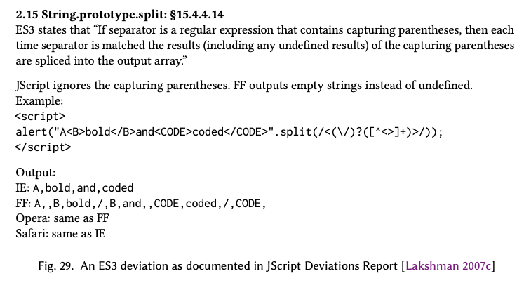

ES3.1 작업 그룹이 당면한 우려는 Microsoft Internet Explorer의 JScript 구현이 웹 표준을 준수하지 않는 것으로 정평이 나 있었다는 것이었다. ECMAScript에 대한 그런 우려의 타당성과 범위를 이해하기 위해, Allen Wirfs-Brock은 Pratap Lakshman에게 IE JScript가 어떤 부분에서 ES3과 다른지 알아내기 위한 분석을 수행하기를 요청했다. 이로 인해 "JScript가 ES3에서 벗어나는 점들"이라는 87페이지 분량의 보고서 [Lakshman 2007c]가 작성되었으며 이 보고서는 2007년 9월에 완성되었다. 보고서에는 세 가지 주요 섹션이 있었다. 첫 번째 주요 섹션은 당시의 JScript 구현이 ES3 명세의 명확한 요구사항에서 벗어난 지점들을 식별했다. ES3를 벗어난 각 부분에 대해 보고서는 ES3 명세 언어에서 위반된 부분, 그 부분을 관찰할 수 있는 테스트 케이스, 그리고 Internet Explorer, Mozilla Firefox, Opera, Apple Safari의 당시 최신 릴리즈에서 해당 테스트를 실행한 결과를 제공했다. 이 브라우저들은 당시 "상위 네 개" 브라우저로 간주되었다. 그림 29는 ES3 명세와의 식별된 차이를 보여주는 예시이다. 일부 차이는 Internet Explorer에만 있었고, 일부는 모든 테스트된 브라우저에서 동일하게 발생했으며, 일부는 Internet Explorer와 다른 하나 또는 두 개의 브라우저에서 발생했다.

보고서의 두 번째 주요 섹션은 ES3 명세에서 동작이 구현에 따라 달라진다고(implementation dependent) 명시적으로 정의되어 있거나 동작이 충분하게 정의되지 않은 모든 부분을 식별했다. 편차 보고서의 두 번째 주요 섹션은 ES3 사양에서 행동이 명시적으로 구현에 따라 달라지거나 충분히 정의되지 않은 모든 장소를 식별했다. 이 섹션 역시 테스트 케이스와 4개의 주요 브라우저에서 테스트를 실행한 결과를 제공했다. 마지막 주요 섹션은 Internet Explorer가 ES3 명세의 확장으로 구현한 기능들을 설명했다. Wirfs-Brock [2007b]은 또한 Firefox의 ES3 확장 목록을 문서화하여 준비했다. Douglas Crockford와 Allen Wirfs-Brock은 2007년 8월 16일에 이러한 문서들의 초안을 검토하기 위해 만났다. 회의 결과는 ES3.1 명세에 대한 잠정적인 변경 사항 집합 [Wirfs-Brock and Crockford 2007]이었다.

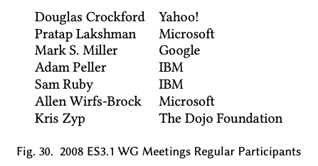

ES3.1의 개발은 2008년 1월 TC39 회의에서 본격적으로 시작되었다. 그 회의에서는 ES3.1의 목표가 검토되었고 여러 추가적인 TC39 참여자들이 이 작업에 관심을 표현했다. 2월 11일, Lakshman은 TC39 사설 이메일 리스트에 ES3.1에 대한 활동을 촉구하는 메시지를 보냈다. 이 이메일은 지난 여름에 준비된 ES3과의 차이와 상호 호환성을 다룬 문서에 대한 주의를 불러일으키고 문서에 대한 피드백을 요청했다. 2월 21일의 전화 회의에서 매주 2번씩의 전화 회의 일정이 수립되었다. 이 전화 회의에 참여한 사람들은 이전의 ES3.1 논의에 참여한 사람보다 훨씬 많았다. 그림 30은 정기적으로 참석한 사람들을 나열한다. 처음에는 제안을 주고받고 논의하기 위해 직통 이메일이 사용되었다. 일부 추가적인 ES3.1 관련 논의는 `es4-discuss` 이메일 포럼에서 일어났다. 그러나 ES4_2와 관련된 주제의 이야기들이 ES3.1에 특정된 주제들을 찾기 어렵게 만들었다. 그래서 4월에는 별도의 `es3.1-discuss`[^80] 이메일 포럼 [TC39 et al. 2008]이 생성되었고 각 회의 사이에 이루어지던 ES3.1 설계 논의의 대부분이 그곳으로 이동했다.

[^80]: 2009년 3월 이 이메일 포럼은 `es5-discuss`로 이름이 변경되었다.

ES3.1에 대한 초기 논의 주제 [TC39 2008d] 중 하나는 ES3.1의 전반적인 목표와 문제 해결과 새로운 기능 추가 시에 따라야 할 설계 규칙에 대한 검토였다. Microsoft Live 팀과 여러 웹 프레임워크 개발자들이 지지한 초기의 입장은 기존 또는 구식 브라우저에서 스크립트 파싱을 실패하게 만들 수 있는 새로운 문법 확장을 피하는 것이었다. 하지만 이러한 "no new syntax" 규칙은 지나친 제약이었으며, 이미 각 브라우저들이 어느 정도의 문법 확장들을 가지고 있다는 현실을 무시하는 것이었다. 이 논의는 "4개 중 3개" 규칙으로 이어졌다. 이 규칙은 Microsoft JScipt와 ES3의 편차를 다룬 문서에서 분석된 4개의 가장 널리 알려진 브라우저(Internet Explorer, Firefox, Opera, Safari)를 기반으로 한 규칙이었다. 이 4개의 브라우저 중 3개가 기능에 대해 동의하거나 공통된 동작을 할 때, 그 기능은 ES3.1 명세에 도입되어야 했다. 이 규칙은 ES3.1이 브라우저 상호 호환성 문제에 어떻게 접근해야 하는지에 대한 더 광범위한 논의로 이어졌다.

기존 ES3.1을 개정하는 작업에 있어서 "기존의 웹을 망가뜨리지 않는다"는 것이 원칙이 되어야 한다는 합의가 있었다. 그러기 위해서 주류 웹 브라우저에서 이미 상호 호환되고 있는 기존 웹 페이지의 동작을 바꾸는 문법 변경 사항을 명시하기로 했다. 그러나 기존 웹 페이지는 수백만 개 있었다. 이 웹페이지들은 실제로 ECMAScript 명세의 어떤 측면에 의존하고 있었는가? 어떤 변경 사항이 기존의 웹을 망가뜨릴 것인가? 브라우저 구현자들의 한 보고에 따르면 기존에 너무 방대한 웹 페이지들이 이미 있기 때문에 어떤 상호 호환 가능한 브라우저 기능(아무리 불분명하거나 타당해 보이지 않는 사례라도)이든지 일부의 기존 페이지에서 사용되고 있을 가능성이 높았다. 그 관점에 기반하면 네 개의 주류 브라우저에서 공통적으로 있는 기능은 변경될 수 없었다. 4개 중 3개 브라우저에서 공통으로 있는 기능은 유력한 표준화 후보였다. 그런데 4개 중 2개 브라우저에만 있거나 모든 브라우저 간에 다르게 작동하는 기능은 어떨까? 그런 기능과 동작은 기존의 호환 가능한 웹에 분명 필수적이지 않았고 표준화 과정에서 수정될 수 있었다.

작업 그룹은 ECMAScript 명세 내에서 어떤 부분에 대해서든 구현의 다양성을 허용하게 되면 브라우저 간에 호환 가능한 웹 페이지의 생성이 어려워진다는 점을 알게 되었다. 전통적인 언어의 명세는 언어 구현자에게 유연성을 주기 위해서 혹은 구현 간의 알려진 차이들을 수용하기 위해서 구현에 따른 다양성을 허용하기도 했다. 하지만 그 방식은 독립적으로 제작된 여러 웹 브라우저에서 상호 호환 가능하게 접근할 수 있는 전세계적인 웹이라는 개념에 근본적으로 부합하지 않았다. ECMAScript 명세는 전통적인 언어 명세보다 더 규범적이고 상세해야 했으며, 구현의 다양성을 가능한 한 제거해야 했다. 이러한 2월의 초기 논의를 따라 Douglas Crockford [2008a]는 TC39 위키에 ES3.1의 수정된 목표를 게시했다(그림 31).

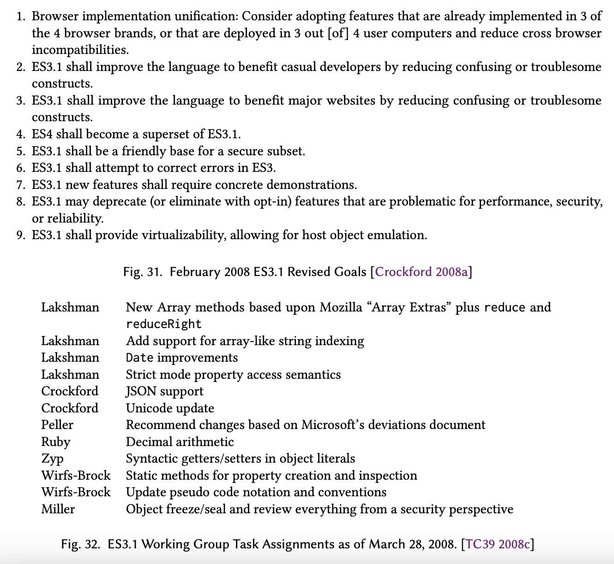

2008년 3월의 대면 회의에서 작업 그룹은 ES3.1의 실제 명세 문서 작성을 즉각적으로 시작하는 것이 중요하다는 데 합의했다. Patrap Lakshman은 Mozilla가 유지하는 ES3 정오표의 항목들에 대한 수정을 적용한 ES3 명세를 가지고 회의에 도착했다. 작업 그룹은 그것을 ES3.1의 기반이 되는 문서로 사용하기로 동의하고 Lakshman이 편집자 역할을 해주기로 요청했다. 이전 판들과 마찬가지로, 명세 문서는 Microsoft Word를 사용하여 작성될 예정이었다. 3판으로부터의 변경 사항에 대한 추적은 이후 검토를 위해 명세의 변화를 추적하고 변경 사항들이 ES4_2 활동의 결과물과 이후 재통합될 수 있도록 하기 위해 사용되었다. 작업 그룹의 구성원들은 특정한 새로운 기능에 대한 명세를 개발하도록 할당되었다(그림 32).

2008년 5월 29일, Pratap Lakshman은 TC39 위키에 ES3.1 명세의 초안을 게시했다. 업데이트된 초안은 일반적으로 주마다 게시되었고 "검토 초안"은 매번 TC39 회의 일정의 2주나 3주 전에 게시되었다. 2008년 5월 29일과 2009년 3월 3일 사이에 총 26개의 중간 초안이 게시되었다.

IBM은 오랫동안 JavaScript가 십진법 산술을 지원해야 한다고 주장해 왔다. 1998년 11월 19일의 TC39 작업 그룹 회의에서부터 Mike Cowlishaw는 십진법 산술이 ES3과 ES4_1에 포함되어야 한다고 주장했다. IBM이 TC39에 다시 참여하여 ES42와 ES3.1에 기여하게 되면서 IBM은 다시 십진법 지원의 포함을 강력히 주장했다. IBM에서 나온 회의 참가자들은 십진법 산술의 지원을 포함하지 않는 모든 새로운 언어 표준에 반대하는 것이 IBM의 정책이라고 알렸다. TC39의 많은 사람들은 십진법 산술을 도입하는 것의 타당성에 대해 회의적이었지만 Brendan Eich는 IBM을 지지했다. 그리고 Firefox의 가장 흔한 버그 보고서가 이진 부동 소수점 산술을 이해하지 못하는 Javascript 개발자들로부터 왔다는 것을 지적했다. Eich는 Sam Ruby가 Mozilla의 SpiderMonkey 엔진을 사용하여 프로토타입을 개발하는 것을 도왔다. 프로토타입은 IEEE754-2008 십진 부동 소수점을 구현하고 이를 Number 타입과 함께 섞어서 사용할 수 있는 새로운 원시값 타입으로 취급했다. 이 십진법 기능에 대한 상당히 완성된 명세는 2008년 9월과 2008년 11월의 ES3.1 초안에 포함되었다. 2008년 11월 19일부터 20일까지의 TC39 회의의 목적은 어떤 기능을 ES3.1 초안에서 유지하고 어떤 기능을 제거할지에 대한 최종 결정을 내리는 것이었다. 그 중 가장 첫째로 논의된 항목이 십진법 산술 지원이었다. 위원회의 결론은 십진법 산술의 설계가 여전히 너무 미성숙하며 ES3.1을 지연시키지 않고는 해결될 가능성이 낮은 남은 설계 문제들이 있다는 것이었다. 고려 사항들은 회의록에 문서화되었으며 [TC39 2008a] 결론은 다음과 같았다.

> 이러한 우려들로 인해 십진법 지원의 포함을 ECMAScript의 Harmony 개정까지 연기하기로 결정했다. 참석자들은 ECMAScript 십진법 제안의 개발에서 매우 중요한 진전이 이루어졌음을 인정하고, 이를 개발하는 데에 많은 노력을 한 IBM의 Sam Ruby에게 감사를 표하고자 한다. 회의 참석자들은 Sam Ruby와 다른 TC39 멤버들이 십진법 제안을 계속 개발할 것을 장려한다. 또한 십진법 산술의 완전히 통합되고 일반화된 버전은 Harmony 개정의 중요한 부분이 될 수 있을 것이라는 낙관적인 전망을 표한다.

2009년 1월에 발표된 다음 검토 초안에서 십진법 관련 자료는 빠져 있었다.

2009년 3월 25일–26일 회의 [TC39 2009d]에서 Pratap Lakshman은 자신이 ECMA-262 편집자직에서 사임한다고 발표했다. 그 이유는 Microsoft가 JavaScript 개발의 담당을 Redmond에 기반을 둔 새로운 그룹으로 이전하고 있는데 그가 거기로 재배치될 수 있는 기회를 거절했기 때문이다. 위원회는 Allen Wirfs-Brock을 후임 편집자로 임명했다.

Wirfs-Brock은 그 TC39 회의 중 휴식 시간에 Brendan Eich에게 접근해서 ES3.1을 하나의 숫자 명칭을 가지는 판으로 다시 명명해야 한다고 제안했다고 회상한다. 그렇게 새로 지정하는 것에 대한 근거는 E3.1이 3개의 이전 판만큼이나 중요한 ECMA-262의 완전한 개정판으로 커졌다는 거였다. 중단된 ES4_2 작업이 받은 관심의 양을 고려할 때 ES3.1을 4번째 판으로 지정하는 것은 JavaScript 개발자 커뮤니티와 웹 검색 엔진 모두에 혼란을 야기할 것이었다. 대신, Wirfs-Brock은 Ecma가 ECMA-262 4번째 판 지정을 영구적으로 떠나보내고 ES3.1 작업을 5번째 판으로 발표할 것을 제안했다. Eich는 동의했고 회의가 재개되자 그들은 전체 위원회에 이 아이디어를 제시했고 받아들여졌다. 위원회는 또한 당시의 초안이 회의에서 합의된 개정을 거친 이후 최종 초안으로 받아들이기로 합의했다. 2009년 4월 7일 "최종 초안"이 5번째 판으로 지정되어 발표되었다 [Lakshman et al. 2009]. 그 최종 초안 이후 자잘한 기술적 및 편집적 수정을 거친 5개의 릴리즈 후보 초안이 나왔다. 2009년 8월, Apple은 arguments 객체가 `Array.prototype`을 상속받도록 하는 결정이 Prototype 프레임워크와 예상치 못한 상호작용을 일으켜 여러 Apple 웹사이트와 NASA 웹사이트를 망가뜨렸다는 것을 발견했다[Hunt 2009].이 변경사항은 최종 사양에서 제거되었다.

2009년 9월 23일, TC39[2009b]는 ES5의 완성을 받아들이고 이를 Ecma 총회에 승인을 위해 전달하기로 투표했다. Ecma 총회 검토 및 승인을 위한 최종 초안은 2009년 10월 28일에 게시되었다. *ECMA-262 5번째 판*은 2009년 12월 3일, 3번째 판의 승인 후 10년 만에 총회에 의해 승인되었다 [Ecma
International 2009a]. 총회 투표 결과는 찬성 19표, 반대 2표였다. IBM은 표준이 십진법 산술을 지원하지 않았기 때문에 반대표를 던졌다. Intel은 충분한 시간을 갖고 명세의 완전한 지적 재산권 검토를 할 수 없었다는 것을 반영하여 반대표를 던졌다고 밝혔다.

*ECMA-262 5번째 판*은 ISO/IEC ECMAScript 표준의 패스트 트랙 개정으로 제출되었다. 이는 ISO 공식 기구의 검토 과정을 거쳤고, 그 피드백을 바탕으로 Allen Wirfs-Brock은 명세에 여러 편집 수정사항을 반영하고 표준을 명확하게 하는 과정을 거쳤다. 그 개정은 2011년 6월에 *ECMA-262 Edition 5.1* 및 *ISO/IEC 16262 Edition 3*으로 발행되었다.

## 20.1 ES5의 기술적 설계(ES5 Technical Design)

기존의 ES3.1의 목표는 매우 소박했지만 그럼에도 ES5는 몇몇 기술적 혁신들을 포함하고 있다.

### 20.1.1 엄격 모드(Strict Mode)

ES5의 엄격 모드(strict mode)는 Javascript 설계에서 "오류와 불편한 부분들을 수정한다"는 Douglas Crockford의 목표의 직접적인 최종 결과물이다. 예약어는 객체 리터럴의 속성 키로도 사용할 수 없고 점(`.`)다음에 사용할 수도 없는 것과 같은 몇몇 불편한 점들은 당시 문법 오류였고 기존 코드의 동작을 변경하지 않고도 ES5에서 수정될 수 있었다. 하지만 Javascript의 많은 잘못된 기능들은 아무런 조건 없이 개선될 수는 없었다. 그렇게 하면 기존 코드의 런타임 동작이 변경될 수도 있었고 이는 "기존 웹을 깨뜨릴" 수 있었다. 엄격 모드의 개념은 JavaScript 개발자들에게 새로운 코드나 업데이트된 코드에서 그러한 수정사항이 포함된 언어의 방언을 명시적으로 선택할 수 있는 기회를 주는 것이었다.

브라우저는 엄격 모드와 기존의 비엄격(non-strict)모드의 코드를 모두 지원해야 했으며, 이상적으로는 개별 함수 수준에서 엄격 모드를 선택할 수 있어야 했다. 기존 스크립트를 엄격 모드를 사용하는 코드로 점진적으로 전환할 수 있도록 하기 위해서였다. 원래의 의도는 시간이 지남에 따라 엄격 모드 문법이 새로운 코드를 작성하는 지배적인 방언이 되는 것이었다. 그러나 첫 도입은 우려의 대상이 되었다. 모든 주요 브라우저가 ES5 엄격 모드를 구현하기까지는 상당한 시간이 걸릴 것으로 추정되었다. 브라우저 게임 이론은 엄격 모드를 선택해서 코드를 작성했을 때 몇몇 주요 브라우저에서 스크립트가 실행되지 않게 된다면 개발자들이 그것을 사용하지 않을 거라고 예측했다. 이 문제는 엄격 모드를 빼는(subtractive) 방식으로 만듦으로써 피해졌다. 엄격 모드는 ECMAScript에 새로운 기능을 추가하지 않았다. 대신 문제가 되는 기능을 제거했다. 버그가 없는 엄격 모드의 코드는 엄격 모드를 지원하지 않는 브라우저에서 실행했을 때도 개발자가 예상한 대로 똑같이 작동해야 한다.

초기의 이슈는 엄격 모드를 작동시킬지 여부를 어떻게 선택할지였다. 엄격 모드의 선택은 스크립트 내에 쉽게 내장될 수 있는 방법으로 이루어져야 했다. 이는 `<script>` 요소의 속성과 같은 외부적인 방법이 될 수 없었다. 


ES4 진영에서는 다양한 모드를 선택할 수 있도록 ECMAScript 코드 내에 `use` 지시문을 도입하는 걸 고려하고 있었다. 하지만 그런 지시문은 ES3.1의 "새로운 문법 없음"이라는 설계 규칙을 위반한다. 하나의 가능성은 특별한 형태의 주석을 지시문으로 사용하는 것이었다. 그러나 ES3.1 작업 그룹은 어떤 형태의 주석이든 문법적으로 의미를 갖도록 만들기를 꺼려했다. JavaScript 최소화 도구(minimizer)가 주석을 제거하기 때문이었다. Allen Wirfs-Brock은 ECMAScript *ExpressionStatement* 구문이 명시적인 세미콜론 혹은 (ASI를 통한) 암시적인 세미콜론으로 끝나는 모든 표현식을 유효한 문장으로 만든다는 것을 관찰했다. 문자열 리터럴 상수만으로 구성된 표현식도 포함해서 말이다. 이는 "use strict";와 같은 문장이 문법적으로 유효한 ES3 코드라는 것을 의미한다. 단순한 상수 값이기 때문에, ES3에서 이를 평가하는 것은 사이드 이펙트가 없다. 그것은 no-op<sup>g</sup>이다. 이러한 문장을 엄격 모드의 선택을 위해 사용하는 것은 안전해 보였으며, 기존의 JavaScript 코드가 그것과 정확히 똑같은 문장을 사용했을 가능성은 매우 낮아 보였다. ES3 구현체는 로드된 모든 ES5 코드에서 그 존재를 무시할 것이다. 작업 그룹은 그 아이디어를 도입했다. 스크립트나 함수 본문의 첫 번째 문장으로 나타나는 `"use strict";` 형태의 문장은 전체 스크립트나 함수가 엄격 모드 문법을 사용하여 처리되어야 함을 나타냈다.

엄격 모드의 주요 목표 중 하나는 분명하지는 않지만 생기기 쉬운 코딩 오류를 런타임에 명시적으로 잡아내는 것이었다. 엄격 모드에는 다음과 같은 새로운 런타임 오류가 추가되었다.

- 선언되지 않은 식별자에 대한 할당. 기존 JavaScript에서는 잘못 입력된 변수 이름에 대한 할당이 전역 객체의 속성 생성으로 이어졌다.
- 읽기 전용의 객체 속성 또는 상속된 속성에 대한 할당. 기존 JavaScript에서는 이것이 아무것도 하지 않는 것으로 조용히 처리되었다.
- 확장할 수 없는 객체에 속성을 생성하려는 시도. ES5 이전에는 그러한 객체가 존재하지 않았지만, 기존 코드와의 일관성을 위해 엄격 모드가 아닌 ES5에서 이 작업을 수행하면 조용히 아무 동작도 하지 않는다.
- 삭제할 수 없는 속성에 대해 delete 연산자를 적용하는 것. 기존 JavaScript에서는 이런 경우 `delete`가 false를 반환했다.
- 변수 참조에 대해 delete 연산자를 적용하면 구문 오류가 발생한다. 기존 JavaScript에서는 명시적으로 선언된 변수에 대해서는 `delete`가 false를 반환한다. 변수 참조가 `with` 문을 통해 객체에 연결되어 있거나 전역 객체의 속성인 경우 기존 JavaScript에서는 삭제된다.

엄격 모드는 또한 프로그램을 더 혼란스럽게 하거나 최적화하기 어렵게 하거나 보안 문제를 일으킬 수 있는 몇몇 기능을 수정하거나 제거했다.

- `with` 문이 허용되지 않는다. `with` 문은 변수 참조의 동적 스코핑 형태를 제공하는데, 이는 개발자에게 혼란을 줄 수 있고 구현체에서 최적화하기 어렵다.
- `eval` 함수를 사용하여 현재 스코프에 새로운 바인딩을 동적으로 추가할 수 없다.
- `eval`과 `arguments`를 변수나 매개변수 이름으로 사용할 수 없다.
- 함수의 `arguments` 객체가 형식 매개변수와 연결되지 않는다 (§3.7.5). 대신, 엄격 모드의 `arguments` 객체는 함수에 전달된 인수 값의 스냅샷을 원소로 갖는 유사 배열 객체이다. 요소를 수정해도 대응되는 형식 매개변수의 값이 수정되지 않으며 그 반대의 경우도 마찬가지다.
- 엄격 모드 함수의 `arguments` 객체에는 `callee` 속성(§5)이 없다. `argument` 객체를 다른 코드에 전달하면 `arguments.callee`를 통해 원래 그 함수를 호출할 수 있는 권한을 암시적으로 전달하게 되었었는데, 이러한 기능은 엄격 모드에서 금지된다[^81].
- 구현체가 엄격 모드 함수의 `arguments` 객체에 `caller` 속성(§3.7.5) 을 제공하는 것이 금지된다. `caller` 속성은 대한 비표준이지만 널리 구현된 ES3의 확장으로, 함수의 호출 스택에서 호출하는 함수를 검색할 수 있게 했다.
- `this` 값을 제공하지 않고 엄격 모드 함수를 호출하면 함수가 전역 객체에 접근할 수 없다.

Douglas Crockford [2007d]의 잘못된 기능과 불편한 점들의 목록에 있는 다른 기능들도 엄격 모드에 도입하는 것이 고려되었지만 포함되지 않았다. 각 기능에 대해서 TC39는 그 기능이 바람직하지 않다는 광범위한 합의에 도달할 수 없었거나, 그 변경 사항이 있던 기능을 제거하기만 하는(subtractive) 형식이 아니라는 게 발견되었다. 예를 들어 Crockford를 포함한 많은 사람들이 JavaScript의 자동 세미콜론 삽입(Automatic Semicolon Insertion)을 좋아하지 않았지만, 많은 개발자들이 명시적인 세미콜론 없이 코딩하는 것을 선호했다. 또한, `typeof null`이 `"object"`가 아닌 다른 것을 반환하도록 변경하는 것은 단순히 기존 기능을 빼는 형식이 아니었다.

### 20.1.2 게터, 세터, 메타 객체 연산자(Getters, Setters, Object Meta Operations)

JavaScript의 첫 구현체부터 특정한 내장 객체나 및 호스트 제공 객체의 일부 속성은 Javascript 코드를 사용하여 생성된 객체에는 사용할 수 없는 특별한 특성을 가지고 있었다. 예를 들어 일부 속성은 읽기 전용 값이거나 `delete` 연산자를 사용하여 삭제할 수 없었다. 그리고 내장 및 호스트 객체의 메서드 속성은 `for-in`문을 사용하여 속성을 열거할 때 건너뛰어졌다. ES1에서 이러한 특별한 시맨틱은 ReadOnly, DontDelete, DontEnum 속성을 객체 속성을 정의한 명세 모델에 연결함으로써 만들어졌다. 


이런 속성들은 그 영향을 받는 언어 기능의 시맨틱을 정의하는 의사 코드에 의해 테스트된다. 이 속성들은 구체화되지 않았다. 원래는 Javascript 코드가 새로 생성된 속성이나 기존 속성에 이런 특별한 속성을 부여할 수 있는 기능이 없었다. ES3에서는 DontEnum 속성의 존재를 테스트하기 위한 `Object.prototype.propertyIsEnumerable` 메서드가 추가됐지만 ReadOnly나 DontDelete 속성의 존재를 테스트하기 위한 메소드는 없었다. 마찬가지로 브라우저 DOM이 제공하는 많은 호스트 객체들은 일반적으로 "게터/세터 속성"이라고 불리지만 ES5에서는 "접근자 속성"으로 명명된 속성을 노출한다. 이 게터/세터 속성은 속성의 값이 설정되거나 검색될 때 계산을 수행한다. 이런 기능의 표준화된 지원 부족으로 인해 JavaScript 프로그래머는 내장 객체나 호스트 객체와 동일한 규칙을 따르는 라이브러리를 정의하거나 그러한 객체를 충실히 모방하는 폴리필을 구현할 수 없었다.

[^81]: 이 다른 코드는 알 수 없는 출처에서 올 수도 있었고, 따라서 신뢰할 수 없는 코드일 가능성이 있었다.

이 문제들에 대한 통합 솔루션은 ES5에서 새로 도입된 기능의 가장 큰 집합 중 하나이다. 이 기능 집합의 공식적인 이름은 없지만 비공식적으로 "정적 객체 함수(Static Object Functions)[^82]" 또는 "객체 반영 함수(Object Reflection Functions)"라고 불린다. Allen Wirfs-Brock [2008]은 이 기능 집합에 대한 설계 근거 문서를 작성했다. 이 문서는 유스케이스를 제시하고 다음과 같은 설계 가이드라인을 포함했다.

- 메타 레이어와 어플리케이션 레이어를 명확하게 분리한다.
- 메서드 수와 인자의 복잡성 같은 API의 표면적인 영역을 최소화한다.
- 명명법과 매개변수 설계에 있어서 사용성에 중점을 둔다.
- 가능하다면 설계의 기본 요소를 반복적으로 적용한다[^83].
- 가능한 경우 프로그래머나 구현체가 API의 사용을 정적으로 최적화할 수 있도록 한다.

첫 번째 가이드라인은 `Object.prototype`에 `propertyIsEnumerable`과 같은 추가적인 메서드들을 더하는 것을 좌절시켰다. 그렇게 하면 메타 계층과 애플리케이션 계층의 구분이 더 흐려질 것이기 때문이었다. 그 대신 ES5 작업 그룹은 이러한 함수들을 애플리케이션 객체에서 분리하여 네임스페이스 객체의 속성으로 만들기로 결정했다. 작업 그룹은 네임스페이스 객체로 사용될 새로운 내장 전역 객체 `Reflect`를 추가하는 것을 고려했지만, 기존 코드와의 이름 충돌이 우려되었다. 결국, 그들은 새로운 함수들을 `Object.prototype`의 속성이 아닌 `Object` 생성자의 속성으로 노출하기로 결정했다. `Object` 생성자는 원래부터 전역 객체이며 표준의 이전 버전이나 이전의 구현체에서도 어떠한 속성도 지정되지 않았기 때문에 네임스페이스로 사용하기 적합한 후보였다. 또한 그 이름은 객체의 정의를 반영한다는(reflecting upon) 개념과 일치했다.

다음 문제는 API의 형태를 결정하는 것이었다. ES5 설계자들은 두 번째 가이드라인에 따라 각 속성 어트리뷰트의 할당 함수나 접근자 속성이 수행하는 함수를 설정하고 검색하기 위한 별도의 쿼리를 피하고자 했다. 설계자들은 이 기능을 적은 수의 함수로 결합하는 다양한 방법들을 고려했다. 고려된 가능성에는 "읽기 전용"같은 불리언 어트리뷰트의 비트 인코딩이 포함된 하나의 함수나, 많은 수의 위치 매개변수를 가진 단일 함수가 있었다. 하지만 두 접근 방식 모두 사용성이 나빴다. 선택적 키워드 인자를 사용하는 것이 이러한 사용성 문제를 해결했을지도 모르지만 ES5는 키워드 인자를 지원하지 않았다.

Allen Wirfs-Brock은 다양한 속성 어트리뷰트에 대응하는 속성을 가진 설명자(descriptor) 객체를 사용하기를 제안했다. 이런 설명자는 속성을 정의하고 검사하는 둘 모두의 경우에 사용될 수 있었다. Wirfs-Brock의 첫 번째 초안 제안[^84]은 `obj`라는 객체에 속성을 추가하기 위해 만들어질 수 있는 API의 예를 다음과 같이 보여주었다.

```javascript
Object.addProperty(obj, {name:"pi", value:3.14159, writable:false});
```

이 예시에서 설명자는 객체 리터럴로 코딩되었다. 그리고 설명자가 누락된 다른 속성 어트리뷰트들에 대해서는 기본값이 사용되었다. 비슷한 설명자를 인수로 받는 가상의 `defineProperty` 함수를 사용하여 기존 속성의 어트리뷰트 값들을 바꿀 수 있었다. `defineProperty`의 경우 주어지지 않은 설명자 속성에 대응하는 어트리뷰트의 경우 수정되지 않고 그대로 유지되었다. 마지막으로, `getProperty` 호출을 사용하여 객체의 기존 속성에 대한 전체 설명자를 얻을 수 있었다.

[^82]: 또는 "메소드(Methods)"라고 할 수도 있다. 네임스페이스로 사용되는 객체와 동작의 추상화로 사용되는 객체의 구분은 개념적인 것이고 언어의 실제 시맨틱에 반영되지 않았다. 일부 JavaScript 프로그래머들은 그 구분을 만들기 위해 "메소드"라는 용어를 사용하지만, 다른 사람들은 사용하지 않는다.

[^83]: 이 말은 개별 기능은 공통의 개념과 문법적 요소들을 가지고 설계되어야 한다는 뜻이다.

[^84]: 이 제안서가 직접적으로 열람 가능하지는 않다. 하지만 Miller의 답장[2008a]이 제안서의 대부분 내용을 포함하고 있다.

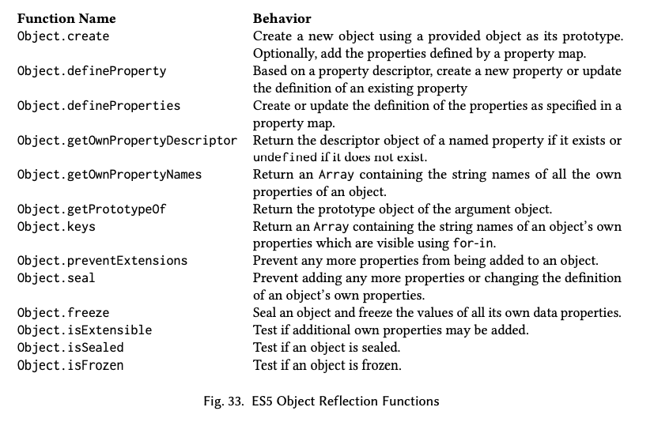

Mark Miller는 `defineProperty`가 "새로운 속성 추가"와 "기존 속성의 수정"을 모두 지원할 수 있도록 정의할 수 있다고 하여 제안서를 개선했다. Miller는 또한 속성 설명자에서 `name` 속성을 제거하고 대신 설명자들을 객체로 감싼 후 대상 객체에서 `defineProperty`의 영향을 받을 속성들의 이름을 key로 하여 대응시키자고 제안했다. 이러한 "속성 맵"은 단일 호출을 사용하여 여러 속성을 정의할 수 있게 한다. 예를 들어, 다음 작업은 `x`와 `y`라는 이름의 속성을 정의한다.

```javascript
Object.defineProperties (obj, {
  x: { value : 0 , writable : true },
  y: { value : 0 , writable : true }
}) ;
```

Miller는 문법에서 `defineProperty`를 제거하고 단일 속성에도 쉽게 사용될 수 있는 `defineProperties` 형태의 함수만 갖도록 하는 것을 제안했다. 하지만 그 형식은 계산된 이름을 갖는 속성을 정의하기 어렵게 했다. ES3.1은 객체 리터럴의 속성명 위치에 계산된 값을 넣는 문법적인 방법이 없었다. 결국 ES3.1은 별도의 인수로 전달된 이름을 키값으로 가지는 단일 속성을 정의하기 위한 `defineProperty`와 속성 맵을 사용하여 여러 속성을 정의할 수 있는 `defineProperties`를 모두 제공했다. ES5에 의해 정의된 객체 반영 함수(Object Reflection Functions)의 전체 집합은 그림 33에서 볼 수 있다.

접근자 속성은 속성 설명자의 대안적 형태를 통해서 지원된다. 접근자 속성은 `value` 속성 대신 `get`, `set` 속성 중 하나 혹은 둘 모두를 갖는 설명자를 사용하여 정의된다. 예를 들어, 데이터 속성에 대한 접근을 매개하는 접근자 속성은 다음과 같이 정의될 수 있다.

```javascript
Object.defineProperties(obj, {
  x: {
    set: function(value) {
      this.privateX = value
    }, // public accessor property
    get: function() {
      return this.privateX
    }
  },
  privateX: {
    value: 0,
    writable: true
  } // "private" data property
});
```

리플렉션 기반의 이런 인터페이스 이외에도 ES3.1은 객체 리터럴을 사용하여 접근자 속성을 정의할 수 있는 문법적 지원도 추가한다. 이 기능은 이미 4개의 주요 브라우저 중 3개에 있었으므로 새로운 문법을 추가하기 위한 조건을 충족했다. 접근자 속성은 `function` 키워드가 `get` 또는 `set`으로 대체된 함수 정의가 객체 리터럴 내에 포함됨으로써 정의된다. 예를 들어 이런 식이다.

```javascript
var obj = {
  privateX: 0, // a normal data property
  set x(value) {
    this.privateX = value
  }, // accessor property x setter
  get x() {
    return this.privateX
  }, // accessor property x getter
  get negX() {
    return -this.privateX
  } //a get - only accessor
};
```

이 새로운 기능을 지원하기 위해서는 ES1 명세에서 처음 정의되었던 내부 객체 모델을 확장하고 이를 객체 리플렉션 API를 통해 일부 노출해야 했다. 이는 또한 객체 모델의 용어들을 재고할 기회가 되기도 했다. ES1은 객체 속성이 값과 어트리뷰트들의 집합을 갖는 것으로 설명했다. ES1에서 객체 속성이 갖는 어트리뷰트는 ReadOnly, DontEnum, DontDelete였다. 이러한 ES1의 어트리뷰트들은 상태를 가지고 있지 않았고 속성에 붙어서 해당 어트리뷰트가 있는지를 나타내는 표지(marker)들이었다. ES3.1의 설계자들은 이런 어트리뷰트들을 구체화해서 속성 설명자 객체의 속성으로 만들고자 했다. 이는 내부 모델을 변경함으로써 달성되었다. ES1에 있던 어트리뷰트들을 각 객체 속성과 연관된 상태 변수(Boolean 값을 가짐)로 모델링하고 속성 값 또한 다른 상태 변수로 다시 개념화했다. 어트리뷰트의 내부 명명 규칙은 내부 메서드에 사용되던 이중 대괄호 패턴을 따르도록 변경되었다. 모델은 `[[Get]]`과 `[[Set]]` 속성을 추가함으로써 접근자 속성을 포함하도록 확장되었고 각 속성의 값은 getter와 setter(혹은 기본 함수를 나타내는 `undefined`)함수였다. getter는 값의 참조에 의해 호출되었고 setter는 값의 할당에 의해 호출되었다. 이로써 속성은 `[[Value]]` 속성이 있으며 `[[Get]]`과 `[[Set]]` 속성이 없는 경우 데이터 속성(data property)으로 분류될 수 있었고 그 반대의 경우에는 접근자(accessor property) 속성으로 분류될 수 있었다.

접근자 속성에 대한 지원을 위해서는 ES1에서 원래 정의되었던 `[[Get]]`, `[[Put]]`, `[[CanPut]]` 내부 메서드의 명세를 업데이트해야 했다. 객체 리플렉션 API에서 사용되는 속성 설명자에 대한 지원은 `[[DefineOwnProperty]]`, `[[GetOwnProperty]]`, `[[GetProperty]]` 내부 메소드의 추가를 필요로 했다. 그러나 그 리플렉션 API는 여전히 충분하지 않았다. ES3.1에서 `for-in` 문의 속성 키 열거와 `Object.getOwnPropertyNames`, `Object.keys` 함수는 여전히 시맨틱 명세에서 비공식적인 서술을 사용했다.

객체 리플렉션 API 설계의 마지막 단계는 프로퍼티 설명자 객체 내에서 속성 어트리뷰트를 속성명으로 노출하는 데 사용되는 어휘에 대한 일관적이고 사용하기 쉬운 네이밍 컨벤션을 정하는 것이었다. 특히 DontEnum과 ReadOnly와 같은 이름은 내부적인 일관성이 부족하고 사용성에 대한 문제를 일으켰다. 이들이 Boolean 값 플래그로 처리될 때 특히 그러했다. 예를 들어 속성을 열거 가능하게(enumerable)하려면 DontEnum을 false로 설정해야 했다. 이건 이중 부정이다. 2008년 초 ES4_2 관련 스레드에서 Neil Mix[2008b]는 "enumerable(열거 가능)", "writable(쓰기 가능)", 그리고 "removable(DontDelete에 대한)"이 어트리뷰트에 더 나은 이름이라고 제안했다. Mark Miller[2008b]는 그 이름 제안에 감사를 표했고 어트리뷰트명은 무엇이 금지되는지가 아니라 무엇이 허용되는지를 표현해야 한다는 설계 가이드라인을 제안했다. Miller는 또한 거부를 기본값으로 하는(deny by default)보안에서의 모범 사례를 따를 것을 제안했다. 속성을 정의할 때는 원하는 어트리뷰트를 명시적으로 활성화해야 한다.

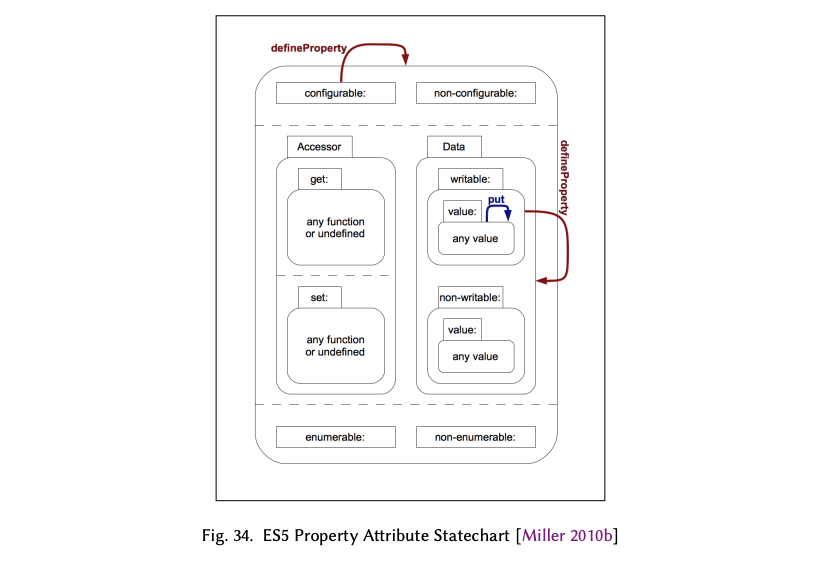

객체 리플렉션 API는 이전 버전의 ECMAScript에서 사용할 수 없었던 새로운 기능을 제공했다. 리플렉션 API는 프로그램이 기존 속성의 어트리뷰트를 변경할 수 있게 했고 데이터 속성과 접근자 속성 간의 전환도 가능했다. 그러한 변경을 만들 수 있는 능력도 비활성화하는 추가 속성이 필요한지에 대한 고려도 있었다. 고려된 속성 이름으로는 "dynamic", "flexible", "fixed"등이 있었다. Boolean 값을 가지는 추가적인 속성 어트리뷰트를 추가하는 것이 기존 구현에 미칠 수 있는 영향에 대한 우려가 있었다. 구현체에서 그 어트리뷰트를 나타내는 데 쓸 수 있는 추가 비트를 가지고 있지 않다면 어떻게 될까? 결국 ES3.1 작업 그룹은 속성의 어트리뷰트를 변경하는 것은 속성의 현재 어트리뷰트를 원자적으로 쿼리하고 속성을 지우고 동일한 이름의 속성을 수정된 어트리뷰트 값을 갖게 하여 다시 생성하는 것과 동등하다는 것을 깨달았다. 이러한 동등성을 고려할 때 삭제와 수정을 활성화하는 것 둘 다 하나의 어트리뷰트로 해결할 수 있었다. DontDelete/removable 속성은 "configurable"[^85]로 이름이 변경되었고 그 의미가 할당되었다. Mark Miller가 ES5 속성 어트리뷰트에 대한 상태 다이어그램 [Harel 2007]을 초안했고 [2010b; Figure 34] 이건 ECMAScript 위키에 게시되었다. configurable 어트리뷰트가 false일 때도 속성의 writable 어트리뷰트를 true에서 false로 변경할 수 있다는 점을 관찰할 수 있다. 이런 이상한 부분은 보안 샌드박스<sup>g</sup>가 특정 내장 속성을 non-configurable, writable 어트리뷰트를 가진 상태에서 non-configurable, non-writable로 바꿀 수 있도록 하기 위해 만들어졌다.

Douglas Crockford는 JavaScript 애플리케이션을 객체지향으로 작성할 때 프로토타입 스타일의 사용을 지지했다. 그는 명시적으로 주어진 프로토타입을 갖는 객체를 생성하기 위해 `beget`이라는 함수를 사용하는 것을 홍보했다. ES5 함수 `Object.create`는 옵셔널한 두 번째 매개변수로 속성 맵을 받을 수 있도록 만든 `beget` 함수와 본질적으로 같았다. 예를 들어서 이렇게 사용할 수 있다.

[^85]: "configurable"이라는 용어는 Neil Mix가 제안했다[2008a].

```javascript
var point1 = beget(protoPoint); // Create a point, using Crockford style
point1.x = 0;
point1.y = 0;

var point2 = Object.create(protoPoint, { // using ES5 declarative style
  x: {
    value: 0
  },
  y: {
    value: 0
  }
});
```

Allen Wirfs-Brock은 JavaScript 프로그래머들이 이러한 선언적 스타일을 도입하기를 바랐고, 구현체들이 그 패턴을 인식하여 객체 생성을 최적화할 것이라고 기대했다. ES5에서 가능해진 이러한 패턴은 사용성 문제로 널리 도입되지 못했다. 문제는 기본 어트리뷰트의 선택에 있었다. 예전 Javascript 1.0에서는 암시적 할당에 의해 생성된 속성은 `{writable: true, enumerable: true, configurable: true}`와 같은 속성 어트리뷰트를 가졌다. 하지만 ES5에서 어트리뷰트 설명자를 설계할 때 사용한 '기본적인 거부(deny-by-default)'정책은 다음과 같은 `Object.create` 선언적 스타일 예시에서 보여지는 것처럼 모든 어트리뷰트가 명시적으로 설정하지 않으면 기본값으로 false를 가지게 했다.

```javascript
// Using Object.create in a Crockford style
var point1 = Object.create(protoPoint);
point1.x = 0;
point1.y = 0;
// point1.x attributes: writable :true, enumerable :true, configurable : true
// point1.x attributes: writable :true, enumerable :true, configurable : true
// using Object . create in a declarative style
var point2 = Object.create(protoPoint, {
  x: {
    value: 0
  },
  y: {
    value: 0
  }
});
// point2.x attributes: writable: false, enumerable: false, configurable: false
// point2.x attributes: writable: false, enumerable: false, configurable: false
```

`beget`함수를 사용한 위에서의 예시와 정확히 같은 동작을 가지도록 ES5 Javascript에서 프로그램을 작성하려면 다음과 같이 해야 했다.

```javascript
// Create a point instance, with ES5 support and traditional attribute values
var point2 = Object.create(protoPoint, {
  x: {
    value: 0,
    writable: true,
    enumerable: true,
    configurable: true
  },
  y: {
    value: 0,
    writable: true,
    enumerable: true,
    configurable: true
  }
});
```

이 형식은 대부분의 프로그래머에게 너무 장황했다. 대부분의 프로그래머들은 Javascript에서 전통적으로 사용되어 온 보다 허용적인 기본값을 계속 사용하고 싶어했다. 실제로 `Object.create`가 하나의 인자만 받는 형태는 새 객체를 생성하는 데에 일상적으로 사용되며 `Object.defineProperties`는 이전에 생성된 객체의 속성을 정의하고 조작하는 데에 사용된다. 하지만 `Object.create`가 2개의 인자를 받는 형태는 새 객체의 속성을 정의하는 데에 거의 사용되지 않는다.

### 20.1.3 객체 통합과 보안 기능(Object Integrity and Security Features)

Netscape 3에서 도입된 HTML `<script>` 요소의 `src` 속성은 웹 페이지가 여러 웹 서버에서 JavaScript 코드를 로드할 수 있게 했다. 가장 일반적인 형태를 보면 스크립트는 단일 JavaScript 실행 환경으로 로드되었고 전역 네임스페이스를 공유했다. 크로스 사이트 스크립트는 직접적으로 상호작용할 수 있었고 이는 매시업 애플리케이션의 생성을 가능하게 했다. 이러한 크로스 스크립트 로딩 기능은 널리 사용되었고 광고 기반 웹 비즈니스 모델의 핵심 조력자였다. 하지만 크로스 사이트 스크립트는 서로간에, 그리고 페이지의 원래 스크립트와 간섭하고 방해할 수도 있었다. 웹 개발자들은 결국 서드파티 스크립트가 비밀번호와 같은 기밀 사용자 데이터를 도난하거나 사용자를 속이기 위해 페이지의 동작을 변경할 위험이 있다는 것을 깨달았다. 2007년에는 웹 광고 중개인이 모르는 채로 배포한 악성 광고가 관찰되기 시작했다. 브라우저 벤더들은 Content Security Policy (CSP)와 같은 다양한 HTML 및 HTTP 수준의 기능을 개발하여 문제를 해결하려고 했지만, 그러한 수준의 기능이 많은 저수준 JavaScript 취약점을 직접적으로 해결하지는 않았다 [Barth et al. 2009].

Douglas Crockford [ADsafe 2007]와 Mark Miller [Caja Project 2012; Miller et al. 2008]는 ES3.1 작업 그룹에 참여하는 동안, 신뢰할 수 없는 서드파티 JavaScript 코드의 실행을 안전하게 호스팅할 수 있는 JavaScript 실행 샌드박스를 제공하기 위한 기술을 적극적으로 개발하고 있었다. ES3.1의 강력한 후방 호환성 요구사항은 많은 알려진 서드파티 스크립트 취약점을 제거할 수 없다는 것을 의미했다. 하지만 Crockford와 Miller는 호환성을 지키면서도 제거될 수 있는 취약점을 제거하고 안전한 샌드박스의 생성을 가능하게 하는 새로운 기능을 추가하도록 밀어붙였다. 특히 Mark Miller는 객체-능력(object-capabilities)에 기반한 샌드박스를 구축하는 데 필요한 기능에 관심이 있었다 [Miller 2006].

가장 큰 문제는 Javascript 객체의 변경 가능성이었다. 기본적으로 Javascript에서는 객체의 참조를 얻기만 하면 어떤 코드든 객체를 완전히 변경할 수 있었다. 표준 라이브러리 객체를 포함하는 모든 Javascript 객체가 그러했다. 메서드를 포함한 모든 속성은 추가되거나 값이 바뀌거나 삭제될 수 있었다. 이는 직접 참조된 객체와 루트 객체에서 시작해서 간접적으로 참조 가능한 모든 객체에 적용되었다. ES3는 객체의 프로토타입 객체에 대한 참조를 직접 수정하는 방법을 제공하지 않았지만, Internet Explorer를 제외한 모든 주요 브라우저는 객체의 프로토타입 상속 체인을 수정하는 데 사용될 수 있는 비표준 속성 `__proto__`를 구현했다. 이러한 광범위한 변경 가능성의 유일한 예외는 ES3에서 ReadOnly 또는 DontDelete 어트리뷰트로 태그된 소수의 내장 속성들뿐이었다.

Mark Miller와 Douglas Crockford 모두 신뢰할 수 없는 코드에 객체를 넘기기 전에 객체의 속성을 잠글 수 있는 기능을 추가하고 싶어했다. 그들은 샌드박스에 노출된 내장 라이브러리 객체를 보호하고, 샌드박스를 호스팅하는 코드가 신뢰할 수 없는 코드에 전달해야 하는 모든 객체를 보호할 수 있도록 하는 데 그 기능을 사용하려고 했다. DontDelete 어트리뷰트를 Configurable 어트리뷰트로 고치고 `Object.defineProperty`를 사용하여 속성을 non-Configurable로 만들 수 있는 기능은 개별 속성을 보호하는 기본적인 능력을 제공했다. 그러나 이것만으로는 신뢰할 수 없는 코드가 전달받은 객체에 새로운 속성을 추가하는 것을 방지할 수 없었다. 새로운 속성을 추가할 수 있는 능력은 신뢰할 수 없는 코드가 상속된 동작을 덮어쓰고 잠재적으로 개인 데이터를 유출할 수 있는 비밀 통신 채널을 구성할 수 있게 했다. ES5에서는 각 객체에 내부적으로 `[[Extensible]]`이라고 불리는 새로운 상태를 연결함으로써 이 문제를 해결했다. 객체는 처음에 `[[Extensible]]`이 `true`로 설정된 상태로 생성된다. 그러나 객체의 `[[Extensible]]`이 false로 설정되면, 해당 객체에 새로운 속성을 추가할 수 없다. 구현체는 `[[Extensible]]`이 `false`일 때 객체의 `[[Prototype]]`을 변경할 수 있는 어떠한 확장도 제공해서는 안 된다. 마지막으로, `[[Extensible]]`이 한 번 `false`로 설정되면 `true`로 재설정될 수 없다.

함수 `Object.isExtensible`은 객체의 `[[Extensible]]` 상태를 조회하는 API를 제공한다. 함수 `Object.preventExtensions`은 `[[Extensible]]`을 `false`로 강제한다. `Object.freeze`는 `[[Extensible]]`을 `false`로 설정하고 객체가 자체적으로 가지는 모든 속성(역주: 프로토타입을 통해서 접근 가능한 속성이 아니라 객체가 직접적으로 가지고 있는 속성)의 `[[Configurable]]`과 `[[Writable]]` 어트리뷰트를 `false`로 설정하는 편의 함수이다. 이는 객체의 직접적인 상태를 완전히 변경 불가능하게 만든다. 함수 `Object.seal`은 `Object.freeze`와 유사하지만 `[[Writable]]`이 `false`로 설정되지 않는다는 점이 다르다. 이는 객체의 프로토타입과 속성 집합을 고정하지만, 데이터 속성의 값을 수정할 수는 있게 한다.

또 다른 중요한 우려 사항은 전역 객체에 대한 주변의 접근이었다. ECMAScript는 전역 객체의 속성이 전역 스코프에 존재한다고 정의한다. 모든 명명된 표준 라이브러리 객체가 전역 객체의 속성으로 존재하며 대부분의 Javascript 호스팅 환경은 전역 객체에 특정 환경에서만 지원하는 추가적인 객체와 API 함수들을 추가한다. 예를 들어 브라우저에서 전역 객체는 `window` 객체와 동일하다. 그리고 전역 객체는 현재 웹페이지의 DOM 객체와 다른 브라우저 API에 대한 모든 접근을 할 수 있게 한다. 일반적으로 샌드박스는 이런 전역 객체 속성 일부 또는 전부에 대한 접근을 제한하거나, 전역 객체 속성 중 일부에 대한 대체 버전을 제공한다. 이론적으로 봤을 때 이는 모든 샌드박스 내의 코드에 추가적인 렉시컬 스코프를 부여하고 그 스코프가 일부 전역 객체 속성에 대해 대체 바인딩을 제공하거나 해당 전역 객체 속성들에 `undefined` 값을 가진 쉐도우 바인딩을 제공하여 접근을 검열함으로써 달성할 수 있어야 한다. 그러나 렉시컬 스코프에 상관없이 전역 객체에 접근할 수 있는 방법이 Javascript 1.0부터 존재했다.

```js
function getGlobalObject() {
  // when directly called, the value of this is the global object
  return this;
}
getGlobalObject().document.write("pwned");
```

ES5 이전까지 객체를 경유하는 메서드 호출이 아니고 함수를 직접적으로 호출할 시 함수의 암시적인 `this` 인수에 `null`을 전달하며 모든 함수는 실행될 때 `this` 의 값이 `null`이면 `this`의 값을 전역 객체로 대체한다고 명세되어 있었다. 후방 호환성을 위해 기존 코드에서는 이 동작을 변경할 수 없었다. 그러나 ES5의 엄격 모드는 새로운 코드가 새로운 동작을 선택할 수 있는 기회를 제공했다. ES5에서 엄격 모드의 함수는 실제 `this` 인수를 전역 객체로 대체하지 않는다. 샌드박스는 엄격 모드 Javascript 코드만 샌드박스에서 실행되도록 허용함으로써 주변 전역 객체 접근으로부터 자신을 보호할 수 있었다.

ES5가 개발되는 동안, 그림 35에서 보여진 예제와 같은 실제의 악의적인 공격이 웹 상에서 관찰되기 시작했다. ES3는 객체 리터럴을 사용하여 생성된 객체는 `Object.prototype`를 상속받고, 객체 리터럴은 리터럴에 나열된 속성을 새 객체에 넣기 위해 내부 메소드 `[[Put]]`을 사용한다고 명세했다. 

그러나 객체의 속성에 값을 할당할 때 `[[Put]]`을 사용하면 같은 이름의 속성을 찾기 위해 프로토타입 상속 체인이 탐색된다. 그러다가 해당 이름을 갖는 setter 속성을 찾으면 그 setter 함수가 실행된다. 만약 그러한 setter가 `Object.prototype`에 있다면 setter와 같은 이름을 가지는 속성을 객체 리터럴을 이용하여 생성하려고 하면 속성값이 setter에게 전달되고 setter가 호출된다.

이러한 서점을 수정하는 건 객체 리터럴의 시맨틱에 대한 breaking change였다. 하지만 브라우저 벤더들이 보안 취약점을 수정하기 위해 기꺼이 수행할 수 있는 종류의 변경이었다. 실제 명세 변경은 간단했다. 객체의 새로운 속성을 생성하기 위해 `[[Put]]` 시맨틱을 사용하는 대신, ES5는 상속된 속성을 항상 무시하고 객체에 직접 새 속성을 생성하는 새로운 내부 메소드 `[[DefineOwnProperty]]`을 사용했다.

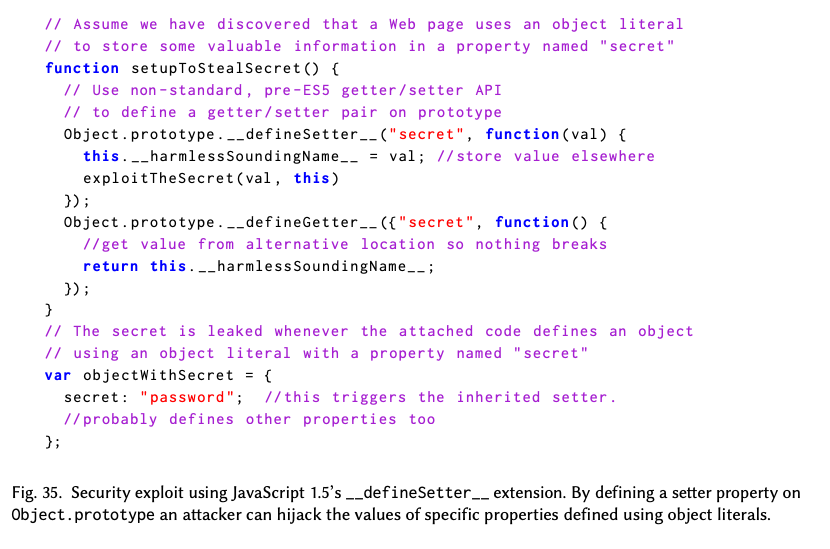

ES5는 JavaScript를 더 안전하게 만들 때, 조금씩 나아갈 수밖에 없었다. ES5 작업이 진행되는 동안, Douglas Crockford는 TC39 내에 Secure ECMAScript (SES) 작업 그룹을 구성할 것을 제안했다. 목적 [Crockford 2008d; TC39 2008b]은 후방 호환성에 대한 제약이 없는 ECMAScript의 안전한 방언을 개발할 가능성을 탐색하는 것이었다. SES 작업 그룹은 2008–2009년에 네 번 만나 신뢰할 수 없는 코드의 안전한 평가를 위한 기존 JavaScript 솔루션들 [TC39 2008e]을 검토했다. TC39가 별도의 새로운 방언을 표준화하는 아이디어는 결국 포기되었다. 하지만 객체-능력 모델(object-capability model)과 같은 SES의 개념은 Harmony 활동에 큰 영향을 미쳤다. Ankur Taly 등[2011]은 엄격 모드와 기타 ES5 기능이 어떻게 매시업-친화적(mashup-friendly)인 안전한 ECMAScript 하위 집합의 생성을 가능하게 하는지를 공식화했다.

### 20.1.4 액티베이션 레코드 제거(Elimination of Activation Objects)

ES5 이전에 ECMAScript 명세에서는 ECMAScript 언어의 스코프 시맨틱을 정의하기 위해서 ECMAScript 객체를 명시적으로 사용했다. 각 스코프 윤곽<sup>g</sup>은 액티베이션 레코드(activation object)로 표현되었다. 액티베이션 레코드는 스코프 윤곽에 해당하는 코드에 의해 생성된 변수와 함수 바인딩을 속성으로 가진 일반 ECMAScript 객체였다. 중첩 스코프는 참조된 바인딩을 찾기 위해 순서대로 검색되는 액티베이션 레코드 목록으로 명세되었다. 바인딩을 참조했던 언어 기능은 액티베이션 레코드에 접근할 때 사용자 프로그램에 의해서 정의된 객체 속성에 접근하기 위해 사용하는 속성 접근 연산자를 똑같이 사용했다. ES1과 후속 명세들에서는 액티베이션 레코드가 ECMAScript 프로그램에서 관측할 수 없고 명세에서만 쓰이는 것이라고 명시했다. 하지만 속성 접근 시맨틱은 엔진이 명세를 완전히 준수하는 경우 관찰될 수 있는 몇 가지 예상치 못한 엣지 케이스의 동작을 초래했다. 구현체마다 이런 엣지 케이스의 시맨틱을 구현했는지, 그리고 얼마나 구현했는지에 따른 차이가 있었다.

이상했던 부분 하나는 액티베이션 레코드가 새로 생성된 객체의 기본 프로토타입인 `Object.prototype`을 아마도 상속한다는 것이었다. 이는 `Object.prototype`의 속성을 모든 액티베이션 레코드가 상속하며 이 속성들이 각 액티베이션 레코드의 로컬 바인딩으로 나타나서 외부 스코프에서 동일한 이름을 가지고 있는 다른 바인딩을 가리게(shadowing)된다는 것이었다.

바인딩의 확정은 명세 상에서 동적으로 발생하도록 지정되었고 여기에는 액티베이션 레코드의 속성 조회를 사용했다. 따라서 호출된 함수 내부에서의 모든 자유 참조(free reference)는 참조된 이름의 `Object.prototype` 바인딩을 호출 전에 연결함으로써 덮어써질 수 있었다. 예를 들어 다음과 같은 경우를 보자.(역주: 이렇게 함수 호출 이전에 `Object.prototype`에 새로운 속성을 추가하면 호출된 함수 내에서 내장 Array 생성자 대신 덮어써진 생성자 함수가 대신 사용되었다)

```js
var originalArray = Array;

function AltArray() {
  // this is a replacement for the built -in Array constructor
  // ...
}
// Call a function , forcing it to use AltArray in place of Array
Object.prototype.Array = AltArray;
somethingThatFreelyReferencesArray();
delete Object.prototype.Array; // remove the alternative Array binding
```

다른 이상현상은 ES3에서 `try`문의 `catch`절 매개변수를 `catch`절 본문을 포괄하는 새로운 스코프의 로컬 렉시컬 스코프 바인딩으로 처리하는 것이었다. 스코프 윤곽을 표현하는 데에 ECMAScript 객체를 사용하는 것은 그 시맨틱에 대해서도 문제를 일으켰다. ES5 명세 [Lakshman and Wirfs-Brock 2009, Annex D]는 이 문제를 다음과 같이 설명했다.

> 12.4: ES3에서 `try`문의 `catch` 절에 전달된 예외 매개변수의 이름을 분석할 때 스코프 객체가 생성되었다. 마치 `new Object()`에 의해 생성된 것과 같은 로직으로. 만약 실제 예외 객체가 함수이며 `catch` 절 내부에서 호출된 경우 스코프 객체가 호출의 `this` 값으로 전달되었다. 그러면 함수의 본문은 그 `this` 값에 새로운 속성을 정의할 수 있었고, 그 속성 이름은 함수 반환 후에도 `catch` 절의 스코프 내에서 접근할 수 있는 식별자 바인딩이 되었다. ES5에서는 예외 매개변수가 함수로 호출될 때 `this` 값으로 `undefined`가 전달된다.

2008년 대부분 기간 동안 작업 그룹은 새로운 판에 `const` 선언을 포함시키고자 했다. `const` 선언은 브라우저마다 의미가 다르긴 했지만 4개의 주요 브라우저 중 3개에서 지원하는 기능이었기 때문이다. 계획은 `const`를 블록 레벨 렉시컬 스코프를 가지도록 만드는 것이었다. 그리고 이는 이전 명세들에서 사용된 전통적인 스코핑 모델을 더욱 압박할 것으로 예상되었다.

이 문제들을 해결하기 위해 Allen Wirfs-Brock은 스코프와 바인딩의 새로운 명세 수준 모델을 개발하였다. 이 모델은 식별자 해석 메커니즘에 ECMAScript 객체 시맨틱을 사용하지 않았다. 이 모델은 단일 스코프 윤곽에 대한 바인딩을 포함하는 환경 레코드(environment record)의 개념을 도입했다. 그리고 환경(environment)이 ECMAScript 프로그램에 식별자 해석의 맥락을 제공하는 환경 레코드의 순서 있는 목록이라는 개념도 도입했다. 전역 스코프, 함수 스코프, 블록 스코프, 그리고 with 문 스코프를 나타내는 다양한 종류의 환경 레코드가 있었지만 모든 환경은 개별 바인딩의 정의, 조회, 값 변경에 대한 공통의 명세 수준 프로토콜을 노출했다. 변수 및 다른 종류의 바인딩을 선언하거나 접근하는 언어 기능들은 이 공통 환경 레코드 프로토콜을 사용하여 명시되었다.

그럼에도 불구하고 `const` 선언은 명세의 미래 harmony 판으로 미루어졌다. `const` 선언의 이른 도입으로 인해 향후 블록 스코프 선언의 더 포괄적인 설계를 하는 게 지장을 받을 수 있다는 사실을 작업 그룹이 깨달았기 때문이다. 새로운 스코핑 모델은 기존 스코핑 모델의 이상한 부분을 해결하기 위해 여전히 ES5에서 사용되었다. 그리고 ES6의 더 포괄적인 선언문 집합의 기반을 제공했다.

### 20.1.5 ES5의 다른 기능들(Other ES5 Features)

ES5는 그림 33에 나열된 객체 리플렉션 함수뿐 아니라 다음과 같은 표준 내장 함수, 메서드, 속성들을 추가했다.

- 객체를 JSON 포맷 문자열로 전환하거나 JSON 포맷 문자열을 객체로 전환하는 데 사용되는 `JSON.stringify`와 `JSON.parse` 함수
- `indexOf`, `lastIndexOf`, `every`, `some`, `forEach`, `map`, `filter`, `reduce`, `reduceRight` 총 9개의 새로운 `Array.prototype` 메서드
- `String.prototype.trim` 메서드
- `Date`의 `Date.prototype.now` 메서드와 데이터 문자열을 ISO 8601 형식으로 파싱할 수 있는 확장
- `Function.prototype.bind` 메서드와 함수 인스턴스의 `name` 속성

다음과 같은 자잘한 변경 사항과 개선 사항들도 있었다.

- `with` 문과 `catch` 절 매개변수의 스코핑에서의 시맨틱 수정
- `[]`문법을 사용한 문자열에서의 인덱싱
- 정규 표현식 문법의 작은 수정
- 정규 표현식 리터럴이 평가될 때 매번 새로운 `RegExp` 객체가 생성되도록 변경
- 잘못된 형식의 정규 표현식 리터럴에 대한 조기 에러 검출
- 전역 객체 속성 중 `undefined`, `NaN`, `Infinity`가 읽기 전용 값을 가지도록 변경
- 명세의 모든 알고리즘이 `Object`, `Array`등 내장 객체의 빌트인 값을 사용하도록 변경. 원래는 해당 객체들의 현재 값을 사용하도록 되어 있었음
- 여러 비-규범적인(non-normative) 시맨틱의 명확화와 명세 부록 D, E에 나열되어 있는 수정 사항

## 20.2 구현과 테스트[^86]

2008년 7월 오슬로에서 열린 Ecma TC39 회의에서 위원회는 출판을 진행하기 전에 ES3.1의 두 가지 상호 호환 가능한 구현체를 갖기로 합의했다. 이 "두 가지 상호 운용 가능한 구현" 요구사향의 주된 동기는 위원회가 기술적으로 실행 가능하며 기존 웹 콘텐츠와 호환 가능하다는 것이 입증되지 않은 것을 표준화하지 않도록 보장하기 위함이었다. 모질라는 구현 중 하나를 제공하기로 약속했다. 마이크로소프트가 가진 시장에서의 위치와 역사적으로 빈번하지 않았던 마이크로소프트의 브라우저 업데이트로 인해, 마이크로소프트가 ES3.1 검증 과정의 일부로 공개적으로 사용할 수 있는 브라우저 호스트 프로토타입의 구현체를 만들어서 ES3.1에 대한 그들의 헌신을 보여주어야 한다는 강한 의견이 TC39 내에 있었다. 당시 TC39의 계획은 2009년 6월 Ecma 총회 회의에서 ES3.1을 출판할 수 있게 준비하는 것이었다. 

이를 위해서는 2009년 2월/3월에 수행될 상호 호환성 테스트의 결과를 기반으로 하는 2009년 3월 TC39 회의에서 진행에 대한 결정을 해야 했다. 당시에는 ECMA-262와 부합하는 공식 테스트 스위트가 없었으며 ES3.1의 새로운 기능에 대한 테스트는 더더욱 없었다. 모든 구현체는 자체적인 ad hoc 테스트 스위트를 가지고 있었고 마이크로소프트를 제외한 모든 구현체가 Mozilla의 JavaScript 테스트 스위트도 사용했다. 마이크로소프트는 Mozilla 테스트 스위트에 사용된 모질라 공개 라이선스에 대한 우려가 있어 그 테스트 스위트를 사용하거나 거기 기여하지 않았다. 마이크로소프트는 MIT나 BSD 스타일 라이센스를 사용하여 Ecma를 통해 제공될 테스트 스위트를 선호했다.

2008년 10월 Pratap Lakshman은 ES3.1의 인터넷 익스플로러 호스팅 구현과 거기 동반되는 테스트 스위트를 생성하는 두 가지 작업에 착수했다.

구현된 테스트 케이스는 커뮤니티에 기여될 예정이었다. 테스트 스위트의 목표는 명세의 의사 코드에 대해서 최대한의 코드 커버리지를 달성하는 것이었다. 각 테스트 케이스는 명세 최신 초안의 섹션과, 알고리즘 상의 단계 번호를 따라서 이름이 지어졌고 단일 `.js` 소스 파일에 배치되었다. 그림 36은 테스트 파일 이름의 명명에 쓰였던 규칙을 보여준다.

Lakshman은 900개 이상의 테스트 케이스와 개별 테스트 케이스를 실행하고 보고하는 간단한 테스트 도구를 구현했다. 그램 37은 테스트 케이스 중 하나의 예를 보여준다.

[^86]: 이 섹션은 Pratap Lakshman가 기여했다.

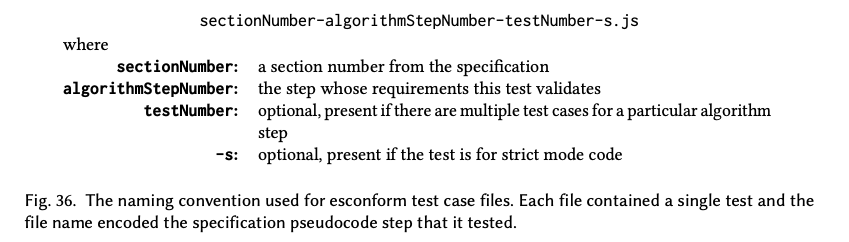

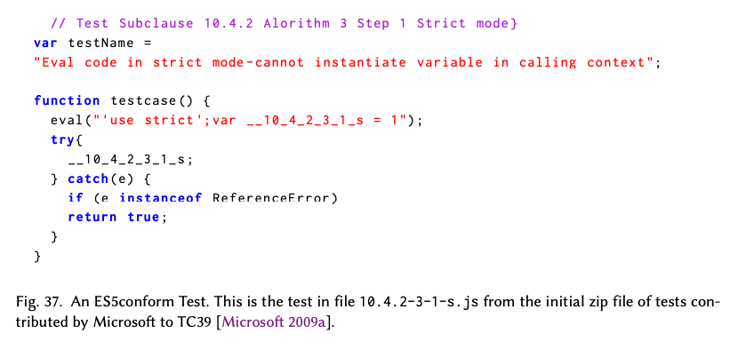

2009년 1월 TC39 회의에서 [Horwat 2009], Pratap Lakshman은 ES3.1 프로토타입 구현체를 시연했다. 이 구현체는 막 출시된 마이크로소프트 인터넷 익스플로러 릴리즈 후보 1에 통합된 실험적 버전의 `JSCRIPT.dll`을 사용했다. 이 시연은 새로운 언어 기능과 함께 명세와 일치하는지를 테스트하는 테스트 스위트를 포함했다. 이 노력에 대해 전반적인 찬사가 있었으며 Waldemar Horwat은 그의 회의 노트에서 "사람들이 매우 좋아했다"고 보고했다.

마이크로소프트는 테스트를 Ecma에 기증했다. 그리고 이 테스트를 "ES5conform" [2009]이라는 이름으로 자사의 오픈 소스 프로젝트 포털 `codeplex.com`에도 공개했다. 거의 같은 시기에 Google은 크롬의 V8 JavaScript 엔진을 개발하는 과정에서 생성한 오픈 소스 ES3 테스트 스위트를 공개한다고 발표했다 [Hansen 2009]. 이 테스트 스위트는 "Sputnik"이라고 명명되었고 5,000개 이상의 테스트로 구성되었다.

2010년, ES5conform과 Sputnik은 "Test262"라고 명명된 공통의 Ecma TC39 관리 테스트 스위트의 핵심이 되었다. Ecma 기술 위원회가 소프트웨어 패키지를 유지하고 배포하는 것은 극적인 변화였으며, 이를 실현하기 위해서는 많은 정책 및 라이선스 문제가 해결되어야 했다. Test262 개발의 초기 ES5 단계는 David Fugate가 이끌었다. 그 후 Brian Terlson이 ES6에 대한 Test262를 조직했고 ES6 이후의 시대에는 Leo Balter가 이를 이어받았다. Test262는 이제 TC39의 개발 과정에서 떼려야 뗄 수 없는 부분이 되었고 ECMAScript의 모든 새로운 기능들은 ECMAScript 표준에 통합되기 전에 해당 기능에 대한 테스트를 생성해야 한다. 2018년 8월 21일 기준으로 Test262는 61,877개의 테스트로 구성되어 있다. Test262의 성공은 실행 가능한 명세가 필수적이지 않다는 것을 TC39에게 확신시켜 주었다.

# 21. Harmony에서 Ecmascript 2015로(From Harmony to ECMAScript 2015)

ES4_2의 종결은 TC39가 1999년 이래 처음으로 Javascript의 미래 발전 경로를 계획함에 있어 상대적으로 깨끗한 기반으로 시작할 수 있도록 해주었다. TC39는 언어를 개선하기 위해 처음부터 다시 시작하는 것을 더 이상 고려하지 않았다. TC39는 성공을 향해 나아가기 시작했다. 그 목표에 도달하는 데 7년이 걸렸다.

## 21.1 Harmony의 시작(Getting Started with Harmony)

TC39의 Harmony 프로젝트는 ES4 작업 중에 이루어진 이전의 결정에 의한 제약을 받지 않았지만 여전히 그 결정들을 참조할 수 있었다. TC39는 ES5 프로젝트에서 내려진 결정들에 의한 제약을 받기는 했지만 그 작업은 Harmony가 나아갈 것으로 예상되는 방향과 전반적으로 일치했다. 실제로 2008년 하반기와 2009년의 TC39 회의 시간 대부분은 ES5를 완성하는 데 할애되었다. 이는 전체 위원회가 Harmony를 위한 기반으로 ES5 명세를 작업하는 데 익숙해질 기회를 제공했다.

## 21.1.1 Strawmen과 목표들(Strawmen and Goals)

2008년 8월 ECMAScript 위키에 "Harmony Strawman" 페이지가 생성되었다. 그리고 `es4-discuss` 메일링 리스트는 `es-discuss`<sup>g</sup>로 이름이 바뀌었다. Harmony 발표 이후 `es-discuss`에서는 잠재적인 Harmony 기능에 대한 새로운 토론이 폭발적으로 일어났다. 개발된 워크플로우는 새로운 아이디어가 `es-discuss` 또는 TC39 회의에서 나타나고, TC39 멤버가 그 아이디어가 좋다고 생각하면 초기 디자인이나 기능 설명을 작성하여 Strawman 위키 페이지에 게시하는 것이었다. Strawman은 TC39 회의에서 발표되었고, 위원회의 반응에 따라 아이디어가 버려지거나 또는 아이디어를 정제하기 위해 해당 과정이 반복되었다. 2008년 11월 21일, 위키 Strawman 페이지 [TC39 Harmony 2008]에는 다음 항목들이 나열되어 있었다.

- classes
- names
- const 키워드
- return to label
- lambdas
- types
- lexical scope

간단한 strawmen 제안들을 가리키는 모든 항목들은 원래 작성되어 있던 classes를 제외하고 모두 Dave Herman이 작성했다.

가능한 Harmony 기능에 대한 논의는 광범위했고 2009년 여름까지 위원회는 활동에 더 많은 구조를 도입하기로 결정했다. 2009년 7월 회의 [TC39 2009a]에서 TC39 멤버들은 Harmony의 목표를 정의할 때라고 결정했다. 그들은 ES3.1의 목표 [Crockford 2008a]가 몇 가지 추가 사항과 개선이 있다면 여전히 적용 가능하다고 결론지었다. Brendan Eich [2009a]는 그 목표의 업데이트된 버전을 게시했다. 그 결과인 Harmony의 목표 선언문이 그림 38에 나타나 있다.

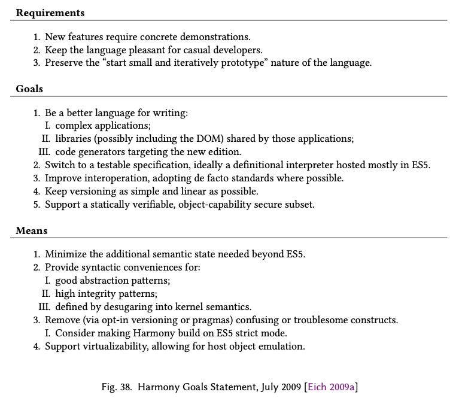

### 21.1.2 챔피언스 모델(The Champions Model)

Dave Herman은 "챔피언 모델" 개발 방식을 도입할 것을 위원회에 제안했다[^86]. 챔피언 모델을 적용하면 개별 멤버나 소규모 그룹이 하나의 기능을 담당한다. 이런 담당자를 챔피언이라고 하는데 챔피언은 초기 strawman 제안을 작성하고 그 제안이 실제 명세에 통합될 준비가 될 때까지 개선하려고 시도한다. 초기 제안에서 시작해서 이후 제안이 점점 발전해 나감에 따라 챔피언은 전체 위원회에 발표를 하고 위원회와 다른 리뷰어들로부터 피드백을 받는다. 피드백을 소화하고 피드백에 기반하여 제안을 업데이트할지 여부를 결정하는 것은 챔피언의 몫이다. 챔피언 모델에 따르면 챔피언의 발표 과정이 진행되는 도중에 위원회가 다시 설계를 맡기로 하는 것을 피해야 한다. 단 궁극적으로 최종 제안을 명세에 포함시키기 위해서는 전체 위원회의 광범위한 합의 결정이 필요하다.

위원회는 챔피언 모델을 따르자는 Herman의 제안을 받아들였으며 전반적으로 이를 효과적으로 사용했다. 그러나 이 방식은 때때로 실패했다. 당시의 핵심 그룹 멤버들은 비교적 작은 규모였고 기술적으로 매우 능숙했다. 그들은 때때로 "위원회에 의한 설계"를 조금이라도 하고 싶은 유혹을 참지 못했고 어떨 때는 이것이 실제로 제안에 대한 진전을 이루는 가장 효과적인 방법이었다. 가끔 특정 기능이나 설계 문제에 대해서 대안적인 접근 방식과 제안을 가진 여러 챔피언이 등장했다. 이런 경우 서로 다른 제안을 한 챔피언들이 합의에 이르지 못하면 위원회는 하나를 선택하거나 경우에 따라 모든 제안들을 거부해야 했다.

[^86]: Herman은 자신이 이 개념을 어디서 봤는지 기억해서 이야기하지 않았다. 하지만 이 개념은 프로그램 위원회를 조직하는 것에 대한 Oscar Nierstrasz[2000]의 챔피언 패턴과 연관되어 있을 가능성이 높다.

### 21.1.3 기능 집합 정하기(Choosing a Feature Set)

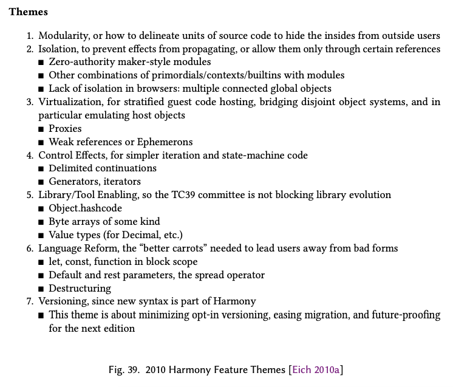

2009년, 2010년과 2011년 상반기의 대부분 기간 동안 TC39의 챔피언들은 제안의 초안을 개발하고 위원회와 그 제안들을 검토하고 제안이 명세에 받아들여질 수 있도록 제안에 대한 광범위한 합의를 얻으려는 시도를 했다. 2009년 8월까지 Strawman 페이지 [TC39 Harmony 2009]는 원래 7개였다가 21개의 제안으로 성장했다. 2010년 초에는 Harmony 기능 집합의 전체적인 형태가 드러나기 시작했다. Brendan Eich [2010a]는 Harmony의 목표에 관한 페이지에 테마들(그림 39)을 추가하고 거기에 따라 제안들을 조직화했다. 2010년 12월에는 Strawman 페이지 [TC39 Harmony 2010b]가 66개의 제안으로 늘어났고 추가적인 17개의 제안 [TC39 Harmony 2010a]이 이미 연기되었거나 포기되었다. 2011년 5월 초에 Strawman 페이지 [TC39 Harmony 2011c; 부록 N]는 100개가 넘는 항목을 가지고 있었고, 승인된 제안 페이지 [TC39 Harmony 2011a]에는 17개의 항목이 있었다.

2009년 Brendan Eich [TC39 2009b]는 TC39가 2011년 5월까지 "ES.next"의 기능 목록을 확정하고 2012년 6월 Ecma 총회에서 이를 승인받는 것을 목표로 할 것을 제안했다. 5월 목표일이 다가오면서 2012년 6월에 승인받는 게 달성 불가능하다는 게 명백해졌다. 하지만 명세 개발에 집중하기 위해 확정된 기능 목록을 작성하는 것은 여전히 의미가 있었다. 5월 회의 [TC39 2011b]의 대부분은 기능 제안 목록을 분류하고 어떤 남은 제안이 "Harmony Proposal" 상태로 승격될지에 대한 광범위한 합의에 도달하는 데에 쓰였다. 각 기능 제안은 승격 여부에 대한 합의가 존재하는지를 가늠하기 전에 논의되었다. 일부 제안은 최소한의 검토 후에 승격되거나 거부되었다. 다른 중요한 기능을 나타내는 제안들은 위원회가 당시의 기능 제안 초안에 만족하지 않았음에도 불구하고 승격되었다. 이런 제안들은 더 개선된 제안의 개발을 기다리는 의미의 플레이스홀더 역할을 했다. 모듈과 클래스가 이런 식으로 다루어졌다. Harmony의 최종적인 기능 집합은 그 회의에서 엄격하게 확정되지 않았다. ES.next의 개발이 계속됨에 따라 몇몇 제안이 추가되었고 몇몇은 제외되었다. 그러나 이 회의에서 나온 제안 목록은 이후 ES2015의 뼈대가 되었다. 그림 40은 5월 회의의 참가자들을 나열하고, 부록 O는 회의 후의 Harmony Proposal 페이지 [TC39 Harmony 2011b]를 보여준다.

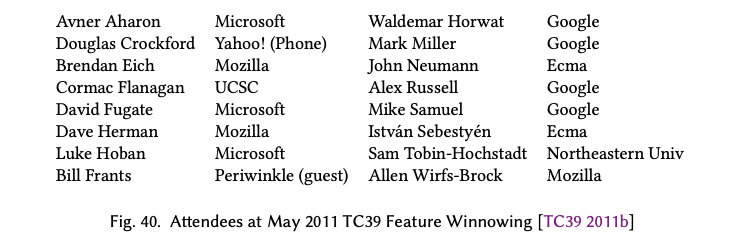

### 21.1.4 작성 시작(Writing Starts)

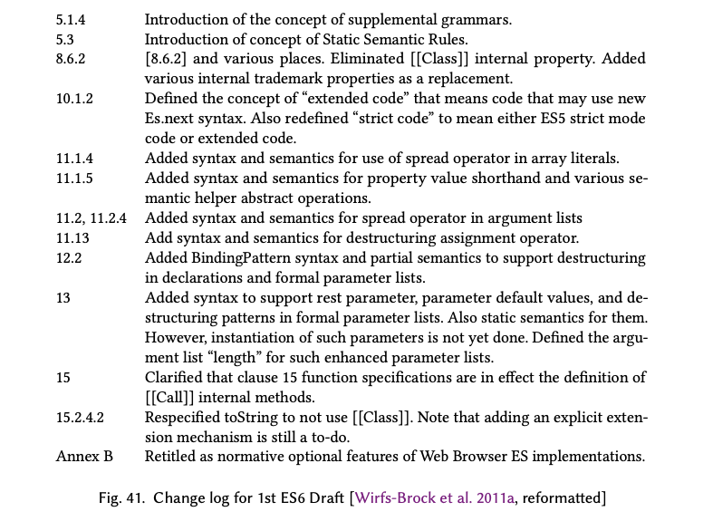

Allen Wirfs-Brock은 프로젝트의 편집자로서 TC39의 챔피언들에 의해 개발된 Harmony 제안으로부터 ES.next 명세 문서를 생성하는 것을 전반적으로 담당했다. 마이크로소프트에서 그의 업무는 TC39 관련 작업과 다른 프로젝트로 나뉘어 있었다. 2010년 12월, 그는 ES Harmony에 집중하기 위해 마이크로소프트를 떠나 모질라로 이직했다.

Allen Wirfs-Brock은 새로운 표준 판을 완성해 나가는 데 있어서 실제 명세 문서에 대한 지속적인 작업이 필수적이라는 걸 ES4, ES5 경험을 통해 알고 있었다. 2011년 6월 22일, 그는 심각한 결심을 가지고 최근 완성된 ES5.1 명세의 소스 파일을 열고, 표지 페이지를 "초안, 제6판"이라고 변경한 뒤 이를 ES6 초안 명세의 기반으로 저장했다. 그 다음 그는 즉시 지난 5월의 기능 분류와 지난 2년 동안 위원회가 내린 기타 결정들에 기반하여 새로운 자료를 편집하기 시작했다. 7월 12일 그는 "ES.next 명세의 첫 번째 작업 초안" [Wirfs-Brock et al. 2011a,b]을 게시했다. 그림 41은 그 초안의 변경 사항 요약이다. 이건 38개의 배포된 초안 중 첫 번째였으며 그 38개 중 가장 마지막으로 배포된 초안은 2015년 4월 14일 위키에 게시된 것이었다 [Wirfs-Brock et al. 2015a,c].

### 21.1.5 하나의 Javascript(One JavaScript)


Harmony 활동이 시작될 때부터 TC39는 Harmony의 새로운 기능 전부 혹은 대부분을 사용하기 위해서는 어떤 명시적인 허용이 있어야 할 거라고 가정했다. 이는 ES4의 시대에서 이어진 가정이다. 그때의 몇몇 제안들은 기존의 일부 Javascript 프로그램을 유효하지 않게 만들 수 있는 breaking change를 포함했기 때문이다. Harmony의 프로세스는 ES4에 비해 breaking change에 대해 더 보수적이었지만 몇몇 breaking change는 여전히 고려되고 있었다. Harmony 개발의 첫 3년 동안, 정확한 허용 메커니즘은 미정이었지만 자주 논의되었다. 첫 번째 ES6 초안은 ES5 엄격 모드의 슈퍼셋인 "확장된 코드" 개념을 포함했지만 아직 허용 메커니즘에 대한 설명은 포함하지 않았다. 고려된 대안들은 HTML의 `<script>` 요소 속성을 사용하는 외부적인 허용, 새로운 `use mode` pragma 문, 구분된 구문 형태, 또는 "use strict"와 비슷한 추가 지시문을 추가하는 것 등이 있었다. 그런데 이렇게 하다 보면 미래에 얼마나 많은 모드가 있게 될지에 대한 우려가 있었다. 표준의 각 주요 판은 새로운 허용 모드를 필요로 하게 될까? 이는 언어의 사용자와 구현자 모두에게 더 복잡한 일을 시키게 될 것이었다.

Dave Herman [2011b]은 "ES6는 허용이 필요하지 않다"라는 제목의 `es-discuss` 메시지에서 breaking change가 매우 제한되어야 하며 ES6 모듈로 캡슐화된 코드에만 적용되어야 한다고 주장했다. 대부분의 기능은 기존 코드의 기능을 해치지 않아야 하며 모듈 내부에 있는지에 상관없이 동일하게 작동해야 한다. 그렇게 하기 위해서는 일부 기능을 재설계해야 했고 몇몇 경우에는 고려된 몇 가지 기능을 포기해야 했다. 이 아이디어들은 `es-discuss` 메시지에 달린 150개 이상의 답글을 통해서 정제되었다. 다음 TC39 회의에서 Herman [2012]은 "One JavaScript"라는 제목의 발표에서 이러한 아이디어들을 정제한 결과를 소개했다. 핵심은 미래의 프로그래머와 ECMAScript Harmony의 구현자들이 모드, 버전, 또는 언어 방언에 대해 생각하지 않고 하나의 통합된 JavaScript 언어에 대해 생각할 수 있어야 한다는 거였다. 그 관점과 일관되게 ES.next를 설계하는 것은 TC39의 책임이었다. 회의의 많은 부분이 이 제안에 대한 논의와 이 제안이 여러 Harmony 기능에 미칠 영향에 대한 토론에 쓰였다. Harmony에서 "하나의 JS"를 만드려는 시도를 하자는 것이 최종적으로 합의되었다. 다음 명세 초안 [Wirfs-Brock et al. 2012a]에서는 확장된 코드 개념이 사라졌고 breaking change가 되었을 부분들을 없애기 위한 여러 변경사항들이 있었다.

### 21.1.6 Brendon의 꿈(Brendan's Dreams)

2011년 1월 Harmony 작업을 2년 이상 진행한 시점에 Brendan Eich [2011b]는 "내가 바라는 Harmony"라는 제목의 블로그 글을 게시했다. 이 글에서 그는 언어 발전과 표준 위원회에 대한 몇 가지 의견을 제시했다. 글의 핵심은 그가 희망하는 Harmony JavaScript가 어떤 모습일지에 대한 예시들을 제공한다.

>...저는 JavaScript Harmony에 대한 새로운 비전을 제시하고 싶습니다. 이러한 시도는 (아직) 공식적이지는 않지만 그렇다고 목표도 없고 기이하기만 한 허구도 아닙니다. 이와 같은 것은 실제로 일어날 수 있으며 여러분의 도움이 있다면 더욱 그럴싸해지고 나아질 것입니다(어떻게 할지는 마지막 부분에서 더 설명할 것입니다).
>
> 저는 TC39에서 현재 합의된 Harmony, TC39의 일부가 선호하는 초안 제안들, 제 아이디어 사이의 경계를 의도적으로 흐리게 하고 있습니다. 왜냐하면 저는 JS에 새로운 개념적 완전성이 필요하다고 생각하기 때문입니다. 거기에는 위원회가 안전하게 설계하는 게 필요하지 않습니다. TC39에서 통과되지 않을 "모든 제안을 합치자"는 접근이든, 역시 TC39에서 통과되지 않을 것이지만 "제안들을 교집합하고 만약 공집합만 남는다면 그대로 두자"는 접근이든 말입니다.

그는 다양한 사용 사례들이 ES5 기능을 사용하여 어떻게 코딩되는지와 그가 꿈꾸는 Harmony에서는 같은 것을 어떻게 표현할 수 있는지에 대한 예시들을 제시했다. 이러한 예시들은 Harmony 제안들과 그것들이 실제 ES2015 기능으로 어떻게 진화했는지에 대한 중간 단계의 관점을 제공한다. 그가 제시한 것들의 일부는 ES2015에 포함되지 않았고 대부분의 기능들은 ES2015에 포함되었더라도 어떤 식으로든 변경되었다. 하나의 JS를 지향하는 접근 방식이 기존 기능의 문법과 의미를 명시적인 허용 모드 하에서 변경하는 것을 제한했으므로 다른 변경사항들이 필요했다.

이 기능 발전에 대한 관점을 얻기 위해서 Brendan Eich가 2011년 꿈꿨던 것[^87]들과 결국 ES2015에서 실현된 것들을 비교해 보자.

- Dream: 바인딩과 스코핑

블록 스코프 선언과 자유 변수 참조(free variable reference)는 parse time에 에러가 난다.

```js
let block_scoped = "yay!"
const REALLY = "srsly"

function later(f, t, type) {
  setTimeout(f, t, typo) // EARLY ERROR
}
```

- ES2015의 실제 구현: `let`과 `const` 선언은 블록 스코프지만 자유 변수 참조에 대한 early error 기능은 하나의 JS를 위해 포기되었다.

- Dream: 개선된 함수 정의

`function` 키워드의 제거, 마지막 expression의 암시적인 `return`, 자유 변수가 없는 함수의 불필요한 클로저 제거

```js
const #add(a, b) { a + b }
#(x) { x * x }
```

- ES2015의 실제 구현: 화살표 함수가 `#`표시 대신 나왔다. 암시적인 리턴은 화살표 함수의 본문 자체가 표현식일 때만 적용된다. 객체 리터럴과 클래스 본문의 축약 메서드 정의가 들어왔다. 내부적인 클로저 최적화는 구현체에게 넘겨졌다.

```js
const add = (a, b) => a + b // expression body has implicit return
x => x * x
x => { console .log(x); return x * x} // statements body needs explicit return
// method definition in object literals and classes
class {
  add(a, b) {return a + b} // No expression bodies
}
```

- Dream: 렉시컬한 this

`#`로 선언된 함수에서 `this`는 자신을 감싸는 `this`바인딩에 렉시컬하게 바인딩된다.

```js
function writeNodes() {
  this.nodes.forEach(#(node) {
    this.write(node)
  })
}
```

- ES2015의 실제 구현: `this`와 다른 함수 스코프의 암시적인 바인딩은 화살표 함수에서 렉시컬하게 바인딩된다.

```js
function writeNodes() {
  this.nodes.forEach(node = > this.write(node))
}
```

- Dream: 레코드와 튜플

참조 기반의 비교가 아니라 값 기반의 비교를 하는 immutable한 자료구조인 레코드와 튜플을 지원한다.

```js
const point = #{x: 10, y: 20}
point === #{x: 10, y: 20} // true
```

- ES2015의 실제 구현: 레코드와 튜플은 ES2015에 포함되지 않았다. 확장 가능한 값 타입(Extensible Value Types)는 Harmony에 도입되지 않았는데, 레코드와 튜플은 해당 개념에 크게 연관되어 있었다.

- Dream: 나머지, 스프레드, 구조 분해

가변 길이의 인수 리스트, 배열을 인수 리스트나 배열 리터럴에서 `...`을 통해 풀어내는 것 그리고 배열과 객체에서 원소들을 추출하는 것에 대한 문법적 지원

```js
function printf(format, ...args) {
  /* use args as a real array here */
}

function construct(f, a) {
  return new f(...a)
}
let [first, second] = sequence
const { name, address, ...misc } = person
```

- ES2015의 실제 구현: ES2015는 배열의 구조 분해만 지원하고 `...`을 이용한 객체의 구조 분해를 지원하지 않았다는 것을 제외하면 정확히 똑같았다. `...`을 이용한 객체의 구조 분해는 이후 판에서 추가되었다.

- Dream: 모듈

브라우저에서 비동기 로딩을 지원하는 간단한 모듈 시스템

``` js
module M {
  module N = " http ://N.com/N.js"
  export const K = N.K // value of N.K exported
  export #add(x, y) { x + y }
}
```

- ES2015의 실제 구현: 명시적인 모듈 정의 구분자 없이 한 파일에 하나의 모듈 정의. 더 많은 `import`와 `export` 구문. 모듈 간에는 값보다는 바인딩이 공유됨.

```js
// content of http ://M.com/M.js
export { K } from " http ://N.com/N.js" // binding of N.K exported
export const add = (x, y) => x + y
```

- Dream: 반복문

프록시 기반 표준 라이브러리나 사용자 정의 제너레이터 함수에서 제공된 이터레이터와 함께 사용할 수 있는 괄호 없는 `for-in`구문

```js
module Iter = {" @std : Iteration "}
import Iter.{ keys, values, items, range }
for k in keys (o) { append (o[k]) }
for v in values (o) { append (v) }
for [k,v] in items (o) { append (k, v) }
for x in o { append (x) }
#sqgen(n) { for i in range (n) yield i*i }
return [i * i for i in range (n) ] // array comprehension
return (i * i for i in range (n) ) // generator comprehension
```

- ES2015의 실제 구현: 1JS는 `for-in`에 모듈과 프록시에 대한 의존성을 오버로딩하는 것 대신 `for-of`를 도입했다. 내장 컬렉션 클래스에 표준 key/value/entries 프로토콜이 정의되었다. 컴프리헨션 표현은 이후 Harmony 개발에서 포기되었다. 미래의 동작 보장에 대한 우려 때문이었다.

```js
for (k of o.keys()) append(o[k])
for (v of o.values()) append(v)
for ([k, v] of o.entries()) append(k, v)
for (x of o) append(x) // o provides its default iterator
function* sqgen(n) {for (let i of Array(n).keys) yield i * i} // a generator
```

- Dream: 괄호 없는 문장

결합 문장에 괄호를 쓸 필요가 없게 한 더 현대적인 문법

```js
if x > y { alert ("paren - free ") }
if x > z return "brace - free "
if x > y { f() } else if x > z { g() }
```

- ES2015의 실제 구현: 포함되지 않았다. 너무 급진적이라는 이유로 TC39에서 거절했다. 1JS는 이전 문법도 계속 유지해야 했는데 만약 이 표현이 도입되어 이전 문법과 섞이게 되면 사용자에게 더 복잡해질 것이었다.

[^87]: dream에 대한 이름과 설명들은 Brandon Eich의 블로그 글에서 패러프레이징된 것이다. 코드 스니펫은 원문 그대로 인용하였다. 세미콜론이 없는 스타일은 Eich가 Dream에 관한 코드를 짤 때 사용한 스타일임을 알린다.

## 21.2 명세 다시 만들기(Recrafting the Specification)

실행 가능하고 테스트 가능한 명세를 사용해서 ECMAScript 시맨틱을 표현하고자 하는 열망은 ES4_2 활동에서부터 이어졌다. 하지만 ML은 명세 언어로서 버려졌다. Harmony 활동 초기에 Allen Wirfs-Brock [2009]은 Harmony를 명세하기 위해 ES5 JavaScript로 작성된 정의적 인터프리터를 사용하는 아이디어를 제안했다. 그 아이디어는 심지어 Harmony 목표 선언문(그림 38)에도 포함되었다. 하지만 2010년 봄까지 그 개념에 대한 별 진전이 없었고 TC39 회원들은 그 접근법에 대해 덜 확신하게 되었다. ES5에서 있었던 의사코드 개선(부록 P)은 이전 판들에서 쓰인 의사코드가 가지고 있던 사용성 문제 대부분을 해결했다. Test262의 진전은 포괄적인 테스트 스위트가 명세뿐만 아니라 구현을 검증하는 데에도 유용함을 보여주었다. 명세의 형식은 다시 5월 TC39 [2010] 회의에서 논의되었고, 현재 상황은 여전히 많은 사람들에게 매력적이었다. Apple의 Oliver Hunt는 구현체의 구현자로서 자신이 본 실행 가능한 명세 코드보다 ES5의 의사코드가 더 잘 작동한다고 관찰했습니다. Harmony를 명세하기 위해 의사코드를 계속 사용하기로 광범위한 합의를 통한 결정이 내려졌다.

프로젝트 편집자에게 명세를 생성하는 것은 단순한 통합 작업만이 아니었다. 이론적으로 제안 사항은 명세에 쉽게 통합될 수 있을 정도로 준비된 상태가 될 때까지 챔피언에 의해 개발되어야 했다. 하지만 실제로 이런 일은 거의 일어나지 않았다. 몇몇 챔피언들은 명세의 구조나 그 형식에 대해서 충분히 잘 알지 못해서 명세에 통합될 만큼 완성된 의사코드를 만들지 못했다. 다른 몇몇은은 상세한 시맨틱 명세를 만들기 위해 필요한 시간이나 전문 지식이 없었습니다. Allen Wirfs-Brock은 많은 제안 사항들에 대해서 그것들을 명세에 어떻게 통합할지를 고안하고 의미론적인 세부 사항을 작업하고 제안 사항의 명세 알고리즘을 처음부터 작성하거나 다시 작성해야 했다.

챔피언들은 대체로 자신의 제안을 통해 정의된 기능에만 집중했다. 좋은 제안은 제안된 기능이 언어의 기존 기능과 어떻게 상호작용하는지를 고려한다. 하지만 자신이 제안한 기능과 다른 챔피언들이 동시에 개발하고 있는 다른 제안 사항들이 어떻게 잠재적으로 상호 작용할지를 모두 고려하는 것은 가장 숙련된 챔피언에게도 어려웠다. 모든 기능은 실제 명세에 통합되기 위해서는 편집자를 거쳐야 했으므로 Wirfs-Brock은 기존 언어와 모든 Harmony 제안 사항들이 ES6에서 어떻게 조화되어야 할지에 대한 가장 완전한 관점을 가졌다. 그는 여러 제안 사항에 걸쳐 있는 교차되는 관심사들과, 제안들 사이에 문법적이고 의미론적인 일관성을 보장하는 것에 특히 집중했다. 그는 승인된 제안 사항들을 통합하면서 그것들을 일련의 조립 가능한 직교 기능으로 변환하려고 시도했다. 때로는 이를 위해 제안의 문법적 혹은 의미론적인 세부 사항을 변경하거나 심지어 상당한 기능을 추가하거나 제거해야 했다. 이런 변경 사항은 승인을 위해서 챔피언들에게 발표되어야 했고 종종 이를 전체 위원회에게도 발표해야 했다.

### 21.2.1 명세를 재조직화하기(Reorganizing the Specification)

1997년의 첫번째 판의 첫번째 초안(그림 13)부터 ES5.1까지 ECMAScript 명세의 구성은 근본적으로 변하지 않았다. ES5 명세 작업을 하면서 Allen Wirfs-Brock은 명세의 기본적인 자료 순서가 혼란스럽다는 것을 발견했다. 그는 명세가 근본적으로 세 가지의 분리 가능한 부분을 정의한다는 것을 이해하게 되었다.

- ECMAScript 가상 머신과 그 런타임 엔티티와 시맨틱
- ECMAScript 언어 문법, 의미론과 가상 머신에 대한 매핑
- 모든 ECMAScript 프로그램에서 사용할 수 있는 표준 객체 라이브러리

원래의 명세와 그 개정판들은 이러한 세 부분을 뒤섞어 배치하여 기본적인 구조를 모호하게 만들었다. Allen Wirfs-Brock은 명세를 세 부분으로 나누고 명시적으로 조직하는 것이 명세를 이해하기 쉽게 만들고, ES6에서 새로 도입된 많은 부분들을 명확히 제시할 수 있도록 해줄 거라고 생각했다. 위원회는 이에 동의했다. 그림 42는 ES2015 명세의 새로운 구성을 ES5와 비교하여 보여준다.

### 21.2.2 새로운 용어(New Terminology)

ES6는 명세에서 사용된 몇몇 용어들을 명확히 하고 갱신할 수 있는 기회가 되었다. 주의가 필요했던 부분 하나는 객체의 명명법이었다. Javascript 1.0의 구현체는 호스트에서 정의한 객체와 Javascript 엔진에서 정의한 객체에 대한 접근 권한을 Javascript 프로그램에 제공했는데, 이러한 객체들은 ECMAScript 코드를 사용하여 생성할 수 있는 객체와는 근본적인 객체 시맨틱이 여러 일반적이지 않은 방향으로 차이가 있었다. ES1 명세는 "객체", "네이티브 객체", "표준 객체", "내장 객체", "표준 네이티브 객체", "내장 네이티브 객체", "호스트 객체"라는 용어를 사용하여 객체가 구현될 수 있는 다양한 방식을 나타냈다. 이러한 명칭들 사이의 구분은 명확하지 않았고 특별히 유용하지도 않았다. 이러한 카테고리 중 정확히 어느 것이 이례적인 객체 시맨틱을 허용하는지도 명확하지 않았고, JavaScript 프로그래머가 생성한 객체가 이 카테고리 중 어디에 속하는지도 명확하지 않았습니다.

ES6의 목표 중 하나는 대부분의 표준 라이브러리와 호스트 객체를 Javascript 코드를 활용해서 자체적으로 구현체를 만들 수 있도록 하는 것이었다. 자체 호스팅의 가능성을 고려할 때 호스트 제공, 엔진 제공, 프로그램 제공 사이의 구분은 점점 그 중요성이 줄어들었다. 객체 간의 시맨틱 차이가 그것들을 제공하는 주체나 구현에 사용된 기술보다 더 중요하다.

근본적으로 필요한 용어는 일반적인 시맨틱을 가지는 객체와 비정상적인(일반적이지 않은) 시맨틱을 가지는 객체를 구분하는 것이었다. 

Douglas Crockford [TC39 2012b]는 Ecma의 최고 회원 등급의 이름을 빗대어 "보통 객체<sup>g</sup>"를 Javascript 객체 리터럴이나 `new Object()`를 사용하여 생성된 객체의 시맨틱을 가진 객체를 위한 용어로 제안했다. 어떤 방식으로든 보통 객체의 시맨틱과 다른 시맨틱을 갖는 객체는 "exotic object<sup>g</sup>"라고 불렀다. 보통 객체와 exotic object는 둘 다 호스트, 엔진, 애플리케이션 프로그래머에 의해 제공될 수 있고 Javascript 혹은 다른 언어를 사용하여 구현될 수 있다.

### 21.2.3 새로운 종류의 시맨틱(New Kinds of Semantics)

ES6 이전에는 표준 라이브러리 함수를 정의하는 것 이외의 대부분의 의사코드 알고리즘들은 문법 생성 규칙과 관련되어 있었고 그 생성물의 런타임 평가 시맨틱을 명세하는 데에 사용되었다. 이런 알고리즘들에 이름을 붙일 필요는 없었다. 그것들이 문법 생성 규칙과 관련된 유일한 시맨틱이었기 때문이다. 타입 변환과 객체 시맨틱을 정의하는 내부 메소드와 같은 몇몇 알고리즘들은 문법과 직접적으로 관련되어 있지도 않았다. 이러한 알고리즘들은 평가 알고리즘에서 참조될 수 있도록 이름이 부여되었다.

ES6는 객체의 구조 분해와 같은 새로운 기능들을 도입했다. 이 기능들은 많은 문법 생성 규칙들을 사용하여 명세된 복잡한 동작을 가지고 있었다. 일부 알고리즘들은 파스 트리를 여러 번 순회하면서 정보를 수집하거나 여러 파스 트리 노드에 걸친 평가 순서를 거쳐야 했다. 또한 일관성을 위해서 여러 기능들에서 공통으로 사용되는, 문법과 관련된 동작들도 있었다. 이러한 요구사항을 수용하기 위해, ES6 명세는 내부적으로 명명된 평가 알고리즘뿐만 아니라 명명된 알고리즘들도 파스 노드와 연결시킬 수 있다. 이들은 문법 기호와 연관되어서 이름을 통해 참조된다. 일반적으로 이런 명명된 알고리즘들은 다형성을 갖는데 여러 문법 생성 규칙에 대해 같은 이름의 알고리즘이 정의되어 있다는 점에서 그렇다. 특정 소스 텍스트를 파싱하는 데 사용된 문법 기호가 어디서 왔는지에 따라서 선택되는 구체적인 알고리즘이 달라진다.

ECMA-262의 각 후속 판들은 구현체간의 차이를 최소화하는 것을 목표로 하여 오류 조건의 정의와 오류가 감지되는 시점을 더욱 엄밀하게 정의했다. ES3은 암묵적으로 "조기 오류(early errors)"의 개념을 도입했는데 이는 ES5에서 더욱 세련되게 다듬어졌다. 조기 오류란 스크립트의 평가 이전에 감지되고 보고되는 스크립트상의 오류를 말한다. 조기 오류가 감지되면 스크립트가 평가되지 않는다. 가장 흔한 형태의 조기 오류는 소스 코드가 ECMAScript 문법을 사용하여 파싱될 수 없을 때 발생하는 구문 오류다. 구문 오류는 문법의 정의에 암묵적으로 포함되어 있다. ES3은 몇 가지 다른 종류의 조기 오류들을 도입했는데 `break`문을 렉시컬하게 둘러싸지 않는 문장 라벨을 참조하는 `break`문과 같은 것이 있었다. ES5의 엄격 모드(strict mode)에서는 몇 가지 더 추가되었다. 명세는 이렇게 추가된 것의 대부분이 파싱 오류가 아니라 언어의 정적 시맨틱 규칙 위반임에도 불구하고 이들을 구문 오류로 정의했다. ES6 이전에는 대부분의 이런 오류들이 평가 알고리즘 근처에 배치된 비공식적인 문장을 사용하여 명세되었다. 다른 오류들은 런타임 오류 조건을 테스트하는 의사코드를 평가 알고리즘 내에 포함시켜 명세되었고, 오류가 스크립트 평가 이전에 보고되어야 하는 조기 오류라는 것을 평문으로 명시했다.

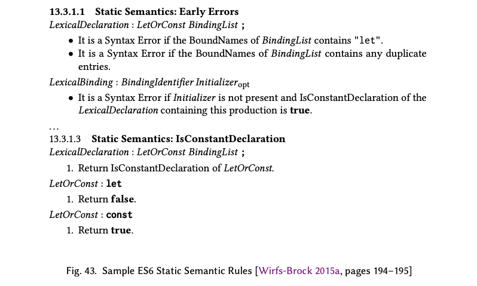

ES6의 기능은 많은 새로운 종류의 조기 오류들을 도입했다. 예를 들어 `let` 또는 `const` 선언을 사용하여 식별자를 중복으로 정의하려는 시도는 조기 오류다. ES6는 조기 오류 조건을 일관적으로 명세하기 위해 문법에 "정적 의미론(Static Semantics)" 소항목을 추가했다. 그림 43은 조기 오류 정의의 예시 집합을 보여준다. 여기서 볼 수 있듯이 조기 오류 규칙들은 정적인 시맨틱 알고리즘을 참조할 수 있다. 정적 시맨틱 알고리즘은 런타임 알고리즘과 같은 규칙을 사용하지만 스크립트의 평가 이전에 적용되기 때문에 ECMAScript 환경의 런타임 상태를 참조할 수 없다. 정적 시맨틱 조기 오류 규칙과 알고리즘은 소스코드를 실행하지 않고도 소스코드에서 추출할 수 있는 정보만 가지고 분석을 수행해야 하는 제약이 있다. 런타임 알고리즘은 정적 시맨틱 알고리즘을 호출할 수 있지만 정적 시맨틱 알고리즘은 런타임 알고리즘을 호출할 수 없다.

## 21.3 ES2015 언어 기능들(ES2015 Language Features)

Harmony Proposals 위키 페이지 [TC39 Harmony 2014]의 최종 버전에 목록으로 정리된 제안사항들은 수십 가지의 새로운 기능 혹은 확장된 언어와 표준 라이브러리 기능으로 발전했다. 일반적으로 제안사항들은 초안 명세에 통합되기 전에 여러 차례의 이터레이션을 거쳤으며, 일부 경우에는 그 이후에도 더 발전하였다. 몇몇 제안들은 결국 고려에서 제외되거나 미래 판으로 연기되었다.

다음 섹션들은 몇 가지 주요 제안들의 개발 역사를 더 깊이 살펴보고 다른 중요한 기능들의 세부 사항을 요약한다.

### 21.3.1 Realms, Jobs, Proxies, and a MOP

Harmony가 목표로 한 것에는 내장 exotic object와 호스트가 정의한 exotic object의 자체적인 호스팅을 가능하게 하고 웹 브라우저에 의해 구현된 시맨틱 확장을 완전히 명세하는 것도 포함되었다. 이 목표를 지원하기 위해서는 ECMAScript "가상 머신"의 기존 추상화를 개선하고, 새로운 또는 아직 명세되지 않은 언어 기능을 명세하는 데 사용될 수 있는 새로운 추상화를 추가할 필요가 있었다.

"Realm" [Wirfs-Brock 2015a, pg. 72]은 단일 ECMAScript 실행 환경 내에서 여러 글로벌 네임스페이스의 시맨틱을 기술하기 위해 추가된, 명세의 새로운 추상화이다. Realm은 HTML 프레임(§3.6)의 시맨틱을 지원한다. 이 HTML 프레임은 ES1 이래로 ECMAScript에서 무시되어 온 브라우저 기능이다. "Job" [Wirfs-Brock 2015a, pg. 76]은 ECMAScript 실행 환경이 여러 스크립트를 각각이 완료될 때까지 실행할 때 스크립트들을 어떻게 순차적으로 실행하는지를 결정론적으로 정의하기 위해 추가된 명세의 추상화 방식이다. Job은 이벤트 디스패칭과 브라우저 및 기타 JavaScript 호스트가 제공하는 지연된 콜백의 시맨틱을 기술하는 방법을 제공한다. 이는 또한 ES2015에서 Promise의 시맨틱을 정의하는 기반이 되었다.

ES1(§9)에 있었던 내장 메서드들은 본질적으로 메타-객체 프로토콜의 흔적이었다. 다양한 종류의 내장 객체와 호스트 제공 객체들의 속성에 접근하는 시맨틱 간의 관찰 가능한 차이를 내부 메서드의 명세 차이를 통해 설명하는 것이 원래 의도였다. 하지만 ES2015의 내장 메서드 시맨틱은 불완전했고 충분히 명시되지 않았으며 일관성 없이 사용되었다. 호스트 객체를 잘 다루고 exotic object의 자체적인 호스팅을 가능하게 하고 객체-능력 시스템에서 객체를 변조 방지된 상태로 공유할 수 있도록(membrane<sup>g</sup> [Van Cutsem and Miller 2013]) 지원하기 위해 ES1-ES5의 내부 메서드 설계는 완전히 명시된 MOP(메타-객체 프로토콜)로 바뀌었다.

Javascript 코드로 exotic object를 정의하기 위해서는 해당 객체의 내장 메서드를 구현할 수 있어야 한다. 이러한 기능은 ES2015의 `Proxy` 객체 [Wirfs-Brock 2015a, pg. 495]에 의해 가능해졌다. ES4_2는 "catchalls" [TC39 ES4 2006a]라는 메커니즘을 제안했는데 이는 Javascript 코드가 존재하지 않는 속성에 접근하거나 존재하지 않는 메서드를 호출하려고 시도할 때 발생하는 기본 동작을 Javascript 코드를 통해 객체별로 재정의할 수 있도록 하려는 의도로 만들어졌다. 

ES4_2의 catchalls은 JavaScript 1.5의 비표준 `__noSuchMethod__` 메커니즘 [Mozilla 2008a]을 개선하려는 의도였다. Harmony에서 Brendan Eich [2009b; 2009d]는 객체에 "액션 메소드"라고 불리는 것을 동적으로 첨부하는 개념을 도입함으로써 ES4_2 catchalls을 일반화하였다. 어떤 객체에 대해 특정 언어 연산을 수행했을 때 만약 해당 객체에 정의된 액션 메서드가 있다면 그 메서드가 호출될 것이다. 사용 가능한 행동의 집합은 ES5 내부 메서드의 집합과 유사했지만 그것들의 직접적인 반영은 아니었다. 모든 속성 접근에 대해 액션이 동작할 것인지, 또는 존재하지 않는 속성에 대한 접근 시에만 액션이 동작할 것인지에 대한 이슈가 있었다. Eich가 객체에 액션을 붙이기 위해 모델링한 API는 ES5의 객체 리플렉션 함수를 기반으로 했다:


```js
var peer = new Object;
Object.defineCatchAll(obj, {
  // add action methods that implement Array - like length behavior
  has: function(id) { return peer.hasOwnProperty(id); },
  get: function(id) { return peer[id]; },
  set: function(id, value) {
    if ((id >>> 0) === id && id >= peer.length) peer.length = 1 + id;
    peer[id] = value
  },
  add: function(id) {
    Object.defineProperty(obj, id, {
        get: function() { return peer[id]; },
        set: function(value) { peer[id] = value; }
    })
  },
// definitions of other actions ...
});
```
이 예시에서, 속성 `has`, `get`, `set`, `add`는 객체 `obj`에 동적으로 첨부되는 catchall 액션을 제공한다. 액션 함수는 `peer` 객체에 대한 접근을 어휘적으로 공유한다. 이는 `obj`와 `peer`간의 일대일 연결을 만든다. 핸들러는 `peer`를 `obj`의 자체 속성같이 동작하는 백업 저장소로 사용하여 함께 동작한다. 또한 `peer` 객체의 `length` 속성 값을 동적으로 업데이트하여 `length`의 값이 항상 속성의 key로 사용된 가장 큰 정수보다 1 더 크도록 한다.

Brendan Eich의 catchall 제안은 곧 Tom Van Cutsem과 Mark Miller [2010a; 2010b]에 의해 주도된 대안적인 설계로 이어졌다. 이 설계는 "프록시를 기반으로 한 catch-all 제안" [Van Cutsem 2009]으로 발표되어 계층화된 객체-개입 API를 정의했다. 프록시 제안의 의도는 가상 객체의 정의를 가능하게 하는 것이었다. 안전한 객체-능력-기반의 시스템에서 격리를 위해 사용되는 멤브레인 객체와 같은 것들 말이다. TC39는 프록시 초안 제안에 대체로 호의적이었으며 이를 Harmony 제안으로 빠르게 받아들였다.

이 제안은 프록시 객체의 개념을 도입했다. 액션 메서드를 이용해서 기본 객체를 확장하는 대신 프록시 객체는 "트랩"이라고 불리는 메서드를 가진 연관된 핸들러 객체와 함께 생성된다. 트랩은 언어의 동작에 의해 촉발된다. 핸들러는 언어상의 동작에서 사용하는 객체의 동작을 완전히 정의 가능하다. 트랩은 자체적으로 모든 동작을 할 수도 있고 렉시컬 스코프를 통해서 핸들러가 접근할 수 있는 기존 객체와 함께 작동할 수도 있다. 예를 들어 다음 코드와 같이 사용할 수 있었다 [Van Cutsem and Miller 2010c].

```js
// a simple forwarding proxy
function makeHandler(obj) {
  return {
    has: function(name) { return name in obj; },
    get: function(rcvr, name) { return obj[name]; },
    set: function(rcvr, name, val) { obj[name] = val; return true; },
    enumerate: function() {
      var res = [];
      for (name in obj) { res.push(name); };
      return res;
    },
    delete: function(name) { return delete obj[name]; }
  };
}
var proxy = Proxy.create(makeHandler(o), Object.getPrototypeOf(o));
```

이 예시에서, `makeHandler`는 핸들러 객체를 생성하는 데 사용되는 보조 함수이다. 그리고 핸들러 객체의 트랩은 `makeHandler`에 인자로 전달된 객체에 대한 접근을 렉시컬하게 공유한다. `makeHandler`에 전달된 객체는 새로 생성된 객체일 수 있는데, 이 경우 catch-all의 예시에서의 `peer` 객체와 유사한 역할을 할 수 있다. 또는 `makeHandler`에 전달된 객체가 기존 객체일 수 있다. 이 경우 트랩은 포착한 연산의 일부 또는 전부를 그 객체로 전달할 수 있다. 그러면 그 객체는 "전달 프록시(forwarding proxy)"의 대상이 되는 것이다.

핸들러 객체 내부에 트랩 메소드들을 배치함으로써 기본 객체 속성과의 이름 충돌을 방지한다. 제안에서는 일곱 가지 기본 트랩, 여섯 가지 파생 트랩[^88], 그리고 함수 객체에 대해서 작용하는 두 개의 트랩을 정의했다. catchall 제안에서와 같이 트랩들은 ES5 내부 메소드들과 유사했지만 그들의 직접적인 리플렉션은 아니었다. ES5는 `[[GetOwnProperty]]` 및 `[[DefineOwnProperty]]` 내부 메소드에 대해 위반되어서는 안 되는 특정 불변성을 설정했다 [Wirfs-Brock 2011b, page 33]. ES2015의 곤란한 문제 하나는 이러한 불변성을 강제하면서[^89] 동결된/봉인된(frozon/sealed) 객체와 설정 불가능한 속성을 가상화하는 방법이었다.

기존 프록시 제안의 프로토타이핑은 Van Cutsem [2011]에 의해 발표된 주요 개정으로 이어졌다.

> 몇 주 전 Mark와 저는 프록시와 관련된 여러 이슈들을 같이 작업했습니다. 특히 설정 불가능한 속성과 확장 불가능한 객체들에 대해서 프록시가 어떻게 더 잘 동작하게 만들지에 대해서 말입니다. 그 결과는 우리가 "직접 프록시(direct proxies)"라고 부르는 것입니다. 새로운 제안에서 프록시는 항상 다른 "대상" 객체의 래퍼입니다. 프록시에 대한 우리의 관점을 이런 방식으로 약간 전환함으로써, 기존의 많은 이슈들이 해결되고, 몇몇 경우에는 프록시의 오버헤드가 상당히 감소할 수 있습니다.


Direct Proxies 제안 [Van Cutsem and Miller 2011a,b, 2012]에서 대상 객체(다음 예시에서의 `o`)는 앞의 프록시 예제에서 `makeHandler`에 전달된 객체와 같다. 이는 프록시 객체의 내부 상태로 유지되며, 트랩이 호출될 때 명시적 인자로 전달된다. 프록시는 대상 객체를 알고 있기 때문에, 필수적인 불변성을 강제하기 위해 대상 객체를 사용할 수 있다. 다음은 앞의 프록시 예제를 Direct Proxies로 쓴 버전이다.

[^88]: 기본적인 트랩은 기초 요소이다. 파생 트랩들의 기본 동작은 기본 트랩의 동작을 이용하여 정의된다.

[^89]: ES5는 사용자 정의 내부 메서드를 지원하지 않았다. 따라서 불변성의 명시적인 강제가 필요하지는 않았다.

```js
// a simple direct forwarding proxy
var Proxy(o, {
  // the handler object
  has: function(target, name) {
    return Reflect.has(target, name)
  },
  get: function(target, name, rcvr) {
    return Reflect.get(target, name, rcvr)
  },
  set: function(target, name, val, rcvr) {
    return Reflect.set(target, name, val, rcvr)
  },
  enumerate: function(target) {
    return Reflect.enumerate(target)
  },
  // ...
});
```

`Reflect` 객체의 메소드는 표준 내부 메소드에 해당한다. 이는 핸들러가 객체의 내부 메서드를 암시적으로 호출하는 Javascript 코드 시퀀스를 사용하는 대신 핸들러가 객체 내부 메서드를 직접 호출할 수 있게 해준다. Direct Proxy 설계는 처음에는 대체로 ES5 내부 메소드를 기반으로 한 열여섯 가지 다른 트랩을 정의했다. 이 설계는 또한 내부 메소드의 관점에서 정의되지 않았기 때문에 Proxy가 가로채지 못하는 몇 가지의 객체 내부 작업을 식별했다. Tom Van Cutsem, Mark Miller, Allen Wirfs-Brock은 함께 Harmony의 내부 메소드와 Proxy 트랩이 일치하도록 공동 작업했다. 또한 그들은 이러한 트랩이 ECMAScript 명세와 호스트 객체에 의해 정의된 모든 객체 동작을 표현하는 데 충분하도록 공동으로 발전시켰다. 이는 새로운 내부 메서드를 추가하고 가로채기가 불가능한 몇몇 작업을 가로채기 가능한(trappable) 일반적인 메서드 호출로 재정의함으로써 이루어졌다. 각 내부 메서드에 대한 필수적인 불변성이 정의되었다. ECMAScript 구현체와 호스트는 이러한 불변성을 준수해야 하며, `Proxy`는 자체 호스팅된 exotic object에 대해서 그것을 강제[^90]한다. 그림 44는 ES2015 MOP의 요약이다.

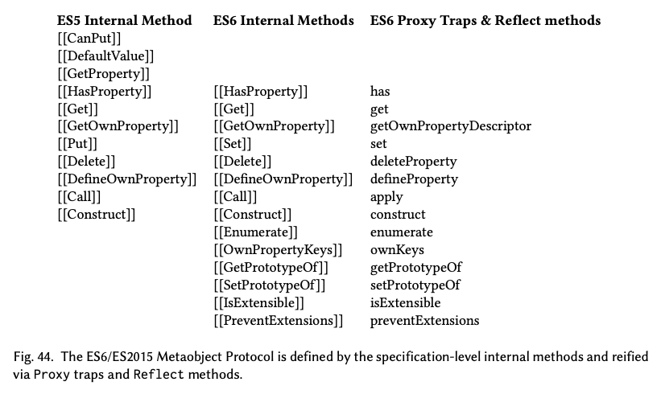

[^90]: 설계상의 우려 중 하나는 각 프록시 트랩 이후 불변성을 강제하는 데 드는 비용이었다. Notification Proxies [Van Cutsem 2013]는 이러한 오버헤드를 제거하는 방법으로 잠시 고려된 대안적 디자인이었다.

Direct Proxy 설계는 캡슐화된 대상 객체를 사용하지만, 대상 객체에 대해서 쉽고 투명한 래핑을 제공하는 것이 목적이 아니다. 보기와 달리 Proxy는 속성 접근을 로깅하거나 "찾을 수 없는 메서드"를 다루는 단순한 방법이 아니다. 그러한 사용 사례를 지원하기 위해 나이브하게 구현된 프록시 객체들은 보통 믿을 수 없거나 버그가 많다. Direct Proxy의 핵심 사용 사례는 객체의 가상화와 안전한 멤브레인의 생성이다. Mark Miller [2018]가 이렇게 설명한 것처럼 말이다.

> 프록시와 WeakMaps는 멤브레인의 생성을 지원하기 위해 만들어졌고 설계되었다. 독립적으로 사용된 프록시는 투명할 수 없으며, 합리적으로 투명성을 근사할 수 없다. 멤브레인은 realm의 경계를 투명하게 에뮬레이션하는 데에 상당히 가까워진다. 프라이빗 멤버를 가진 클래스의 경우, 에뮬레이션은 본질적으로 완벽하다.

### 21.3.2 블록 스코프 선언(Block-Scoped Declarations)

블록 스코프 렉시컬 선언을 도입하는 것은 첫 ES4_1 활동이 시작될 때부터 고려되었다. C와 유사한 언어의 문법에 익숙한 프로그래머들은 `{}`로 구분된 블록 내에 위치한 선언이 해당 블록에 대해서 지역성을 가지기를 기대했다. 원래 Javascript 1.0의 `var` 스코핑 규칙(§3.7.1)은 놀라웠고, 때로는 심각한 버그를 숨겼다. 그런 버그 중 흔히 보이는 것 중 하나가 루프 내 클로저 버그이다:

```js
function f(x) { // this function has the closure in loop bug
  for (var p in x) {
    var v = doSomething(x, p);
    obj.setCallback(function(arg) { handle(v, p, arg) });
    // bug: all the closures created in this loop share
    // the same binding to v and p rather than having
    // distinct per iteration bindings .
  }
}
```

이 패턴은 브라우저 DOM을 조작하는 코드에서 매우 흔하다. 숙련된 Javascript 프로그래머들조차도 가끔 `var` 선언이 블록 스코프가 아니라는 사실을 가끔 잊곤 한다.

기존의 `var` 선언 형식은 기존 코드를 깨뜨리지 않는 방식으로 블록 스코프로 변경될 수는 없었다. ES4_2 활동에서는 블록 스코프로 동작하는 `let`과 `const` 키워드 선언문을 사용하기로 결정했다. 키워드 `let`은 가변 변수 바인딩을 정의하는 데 사용했고 `const`는 불변 상수 바인딩을 위해 사용했다. 그들의 사용은 블록에만 제한되지 않았으며, `var` 선언이 쓰일 수 있는 어디에서나 나타날 수 있었다. ES4_2 설계 그룹은 심지어 "let은 새로운 var이다"라는 슬로건이 담긴 티셔츠를 만들기도 했다. Harmony는 `let`과 `const` 선언을 계속해서 사용했다. 하지만 ES4_2 작업은 해당 선언의 시맨틱과 관련된 많은 이슈를 해결되지 않은 상태로 남겨두었다.

ES5는 `const` 선언을 추가하는 것을 고려했으며, ES5 명세는 블록 수준 선언 바인딩 시맨틱을 명시하는 데 사용될 수 있는 추상화도 포함하고 있었다. 하지만 그 시맨틱이 정확히 무엇이어야 하는지 명확하지 않았다. 다음 코드 스니펫은 몇 가지 이슈를 보여준다.


```js
{ // outer block
  let x = "outer";
  { // inner block
    console.log(x);
    var refX1 = function() { return x };
    console.log(refX1());
    const x = "inner";
    console.log(x);
    var refX2 = function() { return x };
    console.log(refX2());
  }
}
```

inner 블록 내에서 `const` 선언 이전에 발생하는 `x`에 대한 참조는 컴파일 타임 오류가 되어야 하는가? 아니면 그러한 참조가 런타임 오류가 되어야 하는가? 또 만약 그게 오류가 아니라면 inner 블록의 `const` 선언 이전에 참조한 `x`는 외부 바인딩의 `x`로 해석되어야 하는가, 아니면 inner 블록에서 `x`가 초기화될 때까지 `undefined` 값을 가져야 하는가? `const` 선언 이전에 함수 `refX1`을 호출하는 것이 `const` 선언 후에 해당 함수를 호출할 때와 같은 `x` 바인딩을 갖도록 결정되어야 하는가? 이 모든 질문은 만약 inner 블록의 `x` 선언이 `let` 선언이었다고 해도 여전히 적용될 것이다. Waldemar Horwat [2008a]는 이러한 참조의 해석에 대해 4가지 가능한 시맨틱을 특징짓는다.

A1. Lexical dead zone. 같은 블록 내에 있는 변수 정의가 코드상에서 나오기 이전에 해당 변수를 참조하는 것은 오류이다.
A2. Lexical window. 같은 블록 내에 있는 변수 정의가 코드상에서 나오기 이전에 해당 변수를 참조하는 것은 외부 스코프로 간다.
B1. Temporal dead zone. 같은 블록 내에 있는 변수 정의가 평가되기 이전에 해당 변수를 참조하는 것은 오류이다.
B2. Temporal window. 같은 블록 내에 있는 변수 정의가 평가되기 이전에 해당 변수를 참조하는 것은 외부 스코프로 간다.

> 원문은 다음과 같다.
>
> A1. Lexical dead zone. References textually prior to a definition in the same block are errors.
> A2. Lexical window. References textually prior to a definition in the same block go to outer scope.
> B1. Temporal dead zone. References temporally prior to a definition in the same block are errors.
> B2. Temporal window. References temporally prior to a definition in the same block go to outer scope.

Horwat는 "사각 지대(dead zones)"라는 개념을 논의에 도입한 것에 대해 Lars Hansen에게 공을 돌린다. "temporally prior"라는 용어는 런타임 평가 순서를 가리킨다. A2와 B2는 동일한 이름이 블록 내의 다른 위치에 있을 때 서로 다른 바인딩을 가질 수 있기 때문에 바람직하지 않다. 또 B2에서는 블록의 특정 지점에 있는 이름이 다른 시점에 다른 바인딩을 가질 수 있기 때문에 바람직하지 않다. A1은 상호 재귀적인 함수를 정의할 때 이러한 선언 형식을 사용하지 못하도록 하기 때문에 바람직하지 않다. A2는 모든 참조에 대한 초기화 검사를 런타임에 요구하는 단점이 있다. 하지만 그런 단점들은 상당히 간단한 분석을 사용하면 컴파일러 단에서 대부분 제거할 수 있는 부분들이었다. 거의 두 해가 걸렸지만, 결국 TC39는 새로운 렉시컬 선언 형식이 B1 시간적 사각 지대(TDZ) 시맨틱을 가져야 한다는 것에 광범위한 합의를 이루었다. 그 시맨틱은 다음과 같은 규칙으로 요약된다.

- 스코프 내에서는 모든 이름이 단일한 고유 바인딩을 가진다.
- `let`, `const`, `class`, `import`, 블록 레벨 `function` 선언, 그리고 형식 매개변수 바인딩은 초기화될 때까지 런타임에서 접근할 수 없는 사각 지대에 있다.
- 초기화되지 않은 바인딩에 접근하거나 할당하는 것은 런타임 오류이다.

명세에서 첫 번째 규칙은 조기 오류(early-error) 규칙으로 표현된다. 다른 두 규칙은 런타임 시맨틱 알고리즘에서 표현된다.

Allen Wirfs-Brock이 `let`과 `const`를 명세에 통합하기 시작했을 때, 그는 기존의 `var` 및 `function` 선언과의 많은 잠재적 상호작용을 발견했다. 이는 한번 더 TC39 논의를 일으켰는데 그 결과 다음과 같은 추가적인 규칙에 대한 합의에 도달했다.

- 어떤 수준의 중첩 블록에서든 같은 이름에 대한 `var` 선언이 여러 개 존재할 수 있다. 이들은 모두 가장 가까운 함수 스코프 혹은 최상위 전역 스코프로 정의가 호이스팅되는 동일한 바인딩을 참조한다. 이는 ES1의 레거시 시맨틱이다.
- `var`와 함수 스코프와 전역 스코프에서 `function` 선언을 같은 이름에 대해 여러 번 하는 것은 허용되며 이름 하나에 대해 하나의 바인딩이 있다. 이는 ES3의 레거시 시맨틱이다.
- 스코프 내에서 모든 다른 방식의 중복 선언은 조기 오류이다. `var`/`let`, `let`/`let`, `let`/`const`, `let`/`function`, `class`/`function`, `const`/`class` 등.
- 외부에서 `let`, `const`, `class`, `import`, 블록 레벨 `function` 선언을 사용하여 선언된 이름과 같은 이름에 대하여 블록 레벨 `var` 선언이 호이스팅되는 것은 조기 오류이다.
- `var` 선언은 바인딩이 생성될 때 `undefined`로 자동 초기화되므로 선언된 변수에 접근하는 데 TDZ 제한이 없다.

전역 선언의 처리에 관해서 우려된 또 다른 문제들이 있었다. ES2015 이전에 모든 전역 선언은 호스트 환경이 제공하는 전역 객체(§3.6)의 속성을 생성했다. 하지만 temporal dead zone을 구현하기 위해서는 객체 속성을 초기화되지 않은 것으로 태깅할 수 있어야 했는데, 객체 속성에는 이런 기능이 없었다. 하나의 제안은 새로운 `const` `let`, `class` 선언이 전역 수준에서 일어났을 때 `var` 선언처럼 처리하는 것이었다. 이는 선례가 있었다. ES2015 이전의 몇몇 Javascript 엔진들은 그런 방식으로 `const` 선언을 구현했다. 하지만 이렇게 하면 새로운 선언 방식을 전역 수준에서 사용할 때와 다른 곳에서 사용될 때의 동작 간에 일관성이 없어질 거였다. 대신 TC39의 광범위한 합의는 렉시컬 선언 규칙이 가능한 한 모든 유형의 스코프에서 일관적으로 적용되어야 한다는 것이었다. 그래서 전역 스코프에서 `var`과 `function` 선언은 전역 객체의 속성을 생성하는 기존 동작을 유지한다. 하지만 다른 모든 선언 방식은 전역 객체 속성을 생성하지 않는 렉시컬 바인딩을 생성한다. 새로운 선언 규칙은 `var`/`let` 그리고 그와 유사한 선언의 충돌을 금지한다. 하지만 `var` 또는 `function` 키워드 선언을 통해서 생성된 게 아닌 전역 객체 속성은 중복 선언의 충돌을 일으키지 않는다. 그런 경우 전역 `let`/`const`/`class` 선언이 전역 객체 속성의 동일한 이름을 가린다. 이 규칙의 함의는 새로운 선언 방식을 사용하여 정의된 전역 변수는 별도의 스크립트에서 중복 정의될 수 없다는 것이다.

단순히 블록 스코프를 갖는 `let`과 `const` 선언을 추가하는 것만으로는 루프 내 클로저(closure-in-loop)의 위험을 완전히 제거할 수 없다. `for`문에서 도입된 변수의 스코핑 문제도 있다. `for (var p in x)`와 같은 형태를 말한다. ES2015는 for문의 변수 선언에서 `var`가 들어갈 자리에 `let`과 `const`를 사용할 수 있도록 함으로써 이 문제를 해결한다. 이러한 방식으로 사용된 `let` 과 `const`는 루프 본체가 반복될 때마다 재생성되는 스코프 내 바인딩을 생성한다. 루프 `for (const p in x) {body}`는 대략 다음과 같이 단순화<sup>g</sup>된다.

```js
// approximate desugaring of: for (const p in x) { body }
{
  let $next;
  for ($next in x) {
    const p = $next;
    { body }
  }
}
```

C 스타일로 3개의 표현식을 사용하는 `for`문에 의해 도입된 렉시컬 바인딩을 다루는 것은 더 복잡하고 더 많은 논란이 있었다. JavaScript 1.0은 이러한 `for` 문의 첫 번째 표현식으로 `var` 선언을 사용할 수 있는 기능을 포함했으므로 `let`이나 `const` 선언도 거기서 사용될 수 있어야 했다. 그러나 이러한 선언에 의해 생성된 바인딩의 범위는 어떠해야 하는지가 문제였다. 전체 `for` 문이 지속되는 동안 계속 유지되는 하나의 바인딩이 있어야 하는가, 아니면 `for-in` 문에서처럼 루프의 각 반복마다 별도의 바인딩이 있어야 하는가? 이에 대한 답은 명백하지 않다. 왜냐 하면 일반적인 코딩 패턴에서는 루프의 다음 반복문에 사용하기 위해서 `for`문의 두 번째와 세 번째 표현식 혹은 루프 본문의 코드를 사용하여 루프 변수의 값을 업데이트하기 때문이다. 만약 각 반복마다 루프 변수의 새로운 바인딩이 생기게 된다면 이전 반복의 최종적인 루프 변수 값을 사용하여 다음 반복의 루프 변수 바인딩을 자동으로 초기화하는 과정이 필수적이다. 대부분의 C와 유사한 언어들은 `for`문의 각 반복마다 하나의 바인딩을 사용하는 것보다는 `for`문 전체에 대해서 하나의 바인딩을 사용하는 방식을 취했고 ES6 초안 명세에서도 처음에 그렇게 했다. 그러나 그 접근 방식은 여전히 루프 내 클로저에 대한 위험을 가지고 있다. 그 이유로 `let` 선언이 있고 3개의 표현식으로 이루어진 `for` 문은 결국 반복마다 하나씩의 바인딩을 사용하고 반복 간에 값 전파가 이루어지도록 변경되었다. 한 번의 반복에 하나씩의 바인딩을 사용하는 것은 `for`문의 첫번째 표현식에 `const` 선언을 쓸 경우에 적절하였다. 이러한 변수는 `for` 헤더나 루프 본문의 다른 표현식에 의해 값이 수정될 수 없었기 때문이다.

또 다른 중요한 문제는 문장 블록 내에서 선언된 함수의 시맨틱에 관한 것이었다. ES3는 의도적으로 블록 내의 함수 선언에 대한 문법이나 시맨틱 명세를 배제했다(§12). 하지만 구현체들은 그 지침을 무시하고 블록 내 함수 선언을 허용했다. 불행히도 각각의 주요 브라우저 구현체는 블록 내 함수 선언에 대해 서로 다른 시맨틱을 사용했다. 하지만 몇몇 사용 사례[Terlson 2012]에서는 모든 주요 브라우저 간에 상호 호환이 가능한 방식으로 그러한 함수를 선언하고 사용할 수 있을 만큼 충분한 공통 시맨틱이 있었다. 그러한 사용 사례 중 일부는 ES2015 렉시컬 선언 규칙 하에서는 허용되지 않거나 그 의미가 변경될 것이다. 그러한 경우에 대해 새로운 규칙을 구현하면 "웹을 망가뜨릴" 수 있다. 이는 엄격 모드에 대해서는 문제가 되지 않았다. 왜냐하면 ES5는 엄격 모드 코드 내에서 블록 수준 함수 선언을 제공하는 구현을 금지했기 때문이다. 

비-엄격 모드 코드에 대한 한 가지 접근 방식은 ES3의 선례를 따라 블록 내 함수에 대해 아무 것도 명시하지 않는 것이었다. 블록 레벨 함수 선언과 새로운 형태의 렉시컬 선언문을 어떻게 통합할지에 대해서 각 구현체가 결정하도록 내버려두는 것이다. 하지만 그것은 상호 호환성에 좋지 않을 뿐 아니라 1JS 목표 [TC39 2013b]에도 반하는 것이다. 대신 TC39 [2013a]는 기존 블록 수준 함수들이 새로운 규칙에 따르면 오류가 되지만 유용하게 상호 호환 가능한 몇 가지 사용 사례가 존재한다고 결정했다. 예를 들어 다음과 같은 것들.

```js
// 이는 표준이 아니었지만 상호 호환 가능한 ES3 확장이었다
function f(bool) {
  if (bool == true) {
    function g() { /* do something */ }
  }
  if (bool == true) g(); // this worked in all major browsers
}
```

해결책은 비엄격(non-strict) 코드 규칙 [Wirfs-Brock 2015a, Annex B.3.3]을 몇 가지 추가로 정의하여 상호 호환 가능한 그런 특정 사용 사례를 정적으로 감지하고 그것들을 합법적이며 기존 웹 페이지와 호환되도록 만드는 것이었다. 위 예시에 대해, 규칙은 위 코드를 마치 다음과 같은 코드처럼 처리할 것이다.

```js
function f(bool) {
  var g; // but early error if let declaration of g exists at top - level
  function $setg(v) { g = v }
  if (bool == true) {
    function g() { /* do something */ }
    $setg(g); // set top - level g to value of local g
  }
  if (bool == true) g(); // references top - level g
}
```

### 21.3.3 클래스(Classes)

Harmony 활동이 시작된 2008년 7월의 TC39 회의에서는 클래스를 포함할지 그리고 어떤 방식으로 포함해야 할지에 대해서 논의하는 데에 상당한 시간을 할애했다. ES4_1과 ES4_2 모두 복잡한 클래스 정의 구문과 시맨틱을 개발하는 데에 상당한 노력을 기울였다. 그리고 두 설계 모두 그걸 지원하기 위한 새로운 런타임 메커니즘을 필요로 했다. 이러한 설계들은 "Java에서 영감을 받은 클래스"로 느슨하게 특징지어질 수 있다.

Mark Miller [2008d]는 ES3가 클래스와 같은 추상화를 구현하는 데에 필요한 대부분의 런타임 메커니즘을 이미 갖추고 있다고 주장했다. Scheme에서 사용되었고 [Dickey 1992; Sussman and Steele Jr 1975] Douglas Crockford [2008b, pages 52–55]가 Javascript에 맞게 조정한 람다 함수와 렉시컬 캡처 기법을 이용해서 말이다. 클래스 정의의 이러한 lambda desugaring은 본질적으로 모듈 패턴(§13.2)과 같은 것이며, 클래스는 단순히 여러 번 인스턴스화될 의도로 만들어진 작고 가벼운 모듈이라는 사실을 암시한다. Miller는 이러한 접근 방식을 "문법적 설탕으로써의 class"라고 불렀다.

Cormac Flanagan [2008]은 초기의 클래스 논의를 다음과 같이 요약했다.

> EcmaScript는 일체형의 객체(high-integrity objects[^91])와 함께 데이터 추상화와 숨김, 비공개 필드와 메서드를 더 잘 지원해야 한다...
> ...우리는 처음에 상속이나 타입 주석을 지원하지 않고 인스턴스마다의 비공개 데이터를 가진 단순하고 최소주의적인 설계에 초점을 맞춘다. 클래스 이름을 위한 별도의 네임스페이스는 없으며, 클래스 객체는 새로운 종류의 (일급) 값이다.

Flanagan이 제안한 초안 스타일은 다음과 같은 단순한 문법의 클래스 정의를 사용했다.

```js
class Point (initialX, initialY) {
  private x = initialX;
  private y = initialY;
  public getX() { return x };
  public getY() { return y };
}
```

Cormac Flanagan의 제안은 전체적인 디슈거링(역주: 클래스가 문법적 설탕으로써만 기능한다고 할 때 실제로는 어떤 구문과 똑같은지를 이야기하는 것으로 보인다)을 포함하지 않았고 시맨틱 세부 사항은 거의 없었다. Mark Miller [2008c; 2009; 2010a]는 표면적으로 유사한 문법을 가진 설계로 이를 반박했다. Miller의 제안은 클래스 인스턴스를 위한 새로운 종류의 런타임 객체를 필요로 하지 않는 완전한 디슈거링을 포함하고 있었다. Miller의 설계에는 상속이 없었고 모든 메서드와 인스턴스 변수는 기본적으로 private였다. 모든 메서드와 인스턴스 변수는 클래스 정의의 본문 내에서만 직접 접근할 수 있는, 인스턴스별로 렉시컬 스코프를 가지는 선언으로 표현되었다. 클래스 인스턴스 객체의 속성은 public 메서드에 외부 접근을 제공한다. 또 public 인스턴스 변수에 대한 `get` 접근자가 제공되었다. 인스턴스 변수에 대해 외부에서 직접 할당하는 것은 허용되지 않았다. `this` 키워드는 사용되지 않았다.

클래스를 문법적 설탕으로써 사용하는 Mark Miller의 제안은 너무 많은 객체를 생성한다는 반복적인 비판을 받았다. n개의 메서드를 가진 클래스의 각 객체 인스턴스는 실제 인스턴스 개체 외에도 내부적으로 n개의 인스턴스별 클로저 객체를 암묵적으로 생성한다. Miller의 입장은 클래스 제안이 제시한 구조가 관찰 가능한 시맨틱만을 포함하고 있으며 클로저 객체의 생성을 피할 수 있는 기법을 사용하는 것은 구현체의 자유라는 것이었다. 하지만 위원회의 회의론자들은 구현체 개발자들이 그런 최적화를 개발할지에 대해 회의적이었다. 또다른 우려는 상속 또는 다른 동작의 합성을 지원하는 메커니즘이 없었다는 것이었다. 그래서 Miller는 그의 클래스 디슈거링 디자인에 구성 가능한 Trait [Van Cutsem and Miller 2011c] 를 통합한 제안 [Miller 2010d, 2011a]도 개발했다.

위원회 구성원 중 일부는 적대적인 웹 광고와 개인 정보를 훔치려고 시도할 수 있는 웹 매쉬업(§20.1.3)에 대해 우려하고 있었다. 이들은 일체형 객체 정의를 지원하는 게 최우선 순위라고 생각했다. 전체 위원회는 이러한 우려를 공유하고 있었지만 최우선 순위라고 모두가 생각하는 건 아니었다. Waldemar Horwat [2010]은 2010년 9월 TC39 회의에 대한 그의 노트에서 다음과 같이 관찰했다.

> 목표에 대한 그룹 내의 분열: "높은 완전성" vs "사람들이 이미 쓰고 있는 것을 더 나은 문법을 통해 지원하기" vs "둘 다 얻을 수 있을지도 모른다."

Allen Wirfs-Brock은 객체 생성을 덜 명령형으로 만듦으로써 두번째 목표를 지원할 수 있다고 생각했다. 기존의 Javascript에서 클래스와 가장 가까운 것은 생성자 함수(§3.3)이다. 생성자 함수를 통해 새 객체의 속성을 명령형으로 정의할 수 있었다. 객체 리터럴은 객체 속성을 더 선언적으로 작성할 수 있도록 해주었지만 ECMAScript의 내장 클래스가 가지고 있는 컨벤션[^92]을 쉽게 사용할 수 있도록 해주는 기능이 없었다. "클래스"를 새로운 종류의 언어 엔티티로 도입하지 않아도 객체 리터럴을 확장함으로써 사람들이 이미 사용하고 있는 것을 더 잘 지원할 수 있을지도 몰랐다.

[^91]: "high-integrity object"는 접근할 수 없는 정보 은닉을 지원했다. 그 객체의 구조, 상속 관계, 은닉된 상태, 메서드들은 객체를 처음 정의하는 코드가 아닌 다른 곳에서 직접적으로 수정되거나 확장될 수 없었다.

[^92]: 예를 들어서 메서드의 열거 불가능성(non-enumerability)과 읽기 전용 속성의 사용 같은 것을 말한다.

```js
function tripleFactory(a, b, c) {
  return { // This object literal creates the triple objects
    <
    proto: Array.prototype, // proto meta - property sets inheritance
    prototype
    sealed > , // sealed meta - property applies Object . seal ()
    0: a,
    1: b,
    2: c,
    var length
    const: 3, // var sets [[ enumerable ]]: false ,
    // const : sets [[ writable ]]: false
    method toString() { // methods are data properties with function values
      // and [[ enumerable ]]: false
      return " triple (" + this[0] + "," + this[1] + "," + this[2] + ")"
    },
    method sum() {
      return this[0] + this[1] + this[2]
    }
  }
}
```

그림 45. Wirfs-Brock [2011c; 2011d] 의 Harmony의 확장된 객체 리터럴 제안서에 기반한 팩토리 함수

Wirfs-Brock [2011c; 2011d]은 이와 연관된 제안 묶음에서 객체 리터럴이 어떻게 더 선언적으로 확장될 수 있는지 보여주었다. 제안에서는 일상적인 객체 정의의 사용 사례를 위해서 ES5 객체 리플렉션 API를 사용할 필요가 없었다. 예를 들어 그림 45는 확장된 객체 리터럴 기능을 사용하는 팩토리 함수<sup>g</sup>가 명시적인 프로토타입, 메서드, 그리고 비공개 속성을 가진 클래스를 어떻게 정의할지 보여준다.

또한 Allen Wirfs-Brock의 제안은 확장된 객체 리터럴 문법이 클래스 정의의 본문으로 어떻게 사용될 수 있는지를 보여주었다. 2011년 3월 TC39 회의에서 Wirfs-Brock [2011a]은 클래스 정의가 생성자 함수, 프로토타입 객체, 그리고 ECMA-262의 모든 이전 판의 ECMAScript 명세서 15번 조항[^93]에 있는 내장 라이브러리 클래스의 인스턴스 객체, 이렇게 3가지를 기본적으로 생성해야 한다고 제안했다. 클래스 정의를 람다 표현식으로 대체하거나 (클래스를 문법적 설탕으로 취급) 또는 새로운 종류의 런타임 엔티티 (Java에서 영감을 받은 클래스)로 대체하는 대신, 이미 Javascript 프로그래머와 프레임워크 작성자들이 사용하는 익숙한 생성자 함수와 프로토타입 상속 객체로 클래스 정의를 대체해야 한다고 하였다. 회의에서는 확장된 객체 리터럴 문법의 많은 세부 사항에 대해 상당한 의견 차이가 있었다. 하지만 핵심 클래스 정의 시맨틱은 명세 15번 조항의 생성자/프로토타입/인스턴스의 삼각 구조여야 한다는 느슨한 합의가 이루어졌다.

2011년 5월 초 TC39 ES.next 기능의 동결을 위한 회의가 코앞으로 다가오고 있었지만 클래스와 관련해서는 여러 가지 초안 제안들이 여전히 경쟁하고 있었다. 그 중 하나의 제안이 선택될 만큼 충분한 합의에 도달하기는 어려워 보였다. 2011년 5월 10일, Allen Wirfs-Brock은 Mark Miller, Peter Hallam, 그리고 Bob Nystrom과 만났다. Hallam과 Nystrom은 Google의 Traceur 트랜스파일러를 사용하여 Javascript의 클래스 지원을 프로토타이핑하는 팀의 멤버였다 [Traceur Project 2011b]. 그들의 프로토타입은 Wirfs-Brock과 Miller의 제안의 개념을 포함하고 있었다. 회의의 목표는 통합된 제안을 제시할 수 있을 만큼 충분한 합의를 이끌어내는 것이었다. Bob Nystrom [2011]은 그의 회의 보고서에서 다음과 같이 여러 합의점들을 나열하였다.

[^93]: ES6 이전에 15번 조항은 내장 객체와 클래스들을 정의하는 명세서의 섹션 번호였다.

> ...생성자 함수, 프로토타입, 인스턴스의 삼위일체는 다른 언어에서 클래스가 해결하는 문제를 해결하기에 충분하다. Harmony 클래스 문법의 의도는 그 시맨틱을 변경하는 것이 아니다. 그보다는 그 시맨틱에 대해 간결하고 선언적인 표현을 제공하여 기본적인 명령형 코드 대신에 프로그래머의 의도가 나타나도록 하는 것이다.
>
> ...객체는 선언적이고 정보를 담고 있다. 함수는 명령적이고 직접적으로 동작한다. 클래스와 관련된 질문은 그러니까 "우리는 그 추상화 중 하나를 기반으로 클래스를 구축하는가? 만약 그렇다면, 어느 것을 기반으로 하는가?"이다.
>
> 우리의 합의된 제안은 둘 다 사용함으로써 이 종교적인 논쟁을 해결한다. 클래스 본문에는 객체 리터럴과 같은 형식을 사용하고 생성자는 함수 형태로 사용하는 것이다.

회의 이후 Mark Miller [2011b]는 아직 합의되지 않은 많은 세부 사항이 남아 있었음에도 불구하고 새로운 제안서를 만들었다. 그리고 이는 기능 확정 회의 [TC39 2011b]에서 수용되었다. 그림 46의 클래스 정의 예시는 Miller의 기능 확정 클래스 제안서에서 제시된 것을 기반으로 한다.

한 달 후, Dave Herman [2011c]은 "minimal classes"라는 제목의 `es-discuss` 게시물에서 클래스 제안의 복잡성과 합의되지 않은 많은 지점들이 ES.next의 일정에 대한 위험을 초래한다는 우려를 표현했다. Herman은 프로토타입 상속, 생성자, 선언적 메서드, `super` 키워드를 이용해서 상속된 메서드를 호출하는 기능만을 포함하는 최소화된 클래스 선언 설계를 대안으로 제안했다. 선언적 속성, 생성자 속성, private 데이터, 그 이외에도 논쟁적인 부분들은 제외되었다. Herman의 제안은 2011년 7월 회의 [TC39 2011a]에서 논의되었다. 하지만 위원회는 당시 Mark Miller가 했던 제안의 해결되지 않은 문제들을 해결하는 데 집중하기로 결정했다. Brendan Eich [2012a]는 나중에 다음과 같이 썼다.

> Minimal classes는 지난 여름 Redmond에서 TC39의 지지를 어느 정도 받았다. 하지만 const와 guard의 초기화 이전 사용의 동작과 관련한 문제에 부딪쳤다.

대안적인 클래스 설계에 관한 계속되는 온라인 토론 [Ashkenas 2011; Eich 2011a; Herman 2011a]은 Dave Herman [2011d]이 새로운 "minimal classes" 제안서 초안을 작성하도록 동기를 부여했다. 이 제안서는 Herman의 이전 게시물에 "static" 생성자와 static 메서드를 추가하여 공식화한 것이었다. 이후 두 번의 TC39 회의에서 Herman의 최소 클래스 제안에 대한 논의는 거의 없었고, record 기능 계획과 관련해 합의되지 않은 부분들을 해결하는 데 있어 진전도 거의 없었다. Brendan Eich [2012c]는 이 문제를 다음과 같이 설명했다.

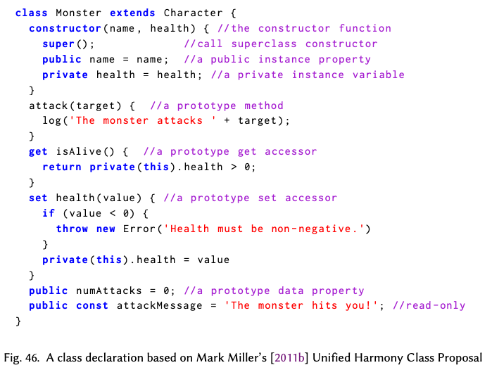

> ...Waldemar Horwat가 관찰한 일반적인 경향은 사실이다. 너무 최소화되면 의미가 없다. 너무 기능이 거대해지면 우리는 합의에 이를 수 없다. 우리는 딱 맞게 만들어진 온도/양인 "Goldilocks class"가 필요하다.

2012년 3월 초까지, ES.next 클래스 설계를 확정하는 데에 있어서 명백한 무능력을 보이는 것에 대해 `es-discuss` 커뮤니티 회원들의 불만은 점점 커지고 있었다. Russell Leggett [2012]는 "Finding a 'Safe Syntax[^94]' for Classes"라는 제목의 게시물에서 다음과 같은 질문을 제기했다.

> 아무것도 없는 것보다 낫다는 것에 대해서 우리가 모두 동의할 수 있는 클래스 문법을 만드는 것이 가능할까? 또 더 중요하게도, 향후 개선 가능성 또한 남겨 두면서 그렇게 할 수 있을까? "안전한 문법(safety syntax)"은 우리가 더 나은 문법을 찾기 위한 시도를 멈춘다는 의미가 아니다. 만약 우리가 더 나은 문법을 찾지 못했다면 ES7에서 개선할 수 있는 무언가를 여전히 가지고 있다는 의미일 뿐이다.

Leggett의 게시물은 3일 동안 119개의 반응을 얻었고 그 대부분이 긍정적이었다. 이 글은 지난 여름 Dave Herman이 작성한 목록과 본질적으로는 동일한 "절대적인 최소 요구사항" 목록을 나열했다. Leggett이 기여한 부분은 안전학교(safety school) 비유였다. Allen Wirfs-Brock은 즉각적으로 지지를 표현했다. 그리고 안전 학교 비유를 이용해서 Herman의 최소 클래스 제안을 재구성한 새로운 "최대한 최소화된(maximally minimal)" 버전을 만들었다 [Wirfs-Brock 2012d]. 가장 핵심적인 기술적 변경사항은 제안서에서 생성자 속성을 제거한 거였다[^95]. 2012년 3월의 TC39 회의의 공식 의제로 "max-min" 제안을 올리기는 힘들었지만 Allen Wirfs-Brock과 Alex Russell이 회의 말미에 비공식 토론을 주도했다 [TC39 2012a]. 반응은 대체로 긍정적이었다. 하지만 제안이 너무 최소화되었다거나 그들이 고려하고 있는 향후 확장을 방해할 수 있다는 몇몇 회원들의 우려가 있었다. 제안에 대한 합의를 도출하려는 시도는 없었지만 Wirfs-Brock과 Russell은 더 복잡한 것은 ES.next에 포함될 가능성이 낮다는 의견을 표현했다.

max-min 제안은 2012년 5월 회의의 공식 의제에 올랐고 비슷한 토론과 비슷한 결과가 있었다 [TC39 2012b]. 참석자들은 제안에 대한 합의에 점점 가까워지고 있었지만, 일부 핵심 인물들은 결석했다. 일정 압박 때문에 프로토타입 작업과 예비 명세 초안 작업이 허용될 수 있다는 합의가 있었다. 7월 회의 [TC39 2012c] 시점까지, Allen Wirfs-Brock은 max-min 클래스에 대한 명세 텍스트를 작성하고 그가 마주한 모든 설계 결정을 나열한 프레젠테이션 [Wirfs-Brock 2012b]을 준비했다. 그는 각 결정들의 검토로 위원회를 이끌었고 결정의 수용 혹은 대안에 대한 합의를 기록했다. 이러한 접근법은 전체 제안에 대한 합의의 문제는 피해 갔지만 위원회를 세부 설계 수준에서 합의 형성에 참여시켰다. ES.next 명세의 다음 초안[Wirfs-Brock et al. 2012b,c]은 7월 회의에서 내린 결정을 포함한 완전한 max-min 클래스 디자인을 통합했다. 아무도 이의를 제기하지 않았다.

하지만 2014년 여름 브라우저 JavaScript 엔진 개발자들이 ES6 클래스의 구현 작업을 시작하면서, 중요한 반대가 나타났다. ES6 활동의 오랜 목표 하나는 `Array` [Kangax 2010]와 웹 플랫폼 DOM 클래스와 같은 내장 클래스들의 "서브클래싱" 수단을 제공하는 것이었다. Allen Wirfs-Brock [2012c; 2012e]은 기존 JavaScript 접근법으로 내장 생성자를 서브클래싱하는 것이 왜 문제가 되는지 설명하는 Harmony 제안서 초안을 작성했다. 내장 생성자는 일반적으로 C++과 같은 구현 언어를 사용하여 정의된다. 그런 구현 언어들은 고유 구조를 갖는 비공개 객체 표현을 할당하고 초기화한다. 이런 고유 구조는 연관된 내장 메서드들에 알려져 있고, 이 내장 메서드들 또한 구현 언어로 정의되어 있다. 내장 생성자가 `new` 연산자를 사용하여 직접 호출될 때는 이러한 방식이 작동한다. 하지만 JavaScript의 ad hoc 프로토타입 상속 체계를 사용하여 이러한 생성자들을 "서브클래싱"할 때는, `new` 연산자가 서브클래스 생성자(일반적으로 JavaScript로 작성됨)에 적용된다. 그래서 상속된 내장 메서드는 고유한 내장 객체 표현을 예상하지만 실제로 생성자에 의해 할당되는 건 일반 객체이다.

Wirfs-Brock [2013]은 max-min 클래스 시맨틱을 명세할 때 이 문제를 회피하려고 시도했다. `new`의 시맨틱은 할당 단계와 초기화 단계로 분리되었다. 객체 할당은 `new`가 특별히 명명된 `@@create` 메서드를 처음 호출함으로써 수행되었다. 내장 슈퍼클래스가 이 `@@create`메서드를 제공했으며 이는 서브클래스에 의해서 오버라이딩되지 않았다. 객체 초기화는 할당 이후에 일어났고 서브클래스 생성자에 의해서 조율되었다. 객체 초기화는 일반적으로 `super`를 호출했는데 이는 슈퍼클래스 생성자가 슈퍼클래스에 필요한 특정 초기화 작업을 수행한 후 서브클래스에 필요한 초기화를 수행하도록 하기 위함이었다. 적절히 작성되었을 경우 이런 방식은 객체가 서브클래스 생성자로 넘어가기 전에 내장 슈퍼클래스가 고유한 내부 객체 구조를 구성할 수 있게 해주었다. 그리고 서브클래스 생성자는 슈퍼클래스에서 객체를 넘겨받아서 서브클래스 속성들을 추가하는 초기화 코드를 사용할 수 있었다.

2014년에 발견된 문제는 `@@create` 메서드에 의해 생성된 객체들이 초기화되지 않았다는 것이었다. 또한 버그가 있거나 악의적인 클래스 생성자가 초기화되지 않은 객체에 대해서 내장 슈퍼클래스 메서드(일반적으로 C++로 구현되어 있음)를 호출할 수 있었고 이는 재앙적인 결과를 초래할 수 있었다. Wirfs-Brock은 이러한 모든 객체가 내부적으로 그들의 초기화 상태를 추적하고, 대응되는 내장 메소드가 초기화되지 않은 객체에 적용되는지를 확인해야 한다고 가정했다. Mozilla의 Boris Zbarsky [2014]는 브라우저에 이러한 메소드가 수천 개 있으며, 할당과 초기화로 분리된 2단계 접근 방식을 위해서는 각 메소드에 대해 모든 브라우저의 DOM 명세와 구현을 업데이트해야 한다고 지적했다. 이는 단일 단계 할당/초기화 접근 방식 [Wirfs-Brock et al. 2014c,d]과 두 단계를 유지하지만 생성자의 인자를 `@@create` 메소드와 생성자 모두에 전달하는 다른 제안 [Herman and Katz 2014]의 개발 동기가 되었다. 이런저런 대안들은 2014년의 나머지 기간 동안 뜨겁게 논의되었다. 그리고 한동안 이런 대안들에 대한 광범위한 합의가 없었기에 이것이 2015년 6월로 계획된 ES6의 출판을 지연시키거나 해당 판에서는 클래스를 완전히 제거하도록 강제될 수도 있을 것처럼 보였다. 하지만 2015년 1월 TC39는 단일 단계 접근 방식의 변형[TC39 2015a; Wirfs-Brock 2015b]에 대한 광범위한 합의를 이루었다. 이 경험은 TC39로 하여금 ES6 이후의 새로운 기능에 대한 구현자들의 피드백을 더 많이 그리고 더 이른 시기에 요구하도록 만들었다.

### 21.3.4. 모듈(Modules)

ES4 설계의 복잡한 면 중 하나는 대규모 프로그램과 라이브러리를 구조화하기 위한 패키지와 네임스페이스 구성이었다. ES4_2가 중단될 때까지, 이러한 메커니즘과 관련된 심각한 문제들이 식별되었고 [Dyer 2008b; Stachowiak 2008b], 그것들이 Harmony에 적합하지 않을 것임이 분명해졌다. 당시, 모듈 패턴(§13.2)을 기반으로 한 ad hoc 모듈화 솔루션이 영향력 있는 JavaScript 개발자들에 의해 채택되고 있었다 [Miraglia 2007; Yahoo! Developer Network 2008]. 2009년 1월, Kris Kowal과 Ihab Awad는 모듈 패턴에서 영감을 받은 설계 [Awad and Kowal 2009; Kowal and Awad 2009a]를 TC39 [2009c]에 발표했다. 그들의 설계는 결국 Node.js에서 사용되는 CommonJS 모듈 시스템으로 발전했다.

Kris Kowal과 Ihab Awad는 원래 제안과 이후의 수정안[Kowal 2009b; Kowal and Awad 2009b]에서 제안의 동적인 시맨틱을 바꾸지 않고 그들의 모듈 디자인에 추가될 수 있는 문법적 설탕 대안들을 포함했다. Awad [2010a; 2010c]는 CommonJS 작업과 E 언어의 Emaker 모듈 [Miller et al. 2019]에서 영감을 받은 다른 제안을 개발했다. 이 모듈은 Secure ECMAScript Caja 프로젝트 [2012]에서 사용되고 있었다. TC39 내에서 이러한 제안들은 "1급 모듈 시스템(first-class module systems)"으로 불렸다. 이 제안들은 모듈을 새로운 계산 추상화 메커니즘을 제공하며 동적으로 구성된 1급 런타임 엔티티로 나타냈기 때문이다. 예를 들어 Awad의 제안에서는 모듈의 인스턴스 여러 개가 동시에 존재할 수 있으며, 각각이 다른 파라미터 값으로 초기화될 수 있다.

Brendan Eich [2009c]는 대안적 접근법을 다음과 같이 설명했다.

> Harmony를 위한 대안은 문법적으로 특수한 형태이다. 예를 들어 프로그램이 파싱될 때(실행되지는 않고) 분석될 수 있어서 프로그램이 실행되기 전에 구현체가 모든 의존성을 사전에 로딩하여 import가 블로킹을 유발(이나 이후의 데이터 의존성)하지 않도록 하는 것이었다. 혹은 JS의 run-to-completion 실행 모델을 보존하기 위해 어색한 논블로킹 import를 사용할 수 있다.

이러한 대안적 접근법은 "정적" 혹은 "2급 모듈" 시스템으로 불렸다. 2급 모듈 시스템은 새로운 계산 추상화를 정의하는 메커니즘보다는 애플리케이션 코드를 구조화하기 위한 메커니즘을 제공한다. Sam Tobin-Hochstadt [2010]는 다음과 같이 설명했다.

> 상태를 가진 언어에서는 프로그램의 동작을 변경하지 않고 프로그램을 모듈로 나눌 수 있도록 하고 싶어합니다. 당신에게 상태를 가진 코드 조각이 있고 그것을 자체 모듈로 이동시키면 그것은 리팩토링을 뿐이지 어떤 동작의 변화를 만들어서는 안 됩니다. 만약 새로운 상태를 반복적으로 생성해야 한다면 ES는 그것을 위한 좋은 메커니즘을 제공합니다. 이와 같이, A를 import하는 모듈이 있고 그것을 두 개로 나누어 이제 그 둘 다 A를 import한다면 그러한 리팩토링이 프로그램의 동작을 변경해서는 안 됩니다.

Dave Herman과 Sam Tobin-Hochstadt는 2급 Harmony 모듈을 위한 "Simple Modules" 설계 [Herman 2010b,c,f; Herman과 Tobin-Hochstadt 2011; Tobin-Hochstadt와 Herman 2010]를 개발했다. 기본적인 아이디어는, 모듈은 렉시컬 바인딩을 공유할 수 있는 코드 단위였다는 것이다. 문법은 코드 단위를 구분하고 어떤 바인딩이 공유될 것인지 식별하는 데 사용되었다. Awad [2010b]가 TC39에게 Herman/Tobin-Hochstadt의 제안에 집중할 것을 권할 때까지 TC39는 두 가지 접근법의 장점에 대해 광범위하게 논의했다.

그들의 설계에는 렉시컬 식별자를 모듈에 할당하는 `module` 선언이 있었다. `module` 선언은 모듈 코드를 포함하거나, 코드를 포함하는 외부 자원을 식별했다. `export` 키워드가 접두사로 붙은 선언은 그 바인딩이 모듈 외부로 노출되도록 했다. 예를 들어 다음과 같다.

```js
module m1 { // an internal module
  export var x = 0, y = 0;
  export function f() { /* ... */ };
}
module m2 { // another internal module in same source file
  export const pi = 3.1415926;
}
module mx = load "http://example.com/js/x.js";
// String literal identifies an external module
// ... code that imports and uses bindings from m1 , m2 , and mx.
```

또한 모듈 선언은 중첩될 수 있었다. `x.js`와 같은 외부 모듈은 그걸 감싸고 있는 모듈 선언 문법 없이도 모듈 본체만으로 구성될 수 있었다. `import` 선언은 모듈에 의해 내보내진 바인딩을 import한 모듈에서 렉시컬하게 접근할 수 있게 하는 데 사용되었다. 위 예제 모듈을 사용하는 코드는 다음과 같은 `import`를 가질 수 있다.

```js
import m1.{x, f}; // import two exported bindings from m1
import m2.{pi: PI}; // import a binding and rename it for local access
import mx.*; // import all of the bindings exported by mx
import mx as X; // Locally bind X to an object whose properties bind
// to the exports of mx
```

모듈 선언, 문자열 리터럴 외부 모듈 지정자, 선언적인 export/import 정의는 코드의 실행 이전 시점에 공유된 렉시컬 바인딩과 연결될 수 있는 의존성 모듈들의 닫힌 집합(closed set)을 정적으로 결정할 수 있게 해준다. 순환 의존성은 허용된다. 실행이 시작될 때, 모듈은 지정된 결정적 순서에 따라 초기화되고, 순환 의존성을 초기화할 수 없는 경우 temporal dead zone은 런타임 오류를 보장한다.

문법은 발전했지만 [Herman 등 2013] 공유된 렉시컬 바인딩을 가지며 정적으로 링킹 가능한 모듈의 기본적인 아이디어는 유지되었다. 주요 변경 사항은 명시적인 모듈 선언 문법, 모듈 식별자, 내부/중첩 모듈의 삭제였다. Harmony의 모듈은 소스 파일당 하나로 정의되고 문자열 리소스 지정자 리터럴을 사용하여 식별된다. 모듈 식별자의 삭제를 위해서는 `import` 문법을 변경해야 했고 와일드카드 import는 너무 오류를 발생시키기 쉬웠기 때문에 삭제되었다. 와일드카드 import는 개별적인 렉시컬 바인딩 대신에 import의 편집 가능한 집합을 하나의 네임스페이스 객체 속성으로 노출하는 대안적인 방식으로 대체되었다. 최종 문법을 사용하여 표현된 위의 `import` 예제는 다음과 같다.

```js
import {x, f} from "m1.js"; // import two exported bindings from m1
import {pi as PI} from "m2.js"; // import a binding . Rename it for local access
import * as X from "mx.js"; // Locally bind X to a namespace object whose
// properties (*) map to the exports of mx.js

// additional import forms
import from "my.js"; // import my.js only for initialization effects
import z from "mz.js"; // import the single default binding exported by mz.js
```

`module` 선언의 제거와 기본 바인딩 `import` 형식의 추가는 설계의 이후 변경 사항이었다. Node.js의 도입은 예상치 못할 정도로 빨랐고 이는 CommonJS 모듈을 JavaScript 개발자 커뮤니티에 널리 퍼뜨렸다. TC39는 부정적인 커뮤니티 피드백 [Denicola 2014]을 받고 있었고 CommonJS 모듈의 사실상의 표준화가 Harmony 설계를 가려 버릴 수 있다는 우려를 가졌다. 많은 CommonJS 모듈에서 사용하고 있는 단일 export 패턴[^96]에 익숙한 개발자들을 수용하기 위해 `export default` 형식이 추가되었다. TC39 모듈 챔피언들은 또한 Node.js 개발자들에게 Harmony 모듈을 전도하기 시작했다 [Katz 2014].

초기의 Simple Modules 제안은 모듈 로더[Herman 2010e]의 개념을 포함했다. 이 모듈 로더는 실행 중인 Javascript 프로그램에 모듈을 통합하는 시맨틱을 제공했다. ECMAScript 명세가 모듈의 언어 수준 문법과 시맨틱, 모듈 로딩의 런타임 시맨틱, Javascript 프로그래머들에게 로더 시맨틱을 제어하고 확장할 수 있는 메커니즘을 제공하는 모듈 로더 API를 정의하려고 하는 의도였다. 로딩 프로세스는 normalize, resolve, fetch, translate, link 이렇게 5단계로 구성된 파이프라인이 될 것으로 상상되었다[Herman 2013b]. 로더는 모듈 식별자를 정규화하는 걸로 시작한다. 그 다음 모듈 소스 코드의 검색과 전처리, 모듈 간 의존성 결정, import와 export의 링킹, 마지막으로 상호 의존적인 모듈의 초기화 과정을 진행한다. 모듈 로더는 극도로 유연하며 웹 브라우저의 비동기 I/O 모델을 완전히 지원할 의도였다. JSConf 2011에서, Dave Herman은 개념적인 모듈 로더를 직접 시연했다. 이 모듈 로더는 translation 단계를 확장하여 Javascript 기반 웹 페이지의 모듈로 CoffeeScript와 Scheme 코드를 로드하는 것을 보여주었다[Leung 2011].

모듈 로딩 과정을 완전히 이해하고 이를 명세할 방법을 찾기 위해 Dave Herman은 Mozilla의 Jason Orndorff와 함께 작업했다.

Javascript 코드를 사용해서 모듈 로더 참조 구현의 프로토타입을 만들기 위해서였다[Orendorff and Herman 2014]. 2013년 12월, Herman [2013a]은 Orndorff의 Javascript 코드를 명세 형식의 의사코드로 재작성했고 2014년 1월 Allen Wirfs-Brock [2014a]은 ES6 초안에 이 의사코드를 예비로 통합했다. Wirfs-Brock은 모듈 로더의 비동기적 성격이 ECMAScript 명세에 새로운 복잡성과 잠재적인 비결정성을 상당히 추가했다는 점을 발견했다. 이는 사용자 프로그램이 모듈 로딩 과정에 임의의 Javascript 코드를 주입할 수 있게 허용하는 로더 API에 의해 더 악화되었다. 2014년 중반까지, 비동기 모듈 로딩의 복잡성이 늘어나고 해결하기 어려운 API 관련 설계 문제가 이어지면서 2015년 ES6의 목표 출시를 위협하는 것으로 보였다.

단순 모듈 제안의 개발 초기에, Allen Wirfs-Brock [2010]은 모듈 스코프와 링킹의 시맨틱이 로더 파이프라인에서 분리될 수 있다는 것을 발견했다. ECMA-262의 이전 판은 Javascript 소스 코드의 문법과 시맨틱을 정의했지만, 그것에 어떻게 접근하는지는 다루지 않았다. 이는 Javascript 엔진을 호스팅하는 환경의 역할로 남겨졌다. 2014년 9월 TC39 회의 [TC39 2014b]에서, Wirfs-Brock은 모듈에 대해서도 비슷한 접근 방식이 사용될 수 있다고 주장했다. ECMA-262는 모듈 로딩 파이프라인의 명세를 포함할 필요가 없었다. 만약 ECMA-262가 모듈의 소스 코드가 이미 사용 가능하다고 가정한다면 개별 모듈의 문법과 의미론 그리고 import된 바인딩을 export된 바인딩에 링킹하는 시맨틱을 명세하는 것으로 충분했다. 브라우저와 같은 호스트 환경은 비동기 로딩 파이프라인을 제공할 수 있지만 그 정의는 언어 명세와는 분리될 것이다. 로더 파이프라인을 제거하는 것은 또한 로더 API의 제거를 의미했다. TC39는 이 논리를 받아들였고, Wirfs-Brock은 2014년 10월 모듈의 거의 완전한 언어 수준 명세를 명세 초안 [Wirfs-Brock et al. 2014b]에 통합할 수 있었다. 모듈 의미론을 로더 파이프라인에서 분리함으로써 WHATWG는 ECMAScript 모듈이 웹 플랫폼과 통합될 수 있는 방법을 명세하는 데에 집중할 수 있게 되었다[Denicola 2016].

[^96]: CommonJS 모듈은 일반적으로 네임스페이스로 쓰이는 단일 객체를 export한다.

### 21.3.5 화살표 함수(Arrow Functions)

ES2015는 "화살표 함수"라고 흔히 불리는 간결한 함수 정의 표현을 도입했다. 화살표 함수는 형식 매개변수 목록 다음에 `=>` 토큰이 오고, 그 다음에 함수 본문이 오는 방식으로 작성된다. 다음과 같이 말이다.

```js
(a, b) => {return a+b}
```

매개변수가 하나만 있는 경우 괄호를 생략할 수 있고, 본문이 하나의 `return` 문으로 이루어져 있을 경우 중괄호와 `return` 키워드도 생략할 수 있다. 이렇게 말이다.

```js
x => x /* an identity function */
```

화살표 함수는 다른 함수 정의 형태와 달리 `this`와 다른 암시적인 함수 스코프 바인딩을 다시 바인딩하지 않는다. 이는 내부 함수가 외부 함수의 암시적 바인딩에 완전히 접근할 수 있어야 하는 상황에서 화살표 함수를 편리하게 만든다.

화살표 함수가 만들어진 주요한 동기는 플랫폼과 라이브러리 API 함수에 콜백 인자로 넘겨주기 위해서 장황한 함수 표현식을 작성해야 할 때가 자주 있었기 때문이다. Javascript 1.8에서 Mozilla [2008b]는 `function` 키워드를 사용하고 중괄호 없는 단일 표현식 본문만 허용하는 "표현식 클로저"를 구현했다[^97]. TC39는 `function` 키워드를 `𝜆`, `f`, `\`, `#`과 같은 기호로 대체하는 비슷한 간결한 형식에 대해 논의했찌만 그 중 어느 것에도 광범위한 합의를 보지 못했다.

TC39 내에서도 [Herman 2008] 적절한 꼬리 호출<sup>g</sup> 지원과 Tennent의 [1981] 대응 원칙[^98]과 같은 현대적인 의미론을 지원하는 "람다 함수"에 대한 관심이 있었다. 지지자들은 이러한 함수가 언어와 라이브러리에서 정의하는 제어 추상화를 구현하는 데 유용할 것이라고 주장했다. Harmony 과정 초기의 `es-discuss` 게시물에서 Brendan Eich [2008a]는 Smalltalk 블록 구문에서 영감을 받은 간결한 람다 함수 문법에 대한 제안을 제시했다. 이 제안은 원래 Allen Wirfs-Brock의 것이었다. 예를 들어 `{|a, b| a+b}`는 Herman의 `lambda(a,b){a + b}`와 동일한 식이었다. Eich의 게시물은 실현 가능한 간결한 함수 기능의 모든 측면을 다루는 방대하지만 결론 없는 온라인 토론을 시작했다. 몇몇 주요 결론은 제시된 많은 문법 개념이 파싱 또는 사용성의 문제를 야기하고, Javascript의 지역적이지 않은(nonlocal) 제어 전달 문장—`return`, `break`, `continue`—이 제어 추상화를 작성하는 메커니즘을 상당히 복잡하게 만든다는 것이었다. 대부분의 TC39 멤버와 `es-discuss` 구독자들은 Tennent의 대응 원칙보다는 간결한 함수 구문에 주로 관심이 있었다.

이후 30개월 동안 별다른 진전이 없었다. 그러다가 Brendan Eich [2011f; 2011g]가 두 가지 대안적인 제안서 초안을 작성했다. 하나는 CoffeeScript의 유사한 기능을 모델로 한 "화살표 함수"였다. 이 제안은 `->`와 `=>`함수를 둘 다 포함했고 그 둘은 다양한 문법적이고 의미론적인 차이와 옵션이 있었다. 다른 제안은 Smalltalk과 Ruby 블록을 모델로 하며 Tennent의 대응 원칙을 지원하는 "블록 람다"였다. 다음 9개월 동안 `es-discuss`와 TC39 회의에서는 이 두 제안과 다른 대안들이 광범위하게 논의되었다. 기존의 Javascript 구현체들이 화살표 함수를 파싱하도록 업데이트되는 것이 쉬울지에 대한 우려가 있었다. 문제는 화살표 기호가 구성의 중간에 나타나며, 화살표 이전에 매개변수 목록이 나오게 되는데 이 매개변수 목록이 괄호로 묶인 표현으로 모호하게 파싱될 수 있다는 것이었다. 블록 람다 제안에 대해서는 [Wirfs-Brock 2012a] 내장된 문법적 제어 구조와 완전히 통합되는 사용자 정의 제어 구조를 만드는 것을 충분히 지원하지 않는다는 우려가 있었다. Brendan Eich는 전반적으로 블록 람다 제안을 선호했다. 하지만 2012년 3월 TC39 회의가 다가오면서 화살표 함수가 위원회에 받아들여지기 더 쉬울 거라고 결론지었다. 회의[TC39 2012a]에서 Eich는 화살표 함수 최종 설계의 핵심 특성에 대해 광범위한 합의를 통해 결정된 목록을 위원회에 소개했다 [Eich 2012b].

### 21.3.6 다른 기능들(Other Features)

이미 논의된 것 이외에도 다음과 같은 중요한 언어 기능이 새로 도입되었다.

- 계산된 속성명과 간결한 메서드 구문을 포함하는 객체 리터럴 개선
- 선언 초기화와 할당 연산자에서의 객체/배열 구조 분해(destructuring)
- 나머지 매개변수, 선택적 매개변수 기본값, 인자 구조 분해를 포함한 형식 매개변수 개선
- 파이썬에서 영감을 받았지만 중요한 차이들을 가지고 있는 이터레이터와 제너레이터
- 새롭고 개조된 맥락에서의 이터레이터 프로토콜의 광범위한 사용과 `for-of` 문
- 문자열과 정규 표현식에서의 완전한 유니코드 지원
- 내장된 도메인 특정 언어를 지원하는 템플릿 리터럴
- `Symbol` 값을 속성 키로 사용
- 2진수, 8진수 숫자 리터럴
- 적절한 꼬리 호출[^99]

다음과 같은 라이브러리 개선 사항도 포함된다.

- 새로운 `Array` 메서드
- 배열과 다른 컬렉션 객체를 생성하기 위한 `of`와 `from` 생성자 메서드 규칙
- 이진 데이터를 다루기 위한 Typed array 클래스들. `DataView`와 `ArrayBuffer` 포함. 모두 Khronos Group [2011] 명세에 기반한 것으로 이전에는 브라우저 호스트 객체로 구현되었으나 언어의 나머지 부분들과의 통합이 개선됨. Typed Array는 이제 대부분의 배열 메서드를 지원
- 키가 있는 `Map`과 `Set` 컬렉션과 `WeakMap`과 `WeakSet`
- 추가적인 `Math`와 `Number` 함수
- 객체 속성을 복사하기 위한 `Object.assign` 함수
- 비동기로 계산된 값에 대한 지연된 접근을 위한 `Promise` 클래스
- 내부적인 메타 객체 프로토콜을 구체화하는 `Reflect` 함수

### 21.3.7 연기된 기능들과 버려진 기능들(Deferred and Abandoned Features)

ES6 개발 과정에서 TC39에 의해 고려되었고 최종적으로 ES2015에 포함되지는 않은 많은 기능 제안서 초안들이 있었다. 이들 중 많은 것들이 첫 발표 후 곧 거부되었다. 하지만 다른 몇몇에 대해서는 상당한 개발 작업이 진행되었었고 심지어 최종적으로 릴리즈에서 제외되기 전에는 Harmony 제안서 승인 상태까지 진전된 것들도 있었다. 제외된 기능 중 일부는 포기되었고 다른 일부는 추가 작업과 미래 판에서의 포함 가능성을 두고 연기되었다. ES2015의 최종 릴리즈 직전에 제외된 주요 기능과 개발 작업은 다음과 같다.

**Comprehensions** [Herman 2010a,d, 2014a; TC39 2014a] Python과 Javascript 1.7/1.8의 유사한 기능을 바탕으로, comprehension은 초기화된 배열을 생성하거나 제너레이터 함수를 정의하는 더 간결하고 선언적인 방법을 제공했을 것이다.

**Module loader API** [Herman 2013b] 모듈 로더 API는 Javascript 프로그래머가 모듈 로더에 의해 수행되는 처리에 동적으로 개입할 수 있게 해주었을 것이다. 프로그램은 API를 사용하여 로딩 프로세스에 트랜스파일러를 삽입하거나 모듈의 동적 정의를 지원하는 등의 작업을 수행할 수 있었을 것이다. 이 API는 모듈 로더와 함께 연기되었다.

**Realms API** Realms API [Herman 2014b]는 Javascript 프로그래머가 새로운 Realm을 생성하고, 채우고, 거기서 코드를 실행할 수 있게 해주었을 것이다. 이는 모듈 로더 API와 밀접하게 관련되어 있었고 추가적인 설계 작업을 위해 연기되었다.

**Pattern matching** [Herman 2011e; Rossberg 2013] 구조 분해의 일반화이다. Haskell에서 영감을 받은 refutable matching을 포함했을 것이다.

**Object.observe** [Arvidsson 2015; Klein 2015; Weinstein 2012] 감시받고 있는 객체의 속성이 수정될 때 이벤트를 생성할 수 있는 복잡한 데이터 바인딩 메커니즘이었다.

**Parallel JavaScript** River Trail [Hudson 2012, 2014]로도 알려져 있다. Intel과 Mozilla의 공동 프로젝트로 Javascript 프로그래머가 프로세서의 SIMD 능력을 명시적으로 활용할 수 있게 하려는 의도였다.

**Value Objects** [Eich 2013] Number, String과 유사한 원시 데이터 타입을 정의하기 위한 포괄적인 지원, 연산자 오버로딩을 포함했을 것이다. 라이브러리들이 십진수(역주: Python Decimal과 같은 고정 소수점을 말하는 듯 하다), 매우 큰 정수 등을 구현할 수 있도록 해주었을 가능성이 있다.

**Guards** [Miller 2010c] 선언에 대한 타입 비슷한 주석으로, 동적으로 검증될 것이었다.

## 21.4 Harmony 트랜스파일러(Harmony Transpilers)