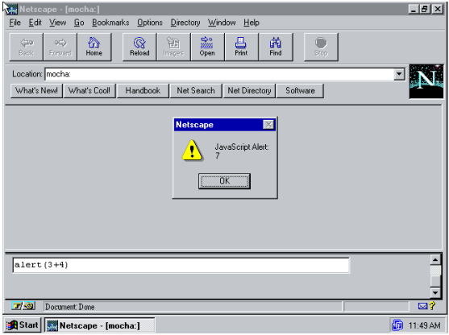

# Javascript 이전 시대

월드 와이드 웹의 개념과 기반 기술들은 1989-1991년에 CERN의 Tim Berners-Lee[2003]에 의해 개발되었다. Berners-Lee의 웹 기술은 몇 년 동안 고에너지 관련 물리학 커뮤니티에서 알려졌다. 하지만 그 커뮤니티 외부에서는 큰 주목을 받지 못했다. 이 상황은 1992-1993년에 당시 학부생이었던 Marc Andreessen과 일리노이 대학교 어바나-샴페인 국립 슈퍼컴퓨팅 응용 프로그램 센터(NCSA)에서 일하던 Eric Bina가 _Mosaic_g를 개발하면서 변화하기 시작했다.

NCSA Mosaic는 GUI를 갖춘 설치하기 쉽고 사용하기 쉬운 웹 클라이언트였다. 이것은 사실상 '웹 브라우저'라는 소프트웨어 분류를 정의했다. 또한 월드 와이드 웹의 개념을 물리학 커뮤니티의 외부에서도 유명하게 만들었다. Mosaic는 널리 배포되었다. 1994년 초, NCSA Mosaic의 라이센스를 얻거나 Mosaic에서 영감을 얻은 브라우저를 처음부터 만드는 데에 상업적 관심이 쏠렸다. 브라우저 열풍에 편승하기 위해서였다. Silicon Graphics Inc.의 창립자 Jim Clark는 벤처캐피탈 투자를 얻은 후 Marc Andreessen과 Eric Bina를 고용했다. 그리고 1994년 4월 그들은 나중에 Netscape Communications Corporation으로 불리게 될 회사를 공동 창립한다. Netscape는 NCSA Mosaic를 대체하는 브라우저를 만들고 그 브라우저를 세계에서 가장 인기있게 만드는 걸 목표로 삼았다. Netscape는 Mosaic와 비슷한 다음 세대의 브라우저를 맨 처음부터 개발했고 이를 1994년 10월 널리 배포하기 시작했다. 1995년 초까지 _Netscape Navigator_g는 초기 목표를 달성하고 Mosaic를 빠르게 대체하고 있었다.

Tim Berners-Lee의 웹 기술은 선언적인(_declarative_g) HTML 마크업 언어를 사용하여 웹 페이지로 문서를 표시하는 데에 중점을 두었다. 반면 스크립트 언어(_scripting language_g)[Ousterhout 1997]를 사용하여 사용자가 애플리케이션의 동작을 직접 만들 수 있도록 하는 데에도 상당한 산업적인 관심이 있었다. Microsoft Office의 Visual Basic, AppleScript[Cook 2007]과 같은 언어들은 주요 애플리케이션의 핵심을 구성하는 복잡한 자료구조와 알고리즘들을 구현하기 위해 만들어진 게 아니었다. 이런 언어들은 사용자들이 애플리케이션의 이미 존재하는 구성 요소들을 사용자가 원하는 새로운 방식으로 결합할 수 있도록 했다. Netscape는 월드 와이드 웹을 더 많은 사람들에게 보급했고 그에 따라 스크립팅이 어떤 방식으로 웹 페이지에 통합되어야 할지는 중요한 질문이 되었다.

## 2.1. Brendan Eich가 Netscape에 합류

Brendan Eich[^4]는 1985년 일리노이 어바나-샴페인 대학교에서 석사 학위를 마치고 즉시 Silicon Graphics Inc.(SGI)에서 일을 시작했다. 그는 주로 Unix 커널과 네트워크 계층에 관련된 일을 했다. 1992년에 그는 SGI를 떠나서 많은 투자를 받은 스타트업 MicroUnity에 합류했다. MicroUnity는 비디오 미디어 프로세서를 만드는 회사였다. 두 회사에서 Eich는 커널과 네트워크 프로그래밍 작업을 지원하는 작은 특수목적 언어를 구현했다. MicroUnity에서는 _GCC 컴파일러_g에 대한 작업도 조금 했다.

1995년 초 Brandon Eich는 "Netscape에 와서 브라우저에서 돌아가는 Scheme을 구현해라"[^5]라는 말을 미끼로 Netscape에 고용되었다. 그는 1995년 4월 3일에 Netscape에 합류했다. 그러나 그는 Scheme을 구현하게 되는 대신 웹 제품과 프로그래밍 언어 시장의 복잡한 상황을 마주하게 된다. Netscape는 1994년 말, Microsoft의 저가 인수 제안을 거절했다. 그 후 Netscape 경영진은 마이크로소프트의 "Embrace, Extend, Extinguish" 전략[Wikipedia 2019]에 의해 직접적으로 공격받을 것으로 예상했다. 당시 Microsoft는 Bill Gates의 직접적인 경영하에 있었는데, 그들은 웹이 크로스-OS 플랫폼으로 부상할 것을 깨달았다. 또한 그에 따라 Microsoft에서 곧 출시하려고 한 사설 환경의 정보 유틸리티인 프로젝트 블랙버드[Anderson 2007]가 무의미해질 것을 빠르게 깨달았다. Bill Gates의 "Internet Tidal Wave"[Gates 1995] 메모는 Microsoft를 프로젝트 블랙버드에서 _Internet Explorer_g와 서버 제품군 쪽으로 완전히 전환시켰다. 그 시점에 Netscape는 해당 시장을 점유하기 위해 서둘렀다.

웹 페이지에 쓰일 스크립트 언어 후보로는 Scheme과 같은 연구용 언어와 Perl, Python, Tcl과 같은 실용적인 Unix 기반 언어, 그리고 Microsoft의 Visual Basic 같이 독점권이 있는 언어들이 있었다. Brendan Eich는 브라우저에 Scheme을 구현할 것으로 예상했다. 하지만 1995년 초 Sun Microsystems는 아직 출시되지 않은[^6] Java 언어에 대한 기습적인 홍보 캠페인[Byous 1998]을 시작했다. Sun과 Netscape는 빠르게 협력하여 Java를 Netscape 2에 통합하는 계약을 체결했다. Eich는 Netscape 회의에서 Marc Andreessen이 "Netscape에 Java가 더해지면 Windows를 죽인다"라는 구호를 외쳤던 걸 회상했다. 1995년 5월 23일 Sun이 Java를 공개한 날, Netscape는 Java의 라이센스를 받아서 브라우저에 사용하려고 한다는 발표를 했다 [Netscape 1995a].

Netscape 내부에서는 브라우저에 사용할 스크립트 언어를 고르기 위한 급박한 계획 수립이 있었다. 여기서 Scheme, Perl, Python, Tcl, Visual Basic은 후보에서 제외되었다. 이는 시장 출시까지의 시간과 사업적 이해관계로 인해서였다. Netscape와 Sun의 고위 관리자들, 특히 Marc Andreessen과 Sun의 Bill Joy는 Java를 보완하는 "작은 언어"[^7]를 설계하고 구현하는 것만이 가능하다고 생각했다.

Sun과 Netscape의 주류에 해당하는 사람들은 간단한 스크립트 언어의 필요성에 대해 의문을 제기했다. Java는 스크립팅에 쓰기에는 적합하지 않은가? Java 하나만 있는 것보다 왜 2개의 언어가 있는 게 나은지 설명 가능한가? 그리고 Netscape가 새로운 언어를 만들 만큼의 충분한 전문성을 갖추고 있는가?

첫 번째 의문은 쉽게 반박되었다. 1995년 봄 당시 Java는 초보자에게 적합한 언어가 아니었다. 메인 프로그램의 코드 본문은 패키지의 _class_g 선언 내부의 `main`이라는 정적 _메서드_g내에 있어야 했다. 모든 매개변수, 리턴값 그리고 변수에는 정적 _타입_g을 선언해 주어야 했다. Visual C++을 보완하는 Visual BASIC, 그리고 네이티브 코드 기반의 컴포넌트를 보완하는 여러 Unix 언어의 경험을 기반으로 고려할 때, 이미 만들어진 컴포넌트들을 조립하는 역할을 할 스크립터들에게 있어 Java는 명백히 복잡했다.

두번째 의문은 마이크로소프트의 제품을 인용하는 것으로 극복할 수 있었다. 마이크로소프트는 전문 Windows 애플리케이션 프로그래머들에게 Visual C++을 판매했다. 그리고 아마추어와 파트타임 프로그래머, 디자이너, 회계사 등에게는 Visual Basic을 판매했다. Visual C++로 만들어진 컴포넌트들을 덜 숙련된 사람들도 조립하고 커스텀할 수 있도록 해주는 스크립트 언어로서였다. "애플리케이션을 위한 Visual Basic"이라고 불린 Visual Basic 버전은 Microsoft Office 제품에 통합되어 오피스 제품들의 사용자 확장과 스크립팅을 지원했다.

처음의 두 가지 의문을 극복한 후 Marc Andreessen은 브라우저에 들어갈 스크립트 언어의 코드네임으로 "Mocha"를 제안했다. Eich에 의하면 이때 언어의 이름을 적절한 시점에 "Javascript"로 바꾸게 될 거라는 바람이 있었다고 한다. 아무튼 이 Java의 동반자격의 언어는 "Java처럼 보여야" 했고 그럼에도 사용하기 쉬워야 했으며 Java같은 클래스 기반이 아닌 "객체 기반"이어야 했다.

아직 스크립트 언어 개발에 반대하는 사람들이 제기한 마지막 하나의 의문점이 남아 있었다. Netscape가 효율적인 스크립트 언어를 만들고 1995년 9월의 Netscape 2 베타에 맞춰서 스크립트 언어를 준비할 수 있을 만큼 충분한 전문성을 갖추고 있는가? Mocha를 만드는 것으로 이걸 증명하는 것이 Brendan Eich의 과제였다.

## 2.2. Mocha의 이야기

Java의 발표가 코앞이었다. 그래서 Brendan Eich는 이 스크립트 언어 개발에 있어서 시간이 가장 중요하다고 보았다. 그리고 불확실한 가능성보다는 확실하게 할 수 있는 부분을 택해야 한다고 보았다. 그런 생각을 바탕으로 그는 1995년 5월에 열흘 동안 최초의 _Mocha_g 구현체 프로토타입을 만들었다.[^8] 이 작업은 기한 안에 실행 가능성을 보여주기 위해 서둘러 진행되었다. 데모는 꼭 필요한 최소한의 언어 구현만으로 구성되었으며 Netscape 2 pre-alpha 버전 브라우저에 최소한으로 통합되었다.

Eich가 만든 프로토타입은 Silicon Graphics Indy Unix 워크스테이션에서 개발되었다 [Netfreak 2019]. 그 프로토타입은 수작업으로 만들어진 렉서와 재귀 하강 파서를 사용했다. 파서는 parse tree 대신 바이트코드로 변환된 명령어들을 출력했다. 바이트코드 _인터프리터_g는 간단하고 느렸다.[^9]

바이트코드는 Netscape의 LiveWire 서버[^10] 쪽의 요구사항이었다. 그쪽의 개발자들은 Mocha 프로토타입이 만들어지기도 전부터 Mocha를 내장할 걸로 생각하고 있었다. 그 팀에 있는 Borland 전 경영진과 엔지니어링 스태프들은 동적인 스크립트 언어의 강력한 지지자였지만, 더 빠른 서버 애플리케이션 로딩을 위해서 소스 파싱보다는 바이트코드를 원했다.

Marc Andreessen은 Mocha가 사용하기 쉬워야 한다고 강조했다. 누구든지 HTML 문서 내에서 코드 몇 줄 정도는 바로 쓸 수 있을 정도로 말이다. Sun과 Netscape의 고위 경영진들은 Mocha가 "Java처럼 보여야 한다"고 되풀이해 요구했으며 BASIC과 비슷한 부분을 명시적으로 배제했다. 하지만 Java처럼 보이는 외관을 가지는 것은 Java와 비슷하게 동작하리라는 기대를 만들었다. 이는 _객체_g 모델의 설계와 `boolean`, `int`, `double`, `string`과 같은 "원시 타입"의 의미에 영향을 미쳤다.

Java처럼 보여야 한다는 것을 제외하면 Brendan Eich는 언어 설계에 관한 세부 사항 대부분을 자유롭게 선택할 수 있었다. Netscape에 합류한 후 Eich는 HyperTalk [Apple Computer 1988], Logo [Papert 1980], Self [Ungar and Smith 1987]와 같은 사용하기 쉽고 교육적인 언어들을 탐구했다. Mocha가 객체 기반이 되어야 한다는 것에는 모두가 동의했다. 하지만 클래스는 없어야 했다. 왜냐 하면 클래스를 지원하는 것은 너무 오래 걸릴 뿐더러 클래스를 지원한다면 이미 클래스 모델을 갖추고 있던 Java와 경쟁해야 하는 위험이 생겼기 때문이다. Eich는 _위임_g과 단일 프로토타입 링크를 사용하는 동적인 객체 모델을 사용하기로 결정했다. 이는 Self 언어에서 영감을 받은 것이었다. 그는 이런 선택이 구현 시간을 절약해줄 것으로 생각했다. 하지만 결국 Mocha 프로토타입에서는 시간이 없어서 이 객체 모델을 넣을 수 없었다.

객체는 _생성자 함수_g에 `new` 연산자를 적용하여 생성할 수 있었다. 기본 객체 생성자 함수인 `Object`는 다른 내장 객체들과 함께 환경에 내장되어 있었다. 각 객체는 0개 혹은 그 이상의 속성들로 구성된다. 각 _속성_g은 이름(또는 _property key_g라고도 한다)과 값으로 구성된다. 이때 값은 _함수_g, 객체 또는 다른 내장 데이터 타입일 수 있다. 속성은 아직 사용되지 않은 속성 키에 값을 할당함으로써 생성됩니다. 속성에 대한 접근 제한이나 할당 제한은 없다(역주: private나 setter 같은 개념). 생성자 함수는 객체가 생성될 때 갖는 초기 속성 집합을 제공할 수 있다. 객체 생성 후에도 추가 속성을 객체에 추가할 수 있다. 매우 동적인 이러한 접근 방식은 특히 LiveWire 팀에게 좋은 반응을 얻었다.

Scheme을 사용할 수는 없게 되었지만 Brendan Eich는 여전히 Lisp 스타일의 _일급_g 함수 개념에 매력을 느꼈다. 클래스가 없어서 메소드를 포함할 수는 없었지만 일급 함수는 Scheme의 영향을 받은 용법들을 구현할 수 있도록 해주었다. 최상위 레벨 프로시저, 함수를 인수로 넘기기, 객체의 메소드, 이벤트 핸들러 등이 그렇다. 시간이 부족해서 함수 표현식(_람다 표현식_g이라고도 불린다)의 구현은 연기되었지만 문법상에는 예약어로 지정되어 있었다. 이벤트 핸들러와 객체 메소드는 Java(그리고 C++)에서 가져온 `this` 키워드를 사용하여 통합되었다. 이 `this` 키워드는 메소드로 호출된 함수의 컨텍스트 객체를 나타낸다.

프로토타입은 프로그램 코드를 포함하는 문자열을 파싱하고 실행할 수 있는 `eval` 함수를 지원했다. 이는 Marc Andreessen과 초기 Netscape 엔지니어들과의 비공식적인 토론에서 동기를 얻은 것이었다[^11]. 여기에 담긴 직관은 런타임에 문자열을 프로그램으로 변환하는 이런 종류의 동적인 프로그래밍이 웹 브라우저와 서버의 몇몇 애플리케이션에서 중요해질 거라는 생각이었다[^12]. 하지만 `eval` 지원하기로 한 이 결정은 즉각적인 결과를 가져왔다. 몇몇 사용 사례에서는 Java와 비슷한 `toString` 메서드를 통해서 문자열 형식으로 함수의 소스 코드를 전달해야 했다.

Eich는 10일간의 스프린트[^13]동안 바이트코드 디컴파일러를 구현하기로 결정했다. 필요한 몇몇 아키텍처를 위해서 소스 코드의 주요 저장소를 건드리거나 보조 저장소로부터 이를 복구하는 건 너무 비용이 많이 드는 연산으로 보였기 때문이다. 이는 Windows 3.1 개인용 컴퓨터에서 특히 그랬다. 이 컴퓨터는 Intel 8086 16비트 세그먼트 메모리 모델에 의해 제한되어 있었고 무제한 또는 큰 인메모리 구조를 위해 오버레이와 수동으로 관리되는 멀티-세그먼트 메모리가 필요했기 때문이다.

> 그림 2. Mocha 콘솔. Brandon Eich가 만든 Mocha의 초기 데모에는 SGI Unix 워크스테이션에서 실행된 Netscape 2 pre-alpha 버전에서 구동되는 "Mocha 콘솔" 기능이 있었다. 이 Mocha 콘솔은 이름만 바뀐 채로 Netscape 2 정식 릴리즈에 포함되었다. 사진은 Windows 95에서 실행되는 Netscape 2.02의 화면 캡처다. Mocha 콘솔은 를 브라우저 주소창에 `mocha:`를 입력하는 것으로 활성화되었다. 정식 버전의 Netscape 2에서는 주소창에 `javascript:`를 입력하는 것로 바뀌었지만 `mocha:`도 여전히 작동했다. 콘솔을 활성화하면 브라우저에서 두 칸으로 이루어진 페이지가 열렸다. 아래 칸의 텍스트 박스에 입력된 Mocha 표현식은 위 칸의 컨텍스트에서 평가되고 실행되었다. 이 예시는 표현식의 값을 보여주는 팝업을 표시하기 위해 내장 `alert` 함수가 호출되는 것을 보여준다. 원래의 데모 버전에서는 "Javascript Alert" 대신 "Mocha Alert"가 표시되었을 것이다.

열흘의 프로토타이핑 기간 이후 Mocha 프로토타입은 Netscape의 전체 엔지니어링 스태프가 모인 회의에서 공개되었다(그림 2). 이는 성공적이었고 이 성공은 1995년 9월에 첫 베타 릴리즈가 예정되어 있던 Netscape 2가 더 완전하고 통합된 버전으로 나올 수 있을 거라는 과도한 낙관주의로 이어졌다. 그해 여름 Brendan Eich는 Mocha와 브라우저를 더 완벽하게 통합하는 것에 주로 초점을 맞췄다. 그러기 위해서는 Mocha 프로그램이 웹 페이지와 상호 작용할 수 있도록 API를 설계하고 구현해야 했다. 동시에 언어의 프로토타입 수준 구현을 상용 가능한 소프트웨어로 변환하고 Mocha를 초기에 사용한 내부 사용자들의 버그 리포트, 변경 제안, 기능 요청에도 응답해야 했다.

열흘간 진행된 Mocha 개발에 대한 더 많은 내용은 Brandon Eich가 그때 당시에 대해 이야기한 글에서 찾아볼 수 있다 [Eich 2008c, 2011d; JavaScript Jabber 2014; Walker 2018]. Mocha의 프로덕션 버전 소스코드는 인터넷 아카이브에서 볼 수 있다 [Netscape 1997b]. Jamie Zawinski[1999]의 "the netscape dorm"은 그 시절의 Netscape에서 소프트웨어 개발자로 일한 경험에 대한 동시대의 기록이다.

[^4]: Eich의 초기 커리어에 대해서는 Coders At Work[Seibel 2009, chapter 4]라는 책에서 더 자세히 다루고 있다.
[^5]: Scheme 언어에 대한 언급[Sussman and Steele Jr 1975]
[^6]: Java의 스텔스 알파 릴리즈는 1995년 3월/4월이었다.
[^7]: Jon Bentley [1986]는 작고 배우기 쉬운 언어를 묘사하기 위한 용어 "little language"를 다음과 같은 의미로 소개했다. "특정한 문제 도메인에 특화되어 있으며 전통적인 언어들에서 발견되는 많은 특징들을 포함하지 않는 언어"
[^8]: 정확한 날짜에 대한 알려진 기록은 없다. Brandon Eich는 이것이 5월 6일에서 15일까지였다고 기억하고 있었다.
[^9]: 데이터 _값_g을 나타내기 위해서 메모리를 많이 차지하는 _discriminated union_g을 사용했으며 메모리 관리에는 레퍼런스 카운팅 기법을 사용했다.
[^10]: Brandon Eich는 Netscape에서의 첫 달 동안 공식적으로는 서버 그룹에서 일했다.
[^11]: General Magic에서 일했던 John Giannandrea를 포함한다. General Magic은 2개의 프로그래밍 언어를 만들었으며 이 언어들은 클라이언트와 서버 두 분야 모두에서 쓰일 수 있었다.
[^12]: 문자열을 동적으로 프로그램으로 변환함으로써, 예를 들어 form의 부분적인 평가를 하거나 클라이언트에서 제공된 코드를 서버에서 실행하는 걸 지원하도록 할 수 있었다. 이는 Telescript [General Magic 1995] 에이전트와 비슷했다.
[^13]: 1995년의 개발자들은 "스프린트"라는 단어를 쓰지 않았다. 하지만 이 단어는 당시 Eich가 한 활동을 잘 묘사한다.
