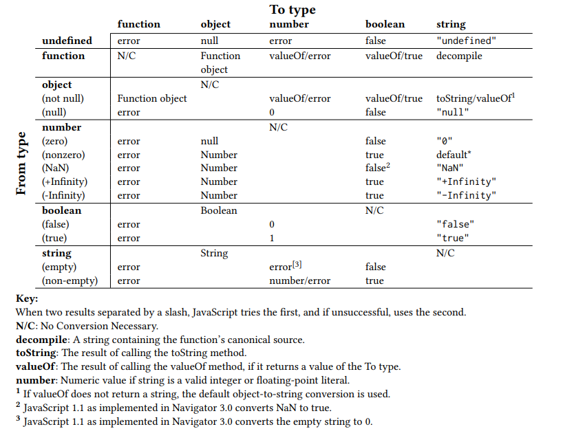
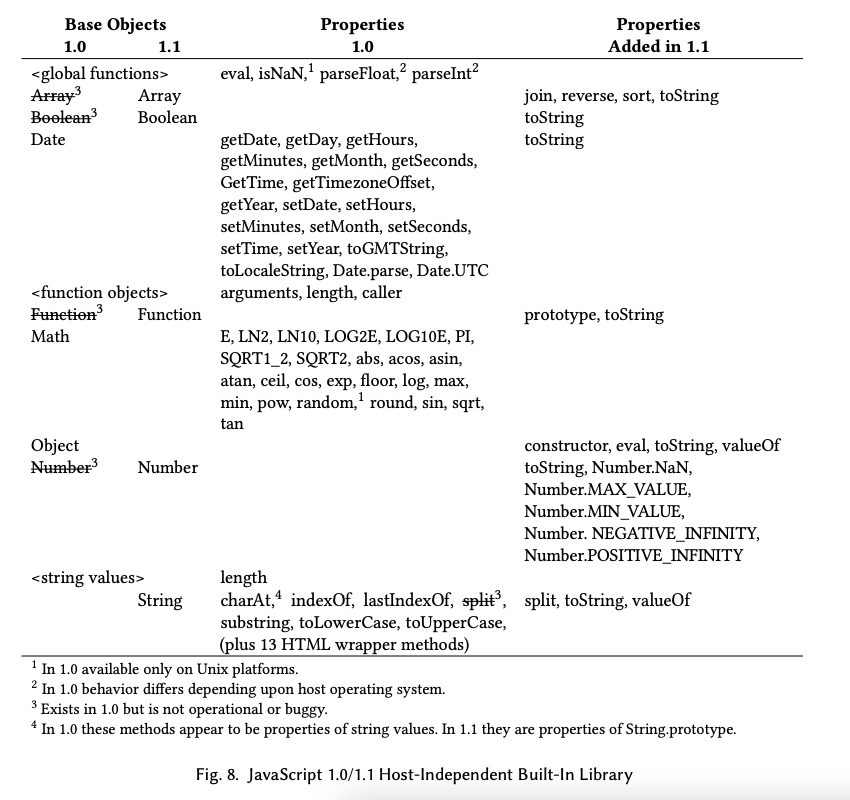

# JavaScript 1.0과 1.1

Netscape Communications Corporation과 Sun Microsystems는 1995년 12월 4일 JavaScript를 공동 보도 자료를 통해 발표했다[[Netscape and Sun 1995; 부록 F]](/docs/appendix/references). 보도 자료에서는 JavaScript를 "객체 스크립팅 언어"이며 동적으로 "Java 객체의 속성과 동작을 수정하는" 스크립트를 작성하는 데 사용될 거라고 설명했다. 이것은 "온라인 애플리케이션 개발을 쉽게 하기 위해 존재하는 "Java의 보완재"으로서의 역할을 할 거라고 했다. 회사들은 Java와 Javascript의 유사성이 표면적으로만 비슷했음에도 불구하고 둘 간의 강한 브랜드 연결을 구축하려고 시도했다. Java와 Javascript 간 이름의 유사성과 두 언어들이 밀접하게 관련되어 있다는 암시는 꾸준히 혼동의 원인이 되었다.

Javascript는 "LiveScript"라는 이름으로 Netscape Navigator 2.0의 첫 베타 릴리즈의 일부로 들어가면서 1995년 9월 처음 대중에게 공개되었다[[Netscape 1995b]](/docs/appendix/references). 이후 4번의 베타 릴리즈가 더 진행되었고 1996년 3월 Javascript 1.0을 지원하는 Netscape Navigator 2.0의 정식 버전이 출시되었다. Netscape Enterprise Server 2.0도 1996년 3월 [[Netscape 1996f]](/docs/appendix/references)에 출시되었으며, Javascript 1.0을 LiveWire의 서버사이드 스크립팅 컴포넌트에 포함했다.

Javascript는 Netscape Navigator의 상대적으로 작은 기능 중 하나였다. 그래서 Javascript의 개발은 1995년 8월의 기능 동결이 요구되었던 Navigator 2.0의 전체적인 일정에 의해 제약을 받았다. Javascript 1.0의 기능 세트는 본질적으로 당시 8월의 Mocha 구현에서 작동하거나 거의 작동하는 것들을 골라낸 것이었다. 이 기능 세트는 구상되었던 언어 설계에 비해 불완전했고 Eich가 Navigator 2.0 릴리즈 과정에서 초기 Mocha 구현의 버그들을 계속 수정했음에도 불구하고 많은 문제가 있는 버그와 엣지 케이스 동작들을 보였다. Javascript 1.0 릴리즈 직전에 Brandan Eich의 인터뷰[Shah 1996]를 보면 Brandan Eich는 Javascript가 Java의 부속물이라는 공식 입장과 초기 릴리즈의 급박한 상황을 반복해 말했다.

> BE(Brandan Eich): 저는 Javascript가 다른 회사들에 의해서도 구현되기를 바랍니다. 저와 Bill Joy가 만들고 있는 사양에 기반해서요. 저는 Javascript가 작은 언어로 남기를 바라지만 HTML 요소와 거기에 가하는 동작들 그리고 Java applet과 다른 컴포넌트들을 결합하기 위해 쓰이면서 웹에서 범용적으로 사용되기를 바랍니다.<br/>
> BE: ...제가 아는 한 Javascript의 가장 흔한 사용처는 페이지를 조금 더 똑똑하고 생생하게 만드는 건데요. 예를 들어 링크를 클릭하면 그때의 시간에 따라 다른 _URL_<sup>g</sup>로 간다든지 하는 거요.<br/>
> ...<br/>
> BE: Javascript는 대부분 저 혼자 만들었기 때문에 Netscape 2.0은 짜증나는 작은 버그들이 많이 포함되어 있을 것입니다. 하지만 터널의 끝에는 빛이 있겠죠. 저는 모든 큰 버그들에 대해서는 해결책을 찾았기를 바랍니다. 다른 개발자들과 버그와 그 해결책을 찾는 데에 많은 시간을 썼거든요.<br/>
> 저는 2.1버전을 마무리하고 있는데요. 버그를 고치고 기능을 추가하고 모든 플랫폼에서 Javascript가 일관되게 동작하도록 노력하고 있습니다. 2.1이 언제 출시될지는 모르겠지만, 저희는 빠르게 작업하고 있기 때문에 내년 봄 전에는 출시될 거라고 내기라도 걸 수 있습니다.

Javascript 1.0 [[Netscape 1996d]](/docs/appendix/references)는 산술 연산, 문자열, 불린값, 일급 함수 그리고 객체 자료형을 지원하는 간단한 _동적 타입_<sup>g</sup> 언어였다. 문법적으로 보면 Javascript는 Java처럼 C 계열에 속했다. C언어에서 가져온 제어 흐름 문법과 C의 산술 연산자 대부분을 포함하는 표현식 구문을 가지고 있었다. Javascript 1.0에는 작은 내장 함수 라이브러리도 있었다. Javascript 1.0 소스 코드는 보통 HTML 파일에 직접 포함되었다. 하지만 내장 라이브러리에는 Javascript의 문자열에 담긴 Javascript 소스 코드를 파싱하고 평가할 수 있는 eval 함수도 포함되어 있었다. Javascript 1.0은 매우 간결한 언어였다. 그림 3은 Javascript 1.0에 없었던 몇몇 문법들의 요약인데, 이는 현대 Javascript 프로그래머에게는 매우 놀라울 수도 있다.

1996년 초, 이후 1996년 8월 출시되어 Netscape Navigator 3.0이라 불릴 제품에 대한 작업이 "Atlas" [[Netscape 1996g]](/docs/appendix/references)라는 코드네임 하에 시작되었다. Brendan Eich는 1995년 8월 Navigator 2.0에서 미완성이거나 누락되었던 기능들에 대한 작업을 다시 시작할 수 있었다. Javascript의 초기 정의와 개발은 Navigator 3.0에 담긴 Javascript 1.1 [[Netscape 1996a,e]](/docs/appendix/references)이 출시됨으로써 완성되었다. 다음 섹션들은 Javascript 1.0/1.1 언어의 설계에 대한 개요를 제공한다.

|                                                                                   |                                         |
| --------------------------------------------------------------------------------- | --------------------------------------- |
| 별도의 `Array` 객체 타입                                                          | `Array` 리터럴                          |
| 정규 표현식                                                                       | 객체 리터럴                             |
| `undefined`의 전역 바인딩                                                         | `===` 연산자                            |
| `typeof`, `void`, `delete` 연산자                                                 | `in`, `instanceof` 연산자               |
| `do-while` 문                                                                     | `switch` 문                             |
| `try-catch-finally` 문                                                            | 특정 레이블로 `break/continue`          |
| 중첩 함수 선언                                                                    | 함수 표현식                             |
| 함수의 `call`, `apply` 메서드                                                     | 함수의 `prototype` 프로퍼티             |
| 프로토타입 기반 상속                                                              | 내장 프로토타입 객체에 대한 접근        |
| 순환 구조 가비지 컬렉션<sup>[g](/docs/appendix/c#cyclic-garbage-collection)</sup> | HTML `<script>` 태그의 `src` 어트리뷰트 |

> 그림 3. 약 2010년에 널리 사용된 Javascript 기능 중 Javascript 1.0에 없었던 것들

## 3.1 Javascript 문법

JavaScript 1.0의 문법은 C언어의 문장 구문[[ANSI X3 1989]](/docs/appendix/references)과 _AWK_<sup>g</sup>[Aho et al. 1988]에서 영향을 받은 몇 가지 장식을 직접적인 기반으로 모델링되었다. 스크립트는 선언(declaration)과 문장(statement)의 연속이다. C와 달리 Javascript의 문장은 함수 내부에서만 발생해야 한다는 제한이 없다. JavaScript 1.0에서 스크립트의 소스 코드는 HTML 문서 내에 포함된 `<script></script>` 태그로 둘러싸여 있다.

C의 영향을 받은 JavaScript 1.0의 문장들에는 이런 것이 있다. 표현식, if 조건문, for과 while 반복문, 비순차적인 흐름 제어를 위한 break, continue, return 문, `{}`로 묶인 문장들을 하나의 문장처럼 사용할 수 있게 하는 문장 블록, `if`, `for`, `while` 문은 복합 문장이다[^14]. JavaScript 1.0은 C의 `do-while` 문, `switch` 문, 문장 레이블(statement label), `goto` 문을 포함하지 않았다.

Javascript 1.0은 C의 문법을 기본으로 했는데, 거기에 객체 자료형의 속성에 접근하기 위한 2가지 복합 문장을 새로 추가했다. AWK에서 영향을 받은 `for-in` 문은 객체의 _속성 키_<sup>g</sup>를 반복한다. `with`[^15]문의 본문 내에서는 지정한 객체의 속성에 접근할 때 마치 해당 속성명이 선언된 변수인 것처럼 접근할 수 있다. 객체의 속성은 동적으로 추가될 수 있으므로(이후 버전에서는 삭제됨) `with`문의 본문 내에서 코드 실행이 진행됨에 따라 보이는 변수 _바인딩_<sup>g</sup>이 바뀔 수 있다.

Javascript의 선언은 C나 Java의 선언 스타일을 따르지 않는다. Javascript는 동적 타입 언어이다. 그리고 선언임을 인식하기 위한 문법적 접두사로 사용할 수 있는 타입명도 지원하지 않는다. 대신 Javascript 선언은 키워드가 접두사로 붙는다. Javascript 1.0의 선언에는 2가지 형태의 선언이 있는데 `function` 선언과 `var`선언이다. `function` 선언[^16] 문법은 AWK에서 직접적으로 가져왔다. `function`선언은 호출 가능한 단일 함수를 정의하는데, 이름, 형식 매개변수, 그리고 함수 본문을 정의한다. `var`선언은 하나 이상의 변수 바인딩을 도입하고 변수에 값을 할당할 수 있다. 값 할당은 필수는 아니다. 모든 var 선언은 문장으로 취급되며 블록 문장 내를 포함하는 어떤 문장 맥락에서도 발생할 수 있다. Javascript 1.0/1.1에서 `function`으로 시작되는 함수 선언은 스크립트의 최상위에서만 발생할 수 있으며 중첩된 함수 선언을 포함할 수 없었다. var 선언은 함수 본문 내에서 발생할 수 있으며, 이러한 선언으로 정의된 변수는 함수의 지역 변수이다.

C와 달리 Javascript 1.0에서 문장 블록, 즉 중괄호로 구분되는 블록들은 선언 스코프를 만들지 않는다. 함수 본문을 구분짓는 중괄호 블록 내의 var 선언은 전체 함수 본문에서 지역 변수로 동작한다. 함수 외부의 블록에 있는 var 선언은 전역 스코프<sup>g</sup>를 가진다. 범위 내에 function이나 var 선언이 없는 변수명에 할당할 경우 그 이름의 전역 변수가 암시적으로 생성된다. 이 동작은 이미 선언된 변수의 이름을 잘못 타이핑해도 에러가 뜨는 대신 조용히 새 변수가 생성되도록 하기 때문에 버그의 큰 요인이 되었다.

Javascript와 전통적인 C 문법의 주요한 차이 중 하나는 문장의 끝에 붙이는 세미콜론을 Javascript가 처리하는 방식이다. C는 세미콜론을 문장 종결에 필수로 취급하는데, Javascript는 세미콜론이 한 줄의 마지막 significant character일 때 문장 종결을 위한 세미콜론을 생략할 수 있도록 허용한다. 이 동작의 정확한 규칙은 Javascript 1.0 문서에 포함되어 있지 않았다. Netscape 2.0 핸드북은 여러 Javascript 문장 형태를 설명할 때 세미콜론을 제대로 보여주지 않았다. 그냥 이렇게만 썼다. "하나의 문장이 여러 줄에 걸쳐 있을 수 있다. 그리고 여러 문장이 하나의 줄에 있을 수 있는데 이럴 때 각 문장은 세미콜론으로 구분된다[[Netscape 1996d]](/docs/appendix/references)." 세미콜론을 쓰지 않는 코딩 스타일은 핸드북의 Javascript 코드 예제에서 사용된 표준이었다.

```js
var a, x, y;
var r = 10;
with (Math) {
  a = PI * r * r;
  x = r * cos(PI);
  y = r * sin(PI / 2);
}
```

세미콜론 없이 Javascript 코드를 작성할 수 있는 건 자동 세미콜론 삽입(Automatic Semicolon Insertion, ASI)덕분이다. ASI는 Javascript 프로그래머들 사이에서 여전히 논쟁의 대상이다. 프로그래머들의 상당한 수가 여전히 세미콜론 없이 코드를 작성하는 스타일을 선호하며, 다른 프로그래머들은 ASI를 사용하지 않고 세미콜론을 붙이는 것을 선호한다.

## 3.2. 자료형과 표현식

JavaScript 1.0/1.1은 5가지 기본 데이터 타입이 있는 동적 타입 언어였다. 그 5가지 타입은 숫자, 문자열, 불린, 객체, 함수였다. 여기서 동적 타입이라 함은 런타임의 타입 정보가 변수같은 값 컨테이너가 아니라 각 데이터와 관련되어 있다는 것을 뜻한다. 런타임 타입 검사는 각 연산이 그것을 지원하는 데이터 값에만 적용되도록 한다.

불린, 문자열, 숫자는 변경 불가능한 값이다. 불린 타입은 true와 false라는 두 가지 값이 있다. 문자열 값은 8비트 문자 코드로 이루어진 변경 불가능한 시퀀스다. 유니코드는 지원되지 않는다. 숫자 타입은 IEEE 754 [[IEEE 2008]](/docs/appendix/references)의 double 정밀도의 64비트 부동소수점 값 전체로 구성되며, 전통적인 NaN 값만 예외다. 일부 연산은 부호 없는 32비트 정수와 부호가 있고 2의 보수 형식으로 나타나는 정수에 해당하는 숫자 값을 특별히 다룬다. Mocha는 내부적으로는 이런 정수값을 다르게 표현했지만 공식적으로는 하나의 숫자 자료형만 있었다.

Javascript 1.0에는 유용한 데이터 값이 없음을 나타내는 데 쓰이는 2가지 특별한 값이 있었다. 초기화되지 않은 변수는 특별한 값 undefined[^17]로 설정되었다. 프로그램이 객체의 존재하지 않는 속성 키에 액세스하려고 할 때도 이 값이 반환되었다. Javascript 1.0에서는 초기화되지 않은 변수를 선언하고 접근함으로써 undefined 값에 접근할 수 있었다. null 값은 객체가 있을 것으로 예상되는 맥락에서 "객체 없음"을 나타내기 위해 만들어졌다. 이는 Java의 null 값에 기반을 두고 있으며, Java로 구현된 객체와 Javascript의 통합을 용이하게 했다. 두 유사하지만 차이점도 많은 값의 존재는 Javascript의 역사 동안 많은 프로그래머들에게 혼란을 주었다. 주어진 상황에서 둘 중 어떤 것을 사용해야 할지 확신하지 못하는 프로그래머들이 많았다.

Javascript 1.0의 표현식 문법은 C에서 가져왔으며 거의 동일한 연산자와 연산자 우선순위 규칙을 가진다. 몇 가지 빠진 부분도 있기는 한데 C의 포인터와 타입 관련 연산자, 그리고 단항 + 연산자이다. 이항 + 연산자는 숫자 덧셈 연산과 문자열 연결 2가지로 오버로딩되어 있다. 시프트 연산자와 비트 논리 연산자는 부호 있는 32비트 2의 보수 형식 정수의 비트 레벨 인코딩에 작용한다. 필요한 경우 피연산자는 정수가 되도록 끝을 자르고 32비트 값으로 모듈로 연산된다. `>>` 연산자는 32비트 정수 값의 부호를 보존하는 오른쪽 시프트를 수행한다. 그리고 Javascript는 Java에서 가져온 `>>>` 연산자를 추가했다. 이 연산자는 부호 없는 오른쪽 시프트를 수행한다.

JavaScript 1.1에는 delete, typeof, void 연산자가 추가되었다. Javascript 1.1에서 delete 연산자는 변수나 객체 속성을 피연산자로 받아서 그 값을 null로 설정했다. typeof 연산자는 피연산자의 원시 타입을 식별하는 문자열을 반환했다. 가능한 값으로는 "undefined", "object", "function", "boolean", "string", "number" 그리고 호스트 정의 객체를 식별하기 위해 구현체에서 정의한 값이 있었다. 놀랍게도 typeof null은 "null"이 아니라 "object" 문자열을 반환한다. 이는 모든 값이 객체이고 null이 본질적으로 "객체 없음"을 나타내는 객체인 Java와 일관성이 있다고 할 수도 있다. 그러나 Java는 typeof 연산자와 같은 기능을 하는 무언가가 없으며 초기화되지 않은 변수의 기본값으로 null을 사용한다. Brandan Eich는 typeof null의 결과는 처음의 Mocha 구현에 있었던 leaky abstraction<sup>g</sup>의 결과였다고 회상한다. null의 런타입 값은 객체 값의 사용된 내부적인 태그 값과 같은 태그 값을 갖도록 인코딩되었고, 따라서 내부 태그 값을 확인하던 typeof 연산자의 당시 구현은 어떤 특별한 검사 로직 없이 "object"를 반환했던 것이다. 이는 객체의 속성에 접근해서 그 값을 사용하기 전 해당 값이 실제로 객체인지 테스트하려고 했던 Javascript 프로그래머들에게 큰 불편을 주었다. typeof의 결과가 "object"인 것을 테스트하는 것만으로는 null을 제대로 걸러낼 수 없었고 null의 속성에 접근하려고 시도하는 것은 런타임 오류를 발생시켰기 때문이다.

void 연산자는 단순히 피연산자를 평가한 다음 undefined를 반환한다. undefined에 접근하는 하나의 일반적인 방법은 void 0을 사용하는 것이다. void 연산자는 원래 클릭했을 때 Javascript 코드를 실행하는 HTML 하이퍼링크를 정의하기 위해 도입되었다. 예를 들어 이런 식이다.

```html
<a href="javascript:void usefulFunction()">Click to do something useful</a>
```

href 속성<sup>g</sup>의 값은 URL이어야 하는데 javascript:는 브라우저에 의해 인식되는 특별한 URL 프로토콜이다. 이는 뒤따르는 것을 JavaScript 코드로 평가하고, 그 결과를 문자열로 변환하여 일반 href URL을 사용하여 가져온 응답 문서인 것처럼 사용하라는 의미이다. `<a>` 요소는 그 응답 문서가 undefined가 아닌 경우 그것을 처리하려고 시도할 것이다. 그런데 일반적으로 웹 개발자는 링크가 클릭되었을 때 Javascript 표현식이 그냥 실행되고 평가되기만 원하지 그 결과를 사용하고 싶어하지는 않는다. void 연산자를 표현식 앞에 붙이는 것은 `<a>`요소에 의한 추가 처리를 방지하고 개발자가 원하는 대로 표현식이 평가만 되도록 해주었다.



> 그림 4. Eich와 McKinney에 의해 발표된 Javascript 1.1 타입 변환표[[1996, page 23]](/docs/appendix/references). Javascript 1.1 예비 사양에 있었다. 최종적으로 표준화된 타입 변환 규칙은 약간 다르다. 이 그림은 약간의 인쇄상의 차이가 있지만 원본 표의 복사본이다. 원본에는 각주 3이 없었다.

C와 JavaScript 표현식 사이의 가장 중요한 차이점은 JavaScript 연산자는 자동으로 피연산자를 연산자가 받을 수 있는 자료형으로 암묵적 형변환을 한다는 것이다. Javascript 1.1은 이렇게 임의의 객체를 숫자나 문자열 값으로 변환하는 설정 가능한 메커니즘을 추가했다. 그림 4는 Javascript 1.1의 암묵적 형변환 규칙을 요약한다.

## 3.3. 객체(Objects)

```js
// using Object constructor
var pt = new Object();
pt.x = 0;
pt.y = 0;

// using custom constructor
function Point(x, y) {
  this.x = x;
  this.y = y;
}
var pt = new Point(0, 0);
```

> 그림 5. Javascript 1.0의 객체 생성을 위한 다른 방법들. `Object` 생성자로 객체를 생성한 뒤 속성을 추가할 수도 있고 생성자 함수를 만들어서 객체가 만들어지는 동안 속성을 추가할 수도 있다.

Javascript 1.0의 객체는 "속성(property)"라 불리는 원소들로 이루어진 연관 배열이다. 각 속성은 문자열로 된 키와 값을 가지고 값은 Javascript의 어떤 데이터 타입이든 될 수 있다. 속성은 동적으로 추가될 수 있다. JavaScript 1.0/1.1은 객체에서 속성을 제거하는 방법을 제공하지 않았다.

키 문자열이 식별자 이름에 대한 문법 규칙을 준수할 시 해당 속성은 점 표기법을 통해서 접근할 수 있다. 예를 들어서 `obj.prop0`과 같이 할 수 있다. 식별자가 아닌 키를 가진 속성을 포함한 모든 속성은 대괄호 표기법으로 접근할 수 있다. 이 표기법을 사용하면 대괄호로 둘러싸인 표현식은 평가되고 문자열로 변환되어 속성의 키로 사용된다. 예를 들어 `obj["prop"+n]`은 n의 값이 0일 때 `obj.prop0`과 동일하다. 존재하지 않는 속성에 값을 할당하면 새로운 속성이 생성된다. 만약 존재하지 않는 속성의 값에 접근하려고 하면 보통 undefined가 반환된다. 하지만 Javascript 1.0/1.1에서는 대괄호 표기법을 사용해 존재하지 않는 객체의 속성 값에 접근했으며 사용한 속성 키가 음이 아닌 정수의 문자열 표현이었을 경우 null이 반환되었다.

속성은 데이터 저장소로 사용될 수도 있고 객체의 동작을 구현하는 데에 사용될 수도 있다. 그 값이 함수인 속성은 객체의 메서드로서 호출될 수 있다. 객체의 메서드로 호출된 함수는 키워드 this와의 동적 바인딩을 통해 자신을 호출한 객체 그 자신에게 접근할 수 있다(§3.7.4).

객체는 내장 함수나 사용자 정의 함수에 new 연산자를 적용하여 생성된다. 이런 용도로 사용되기 위해 만들어진 함수를 "생성자(constructor)"라고 한다. 생성자는 일반적으로 새로운 객체에 속성을 추가한다. 이 속성들은 저장할 데이터 혹은 메서드이다. 내장 생성자 Object는 초기에 속성이 없는 새로운 객체를 생성하는 데에 사용될 수 있다. 그림 5는 Object 생성자나 사용자 정의 생성자 함수가 새로운 객체를 생성하는 방법을 보여준다.

JavaScript 1.0에는 또한 내장 Array 생성자가 있다. 하지만 Array 생성자로 생성된 객체와 Object 생성자로 생성된 객체 사이의 유일한 차이점은 객체에 표시되는 디버깅 문자열뿐이다. JavaScript 1.0의 Array 생성자로 생성된 객체는 length 속성을 가지고 있지 않았다.

정수값을 키로 사용하는 속성들을 생성함으로써 어떤 객체에 대해서든 배열과 유사한 인덱싱 동작을 할 수 있다. 이런 객체는 정수가 아닌 키를 가진 속성들도 가질 수 있다.

```js
var a = new Object(); // or new Array
a[0] = " zero ";
a[1] = " one";
a[2] = " two";
a.length = 3;
```

```js
// define functions to be used as methods
function ptSum(pt2) {
  return new Point(this.x + pt2.x, this.y + pt2.y);
}

function ptDistance(pt2) {
  return Math.sqrt(Math.pow(pt2.x - this.x, 2) + Math.pow(pt2.y - this.y, 2));
}
// define Point constructor
function Point(x, y) {
  // create and initialize a new object 's data properties
  this.x = x;
  this.y = y;
  // add methods to each instance object
  this.sum = ptSum;
  this.distance = ptDistance;
}
var origin = new Point(0, 0); // create a Point object
```

> 그림 6. Javascript 1.0에서 추상화된 Point 객체를 생성한다. 각 인스턴스는 각각의 메서드 속성들을 가지고 있다.

Javascript 1.0은 _상속_<sup>g</sup>의 개념이 없다. 프로그램은 각각의 새로운 객체에 모든 속성을 개별적으로 추가해야 한다. 이는 일반적으로 프로그램에서 사용하는 각 "클래스" 객체에 대한 생성자 함수를 정의하는 방식으로 이루어진다. 그림 6은 Javascript 1.0을 사용하여 작성된 간단한 Point 추상화 정의를 보여준다. 이 예제에서 중요한 점은 다음과 같다.

- 각 메서드는 전역 함수로 정의되어야 한다. 이 함수들은 다른 추상화 객체의 메서드 함수를 정의하는 데에 사용되는 이름과 충돌하지 않을 가능성이 있는 이름을 가져야 한다(예: ptSum, ptDistance).
- 객체가 생성되는 시점에 객체 속성들은 각 메서드를 위해 생성된 전역 함수로 초기화된 값으로 생성되어야 한다.
- 메서드는 선언된 전역 이름(ptDistance)보다는 객체 속성 이름(origin.distance)을 사용하여 호출된다.

Javascript 1.1에서는 각각의 새로운 인스턴스에 직접 메서드 속성을 생성할 필요가 없어졌다. 1.1부터는 생성자 함수 객체의 `prototype`이라는 속성을 통해서 생성자 함수 인스턴스의 프로토타입<sup>g</sup> 객체를 연결할 수 있게 되었다. JavaScript 1.1 가이드 [[Netscape 1996e]](/docs/appendix/references)는 `prototype`을 "지정된 타입의 모든 객체에 의해 공유되는 속성"으로 설명한다. 이건 모호한 설명이고, 다음과 같이 더 잘 표현할 수 있다. "해당 생성자에 의해 생성된 모든 객체에 의해 공유되는 속성을 가진 객체"라고 말이다. 이런 공유 메커니즘은 더 자세히 설명되지는 않았지만 다음과 같은 프로토타입 객체의 속성들을 관찰할 수 있다.

- 해당 객체를 생성한 생성자 함수의 `prototype` 객체에 정의된 속성 이름에 접근하면 생성자 함수의 `prototype` 객체의 해당 속성 값이 반환된다.
- 프로토타입 객체의 속성을 추가하거나 수정하는 것은 기존에 해당 prototype 속성을 가진 생성자 함수에 의해 만들어진 객체에 즉시 반영된다.
- 객체의 생성자 함수의 `prototype`에 이미 정의되어 있는 속성과 같은 이름의 속성에 값을 할당하면 객체의 속성 값이 생성자 함수의 `prototype`에 정의된 속성 값을 덮어씌운다(shadow<sup>g</sup>[^18]).

내장 Object.prototype 객체의 속성은 객체 또는 객체의 프로토타입 객체에 의해 덮어씌워지지 않는 한 모든 객체에서 접근 가능하다.

```js
// define functions to be used as methods
function ptSum(pt2) {
  return new Point(this.x + pt2.x, this.y + pt2.y);
}

function ptDistance(pt2) {
  return Math.sqrt(Math.pow(pt2.x - this.x, 2) + Math.pow(pt2.y - this.y, 2));
}
// define Point constructor
function Point(x, y) {
  // create / initialize a new object's data properties
  this.x = x;
  this.y = y;
}
// add methods to shared prototype object
Point.prototype.sum = ptSum;
Point.prototype.distance = ptDistance;
var origin = new Point(0, 0); // create a Point object
```

> 그림 7. Javascript 1.1에서 추상화된 Point 객체를 생성한다. 각 Point 인스턴스 객체는 직접 속성들을 정의하는 대신 `Point.prototype` 객체에서 메서드 속성들을 상속받는다.

그림 7은 그림 6에서 했던 간단한 Point 추상화를 Javascript 1.1에서 다시 정의한 것이다. 이는 메서드가 각 인스턴스 객체에서 반복적으로 정의되는 것과 달리 프로토타입 객체에 한 번만 정의된다는 점이 다르다. 프로토타입 속성을 통해서 객체에서 접근할 수 있는 속성은 상속된 속성<sup>g</sup>이라고 한다. 객체에 직접 정의된 속성은 자체 속성<sup>g</sup>이라고 한다. 자체 속성은 동일한 이름의 자체 속성을 덮어씌운다.

프로토타입 객체 속성은 보통 메서드다. 이 경우 생성자를 통해 제공된 프로토타입 객체는 C++의 vtable이나 Smalltalk의 MethodDictionary와 같은 역할을 하여 객체들의 집합과 공통의 행동을 연관시킨다. 생성자 함수는 본질적으로 클래스 객체의 역할을 하고 프로토타입은 클래스 인스턴스들에게 공유되는 메서드들의 컨테이너와 같다. 이것은 Javascript 1.1의 객체 모델에 대한 합리적인 해석이지만 유일한 해석은 아니다.

생성자 함수의 `prototype` 이라는 속성의 작명은 Brandan Eich가 다른 객체 모델을 염두에 두었다는 명백한 단서이다. 그 모델은 Self 프로그래밍 언어에 의해 영감을 받았다[[Ungar and Smith 1987]](/docs/appendix/references). Self에서는 새로운 객체를 만들 때 일부 객체 카테고리의 프로토타입 객체를 복제하여 만든다. 각각의 복제본은 프로토타입 객체를 참조하는 부모 링크를 가지고 있어서 프로토타입이 그 복제본들에게 공통적으로 제공하고자 하는 기능들을 제공할 수 있었다. Javascript 1.1 객체 모델은 Self의 모델의 변형이라고 할 수 있다. 프로토타입 객체는 생성자 함수를 통해서 간접적으로 접근되고 new 연산자는 프로토타입에서 새로운 인스턴스를 복제한다. 복제된 인스턴스는 프로토타입 객체의 속성들을 상속<sup>g</sup>받아서 공통 기능으로 사용할 수 있다. 일부 Javascript 프로그래머들은 이 메커니즘을 "프로토타입 상속<sup>g</sup>"이라고 부른다. 이것은 위임의 한 형태이다. 일부 Javascript 프로그래머들은 Java와 다른 많은 객체지향 언어들에서 사용되는 상속 스타일을 가리키기 위해 "전통적인 상속(classical inheritance)<sup>g</sup>"이라는 중의적 표현을 사용한다.

JavaScript 1.1 문서 [[Netscape 1996e]](/docs/appendix/references)는 이러한 객체 모델 중 어느 것도 완전히 설명하지 않는다. 그 문서는 1995년 12월 Netscape와 선의 보도자료와 일관성 있는 마케팅 전략을 유지했다. Javascript는 추상화된 진짜 객체 정의(클래스 정의)는 Java로 쓰여질 때 그 객체들 간의 상호작용을 위한 스크립트 언어로 포지셔닝되었다. Javascript 고유의 객체 추상화 기능은 별로 주목을 끌지 않고 잘 문서화되지 않은 보조 기능으로 제한되었다.

## 3.4. 함수 객체(Function Objects)

Javascript 1.0/1.1의 함수 정의는 호출 가능한 함수를 만들고 이름을 지정한다. Javascript의 함수는 일급 객체 값이다. `function` 키워드 선언에 주어진 이름은 최상위 스코프에서의 `var` 선언과 같이 전역 변수를 정의한다. 그 값은 함수 객체이며 변수에 할당되거나 그 값은 함수 객체이며 변수에 할당되거나, 속성 값으로 설정되거나, 함수 호출에서 인수로 전달되거나, 함수의 반환값으로 쓰일 수 있다. 함수는 객체이기 때문에 속성을 가질 수도 있다. 다음 예시는 함수 객체에 속성을 추가하는 방법을 보여준다.

```js
function countedHello() {
  alert("Hello, World!");
  countedHello.callCount++; // increment this function's callCount property
}

countedHello.callCount = 0; // associate counter with function and initialize
for (var i = 0; i < 5; i++) countedHello();
alert(countedHello.callCount); // displays : 5
```

함수는 형식 매개변수 목록과 함께 선언된다. 하지만 정의와 함께 선언된 매개변수 목록의 크기는 실제로 함수를 호출할 때 전달될 수 있는 인수의 갯수를 제한하지는 않는다. 만약 함수 정의에 선언된 형식 매개변수보다 적은 인수로 함수를 호출하면 전달되지 않은 매개변수는 undefined로 설정된다. 형식 매개변수보다 많은 인수로 함수를 호출하면 추가 인수는 평가되지만 그 값을 매개변수 이름을 통해서 사용할 수는 없다. 그러나 함수 본문이 실행되는 동안 함수 객체의 `arguments` 속성 값을 통해 인수들을 담은 유사 배열 객체를 사용할 수 있다. 함수 호출 시 전달된 모든 실제 인수는 `arguments` 객체의 정수 키 속성을 통해서 사용할 수 있다. 이를 통해 가변 갯수의 인수들을 처리할 수 있는 함수를 작성할 수 있다.

## 3.5. 내장 라이브러리(Built-in Library)



> 그림 8. Javascript 1.0/1.1의 호스트-독립적인 내장 라이브러리

JavaScript 1.0은 내장 함수, 객체, 생성자들의 라이브러리를 가지고 있었다. 이 라이브러리는 소수의 일반 목적 객체[^19]들과 함수들, 그리고 더 많은 호스트별 객체와 함수들을 정의한다. Netscape Navigator의 경우 호스트 객체<sup>g</sup>는 현재 HTML 문서의 일부 모델을 제공했다. 이 API들은 결국 '문서 객체 모델(Document Object Model, DOM) 레벨 0' [[Koch 2003; Netscape 1996b]](/docs/appendix/references)으로 알려지게 된다. Netscape 엔터프라이즈 서버의 경우 호스트 객체는 클라이언트/서버 통신, 클라이언트와 서버 세션의 상태 관리, 파일 및 데이터베이스 접근을 지원했다. 서버 호스트 객체에 대한 이러한 설계는 Netscape 서버 제품 외에는 널리 채택되지 않았다.

Javascript의 초기 설계는 대부분 브라우저 플랫폼에서 필요로 하는 것들에 의해 주도되었다. 초기 Javascript 버전의 Netscape 문서는 어떤 라이브러리 요소가 호스트 환경에 의존적이고 어떤 라이브러리 요소가 호스트 환경에 독립적인지 명확히 구분하지 않았다. 그러나 DOM과 다른 브라우저 플랫폼 API의 설계, 진화, 표준화는 각각의 중요한 이야기를 가지며 그 자체로서의 역사를 가진다. 이 문서는 Javascript의 전체적인 설계와 관련되어 있을 경우에만 브라우저 관련 주제들을 언급한다.

Javascript 1.0은 딱 2가지의 일반 목적 객체 분류를 가지고 있었다. `String`과 `Date`였다. 그리고 일반적으로 사용되는 수학의 상수와 함수들을 정의한 싱글톤 전역 객체 Math도 있었다. 또 접근 방법을 알고 있을 경우 활성화되지 않았거나 불완전하게 구현된 여러 클래스의 생성자들도 Javascript 1.0 프로그램에서 접근할 수 있었다. Javascript 1.1은 이런 기능들의 구현을 완성하고 문서화했다. 그림 8은 Javascript 1.0과 1.1에서 정의된 호스트 독립적인 클래스들을 요약해 보여준다.

`String` 클래스는 `length` 속성과 6개의 일반 메서드를 제공한다. 이 메서드들은 불변의 문자열 값들에 작용하며 적절한 경우 새로운 문자열 값을 반환한다. JavaScript 1.0의 `String` 클래스는 또한 문자열 값을 다양한 HTML 태그로 감싸는 열세 개의 메서드를 포함gksek. 이는 Javascript 1.0/1.1에서 호스트 의존적 기능과 일반 목적 기능 사이의 유동적인 경계를 보여주는 예시이다. Javascript 1.0은 전역 `String` 생성자 함수를 제공하지 않는다. 모든 문자열 값은 문자열 리터럴이나 연산자 혹은 내장 함수를 통해서 생성된다. Javascript 1.1에서 전역 `String` 생성자와 `split` 메서드가 추가되었다.

`Date` 클래스는 달력 날짜와 시간을 나타내기 위해 쓰인다. Javascript 1.0의 `Date`는 Java 1.0의 `java.util.Date` 클래스를 버그까지도 그대로 옮긴 것이었다[[Gosling et al. 1996]](/docs/appendix/references). 이는 1970년 1월 1일 GMT 00:00:00을 기준으로 시작하는 밀리세컨드 단위의 시간 값을 사용하는 것, 다른 날짜 관련 값들과 달리 월을 나타내는 값을 0-11로 번호매기는 것, Java 설계에 있었던 2000년 문제 등을 포함한다. 이런 설계 결정은 Java와의 호환성 요구 사항에 영향을 받았다. Java의 `java.util.Date`를 옮겨올 때 빠진 것은 equals, before, after뿐이었다. 이들은 Javascript의 자동 형변환으로 인해 숫자 관계 연산자를 Date 객체에 직접 사용할 수 있었기 때문에 필요없어서 제외되었다.

Date는 Object를 제외하면 Javascript 1.0에서 유일하게 사용 가능한 내장 생성자 함수였다. Date는 또 클래스 인스턴스의 메서드 외에 생성자 객체에 메서드를 노출하는 유일한 클래스였다. 브라우저별 클래스 중 어떤 것도 생성자 함수를 노출하지 않았다.

내장 라이브러리 객체와 호스트 제공 객체의 일부 속성은 Javascript 프로그래머가 직접 정의한 속성(사용자 정의 속성)은 가질 수 없는 특징들을 가지고 있다. 예를 들어 내장 객체의 메서드 속성은 for-in 문에 의해 열거되지 않는다. 일부 속성은 delete 연산자를 써도 무시되거나 읽기 전용 값이다. 내장 객체의 일부 속성에 접근하거나 속성을 수정하는 것은 사이드 이펙트를 가진 특별한 동작을 유발한다.

JavaScript 1.1은 사용 가능한 Array 클래스를 추가했다. Array 생성자는 0에서 시작하는 정수 인덱스를 가지며 서로 다른 여러 종류의 값들로 이루어진 벡터와 같은 객체를 생성한다. 배열의 각 요소는 정수 인덱스의 문자열 표현(역주: `'0'`, `'1'`과 같은)을 키로 가지는 객체 속성으로 표현된다. 배열 객체는 또한 생성자에 의해 값이 초기화되는 `length` 프로퍼티를 가지고 있다. `length` 속성의 값은 현재 `length` 값보다 크거나 같은 요소 인덱스에 접근할 때마다 업데이트된다. 따라서 배열 객체의 요소 수는 동적으로 증가할 수 있다.

## 3.6. 실행 모델(Execution Model)

Netscape 2와 그 이후의 브라우저에서, HTML 웹 페이지는 여러 개의 `<script>` 요소를 포함할 수 있다. 페이지가 로드될 때 HTML 문서를 위한 새로운 Javascript 실행 환경과 전역 컨텍스트가 생성된다. 전역 컨텍스트에는 Javascript와 호스트 환경이 제공하는 내장 함수와 변수의 이름들을 키로 가지는 전역 객체가 포함되어 있다. 그리고 전역 객체에는 스크립트 코드에 의해 정의된 전역 변수와 함수들도 정의되어 있다.

Netscape 2에서 각 `<script>` 요소의 Javascript 코드는 페이지의 HTML 파일 내에서의 순서대로 구문 분석되고 평가된다. 최신 브라우저에서는 `<script>` 요소의 지연 평가를 위한 태그를 붙일 수 있다. 이 태그를 붙이면 Javascript 코드가 네트워크 통신 등 HTML 분석과 관계없는 코드를 실행할 경우 그동안 HTML 처리를 계속할 수 있다. 어떤 경우든 브라우저는 한번에 하나의 스크립트만 평가한다. 스크립트는 일반적으로 동일한 전역 객체를 공유한다. 하나의 스크립트에 의해 생성된 전역 변수와 함수는 이후의 모든 스크립트에서 볼 수 있다. 각 스크립트는 선점이나 중단 없이 완료될 때까지 실행된다. 이런 초기 브라우저의 특성은 Javascript의 근본적인 원칙이 되었다. 스크립트는 실행에 대한 원자 단위이며 한번 실행되면 완료될 때까지 실행된다. 스크립트 내에서는 다른 스크립트의 동시 실행으로 인한 간섭에 대해 걱정할 필요가 없다. 그런 일이 일어날 수 없기 때문이다.

Netscape 2는 또한 웹 페이지 프레임[^20]의 개념을 도입했다. 프레임은 별도의 HTML 문서가 로드될 수 있는 웹 페이지상의 영역이다. 페이지의 모든 프레임은 동일한 Javascript 실행 환경을 공유하지만, 각 프레임은 해당 환경 내에서 각각의 다른 전역 컨텍스트를 가진다. 다른 프레임에 로드된 스크립트는 다른 전역 객체, 다른 내장 요소, 그리고 다른 전역 변수와 함수를 가진다. 하지만 전역 컨텍스트는 주소 공간이 아니다. Javascript 실행 환경은 객체의 단일 주소 공간을 가지며 이는 그 환경 내의 모든 프레임 내에서 공유된다. 이런 단일 주소 공간 덕분에 다른 프레임의 Javascript 코드 사이에서 객체 참조를 전달하고, 서로 다른 전역 컨텍스트의 객체를 혼합하는 게 가능하다. 이는 놀라운 동작을 만들 수도 있다. 그림 9의 Javascript 1.1 코드 예시를 보자. 각각의 프레임은 자체적인 `Object` 생성자와 그 생성자로 만들어진 모든 객체들에게 상속되는 속성을 제공하는 `Object.prototype`을 가지고 있다. 그래서 한 프레임의 `Object.prototype`에 속성을 추가해도 다른 프레임의 `Object` 생성자로 만들어진 객체에는 그 속성이 보이지 않는다.

```js
// The variable alien references an object created within a different frame
// by evaluating : new Object ()
var alien = createNewObjectInADifferentFrame();
var native = new Object(); // create an object in the current frame
Object.prototype.sharedProperty = " each frame has distinct built - ins ";
alert(native.sharedProperty); // displays : each frame has distinct built - ins
alert(alien.sharedProperty); // displays : undefined
```

> 그림 9. 서로 다른 HTML 프레임은 각각의 내장 객체를 가지고 있지만 객체를 공유할 수 있다는 것을 보여주는 Javascript 1.1 코드 예시

대화형 Javascript 웹 페이지는 브라우저가 제공하는 이벤트 루프와 함께 사용되는 이벤트 기반의 응용 프로그램이다. HyperCard[[Apple Computer 1988]](/docs/appendix/references)는 Brandan Eich가 Netscape 2 DOM[[Netscape 1996c]](/docs/appendix/references)의 설계에서 이벤트 개념을 사용하도록 영감을 주었다. 원래 이벤트는 주로 사용자 상호작용에 의해 트리거되었었다. 하지만 현대 브라우저에서는 많은 종류의 이벤트가 있으며, 그 중 일부만 사용자가 발생시킨다.

웹 페이지에 정의된 모든 스크립트가 실행되고 나면 페이지의 Javascript 환경은 이벤트가 발생하기를 기다리는 활성 상태로 남아 있다. 이벤트 핸들러는 여러 DOM 객체를 포함하여 브라우저가 제공하는 객체와 연결될 수 있다. 이벤트 핸들러는 이벤트 발생에 대한 응답으로 호출되는 Javascript 함수일 뿐이다. 브라우저 객체의 특정 속성에 함수를 할당하면 그 함수는 해당 속성과 관련된 이벤트의 핸들러가 된다. 예를 들어 클릭 가능한 요소로 설정된 객체는 `onclick` 속성을 가지고 있다. Javascript 이벤트 핸들러는 다음과 같이 HTML 요소 내에서 Javascript 코드를 사용하여 직접 정의될 수도 있다.

```html
<button onclick="doSomethingWhenClicked()">Click me</button>
```

HTML 요소가 처리될 때 브라우저는 Javascript 함수를 생성하고 버튼 객체의 onclick 속성 값으로 할당한다. onclick에 할당된 코드는 함수 본문으로 사용된다. Javascript 이벤트 핸들러가 설정되어 있는 이벤트가 발생하면 그 이벤트는 대기 중인 이벤트 풀에 들어간다. 실행중인 Javascript 코드가 없을 때 브라우저는 이벤트 풀에서 대기 중인 이벤트를 가져와서 연관된 이벤트 핸들러 함수를 호출한다. 스크립트와 마찬가지로 이벤트 핸들러 함수도 완료될 때까지 실행된다.

## 3.7. Javascript의 이상한 점과 버그들(Oddities and Bugs)

Javascript에는 몇몇 이상하거나 예상치 못한 기능들이 있다. 일부는 의도적이었고 다른 일부는 Javascript의 전신인 Mocha를 만들기 위한 단 10일 간의 스프린트 동안 이루어진 급한 설계 결정의 산물이었다. Javascript 1.0에는 또한 버그들과 불완전하게 구현된 기능들도 있었다.

### 3.7.1. 재정의(Redundant Declarations)

JavaScript는 스코프 내에서 같은 이름을 가진 선언을 허용한다. 함수 내부에서 발생한 이름의 모든 선언은 함수 본문 전체에서 보이는 단일 바인딩에 해당한다. 예를 들어 다음은 유효한 함수 정의이다.

```js
function f(x, x) {
  // x names the second parameter , ignores 1st x
  var x; // same binding as second parameter
  for (var x in obj) {
    // same binding as second parameter
    var x = 1,
      x = 2; // same bindings as second parameter
  }
  var x = 3; // same binding as second parameter
}
```

함수 `f` 내의 모든 `var` 선언은 동일한 변수 바인딩을 참조한다. 이는 함수의 2번째 매개변수에 대한 바인딩과도 같다. 같은 이름이 함수의 형식 매개변수 목록에 여러 번 나타날 수도 있다. 함수 본문을 실행하기 전에 `var` 선언에 의해 정의된 변수들은 모두 `undefined`로 초기화된다. 그러나 매개변수 이름과 동일한 이름을 가진 `var` 변수의 경우에는 같은 이름을 가진 매개변수와 같은 초기값을 가진다. 중복 선언을 포함하여 `var` 선언의 초기화는 초기화된 변수에 대한 할당과 동일한 의미를 가진다. 이들은 함수 본문 내에서 정상적인 실행 순서에 도달했을 때 실행된다.

스크립트 내에서 동일한 이름의 여러 함수 선언 즉 `function` 키워드가 쓰인 곳이 있을 수도 있다. 그럴 경우 동일한 이름의 함수 선언들 중 마지막 함수 선언이 해당 이름으로 사용된다. 그리고 이 함수 선언은 스크립트의 최상단으로 끌어올려져서 그 이름과 같은 전역 변수를 초기화하는 데에 사용된다. 같은 이름의 다른 모든 `function` 선언은 무시된다. 동일한 이름에 대해 `function` 선언과 `var` 변수 선언이 동시에 있을 경우 그들은 모두 동일한 변수를 참조한다. 그리고 코드를 한 줄씩 실행하는 도중에 `var` 선언을 통한 초기화가 발견되면 함수 값은 덮어씌워진다.

### 3.7.2. 자동 형변환과 == 연산자(Automatic Coercions and the == Operator)

자동 형변환은 Javascript가 간단한 스크립트 언어로 도입될 때 진입 장벽을 낮추기 위해 만들어졌다. 하지만 Javascript가 일반 목적의 언어로 발전해 감에 따라서 이런 형변환은 혼란과 버그의 주요한 원인임이 증명되었다. 이는 특히 `==` 연산자에서 두드러진다. Mocha의 초기 10일간의 스프린트 이후 알파 유저들의 요청에 의해 몇 가지 문제가 되는 형변환이 추가되었다. 이는 Javascript와 HTTP/HTML의 통합을 쉽게 만들기 위한 요구 사항이었다. 예를 들어서 Netscape의 내부 사용자들은 문자열 값 `"404"`를 포함하는 HTTP 상태 코드가 `==` 연산자를 통해 숫자 404와 동일하게 비교되기를 원했다. 또한 그들은 HTML 폼의 빈 필드에 대한 기본값을 제공하기 위해 빈 문자열이 숫자 맥락에 있을 때는 0으로 자동 형변환되기를 요구했다. 이런 형변환은 다음과 같은 놀라운 결과를 가져왔다. `1 == '1'`과 `1 == '1.0'`은 참이지만 `'1' != '1.0'`이다.

Javascript 1.0은 `if` 문의 조건에서 `=` 연산자를 `==`와 똑같이 취급한다. 예를 들어 다음 두 줄의 코드는 같은 의미이다.

```js
if ((a = 0)) alert("true"); // these two statements are equivalent
if (a == 0) alert("true");
```

> Javascript 1.0 - 1.2

### 3.7.3. 32비트 산수(32-bit Arithmetic)

Javascript의 비트 논리 연산자는 IEEE double 부동 소수점 인코딩 내에 있는 32비트 값에 작용한다. 비트 연산자는 비트 연산을 수행하기 위해 먼저 피연산자를 정수로 잘라내고 32비트 2의 보수 값으로 모듈러 변환을 수행한다. 그래서 표현식 `x|0`(`|`는 비트 or 연산자)에서 숫자값 `x`는 32비트 값으로 강제될 수 있다. 이런 방식을 사용하여 32비트 부호 있는 덧셈을 이렇게 수행할 수 있다.

```js
function int32bitAdd(x, y) {
  return ((x | 0) + (y | 0)) | 0; // addition with result truncated to 32-bits
}
```

부호 없는 32비트 연산도 할 수 있다. `|0` 대신 부호 없는 오른쪽 쉬프트 연산자를 사용해 `>>>0`과 같이 하면 된다.

### 3.7.4. this 키워드(The this keyword)

모든 함수는 `this` 매개변수를 암시적으로 가지고 있다. 함수가 메소드 형식으로 호출될 때 `this` 매개변수는 메소드에 접근하기 위해 사용된 객체로 설정된다. 이는 대부분의 객체 지향 언어에서 `this`(또는 `self`)에 부여된 의미와 동일하다. 그러나 Javascript는 독립된 함수와 객체 메서드에 대해 같은 형식으로 정의하는데 이 둘의 this 매개변수는 서로 다른 의미를 가지기 때문에 이는 많은 프로그래머들에게 있어 혼란과 버그의 원인이 되었다.

함수가 객체를 통하지 않고 직접 호출되면 `this`는 암시적으로 전역 객체로 설정된다. 전역 객체의 속성에는 프로그램의 모든 전역 변수가 포함된다. 그래서 독립적으로 호출된 함수에서의 `this`의 속성 참조는 전역 변수에 대한 참조와 같다. `this`의 처리가 함수가 어떤 방식으로 호출되는지에 따라 달라지기 때문에 같은 `this` 참조도 다른 방식의 호출에서 다른 의미를 가질 수 있다. 예를 들어 이런 것이다.

```js
function setX(value) {
  this.x = value;
}
var obj = new Object();
obj.setX = setX; // install setX as a method of obj

obj.setX(42); // calls setX as a method
alert(obj.x); // displays : 42

setX(84); // directly call setX
alert(x); // accesses global variable x; displays 84
alert(obj.x); // displays : 42
```

`this`에 대한 혼란을 일으키는 다른 요인도 있다. 몇몇 HTML 요소들은 Javascript 코드를 메서드로 호출되도록 암시적으로 변환한다. 예를 들어 다음과 같은 HTML 코드가 있다고 하자.

```html
<button name="B" onclick='alert(this.name + " clicked")'>Click me</button>
```

이벤트 핸들러가 실행되면 버튼의 `onclick` 메서드가 호출된다. 해당 메서드의 `this`는 버튼 객체를 가리키며 `this.name`은 버튼 객체의 `name` 속성값을 검색한다.

### 3.7.5. 인수 객체(Arguments objects)

함수의 `arguments`객체는 함수의 형식 매개변수와 연결되어 있다. `argument` 객체의 숫자 인덱스 속성과 함수의 형식 매개변수 사이에는 동적 매핑이 있다. `arguments` 객체 속성의 변경은 상응하는 형식 매개변수의 값을 변경하며, 형식 매개변수를 변경하면 그 위치에 대응되는 `arguments` 객체 속성의 변경을 관찰할 수 있다.

```js
f(1, 2);

function f(argA, argB) {
  alert(argA); // displays : 1
  alert(f.arguments[0]); // displays : 1
  f.arguments[0] = "one";
  alert(argA); // displays : one
  argB = "two";
  alert(f.arguments[1]); // displays : two
  alert(f.arguments.argB); // displays : two
}
```

> Javascript 1.0 - 1.1

위 코드 예제의 마지막 줄에서 볼 수 있듯이 `arguments` 객체의 속성 키에 형식 매개변수 이름을 넣음으로써 해당 형식 매개변수에 접근할 수 있다. 예를 들어서 `f.arguments.argB`는 해당 함수의 `argB` 매개변수에 접근한다.

개념적으로 함수가 호출되면 함수의 새로운 동작을 위해 새로운 `arguments` 객체가 생성되고 함수 객체의 `arguments` 속성 값이 그 새로운 `arguments` 객체로 설정된다. 하지만 Javascript 1.0/1.1에서는 함수 객체와 `arguments` 객체가 동일한 객체이다.

```js
function f(a, b) {
  if (f == f.arguments) alert("f and f.arguments are the same object");
}
if (f.arguments == null) alert("but only while a call to f is active");
```

> Javascript 1.0 - 1.1

이상적으로는 함수의 `arguments` 객체는 해당 함수의 본문 내에서만 접근 가능해야 한다. 이는 함수가 반환될 때 자동으로 `arguments` 속성을 `null`로 설정함으로써 부분적으로 강제된다. 하지만 `f1`과 `f2`라는 두 함수가 있다고 가정해 보자. `f1`이 `f2`를 호출하면 `f2`의 함수 본문에서는 `f1.arguments`을 통해 `f1`의 인자들에 접근할 수 있다.

`arguments` 객체에는 `caller`라는 속성도 있다. `caller`속성의 값은 현재 함수를 호출한 함수 객체이거나 만약 가장 바깥쪽 즉 전역에서 호출되었을 경우 `null`이다. `caller`와 `arguments`를 사용함으로써 어떤 함수든 현재 콜스택에 있는 함수들과 그들의 인자들을 검사할 수 있다. 그리고 심지어 콜스택에 있는 함수들의 형식 매개변수 값을 수정할 수도 있다. 같은 의미의 `caller` 속성은 `arguments` 객체를 거치지 않고 함수 객체를 통해 직접 접근할 수도 있다.

### 3.7.6. 숫자 속성 키의 특별 취급(Special Treatment of Numeric Property Keys)

Javascript 1.0에서 대괄호 표기법은 숫자 키와 함께 쓰였을 경우 특이한 의미를 가졌다. 어떤 경우 대괄호로 둘러싸인 정수 키는 객체 속성이 생성된 순서대로 속성에 접근했다. 정수를 통해서 속성이 생성된 순서에 따라 속성에 접근하게 되는 것은 해당 키를 가진 속성이 객체에 존재하지 않고 정수의 값 n이 객체 속성의 총 개수보다 작은 경우에만 발생한다. 그럴 경우 `객체[n]`과 같이 숫자 키로 속성에 접근하면 그 객체에 생성된 n번째 속성(0부터 시작)에 접근하게 된다. 예를 들어 다음과 같은 코드가 있다고 하자.

```js
var a = new Object(); // or new Array
a[0] = "zero";
a[1] = "one";
a.p1 = "two";

alert(a[2]); // displays : two
a[2] = "2";
alert(a.p1); // displays : 2
```

> Javascript 1.0

Javascript 1.1에서는 이런 대괄호 표기법의 특이한 동작을 제거했다.

### 3.7.7. 원시값의 속성(Properties of Primitive Values)

Javascript 1.0에서 숫자형과 불린값은 속성을 갖지 않았다. 그리고 그 값들의 속성에 접근하거나 속성을 지정하려고 하면 에러 메시지가 발생했다. 문자열 값은 속성을 가진 객체처럼 동작하지만, 읽기 전용인 `length` 속성을 제외하고는 모두 동일한 속성을 공유합니다. 다음과 같은 코드를 보면 그걸 알 수 있다.

```js
"xyz".prop = 42; // Set the value of property prop to 42 for all strings
alert("xyz".prop); // displays : 42
alert("abc".prop); // displays : 42
```

> Javascript 1.0

Javascript 1.1에서는 숫자, 불린, 문자열 값에 대한 속성 접근이나 할당은 내장된 `Number`, `Boolean`, `String` 생성자를 이용해 암시적으로 "래퍼 객체(wrapper object)"를 만들도록 한다. 이 속성 접근은 래퍼 객체에 수행된다. 그리고 일반적으로 내장 프로토타입에서 상속받은 속성에 접근한다. `valueOf`와 `toString` 메서드의 자동 호출로 이루어지는 형변환은 대부분의 상황에서 래퍼 객체를 원시값처럼 사용할 수 있게 한다. 할당을 통해 래퍼 객체에 새로운 속성을 만들 수는 있지만, 암시적으로 생성된 래퍼는 일반적으로 할당 직후에는 접근할 수 없게 된다. 예를 들어 다음과 같은 코드를 보자.

```js
" xyz".prop = 42; // Set the value of a String wrapper property to 42
alert("xyz".prop); // Implicitly creates another wrapper , displays: undefined
var abc = new String("abc"); // Explicitly create a wrapper object
alert(abc + "xyz"); // Implicitly converts wrapper to string , displays: abcxyz
abc.prop = 42; // create a property on a wrapper objects
alert(abc.prop); // display: 42
```

> JavaScript 1.1

### 3.7.8. Javascript 내부의 HTML 주석(HTML Comments Inside JavaScript)

Netscape 2에서는 Javascript의 잠재적인 상호 운용성 문제가 있었다. 이는 Netscape 1과 Mosaic 브라우저가 HTML의 `<script>` 요소를 만났을 때 어떻게 했는지와 관련이 있었다. 구식이지만 널리 사용되던 이런 브라우저들은 Javascript 코드를 담은 `<script>` 요소를 만나면 해당 요소의 본문을 웹 페이지에 일반 텍스트로 표시했다. 이런 구식 브라우저들에서 발생하던 문제는 HTML 주석[^21]으로 스크립트 본문을 감싸는 것으로 방지할 수 있었다. 예를 들어 이런 식으로 말이다.

```html
<script>
  <!-- This is an HTML comment surrounding a script body
  alert("this is a message from JavaScript"); // not visible to old browsers
  // the following line ends the HTML comment
  -->
</script>
```

> Mosaic와 Netscape 1에서

이런 코딩 패턴을 사용하면 Netscape 1과 Mosaic의 HTML 파서는 전체 스크립트 본문을 HTML 주석으로 인식하고 페이지에 표시하지 않았다. 하지만 Mocha가 처음 구현되었을 때 이런 패턴을 사용하면 브라우저가 스크립트 본문을 파싱하고 실행하지 못했다. HTML 주석 구분자가 Javascript 코드에서 문법적으로 유효하지 않았기 때문이다. 이 문제를 피하기 위해 Brandan Eich는 Javascript 1.0에서 `<!--`가 한 줄 주석의 시작으로 인식되도록 했다. 이는 `//`와 동일하다. 하지만 `-->`는 Javascript 주석의 구분자로 만들지 않았다. 이 패턴을 사용할 때 `-->`의 앞에 `//`를 두는 것으로 충분했기 때문이다. 그래서 하위 호환성이 있는 스크립트는 다음과 같이 작성할 수 있었다.

```html
<script>
  <!-- This is an HTML comment in old browsers and a JS single line comment
  alert("this is a message from JavaScript"); // not visible to old browsers
  // the following line ends the HTML comment and is a JS single line comment
  // -->
</script>
```

> Mosaic, Netscape 1, Netscape 2에서의 JavaScript 1.0

`<!--`주석은 공식 Javascript 문법에 문서화되지는 않았다. 하지만 많은 웹 개발자가 사용하였고 다른 브라우저들의 Javascript 구현에서 지원되었다. 그 결과로 `<!--` 는 웹 현실(_Web Reality_<sup>g</sup>)의 사실상의 표준이 되었다. 그래서 20년이 걸렸지만 2015년에 `<!--`주석은 ECMAScript 표준에 추가되었다. 결국 실질적으로 쓰이는 게 언제나 승리한다.

[^14]: 복합 문장은 중첩된 문장을 그 문법적 구조의 일부로 포함하고 있다. 일반적으로 문장 블록은 중첩된 문장으로 사용된다. 대부분의 복합 문장은 하나의 중첩된 문장을 가지고 있다. 그 경우 중첩된 문장은 복합 문장의 "본문"이다.
[^15]: `with` 문은 Netscape LiveWire 팀의 요청에 따라 Mocha 제작을 위한 열흘간의 스프린트 이후에 추가되었다.
[^16]: `return` 문의 문법과 시맨틱을 포함한다.
[^17]: 이 섹션에서는 "undefined"를 이탤릭체로 표현한다. Javascript 1.0은 이 undefined 값에 직접 접근할 수 있는 이름을 제공하지 않았기 때문이다.(역주: 당시에는 `void 0`등으로 이 값에 접근할 수 있었다)
[^18]: 프로토타입의 속성을 덮어씌우는(over-ride)새로운 속성을 만드는 것
[^19]: Javascript에는 객체 추상화 메커니즘을 위한 공식적인 명명이 없었다. 그래서 Javascript 내장 라이브러리에서 지원하는 특정 종류의 객체에 대해 이야기하기 쉽지 않다. JavaScript 문서에서는 "타입", "객체", "생성자", "클래스"와 같은 다양한 용어로 이런 추상화 객체를 이야기했다. 이 문서의 나머지 부분에서는 공통된 표현과 메서드를 공유하는 Javascript 객체 집합을 부르기 위해 첫 글자가 대문자인 `Class`라는 용어를 사용하겠다. 이는 실제 객체 정의의 형태와는 관계없이 적용된다.
[^20]: 원래의 HTML `<frame>` 태그는 지금 구식으로 취급되며 `<iframe>`에 의해 대체되고 있다. 여기에 설명된 의미는 두 태그 모두에게 공통으로 적용되는 이야기이다.
[^21]: 스크립트 본문에는 HTML 주석에서 허용되지 않는 `>` 또는 `--` 연산자가 포함되어 있지 않아야 한다.
