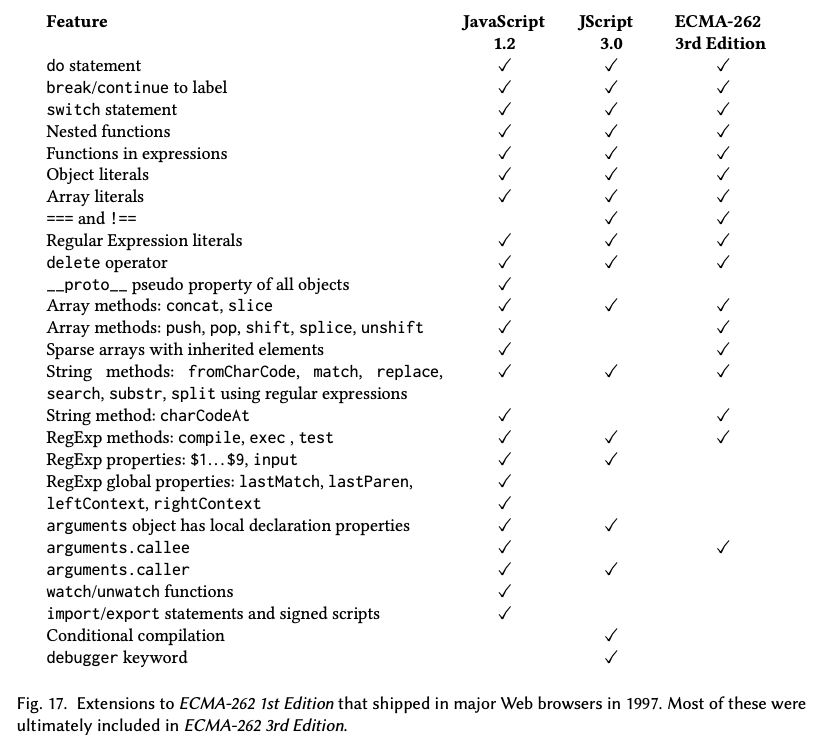
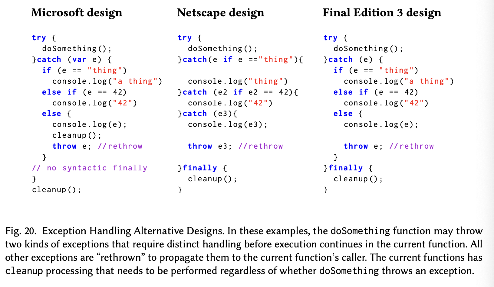
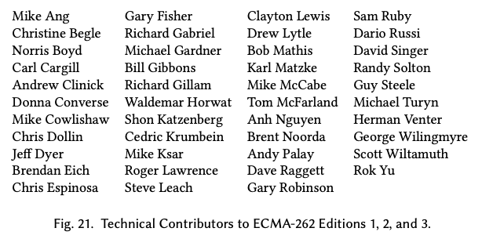

# ECMAScript 3 정의하기

TC39의 첫번째 회의에서는 JavaScript 1.0/1.1 언어의 여러 확장이 제안되었다. 그리고 그 중 일부는 언어 명세의 첫번째 초안에 포함되었다. 하지만 TC39는 기본적인 언어의 명세가 완성될 때까지 새로운 기능에 대한 고려는 유예하기로 합의했다. 첫번째 판의 개발 기간 동안, 가능한 확장들은 초안 명세의 부록 부분으로 밀려났다.

1997년 7월의 TC39 회의까지 첫 번째 판의 작업은 거의 완료되었다. 위원회는 이제 명세의 다음 판에 어떤 새로운 기능들을 포함시킬지에 초점을 맞추었다. 넷스케이프는 이미 Javascript 1.2 확장을 포함한 SpiderMonkey 엔진을 탑재한 넷스케이프 4.0을 출시함으로써 자신들의 방향을 제시했다. Scott Wiltamuth는 "ECMAScript 2.0"에 대한 마이크로소프트의 초기 제안[1997]을 발표했는데 여기에는 `switch` 문, `do while` 문, 레이블 문과 레이블이 붙은 `break` 및 `continue`가 포함되어 있었다. 그리고 `===` 및 `!==` 연산자, `arguments` 객체에 `caller` 속성을 추가하는 내용도 포함되었다. 마이크로소프트의 Andrew Clinick [1997]은 조건부 컴파일 지원을 추가하는 별도의 제안을 발표했다. "버전 2"의 시작점은 마이크로소프트가 인터넷 익스플로러 4.0의 구성 요소로 JScript 3.0을 출시했을 때 확고해졌다. 그림 17은 넷스케이프[1997c]와 마이크로소프트[2009b] 브라우저가 1997년 말까지 ECMAScript의 첫 번째 판에 구현한 주요 확장들을 나열하고 있다.

공식 TC39 회의는 각 회원사를 대표하는 그룹과 프로그램 매니저들이 참석하는 관리/전략 세션이 되었다. 위원회의 기술적 작업의 대부분은 비공식적인 기술 작업 그룹에서 진행되었다. 7월 회의에서 TC39는 버전 2를 개발하기 위한 단계들에 대해 합의를 보았다. 그리고 작업 항목, 기능 제안, 수용의 기준을 정하는 것이 기술 작업 그룹의 역할이라는 것에 대한 합의도 있었다. 버전 2에는 첫번째 판에서보다 더 많은 시간이 할당되었다. 초안이 더 성숙해지고 외부 피드백을 받을 수 있도록 하기 위해서였다. 버전 2 명세의 첫 번째 초안은 1997년 12월까지 완성되는 것이 목표였다. 9월 회의에서는 [TC39 1997h] 버전 2 명세가 첫 번째 판의 명세를 따라 작성된 프로그램과의 하위 호환성을 유지해야 한다는 것을 추가적으로 합의했다.

이러한 결정들이 내려졌을 때, ISO의 패스트트랙 과정은 아직 시작되지 않았다. 그리고 ISO 패스트트랙 과정에서 나온 변경 사항으로 인해 ECMA-262의 새로운 판을 ISO 판에 맞게 조정하는 작업이 있을 걸로 예상되지는 않았다. 그러나 1998년 초기는 2개의 작업 그룹이 있었는데 각각의 작업 그룹에서 작업하는 회원들은 중복되었지만 둘은 별개의 명세 초안을 작업하고 있었다. “에디션 2”와 “버전 2”가 같은 출판물이 되지 않을 게 분명해졌다. 하지만 TC39 대표들은 작업 중인 명세 초안이 "제 3판"으로 출판될 거라고 알려졌을 때에도 이 기능 작업들을 계속 "버전 2" 또는 "V2"라고 불렀다. TC39의 내부적인 버전 명명이 최종 출판물의 이름과 충돌하는 경우는 이후에도 또 생기게 된다.



1997년 말 기술 작업 그룹의 참여자들에 큰 변화가 있었다. 그림 18은 1998년을 통틀어서 적어도 두 번의 작업 그룹 회의록에 등장하는 사람들을 나열하고 있다. 명세의 첫번째 판을 개발한 작업 그룹 중에서 Clayton Lewis만이 계속 활동하고 있었다. Brendan Eich는 1998년 2월에 한 회의에 참석한 후 모질라 프로젝트 [Mozilla Organization 1998]의 공동 창립자가 되었다. 이 모질라 프로젝트는 넷스케이프 브라우저의 코드를 오픈소스로 전환하려는 노력이었다. Waldemar Horwat은 TC39에서 넷스케이프의 언어 디자인 리더 역할을 맡았다. 마찬가지로 마이크로소프트의 Katzenberger는 휴직을 하고 다른 프로젝트로 옮겨갔다. 마이크로소프트에서 Katzenberger가 하던 TC39 관련 업무는 Herman Venter 와 Rok Yu가 맡았다.

1997년 10월, 기술 작업 그룹은 버전 2에 포함할 후보 기능들의 목록(부록 H)을 만들었다. 이렇게 명세에 포함하는 것에 대한 합의가 있었던 기능들은 대체로 넷스케이프의 Javascript 1.2와 마이크로소프트 JScript 3.0의 합집합이었다. 그 합집합에서 배제된 것도 몇 가지 있었지만. 이 후보 기능 목록에는 `toSource`도 있었다. 이는 Brendan Eich가 Javascript 1.3[^37]을 위해 개발한 객체 직렬화/지속 스키마에 해당했다. 명세 포함에 대한 합의가 부족한 다른 기능들은 별도로 나열되었다. 첫번째 판에서 그랬던 것과 같이 작업 그룹은 이미 구현된 기능들을 엄밀하게 명세화하고 구현체들 간의 차이를 해결하는 데에 주로 초점을 맞췄다. 하지만 합의된 기능 목록에는 예외 처리 메커니즘, instanceof 연산자, 그리고 다른 기능들 몇몇이 있었는데 이 기능들은 아직 어떤 구현에도 없었다. 이런 기능들은 아직 구현된 적이 없었다. 따라서 이 기능들은 첫번째 판에는 필요하지 않았던 형태의 설계 작업을 요구했다. 그림 19는 1998년 이전 브라우저에는 없었던 기능들 중 최종적으로 ES3에 포함된 기능들을 나열하고 있다.

기술 작업 그룹은 매월 대면 회의를 하는 것으로 일정을 잡았다. 프로젝트 편집자였던 Mike Cowlishaw[1999b; Appendix I]는 명세 각 섹션의 현재 상태를 추적하는 문서를 유지했다. 상태를 나타내는 용어로는 "V1 이후 변경되지 않음", "준비되지 않음", "논의 필요", "기능 수용됨", "내용 합의됨"이 있었다. "기능 수용됨" 상태는 위원회가 명세에서 기능이 어떻게 정의될지 합의했다는 것을 의미했다. 그리고 "내용 합의됨" 상태는 실제 명세 텍스트가 검토되고 수용되었음을 의미했다.

Bill Gibbons는 새로운 명세의 작업 초안 편집자였다. 각 회의는 제안들과 해결되지 않은 문제들에 대한 발표와 토론들로 구성된 의제가 있었다. 제안들은 일반적으로 새롭거나 개정된 알고리즘적인 명세 텍스트의 형태로 제시되었다.(역주 : ECMA-262 명세를 보면 각 기능들은 알고리즘적으로 정의되어 있다) 회의에는 참가자들이 마지막 회의 이후 발견한 문제들을 논의하는 일반적인 상태 검토 시간도 있었다. 제안이나 문제 해결에 관한 합의가 이루어지면 Gibbons가 이를 작업 초안에 포함시켰다. V2의 첫번째 완전한 초안 [Cowlishaw et al. 1998]은 1998년 4월에 발표되었으며 ECMA-262 Edition 1을 기반으로 했다. 이는 그때 동시에 개발되고 있던 ECMA-262 Edition 2, ISO 판에서 생긴 변경 사항들을 포함하고 있지 않았다. 작업 초안의 제목 페이지에는 넷스케이프와 마이크로소프트가 제출한 변경 사항 제안들을 포함하고 있다고 명시되어 있었다. 9월에 ISO 판이 완성된 후, Bill Gibbons가 ES2의 변경 사항을 현재 V2 작업 초안에 통합했다.

유니코드는 여전히 새로운 기술이었고 언어 설계자들은 유니코드를 프로그래밍 언어에 통합하는 여러 접근 방식을 찾고 있었다. 특히 중요한 문제는 유니코드의 다양한 정규화 형태를 어떻게 다룰지였다. 이런 다양한 정규화 형태는 동작이 동일한 문자 시퀀스를 다른 방식으로 인코딩할 수 있게 했다. ES1은 유니코드에 대해 매우 제한된 지원을 제공했다. Hewlett-Packard의 Tom McFarland는 1998년 5월의 회의에 참석한 후 국제화<sup>g</sup>(I18N) 그리고 ECMAScript와 유니코드를 더 잘 통합하는 것을 포함한 여러 문제들에 대한 자신의 생각을 기록한 메모[McFarland 1998]를 제출했다. 여러 회의에서 논의된 결과 1998년 11월 TC39는 IBM의 Richard Gillam [1998]이 의장을 맡은 “I18N 작업 그룹”을 설립했다. I18N 그룹은 핵심 언어의 몇 가지 기본적인 I18N 기능에 집중하기로 빠르게 결정했다. 국제화와 지역화의 더 복잡한 측면들은 별도로 정의된 옵셔널 라이브러리에 포함시키기로 하고 당장은 연기하기로 결정했다 [Gillam et al. 1999a,b]. 그러나 이런 국제화와 지역화 관련 라이브라러의 명세[Lindenberg 2012]가 완성된 것은 2012년이 되어서였다. I18N 그룹은 언어에 몇 개의 지역-특화(locale-specific)함수를 추가하고 non-Latin 문자를 어떻게 식별자로 포함시킬지에 대한 것도 해결했다. I18N 그룹은 구현에 제시된 소스코드가 유니코드 C 정규화 형식(Unicode Normal Form C)으로 되어 있다고 간주하고 ECMAScript 언어 명세를 작성하도록 권고함으로써 정규화 문제를 대부분 회피했다. 또한 언어 코어에는 유니코드 정규화에 대한 지원을 포함시키지 않고, 정규화에 대한 프로그램적 지원은 옵셔널 라이브러리에 포함시키기로 하고 연기했다.

V2의 주요 과제 중 하나는 언어의 에러 핸들링 메커니즘을 설계하는 것이었다. 1998년 2월 [TC39 1998c], 마이크로소프트의 Herman Venter와 넷스케이프의 Waldemar Horwat는 각자의 설계 스케치를 발표했다. 두 설계 모두 Java의 try-catch-finally 문법을 대략적으로 기반삼아 만들어졌지만 Java와의 사이에 그리고 서로간에도 상당한 문법적 차이와 의미적 차이가 있었다.

마이크로소프트의 설계[Venter 1998b]에서는 어떤 값이든 예외로 던져질 수 있었다. 그리고 `try` 문은 포착된 예외 값으로 초기화된 지역 변수를 선언하는 단일 `catch` 절을 가진다. try 블록에서 전파된 모든 예외는 무조건 포착된다. `finally`는 없었다.

넷스케이프의 설계 [Horwat 1998]도 어떤 값이든 예외로 던져질 수 있었다. 그러나 이 설계에서는 하나의 `try`문이 여러 개의 `catch`절[^38]을 가지고 `instanceof` 연산자를 이용해서 어떤 `catch`절이 실행될지 결정할 수 있는 문법이 있었다. 예외와 일치하는 `catch` 절이 없으면 예외는 `finally` 절의 실행 후에 호출 스택을 따라 계속 전파된다. 어떤 `catch` 절이 실행될지 결정하는 것은 결국 `instanceof` 연산자 대신 `if` 문을 이용하는 것으로 대체되었다[^39]. `if`문에서 표현식을 불리언 값으로 평가하고 그것을 이용해서 해당 `catch`절이 선택될지를 결정하는 방식이었다.

1998년 2월 회의에서, 위원회는 `try`와 `catch` 키워드를 사용하기로 합의했다. 그리고 `throw`문은 특정 내장 예외 클래스의 인스턴스뿐만 아니라 어떤 값이든 에러로 쓰여서 전파될 수 있도록 했다. 1998년 3월 작업 그룹 회의에서 Waldemar Horwat는 `finally` 절이 포함되어야 한다고 주장하고 그것이 어떻게 구현될 수 있을지에 대한 세부 사항을 더 조사해 오기로 했다. 4월 작업 초안[Cowlishaw et al. 1998]은 Netscape의 설계를 통합했다. 하지만 `finally`의 지원, `catch`변수 바인딩의 범위, `catch` 절 여러 개를 허용할지의 여부, `instanceof`가 `catch`절을 선택하는 데에 쓰일 수 있을지, 선택되지 않은 예외를 자동으로 다시 throw할지 등의 문제들은 아직 해결되지 않은 상태로 남아 있었다. 그림 20은 마이크로소프트의 제안, 넷스케이프의 수정된 제안, 그리고 최종적으로 ES3에서 명세된 문법의 예시를 보여준다. 넷스케이프의 설계에서는 catch 절을 선택하기 위한 별도의 선택을 위한 표현식이 사용되는 반면 마이크로소프트의 설계와 최종 ES3 설계에서는 단일 catch 블록에서 다양한 예외를 구분하기 위한 사용자 로직이 필요하다.



언어가 여러 개의 `catch`절을 지원해야 하는지에 대한 문제는 1999년 9월 초안 표준의 최종 기술 검토 [TC39 1999b]에서도 해결되지 않은 채로 남아 있었다. 그리고 해당 리뷰에서 그 기능은 최종적으로 추후 고려 사항으로 연기되었다. 또한 내장 예외 클래스가 표준에 정의되는 데에 대한 합의도 이 최종 검토에서 이루어졌다.

`catch`절의 가드 표현식은 Java와 다른 정적 타입<sup>g</sup> 클래스 기반 언어들의 기능을 Javascript의 동적 타입과 프로토타입 기반 상속에 적용하는 데에 있어서 위원회가 겪은 어려움의 예시이다. Java에서는 사이드 이펙트가 없고 정적으로 선언된 클래스 계층에만 의존하는 서브타입 포함 테스트를 통해서 어떤 catch 절이 던져진 예외를 처리할지 결정한다. 이 테스트는 실제로 호출 스택을 해제하기 전에 수행할 수 있다. 그러나 Javascript는 클래스나 정적 클래스 계층의 공식적인 개념이 없다. 따라서 위원회는 어떤 형태의 값이든 예외로 throw될 수 있도록 허용하기로 했다. Javascript `catch` 절에서 임의의 값을 구분짓는 것은 할당과 함수 호출을 잠재적으로 포함할 수 있는 임의의 가드 표현식을 평가할 것을 요구한다. 하지만 표현식의 평가는 적절한 어휘적이고 동적인 환경의 설정을 요구한다. 그리고 각 가드 표현식의 평가는 이후의 가드 표현식 평가 결과에 영향을 줄 수 있는 사이드 이펙트를 가질 수 있다. 하나의 중간 제안에서 Waldemar Horwat [1998]는 언제 그리고 어떤 순서로 `catch`절의 가드 표현식을 평가할지를 구현체가 결정할 수 있도록 하는 복잡하고 산문적은 명세를 제안했다. 이 중간 제안은 심지어 하나의 가드 표현식이 여러 번 평가되는 것도 허용했다. Horwat은 throw된 예외가 처리되지 않았는지를 스택을 해제하기 전에 디버거가 확인할 수 있도록 하고자 했다. 이 설계가 받아들여지지 않은 것은 다행이었다. 그러한 구현의 다양성은 다양한 브라우저에서 작동해야 하는 웹페이지가 겪는 상호 호환성 문제의 주요한 원인이 될 수 있다는 것을 이후의 경험들이 보여주었기 때문이다.

Java에 있는 개념과 구조를 Javascript로 가져오는 데에 있어서 TC39가 어려움을 겪었던 다른 예시는 `instanceof` 연산자이다. Java에서 `instanceof`는 이항 연산자로 왼쪽 피연산자가 오른쪽 피연산자의 이름을 가지는 클래스의 인스턴스이거나 서브클래스의 인스턴스인지를 테스트한다. Herman Venter의 [1998a] 초기 제안은 instanceof에 대한 Java 문법을 정확히 모방하여 오른쪽 피연산자가 식별자일 것을 요구했다. 하지만 Javascript는 본질적으로 클래스의 개념이 없으며 새 객체를 생성하는 여러 가지 방법을 가지고 있다. Venter의 제안은 `instanceof` 테스트의 기반으로 생성자 함수 패턴의 사용을 가정했다. 따라서 `instanceof`의 오른쪽 피연산자는 동적으로 생성자 객체 즉 일급 함수 값으로 평가되어야 했다. 오른쪽 피연산자가 타입 참조가 아니라 일급 객체 값이었기 때문에 이 제안은 오른쪽 연산자 위치에 표현식을 허용하도록 곧 일반화되었다. `instanceof`의 런타임 시맨틱은 왼쪽 피연산자의 프로토타입 상속 체인을 탐색하면서 오른쪽 피연산자의 `prototype` 속성의 현재 값을 갖는 객체를 찾는 방식으로 정의되었다. 많은 생성자들에 있어서 이런 방식은 해당 생성자 함수에 `new` 연산자를 적용해 생성된 객체들에 대해서 일치를 반환할 것이다.

Java 경험을 가진 신입 Javascript 프로그래머들은 `instanceof`가 다양한 종류의 객체들을 구분하는 데에 있어 믿을 만한 방법이라고 생각한다. 하지만 많은 숙련된 Javascript 프로그래머들은 `instanceof`를 사용하지 않는다. 그 이유는 먼저 생성자에 의해 반환된 객체가 동적인 `instanceof` 테스트를 통과할 거라는 보장이 없기 때문이다. 또한 객체의 메타 구조의 가변성(mutability) 때문에 `instanceof`의 반복적인 적용은 멱등(반복해서 적용했을 때도 같은 결과가 나오는 것)이 아닐 수 있다. 테스트하는 객체가 생성자 함수와 다른 HTML 프레임에서 온 경우에도 테스트가 실패할 수 있다. 마지막으로, 결과가 참이더라도 테스트된 객체는 생성자에 의해 생성된 것과 같은 데이터와 동작 속성을 가지고 있지 않을 수 있다.

ES3은 원래 Javascript 1.2에 도입되었던 것과 비슷한 내부 함수 선언과 함수 표현식을 포함한다. 함수 선언문은 `{}`블록 내부나 서브 문장으로 중첩되지 못하도록 명시적으로 제외되었다. 이후 Waldemar Horwat [2008b]는 그 이유를 다음과 같이 설명했다.

1. `var`에 그랬던 것과 같이 이런 함수 선언문을 스코프 최상위로 끌어올리는 것은 제대로 작동하지 않는다. 왜냐 하면 이런 함수들은 아직 존재하지 않는 변수들을 포함하는 스코프를 캡처할 수 있기 때문이다. ES3에는 지역 스코프가 없었지만 같은 문제를 일으킬 수 있는 예외 스코프가 있었다. 언어에 상수와 동적(런타임) 타입 어노테이션을 추가했을 때 어떻게 될지를 고려하면 이 문제는 더욱 악화된다. 이런 함수들은 아직 생성되지 않은 상수들을 캡처할 수 있었고 심지어는 아직 타입이 계산되지 않은 변수들을 캡처할 수도 있었다!
2. 함수 선언문을 만난 시점에 함수와 다른 선언들을 바인딩하도록 하면 잘 작동했을 것이다. 하지만 함수의 지원을 위해서만 ES3에 이런 로컬 바인딩을 구현하고 싶지는 않았다.
3. 함수 선언문이 `if`문의 서브문장(\*if문 조건이 참일 때 실행되는 블록) 위치에 있다고 하자. 그러면 의도는 `if` 표현식이 참일 때(`else`절의 경우 거짓일 때)만 함수를 생성하고 함수를 가장 가까운 블록 스코프에 넣는 것이었다. 이는 일종의 조건부 컴파일 형태를 구성할 것이다. 속성을 가진 블록이 함수 선언문 이전에 나올 경우 이 블록은 블록에 포함된 정의들에서 속성에 접근할 수 있도록 해주는 비-스코핑 블록이 될 것이다. 따라서 하나의 `if`문에 여러 정의를 첨부할 수 있게 된다.

주요 브라우저들은 이러한 우려를 무시하고 블록 내에서의 함수 선언을 구현했다. 하지만 각 구현은 블록 내에서의 함수 선언문의 구현을 위해 자체적인 고유한 시맨틱을 만들어냈다. 이것은 15년 후 ES6의 설계자들에게 상당한 문제를 야기했다 [TC39 2013b, Function In Block Options; §21.3.2].

1999년 봄이 되자 3판이 1999년 6월 총회에서 승인을 받을 수 있을 정도의 기한 내에 완성될 수 없다는 것이 분명해졌다. 하지만 12월에 승인을 받는 건 여전히 가능했다. 그해 3월 작업 그룹은 12월 완성을 위해서 제거되거나 연기되어야 할 기능을 분류하는 작업[Clinick 1999]을 수행했다. `__proto__` 속성, sharp variables, 스택의 구체화를 위한 호출 객체 그리고 명시적인 클로저 객체는 영구적으로 제거되었다. 이후 판에서 포함될 가능성을 가지고 연기된 기능들은 다음과 같다.

- 원자적 연산(atomic operations)
- 예외 `catch` 가드(exception catch guards)
- 조건부 컴파일(conditional compilation)
- 날짜 스칼라(date scalars)
- 십진법 산술(decimal arithmetic)
- 제네릭 시퀀스 연산자(generic sequence operators)
- 선택적 I18N 라이브러리(optional I18N library)
- 외부 함수 인터페이싱(foreign function interfacing)
- toSource를 사용한 객체 지속성(object persistence using `toSource`)
- 수치 단위 문법 및 산술 지원(support for numeric units syntax and arithmetic)
- 리터럴에 대한 확장 가능한 문법(extensible syntax for literals)

작업 그룹은 1999년 5월부터 9월까지 4번의 회의를 가졌다. 3판 명세의 최종 초안 관련 문제들을 해결하기 위해서였다. 이 기간 동안 해결해야 할 중요한 설계 문제들은 정규 표현식 매칭 시맨틱의 알고리즘적 명세 생성, 내장 예외 타입의 종류들을 결정하는 것, 함수 표현식의 바인딩 시맨틱을 확립하는 것, 언어에 유니코드 지원을 통합하는 것의 세부 사항 작업이었다.

1999년 8월 8일 Mike Cowlishaw [1999c]는 최종적인 "E3 초안 상태"를 배포했다. 모든 섹션이 "내용 합의됨" 혹은 "V1 이후 변경되지 않음" 상태였다. 8월 25일 Bill Gibbons[1999]가 "3판 최종 초안"을 배포하고 새로운 작업을 위해 위원회를 떠났다. Herman Venter와 Waldemar Horwat가 남은 변경 사항을 초안에 통합하는 책임을 맡았다.

최종적인 ES3 개발 회의[TC39 1999b]를 위해 Horwat는 사소한 편집 및 기술적 문제에 대한 수정을 기록한 긴 목록을 준비했다. 일반적인 Javascript 프로그래머들에게 중요한 변경사항은 몇 가지밖에 없었다. 내장 예외인 `ConversionError`와 `RegExpError`가 제거되고 `TypeError`와 `SyntaxError`로 대체되었다.

8월의 초안은 FunctionExpression[^40]의 함수명 위치에 올 수 있는 선택적 식별자에 대한 어떤 의미도 명시하지 않았다.(역주: 함수 표현식에서 함수명을 명시할지는 선택할 수 있는데, 이때 명시한 함수명이 어떤 의미를 갖는지에 대한 명세가 없었다는 의미)

```js
function fact(n) {
  throw "wrong fact";
} // 함수 선언문

var lambdaFact = function fact(n) {
  // 함수 표현식: 앞서 선언된 `fact`가 여기 바인딩되는가?
  return n <= 1 ? 1 : fact(n - 1);
};

lambdaFact(5); // 이는 재귀적으로 작동해야 하는가 아니면 throw를 해야 하는가?
```

해당 초안에서 `lambdaFact`를 호출하면 throw가 동작했을 것이다. 왜냐 하면 함수 표현식에 명시된 이름 `fact`는 `fact`에 대한 어휘적 바인딩을 생성하지 않았기 때문에다. 9월 회의에서는 이렇게 함수 표현식에 명시된 이름은 해당 함수 표현식의 본문 내에서만 보이는 지역적인 함수명 바인딩을 만들도록 명세를 수정하는 것에 대한 합의가 있었다.

가장 놀라운 마지막 추가 사항은 "joined functions"라는 기능이었다. 이는 Waldemar Horwat가 회의에서 제안한 것이었다. 이 기능은 다음과 같은 상황에서 함수가 동일한 함수 클로저 객체를 반복적으로 반환할 수 있도록 허용했다.

```js
function getClosure() {
  return function () {
    /* 외부 스코프에 의해서 값이 정해지는 free variable이 없다 */
  };
}

var firstTime = getClosure();
var secondTime = getClosure();

// 다음 코드가 true를 출력할지 false를 출력할지는 구현체에 따라 다르다.
console.log(firstTime === secondTime); // 둘이 같은 객체인가?
```

Waldemar Horwat는 클로저 생성의 오버헤드에 대한 우려를 가지고 있었다. 따라서 이런 joined function 기능을 통해 일부 일반적인 상황에서는 구현체가 클로저를 재사용할 수 있도록 재량권을 부여할 수 있을 거라고 주장했다. Herman Venter는 몇 가지 우려를 표했지만, 회의가 끝날 때는 이 변경을 허용하기로 동의했다. 이는 중대한 설계 실수가 될 수 있었다. joined function 기능에 의해 가능해질 구현의 다양성들은 웹사이트들이 모든 브라우저에서 성공적으로 작동하는 것을 방해할 수 있었기 때문이다. 이는 웹 브라우저의 후속 경험들이 이후 보여주었다. 다행히 어떤 브라우저도 이 joined function 기능을 구현하지 않았다. 그리고 2009년 이 기능은 ES5 명세에서 제거되었다.



앞에 `0`이 붙은 형태로 작성되는 8진수 상수와 문자열 리터럴의 8진수 이스케이프 시퀀스는 권장되지 않았다. 이것들이 표준의 규범적인(normative<sup>g</sup>) 명세에서 비규범적인 부속 문서 B[^41]로 옮겨졌기 때문이다. 같이 부속 문서 B로 옮겨진 개념들은 Y2K를 준수하지 않는 Date 메소드, `escape` 및 `unescape` 문자열 함수, 문자열 메소드 `substr`이 있었다. 이들은 모두 구식이지만 여전히 웹사이트에서 사용되는 기능들이었다. TC39에서는 이렇게 표준의 비규범적 부속 문서 B에 기능들을 옮겨서 나열함으로써 이 기능들이 더 이상 사용되어서는 안 되는 기능이며 구현체가 결국 이를 제거할 수 있는 권한을 갖게 될 것임을 사람들에게 시사하고자 했다. 하지만 이는 순진한 기대였다. TC39 회원들은 브라우저 구현자들이 웹 페이지에서 실제로 사용되고 있을 수 있는 어떤 기능을(그 기능이 표준화되었건 그렇지 않건 간에) 제거하는 것을 굉장히 꺼릴 거라는 걸 아직 깨닫지 못했다. 일부 웹 페이지들은 절대로 사라지지 않는다.

모든 미해결 이슈들을 검토하고 해결한 후 TC39는 회의에서의 변경 사항을 통합하는 것을 전제로 하여 명세가 이의 없이 완성되었다는 것으로 받아들였다. Waldemar Horwat와 Herman Venter는 최종 문서 [TC39 1999e]를 준비하여 1999년 10월 13일에 Ecma 사무국에 제출했다. 최종 초안에는 내용을 저술하거나 기술 회의에 참석하거나 이메일로 기여하는 것을 통해 ECMA-262의 첫 세 판에 기여한 모든 사람들의 목록(그림 21)이 포함되었다.

11월, 최종 초안의 몇몇 사소한 편집 오류와 기술적 오류가 발견되었고 수정되었다[TC39 1999a]. 무엇보다도 중요하게, 마이크로소프트는 정규 표현식을 사용하는 JScript의 `String.replace` 구현을 최종 초안에 맞게 변경했을 때 자사 웹사이트인 `microsoft.com`을 포함한 많은 웹사이트가 제대로 동작하지 않게 된다는 사실을 발견했다. TC39는 마이크로소프트의 이전 구현에 맞추기 위해 명세를 변경하기로 합의했다.

1999년 12월 16일, Ecma 총회 [Ecma International 1999]는 ECMA-262, 3번째 에디션(ECMA-262, 3rd Edition)[Cowlishaw 1999a]으로 명세를 승인했다. 2000년 3월부터 Waldemar Horwat [2003b]는 비공식적인 ES3 정오표를 유지했다. 주요 브라우저들은 2000년 동안 ES3을 준수하는 버전을 출시했다. 마이크로소프트의 JScript 5.5는 2000년 7월 IE 5.5의 일부로 출시되었다. 그리고 넷스케이프는 2000년 11월 Netscape 6의 일부로 JavaScript 1.5를 출시했다. ECMA-262 3번째 에디션은 2009년 12월 새로운 에디션이 나올 때까지 대체되지 않았다. 그 기간 동안 브라우저는 자동으로 업데이트되지 않았고 많은 사용자들은 새 컴퓨터를 사거나 운영 체제의 새 버전을 깔았을 때만 브라우저를 업데이트했다. 웹 개발자들이 '모든 사용자가 ES3 기능을 지원하는 브라우저를 사용하고 있다'고 가정할 수 있게 되기까지는 거의 10년이 걸렸다.

[^37]: 직렬화 스키마는 개별 객체를 Javascript 소스코드로 직렬화하기 위해 쓰이는 확장 가능한 `toSource` 메서드 집합과 순환 참조를 나타내기 위한 "sharp variables"를 포함했다. 전역 함수 `uneval`은 루트 객체로 시작하는 객체 그래프를 직렬화했다. 그 결과로 생성된 소스코드 문자열은 `eval`을 사용해 역직렬화할 수 있었다. Brendan Eich는 sharp variable 구문 `#n=`과 `#n#`을 커먼 리스프에서 가져왔다[Steele 1990, pages 578-579].
[^38]: Mike Shaver는 2019년의 대화에서 자기가 다중 `catch` 절의 개념을 고안했다고 제보했다. 넷스케이프의 Javascript 1.5[2000]는 이후에 다중 `catch` 절을 ES3의 비표준 확장으로 포함시켰다.
[^39]: 몇몇 작업 문서[Horwat 1998; Venter 1998c]에는 `catch`의 표현식 앞에 붙는 `if`가 콜론으로 대체되어 있다.
[^40]: `FunctionExpression`은 ECMAScript 문법의 논터미널 심볼이다. 관례적으로 그런 심볼들은 이탤릭체로 쓰인다.
[^41]: 부속 문서 B(Annex B)는 ES3 명세의 부록으로, 구식 ECMAScript 기능의 정의를 제공한다.
