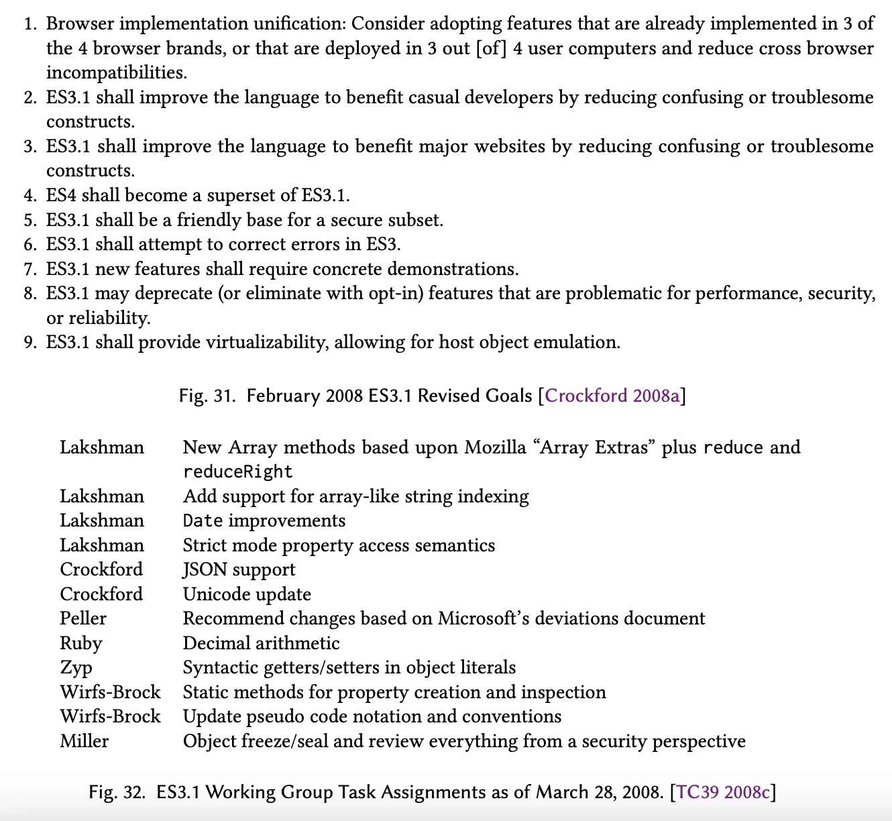
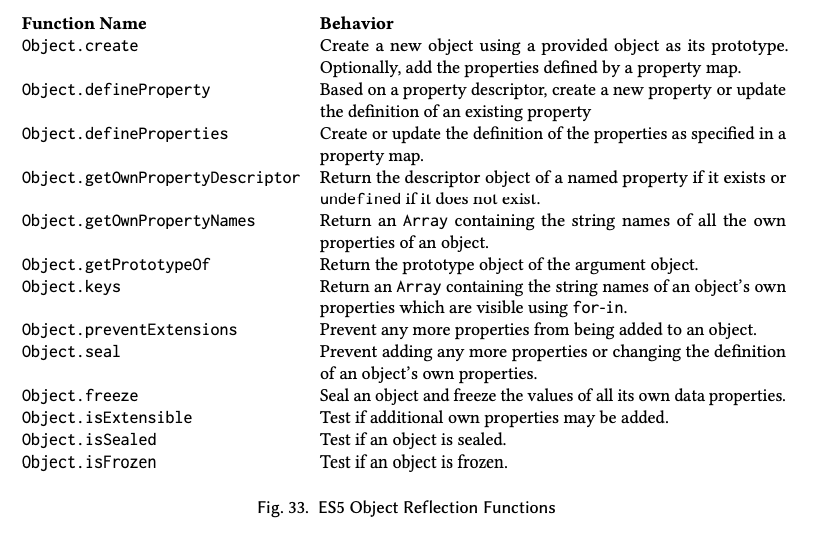
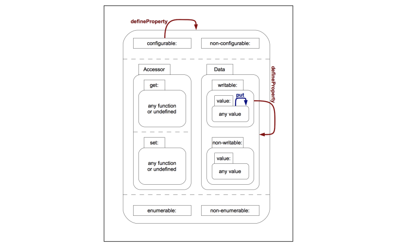
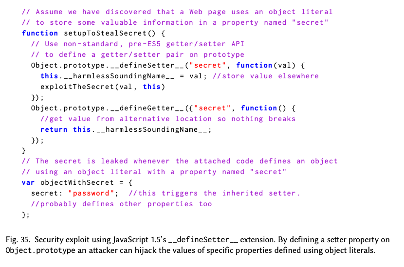
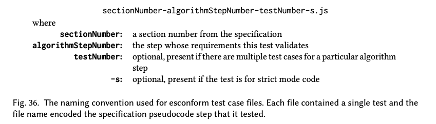
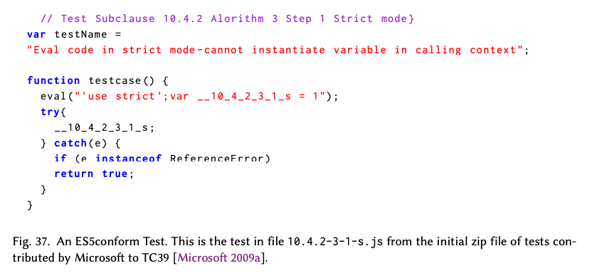

# ES3.1과 ES5의 개발

2007년 대부분의 기간 동안, ES4_2 작업 그룹은 ES3.1 활동이 단순히 ES4_2를 방해하기 위한 경쟁적인 시도이며 기술적 실체가 결여되어 있다고 믿었다. 그러나 Douglas Crockford, Pratap Lakshman, Allen Wirfs-Brock은 ES3 명세를 최신화하고 상호 호환성 문제의 원인들을 수정하는 점진적인 개선을 하는 데에 전념했다. ES3.1의 초기 목표, 설계 원칙, 제안된 기능 변경사항 [Lakshman et al. 2007]을 게시한 후 이루어진 첫 활동은 당시 웹 브라우저에서의 JavaScript의 상태와 웹의 당시 현실이 ES3 명세와 어떻게 다른지에 대한 보다 충분한 이해를 만드는 것이었다.

> **2.15 String.prototype.split: §15.4.4.14**<br/>
> ES3 states that "If separator is a regular expression that contains capturing parentheses, then each time separator is matched the results (including any undefined results) of the capturing parentheses are spliced into the output array."
>
> JScript ignores the capturing parentheses. FF outputs empty strings instead of undefined.<br/>
> Example:<br/> `<script>`<br/>`alert("A<B>bold</B>and<CODE>coded</CODE>".split(/<(\/)?([^<>]+)>/));`<br/>`</script>`
>
> Output:<br/>
> IE: `A`,`bold`,`and`,`coded`<br/>
> FF: `A`,,`B`,`bold`,`/`,`B`,`and`,,`CODE`,`coded`,`/`,`CODE`,<br/>
> Opera: same as FF<br/>
> Safari: same as IE
>
> 그림 29. JScript Deviations 보고서에 문서화된 ES3 명세와 JScript의 차이점

ES3.1 작업 그룹이 당면한 우려는 Microsoft Internet Explorer의 JScript 구현이 웹 표준을 준수하지 않는 것으로 정평이 나 있었다는 것이었다. ECMAScript에 대한 그런 우려의 타당성과 범위를 이해하기 위해, Allen Wirfs-Brock은 Pratap Lakshman에게 IE JScript가 어떤 부분에서 ES3과 다른지 알아내기 위한 분석을 수행하기를 요청했다. 이로 인해 "JScript가 ES3에서 벗어나는 점들"이라는 87페이지 분량의 보고서 [Lakshman 2007c]가 작성되었으며 이 보고서는 2007년 9월에 완성되었다. 보고서에는 세 가지 주요 섹션이 있었다. 첫 번째 주요 섹션은 당시의 JScript 구현이 ES3 명세의 명확한 요구사항에서 벗어난 지점들을 식별했다. ES3를 벗어난 각 부분에 대해 보고서는 ES3 명세 언어에서 위반된 부분, 그 부분을 관찰할 수 있는 테스트 케이스, 그리고 Internet Explorer, Mozilla Firefox, Opera, Apple Safari의 당시 최신 릴리즈에서 해당 테스트를 실행한 결과를 제공했다. 이 브라우저들은 당시 "상위 네 개" 브라우저로 간주되었다. 그림 29는 ES3 명세와의 식별된 차이를 보여주는 예시이다. 일부 차이는 Internet Explorer에만 있었고, 일부는 모든 테스트된 브라우저에서 동일하게 발생했으며, 일부는 Internet Explorer와 다른 하나 또는 두 개의 브라우저에서 발생했다.

보고서의 두 번째 주요 섹션은 ES3 명세에서 동작이 구현에 따라 달라진다고(implementation dependent) 명시적으로 정의되어 있거나 동작이 충분하게 정의되지 않은 모든 부분을 식별했다. 편차 보고서의 두 번째 주요 섹션은 ES3 사양에서 행동이 명시적으로 구현에 따라 달라지거나 충분히 정의되지 않은 모든 장소를 식별했다. 이 섹션 역시 테스트 케이스와 4개의 주요 브라우저에서 테스트를 실행한 결과를 제공했다. 마지막 주요 섹션은 Internet Explorer가 ES3 명세의 확장으로 구현한 기능들을 설명했다. Wirfs-Brock [2007b]은 또한 Firefox의 ES3 확장 목록을 문서화하여 준비했다. Douglas Crockford와 Allen Wirfs-Brock은 2007년 8월 16일에 이러한 문서들의 초안을 검토하기 위해 만났다. 회의 결과는 ES3.1 명세에 대한 잠정적인 변경 사항 집합 [Wirfs-Brock and Crockford 2007]이었다.

Douglas Crockford Yahoo!
Pratap Lakshman Microsoft
Mark S. Miller Google
Adam Peller IBM
Sam Ruby IBM
Allen Wirfs-Brock Microsoft
Kris Zyp The Dojo Foundation

|                   |                     |
| ----------------- | ------------------- |
| Douglas Crockford | Yahoo!              |
| Pratap Lakshman   | Microsoft           |
| Mark S. Miller    | Google              |
| Adam Peller       | IBM                 |
| Sam Ruby          | IBM                 |
| Allen Wirfs-Brock | Microsoft           |
| Kris Zyp          | The Dojo Foundation |

> 그림 30. ES3.1 총회의의 정규 참석자들

ES3.1의 개발은 2008년 1월 TC39 회의에서 본격적으로 시작되었다. 그 회의에서는 ES3.1의 목표가 검토되었고 여러 추가적인 TC39 참여자들이 이 작업에 관심을 표현했다. 2월 11일, Lakshman은 TC39 사설 이메일 리스트에 ES3.1에 대한 활동을 촉구하는 메시지를 보냈다. 이 이메일은 지난 여름에 준비된 ES3과의 차이와 상호 호환성을 다룬 문서에 대한 주의를 불러일으키고 문서에 대한 피드백을 요청했다. 2월 21일의 전화 회의에서 매주 2번씩의 전화 회의 일정이 수립되었다. 이 전화 회의에 참여한 사람들은 이전의 ES3.1 논의에 참여한 사람보다 훨씬 많았다. 그림 30은 정기적으로 참석한 사람들을 나열한다. 처음에는 제안을 주고받고 논의하기 위해 직통 이메일이 사용되었다. 일부 추가적인 ES3.1 관련 논의는 `es4-discuss` 이메일 포럼에서 일어났다. 그러나 ES4_2와 관련된 주제의 이야기들이 ES3.1에 특정된 주제들을 찾기 어렵게 만들었다. 그래서 4월에는 별도의 `es3.1-discuss`[^80] 이메일 포럼 [TC39 et al. 2008]이 생성되었고 각 회의 사이에 이루어지던 ES3.1 설계 논의의 대부분이 그곳으로 이동했다.

[^80]: 2009년 3월 이 이메일 포럼은 `es5-discuss`로 이름이 변경되었다.

ES3.1에 대한 초기 논의 주제 [TC39 2008d] 중 하나는 ES3.1의 전반적인 목표와 문제 해결과 새로운 기능 추가 시에 따라야 할 설계 규칙에 대한 검토였다. Microsoft Live 팀과 여러 웹 프레임워크 개발자들이 지지한 초기의 입장은 기존 또는 구식 브라우저에서 스크립트 파싱을 실패하게 만들 수 있는 새로운 문법 확장을 피하는 것이었다. 하지만 이러한 "no new syntax" 규칙은 지나친 제약이었으며, 이미 각 브라우저들이 어느 정도의 문법 확장들을 가지고 있다는 현실을 무시하는 것이었다. 이 논의는 "4개 중 3개" 규칙으로 이어졌다. 이 규칙은 Microsoft JScipt와 ES3의 편차를 다룬 문서에서 분석된 4개의 가장 널리 알려진 브라우저(Internet Explorer, Firefox, Opera, Safari)를 기반으로 한 규칙이었다. 이 4개의 브라우저 중 3개가 기능에 대해 동의하거나 공통된 동작을 할 때, 그 기능은 ES3.1 명세에 도입되어야 했다. 이 규칙은 ES3.1이 브라우저 상호 호환성 문제에 어떻게 접근해야 하는지에 대한 더 광범위한 논의로 이어졌다.

기존 ES3.1을 개정하는 작업에 있어서 "기존의 웹을 망가뜨리지 않는다"는 것이 원칙이 되어야 한다는 합의가 있었다. 그러기 위해서 주류 웹 브라우저에서 이미 상호 호환되고 있는 기존 웹 페이지의 동작을 바꾸는 문법 변경 사항을 명시하기로 했다. 그러나 기존 웹 페이지는 수백만 개 있었다. 이 웹페이지들은 실제로 ECMAScript 명세의 어떤 측면에 의존하고 있었는가? 어떤 변경 사항이 기존의 웹을 망가뜨릴 것인가? 브라우저 구현자들의 한 보고에 따르면 기존에 너무 방대한 웹 페이지들이 이미 있기 때문에 어떤 상호 호환 가능한 브라우저 기능(아무리 불분명하거나 타당해 보이지 않는 사례라도)이든지 일부의 기존 페이지에서 사용되고 있을 가능성이 높았다. 그 관점에 기반하면 네 개의 주류 브라우저에서 공통적으로 있는 기능은 변경될 수 없었다. 4개 중 3개 브라우저에서 공통으로 있는 기능은 유력한 표준화 후보였다. 그런데 4개 중 2개 브라우저에만 있거나 모든 브라우저 간에 다르게 작동하는 기능은 어떨까? 그런 기능과 동작은 기존의 호환 가능한 웹에 분명 필수적이지 않았고 표준화 과정에서 수정될 수 있었다.

작업 그룹은 ECMAScript 명세 내에서 어떤 부분에 대해서든 구현의 다양성을 허용하게 되면 브라우저 간에 호환 가능한 웹 페이지의 생성이 어려워진다는 점을 알게 되었다. 전통적인 언어의 명세는 언어 구현자에게 유연성을 주기 위해서 혹은 구현 간의 알려진 차이들을 수용하기 위해서 구현에 따른 다양성을 허용하기도 했다. 하지만 그 방식은 독립적으로 제작된 여러 웹 브라우저에서 상호 호환 가능하게 접근할 수 있는 전세계적인 웹이라는 개념에 근본적으로 부합하지 않았다. ECMAScript 명세는 전통적인 언어 명세보다 더 규범적이고 상세해야 했으며, 구현의 다양성을 가능한 한 제거해야 했다. 이러한 2월의 초기 논의를 따라 Douglas Crockford [2008a]는 TC39 위키에 ES3.1의 수정된 목표를 게시했다(그림 31).



2008년 3월의 대면 회의에서 작업 그룹은 ES3.1의 실제 명세 문서 작성을 즉각적으로 시작하는 것이 중요하다는 데 합의했다. Patrap Lakshman은 Mozilla가 유지하는 ES3 정오표의 항목들에 대한 수정을 적용한 ES3 명세를 가지고 회의에 도착했다. 작업 그룹은 그것을 ES3.1의 기반이 되는 문서로 사용하기로 동의하고 Lakshman이 편집자 역할을 해주기로 요청했다. 이전 판들과 마찬가지로, 명세 문서는 Microsoft Word를 사용하여 작성될 예정이었다. 3판으로부터의 변경 사항에 대한 추적은 이후 검토를 위해 명세의 변화를 추적하고 변경 사항들이 ES4_2 활동의 결과물과 이후 재통합될 수 있도록 하기 위해 사용되었다. 작업 그룹의 구성원들은 특정한 새로운 기능에 대한 명세를 개발하도록 할당되었다(그림 32).

2008년 5월 29일, Pratap Lakshman은 TC39 위키에 ES3.1 명세의 초안을 게시했다. 업데이트된 초안은 일반적으로 주마다 게시되었고 "검토 초안"은 매번 TC39 회의 일정의 2주나 3주 전에 게시되었다. 2008년 5월 29일과 2009년 3월 3일 사이에 총 26개의 중간 초안이 게시되었다.

IBM은 오랫동안 JavaScript가 십진법 산술을 지원해야 한다고 주장해 왔다. 1998년 11월 19일의 TC39 작업 그룹 회의에서부터 Mike Cowlishaw는 십진법 산술이 ES3과 ES4_1에 포함되어야 한다고 주장했다. IBM이 TC39에 다시 참여하여 ES42와 ES3.1에 기여하게 되면서 IBM은 다시 십진법 지원의 포함을 강력히 주장했다. IBM에서 나온 회의 참가자들은 십진법 산술의 지원을 포함하지 않는 모든 새로운 언어 표준에 반대하는 것이 IBM의 정책이라고 알렸다. TC39의 많은 사람들은 십진법 산술을 도입하는 것의 타당성에 대해 회의적이었지만 Brendan Eich는 IBM을 지지했다. 그리고 Firefox의 가장 흔한 버그 보고서가 이진 부동 소수점 산술을 이해하지 못하는 Javascript 개발자들로부터 왔다는 것을 지적했다. Eich는 Sam Ruby가 Mozilla의 SpiderMonkey 엔진을 사용하여 프로토타입을 개발하는 것을 도왔다. 프로토타입은 IEEE754-2008 십진 부동 소수점을 구현하고 이를 Number 타입과 함께 섞어서 사용할 수 있는 새로운 원시값 타입으로 취급했다. 이 십진법 기능에 대한 상당히 완성된 명세는 2008년 9월과 2008년 11월의 ES3.1 초안에 포함되었다. 2008년 11월 19일부터 20일까지의 TC39 회의의 목적은 어떤 기능을 ES3.1 초안에서 유지하고 어떤 기능을 제거할지에 대한 최종 결정을 내리는 것이었다. 그 중 가장 첫째로 논의된 항목이 십진법 산술 지원이었다. 위원회의 결론은 십진법 산술의 설계가 여전히 너무 미성숙하며 ES3.1을 지연시키지 않고는 해결될 가능성이 낮은 남은 설계 문제들이 있다는 것이었다. 고려 사항들은 회의록에 문서화되었으며 [TC39 2008a] 결론은 다음과 같았다.

> 이러한 우려들로 인해 십진법 지원의 포함을 ECMAScript의 Harmony 개정까지 연기하기로 결정했다. 참석자들은 ECMAScript 십진법 제안의 개발에서 매우 중요한 진전이 이루어졌음을 인정하고, 이를 개발하는 데에 많은 노력을 한 IBM의 Sam Ruby에게 감사를 표하고자 한다. 회의 참석자들은 Sam Ruby와 다른 TC39 멤버들이 십진법 제안을 계속 개발할 것을 장려한다. 또한 십진법 산술의 완전히 통합되고 일반화된 버전은 Harmony 개정의 중요한 부분이 될 수 있을 것이라는 낙관적인 전망을 표한다.

2009년 1월에 발표된 다음 검토 초안에서 십진법 관련 자료는 빠져 있었다.

2009년 3월 25일–26일 회의 [TC39 2009d]에서 Pratap Lakshman은 자신이 ECMA-262 편집자직에서 사임한다고 발표했다. 그 이유는 Microsoft가 JavaScript 개발의 담당을 Redmond에 기반을 둔 새로운 그룹으로 이전하고 있는데 그가 거기로 재배치될 수 있는 기회를 거절했기 때문이다. 위원회는 Allen Wirfs-Brock을 후임 편집자로 임명했다.

Wirfs-Brock은 그 TC39 회의 중 휴식 시간에 Brendan Eich에게 접근해서 ES3.1을 하나의 숫자 명칭을 가지는 판으로 다시 명명해야 한다고 제안했다고 회상한다. 그렇게 새로 지정하는 것에 대한 근거는 E3.1이 3개의 이전 판만큼이나 중요한 ECMA-262의 완전한 개정판으로 커졌다는 거였다. 중단된 ES4_2 작업이 받은 관심의 양을 고려할 때 ES3.1을 4번째 판으로 지정하는 것은 JavaScript 개발자 커뮤니티와 웹 검색 엔진 모두에 혼란을 야기할 것이었다. 대신, Wirfs-Brock은 Ecma가 ECMA-262 4번째 판 지정을 영구적으로 떠나보내고 ES3.1 작업을 5번째 판으로 발표할 것을 제안했다. Eich는 동의했고 회의가 재개되자 그들은 전체 위원회에 이 아이디어를 제시했고 받아들여졌다. 위원회는 또한 당시의 초안이 회의에서 합의된 개정을 거친 이후 최종 초안으로 받아들이기로 합의했다. 2009년 4월 7일 "최종 초안"이 5번째 판으로 지정되어 발표되었다 [Lakshman et al. 2009]. 그 최종 초안 이후 자잘한 기술적 및 편집적 수정을 거친 5개의 릴리즈 후보 초안이 나왔다. 2009년 8월, Apple은 arguments 객체가 `Array.prototype`을 상속받도록 하는 결정이 Prototype 프레임워크와 예상치 못한 상호작용을 일으켜 여러 Apple 웹사이트와 NASA 웹사이트를 망가뜨렸다는 것을 발견했다[Hunt 2009].이 변경사항은 최종 사양에서 제거되었다.

2009년 9월 23일, TC39[2009b]는 ES5의 완성을 받아들이고 이를 Ecma 총회에 승인을 위해 전달하기로 투표했다. Ecma 총회 검토 및 승인을 위한 최종 초안은 2009년 10월 28일에 게시되었다. *ECMA-262 5번째 판*은 2009년 12월 3일, 3번째 판의 승인 후 10년 만에 총회에 의해 승인되었다 [Ecma
International 2009a]. 총회 투표 결과는 찬성 19표, 반대 2표였다. IBM은 표준이 십진법 산술을 지원하지 않았기 때문에 반대표를 던졌다. Intel은 충분한 시간을 갖고 명세의 완전한 지적 재산권 검토를 할 수 없었다는 것을 반영하여 반대표를 던졌다고 밝혔다.

*ECMA-262 5번째 판*은 ISO/IEC ECMAScript 표준의 패스트 트랙 개정으로 제출되었다. 이는 ISO 공식 기구의 검토 과정을 거쳤고, 그 피드백을 바탕으로 Allen Wirfs-Brock은 명세에 여러 편집 수정사항을 반영하고 표준을 명확하게 하는 과정을 거쳤다. 그 개정은 2011년 6월에 _ECMA-262 Edition 5.1_ 및 *ISO/IEC 16262 Edition 3*으로 발행되었다.

## 20.1 ES5의 기술적 설계(ES5 Technical Design)

기존의 ES3.1의 목표는 매우 소박했지만 그럼에도 ES5는 몇몇 기술적 혁신들을 포함하고 있다.

### 20.1.1 엄격 모드(Strict Mode)

ES5의 엄격 모드(strict mode)는 Javascript 설계에서 "오류와 불편한 부분들을 수정한다"는 Douglas Crockford의 목표의 직접적인 최종 결과물이다. 예약어는 객체 리터럴의 속성 키로도 사용할 수 없고 점(`.`)다음에 사용할 수도 없는 것과 같은 몇몇 불편한 점들은 당시 문법 오류였고 기존 코드의 동작을 변경하지 않고도 ES5에서 수정될 수 있었다. 하지만 Javascript의 많은 잘못된 기능들은 아무런 조건 없이 개선될 수는 없었다. 그렇게 하면 기존 코드의 런타임 동작이 변경될 수도 있었고 이는 "기존 웹을 깨뜨릴" 수 있었다. 엄격 모드의 개념은 JavaScript 개발자들에게 새로운 코드나 업데이트된 코드에서 그러한 수정사항이 포함된 언어의 방언을 명시적으로 선택할 수 있는 기회를 주는 것이었다.

브라우저는 엄격 모드와 기존의 비엄격(non-strict)모드의 코드를 모두 지원해야 했으며, 이상적으로는 개별 함수 수준에서 엄격 모드를 선택할 수 있어야 했다. 기존 스크립트를 엄격 모드를 사용하는 코드로 점진적으로 전환할 수 있도록 하기 위해서였다. 원래의 의도는 시간이 지남에 따라 엄격 모드 문법이 새로운 코드를 작성하는 지배적인 방언이 되는 것이었다. 그러나 첫 도입은 우려의 대상이 되었다. 모든 주요 브라우저가 ES5 엄격 모드를 구현하기까지는 상당한 시간이 걸릴 것으로 추정되었다. 브라우저 게임 이론은 엄격 모드를 선택해서 코드를 작성했을 때 몇몇 주요 브라우저에서 스크립트가 실행되지 않게 된다면 개발자들이 그것을 사용하지 않을 거라고 예측했다. 이 문제는 엄격 모드를 빼는(subtractive) 방식으로 만듦으로써 피해졌다. 엄격 모드는 ECMAScript에 새로운 기능을 추가하지 않았다. 대신 문제가 되는 기능을 제거했다. 버그가 없는 엄격 모드의 코드는 엄격 모드를 지원하지 않는 브라우저에서 실행했을 때도 개발자가 예상한 대로 똑같이 작동해야 한다.

초기의 이슈는 엄격 모드를 작동시킬지 여부를 어떻게 선택할지였다. 엄격 모드의 선택은 스크립트 내에 쉽게 내장될 수 있는 방법으로 이루어져야 했다. 이는 `<script>` 요소의 속성과 같은 외부적인 방법이 될 수 없었다.

ES4 진영에서는 다양한 모드를 선택할 수 있도록 ECMAScript 코드 내에 `use` 지시문을 도입하는 걸 고려하고 있었다. 하지만 그런 지시문은 ES3.1의 "새로운 문법 없음"이라는 설계 규칙을 위반한다. 하나의 가능성은 특별한 형태의 주석을 지시문으로 사용하는 것이었다. 그러나 ES3.1 작업 그룹은 어떤 형태의 주석이든 문법적으로 의미를 갖도록 만들기를 꺼려했다. JavaScript 최소화 도구(minimizer)가 주석을 제거하기 때문이었다. Allen Wirfs-Brock은 ECMAScript _ExpressionStatement_ 구문이 명시적인 세미콜론 혹은 (ASI를 통한) 암시적인 세미콜론으로 끝나는 모든 표현식을 유효한 문장으로 만든다는 것을 관찰했다. 문자열 리터럴 상수만으로 구성된 표현식도 포함해서 말이다. 이는 "use strict";와 같은 문장이 문법적으로 유효한 ES3 코드라는 것을 의미한다. 단순한 상수 값이기 때문에, ES3에서 이를 평가하는 것은 사이드 이펙트가 없다. 그것은 no-op<sup>g</sup>이다. 이러한 문장을 엄격 모드의 선택을 위해 사용하는 것은 안전해 보였으며, 기존의 JavaScript 코드가 그것과 정확히 똑같은 문장을 사용했을 가능성은 매우 낮아 보였다. ES3 구현체는 로드된 모든 ES5 코드에서 그 존재를 무시할 것이다. 작업 그룹은 그 아이디어를 도입했다. 스크립트나 함수 본문의 첫 번째 문장으로 나타나는 `"use strict";` 형태의 문장은 전체 스크립트나 함수가 엄격 모드 문법을 사용하여 처리되어야 함을 나타냈다.

엄격 모드의 주요 목표 중 하나는 분명하지는 않지만 생기기 쉬운 코딩 오류를 런타임에 명시적으로 잡아내는 것이었다. 엄격 모드에는 다음과 같은 새로운 런타임 오류가 추가되었다.

- 선언되지 않은 식별자에 대한 할당. 기존 JavaScript에서는 잘못 입력된 변수 이름에 대한 할당이 전역 객체의 속성 생성으로 이어졌다.
- 읽기 전용의 객체 속성 또는 상속된 속성에 대한 할당. 기존 JavaScript에서는 이것이 아무것도 하지 않는 것으로 조용히 처리되었다.
- 확장할 수 없는 객체에 속성을 생성하려는 시도. ES5 이전에는 그러한 객체가 존재하지 않았지만, 기존 코드와의 일관성을 위해 엄격 모드가 아닌 ES5에서 이 작업을 수행하면 조용히 아무 동작도 하지 않는다.
- 삭제할 수 없는 속성에 대해 delete 연산자를 적용하는 것. 기존 JavaScript에서는 이런 경우 `delete`가 false를 반환했다.
- 변수 참조에 대해 delete 연산자를 적용하면 구문 오류가 발생한다. 기존 JavaScript에서는 명시적으로 선언된 변수에 대해서는 `delete`가 false를 반환한다. 변수 참조가 `with` 문을 통해 객체에 연결되어 있거나 전역 객체의 속성인 경우 기존 JavaScript에서는 삭제된다.

엄격 모드는 또한 프로그램을 더 혼란스럽게 하거나 최적화하기 어렵게 하거나 보안 문제를 일으킬 수 있는 몇몇 기능을 수정하거나 제거했다.

- `with` 문이 허용되지 않는다. `with` 문은 변수 참조의 동적 스코핑 형태를 제공하는데, 이는 개발자에게 혼란을 줄 수 있고 구현체에서 최적화하기 어렵다.
- `eval` 함수를 사용하여 현재 스코프에 새로운 바인딩을 동적으로 추가할 수 없다.
- `eval`과 `arguments`를 변수나 매개변수 이름으로 사용할 수 없다.
- 함수의 `arguments` 객체가 형식 매개변수와 연결되지 않는다 (§3.7.5). 대신, 엄격 모드의 `arguments` 객체는 함수에 전달된 인수 값의 스냅샷을 원소로 갖는 유사 배열 객체이다. 요소를 수정해도 대응되는 형식 매개변수의 값이 수정되지 않으며 그 반대의 경우도 마찬가지다.
- 엄격 모드 함수의 `arguments` 객체에는 `callee` 속성(§5)이 없다. `argument` 객체를 다른 코드에 전달하면 `arguments.callee`를 통해 원래 그 함수를 호출할 수 있는 권한을 암시적으로 전달하게 되었었는데, 이러한 기능은 엄격 모드에서 금지된다[^81].
- 구현체가 엄격 모드 함수의 `arguments` 객체에 `caller` 속성(§3.7.5) 을 제공하는 것이 금지된다. `caller` 속성은 대한 비표준이지만 널리 구현된 ES3의 확장으로, 함수의 호출 스택에서 호출하는 함수를 검색할 수 있게 했다.
- `this` 값을 제공하지 않고 엄격 모드 함수를 호출하면 함수가 전역 객체에 접근할 수 없다.

Douglas Crockford [2007d]의 잘못된 기능과 불편한 점들의 목록에 있는 다른 기능들도 엄격 모드에 도입하는 것이 고려되었지만 포함되지 않았다. 각 기능에 대해서 TC39는 그 기능이 바람직하지 않다는 광범위한 합의에 도달할 수 없었거나, 그 변경 사항이 있던 기능을 제거하기만 하는(subtractive) 형식이 아니라는 게 발견되었다. 예를 들어 Crockford를 포함한 많은 사람들이 JavaScript의 자동 세미콜론 삽입(Automatic Semicolon Insertion)을 좋아하지 않았지만, 많은 개발자들이 명시적인 세미콜론 없이 코딩하는 것을 선호했다. 또한, `typeof null`이 `"object"`가 아닌 다른 것을 반환하도록 변경하는 것은 단순히 기존 기능을 빼는 형식이 아니었다.

### 20.1.2 게터, 세터, 메타 객체 연산자(Getters, Setters, Object Meta Operations)

JavaScript의 첫 구현체부터 특정한 내장 객체나 및 호스트 제공 객체의 일부 속성은 Javascript 코드를 사용하여 생성된 객체에는 사용할 수 없는 특별한 특성을 가지고 있었다. 예를 들어 일부 속성은 읽기 전용 값이거나 `delete` 연산자를 사용하여 삭제할 수 없었다. 그리고 내장 및 호스트 객체의 메서드 속성은 `for-in`문을 사용하여 속성을 열거할 때 건너뛰어졌다. ES1에서 이러한 특별한 시맨틱은 ReadOnly, DontDelete, DontEnum 속성을 객체 속성을 정의한 명세 모델에 연결함으로써 만들어졌다.

이런 속성들은 그 영향을 받는 언어 기능의 시맨틱을 정의하는 의사 코드에 의해 테스트된다. 이 속성들은 구체화되지 않았다. 원래는 Javascript 코드가 새로 생성된 속성이나 기존 속성에 이런 특별한 속성을 부여할 수 있는 기능이 없었다. ES3에서는 DontEnum 속성의 존재를 테스트하기 위한 `Object.prototype.propertyIsEnumerable` 메서드가 추가됐지만 ReadOnly나 DontDelete 속성의 존재를 테스트하기 위한 메소드는 없었다. 마찬가지로 브라우저 DOM이 제공하는 많은 호스트 객체들은 일반적으로 "게터/세터 속성"이라고 불리지만 ES5에서는 "접근자 속성"으로 명명된 속성을 노출한다. 이 게터/세터 속성은 속성의 값이 설정되거나 검색될 때 계산을 수행한다. 이런 기능의 표준화된 지원 부족으로 인해 JavaScript 프로그래머는 내장 객체나 호스트 객체와 동일한 규칙을 따르는 라이브러리를 정의하거나 그러한 객체를 충실히 모방하는 폴리필을 구현할 수 없었다.

[^81]: 이 다른 코드는 알 수 없는 출처에서 올 수도 있었고, 따라서 신뢰할 수 없는 코드일 가능성이 있었다.

이 문제들에 대한 통합 솔루션은 ES5에서 새로 도입된 기능의 가장 큰 집합 중 하나이다. 이 기능 집합의 공식적인 이름은 없지만 비공식적으로 "정적 객체 함수(Static Object Functions)[^82]" 또는 "객체 반영 함수(Object Reflection Functions)"라고 불린다. Allen Wirfs-Brock [2008]은 이 기능 집합에 대한 설계 근거 문서를 작성했다. 이 문서는 유스케이스를 제시하고 다음과 같은 설계 가이드라인을 포함했다.

- 메타 레이어와 어플리케이션 레이어를 명확하게 분리한다.
- 메서드 수와 인자의 복잡성 같은 API의 표면적인 영역을 최소화한다.
- 명명법과 매개변수 설계에 있어서 사용성에 중점을 둔다.
- 가능하다면 설계의 기본 요소를 반복적으로 적용한다[^83].
- 가능한 경우 프로그래머나 구현체가 API의 사용을 정적으로 최적화할 수 있도록 한다.

첫 번째 가이드라인은 `Object.prototype`에 `propertyIsEnumerable`과 같은 추가적인 메서드들을 더하는 것을 좌절시켰다. 그렇게 하면 메타 계층과 애플리케이션 계층의 구분이 더 흐려질 것이기 때문이었다. 그 대신 ES5 작업 그룹은 이러한 함수들을 애플리케이션 객체에서 분리하여 네임스페이스 객체의 속성으로 만들기로 결정했다. 작업 그룹은 네임스페이스 객체로 사용될 새로운 내장 전역 객체 `Reflect`를 추가하는 것을 고려했지만, 기존 코드와의 이름 충돌이 우려되었다. 결국, 그들은 새로운 함수들을 `Object.prototype`의 속성이 아닌 `Object` 생성자의 속성으로 노출하기로 결정했다. `Object` 생성자는 원래부터 전역 객체이며 표준의 이전 버전이나 이전의 구현체에서도 어떠한 속성도 지정되지 않았기 때문에 네임스페이스로 사용하기 적합한 후보였다. 또한 그 이름은 객체의 정의를 반영한다는(reflecting upon) 개념과 일치했다.

다음 문제는 API의 형태를 결정하는 것이었다. ES5 설계자들은 두 번째 가이드라인에 따라 각 속성 어트리뷰트의 할당 함수나 접근자 속성이 수행하는 함수를 설정하고 검색하기 위한 별도의 쿼리를 피하고자 했다. 설계자들은 이 기능을 적은 수의 함수로 결합하는 다양한 방법들을 고려했다. 고려된 가능성에는 "읽기 전용"같은 불리언 어트리뷰트의 비트 인코딩이 포함된 하나의 함수나, 많은 수의 위치 매개변수를 가진 단일 함수가 있었다. 하지만 두 접근 방식 모두 사용성이 나빴다. 선택적 키워드 인자를 사용하는 것이 이러한 사용성 문제를 해결했을지도 모르지만 ES5는 키워드 인자를 지원하지 않았다.

Allen Wirfs-Brock은 다양한 속성 어트리뷰트에 대응하는 속성을 가진 설명자(descriptor) 객체를 사용하기를 제안했다. 이런 설명자는 속성을 정의하고 검사하는 둘 모두의 경우에 사용될 수 있었다. Wirfs-Brock의 첫 번째 초안 제안[^84]은 `obj`라는 객체에 속성을 추가하기 위해 만들어질 수 있는 API의 예를 다음과 같이 보여주었다.

```javascript
Object.addProperty(obj, { name: "pi", value: 3.14159, writable: false });
```

이 예시에서 설명자는 객체 리터럴로 코딩되었다. 그리고 설명자가 누락된 다른 속성 어트리뷰트들에 대해서는 기본값이 사용되었다. 비슷한 설명자를 인수로 받는 가상의 `defineProperty` 함수를 사용하여 기존 속성의 어트리뷰트 값들을 바꿀 수 있었다. `defineProperty`의 경우 주어지지 않은 설명자 속성에 대응하는 어트리뷰트의 경우 수정되지 않고 그대로 유지되었다. 마지막으로, `getProperty` 호출을 사용하여 객체의 기존 속성에 대한 전체 설명자를 얻을 수 있었다.

[^82]: 또는 "메소드(Methods)"라고 할 수도 있다. 네임스페이스로 사용되는 객체와 동작의 추상화로 사용되는 객체의 구분은 개념적인 것이고 언어의 실제 시맨틱에 반영되지 않았다. 일부 JavaScript 프로그래머들은 그 구분을 만들기 위해 "메소드"라는 용어를 사용하지만, 다른 사람들은 사용하지 않는다.
[^83]: 이 말은 개별 기능은 공통의 개념과 문법적 요소들을 가지고 설계되어야 한다는 뜻이다.
[^84]: 이 제안서가 직접적으로 열람 가능하지는 않다. 하지만 Miller의 답장[2008a]이 제안서의 대부분 내용을 포함하고 있다.



Mark Miller는 `defineProperty`가 "새로운 속성 추가"와 "기존 속성의 수정"을 모두 지원할 수 있도록 정의할 수 있다고 하여 제안서를 개선했다. Miller는 또한 속성 설명자에서 `name` 속성을 제거하고 대신 설명자들을 객체로 감싼 후 대상 객체에서 `defineProperty`의 영향을 받을 속성들의 이름을 key로 하여 대응시키자고 제안했다. 이러한 "속성 맵"은 단일 호출을 사용하여 여러 속성을 정의할 수 있게 한다. 예를 들어, 다음 작업은 `x`와 `y`라는 이름의 속성을 정의한다.

```javascript
Object.defineProperties(obj, {
  x: { value: 0, writable: true },
  y: { value: 0, writable: true },
});
```

Miller는 문법에서 `defineProperty`를 제거하고 단일 속성에도 쉽게 사용될 수 있는 `defineProperties` 형태의 함수만 갖도록 하는 것을 제안했다. 하지만 그 형식은 계산된 이름을 갖는 속성을 정의하기 어렵게 했다. ES3.1은 객체 리터럴의 속성명 위치에 계산된 값을 넣는 문법적인 방법이 없었다. 결국 ES3.1은 별도의 인수로 전달된 이름을 키값으로 가지는 단일 속성을 정의하기 위한 `defineProperty`와 속성 맵을 사용하여 여러 속성을 정의할 수 있는 `defineProperties`를 모두 제공했다. ES5에 의해 정의된 객체 반영 함수(Object Reflection Functions)의 전체 집합은 그림 33에서 볼 수 있다.

접근자 속성은 속성 설명자의 대안적 형태를 통해서 지원된다. 접근자 속성은 `value` 속성 대신 `get`, `set` 속성 중 하나 혹은 둘 모두를 갖는 설명자를 사용하여 정의된다. 예를 들어, 데이터 속성에 대한 접근을 매개하는 접근자 속성은 다음과 같이 정의될 수 있다.

```javascript
Object.defineProperties(obj, {
  x: {
    set: function (value) {
      this.privateX = value;
    }, // public accessor property
    get: function () {
      return this.privateX;
    },
  },
  privateX: {
    value: 0,
    writable: true,
  }, // "private" data property
});
```

리플렉션 기반의 이런 인터페이스 이외에도 ES3.1은 객체 리터럴을 사용하여 접근자 속성을 정의할 수 있는 문법적 지원도 추가한다. 이 기능은 이미 4개의 주요 브라우저 중 3개에 있었으므로 새로운 문법을 추가하기 위한 조건을 충족했다. 접근자 속성은 `function` 키워드가 `get` 또는 `set`으로 대체된 함수 정의가 객체 리터럴 내에 포함됨으로써 정의된다. 예를 들어 이런 식이다.

```javascript
var obj = {
  privateX: 0, // a normal data property
  set x(value) {
    this.privateX = value;
  }, // accessor property x setter
  get x() {
    return this.privateX;
  }, // accessor property x getter
  get negX() {
    return -this.privateX;
  }, //a get - only accessor
};
```

이 새로운 기능을 지원하기 위해서는 ES1 명세에서 처음 정의되었던 내부 객체 모델을 확장하고 이를 객체 리플렉션 API를 통해 일부 노출해야 했다. 이는 또한 객체 모델의 용어들을 재고할 기회가 되기도 했다. ES1은 객체 속성이 값과 어트리뷰트들의 집합을 갖는 것으로 설명했다. ES1에서 객체 속성이 갖는 어트리뷰트는 ReadOnly, DontEnum, DontDelete였다. 이러한 ES1의 어트리뷰트들은 상태를 가지고 있지 않았고 속성에 붙어서 해당 어트리뷰트가 있는지를 나타내는 표지(marker)들이었다. ES3.1의 설계자들은 이런 어트리뷰트들을 구체화해서 속성 설명자 객체의 속성으로 만들고자 했다. 이는 내부 모델을 변경함으로써 달성되었다. ES1에 있던 어트리뷰트들을 각 객체 속성과 연관된 상태 변수(Boolean 값을 가짐)로 모델링하고 속성 값 또한 다른 상태 변수로 다시 개념화했다. 어트리뷰트의 내부 명명 규칙은 내부 메서드에 사용되던 이중 대괄호 패턴을 따르도록 변경되었다. 모델은 `[[Get]]`과 `[[Set]]` 속성을 추가함으로써 접근자 속성을 포함하도록 확장되었고 각 속성의 값은 getter와 setter(혹은 기본 함수를 나타내는 `undefined`)함수였다. getter는 값의 참조에 의해 호출되었고 setter는 값의 할당에 의해 호출되었다. 이로써 속성은 `[[Value]]` 속성이 있으며 `[[Get]]`과 `[[Set]]` 속성이 없는 경우 데이터 속성(data property)으로 분류될 수 있었고 그 반대의 경우에는 접근자(accessor property) 속성으로 분류될 수 있었다.

접근자 속성에 대한 지원을 위해서는 ES1에서 원래 정의되었던 `[[Get]]`, `[[Put]]`, `[[CanPut]]` 내부 메서드의 명세를 업데이트해야 했다. 객체 리플렉션 API에서 사용되는 속성 설명자에 대한 지원은 `[[DefineOwnProperty]]`, `[[GetOwnProperty]]`, `[[GetProperty]]` 내부 메소드의 추가를 필요로 했다. 그러나 그 리플렉션 API는 여전히 충분하지 않았다. ES3.1에서 `for-in` 문의 속성 키 열거와 `Object.getOwnPropertyNames`, `Object.keys` 함수는 여전히 시맨틱 명세에서 비공식적인 서술을 사용했다.

객체 리플렉션 API 설계의 마지막 단계는 프로퍼티 설명자 객체 내에서 속성 어트리뷰트를 속성명으로 노출하는 데 사용되는 어휘에 대한 일관적이고 사용하기 쉬운 네이밍 컨벤션을 정하는 것이었다. 특히 DontEnum과 ReadOnly와 같은 이름은 내부적인 일관성이 부족하고 사용성에 대한 문제를 일으켰다. 이들이 Boolean 값 플래그로 처리될 때 특히 그러했다. 예를 들어 속성을 열거 가능하게(enumerable)하려면 DontEnum을 false로 설정해야 했다. 이건 이중 부정이다. 2008년 초 ES4_2 관련 스레드에서 Neil Mix[2008b]는 "enumerable(열거 가능)", "writable(쓰기 가능)", 그리고 "removable(DontDelete에 대한)"이 어트리뷰트에 더 나은 이름이라고 제안했다. Mark Miller[2008b]는 그 이름 제안에 감사를 표했고 어트리뷰트명은 무엇이 금지되는지가 아니라 무엇이 허용되는지를 표현해야 한다는 설계 가이드라인을 제안했다. Miller는 또한 거부를 기본값으로 하는(deny by default)보안에서의 모범 사례를 따를 것을 제안했다. 속성을 정의할 때는 원하는 어트리뷰트를 명시적으로 활성화해야 한다.



객체 리플렉션 API는 이전 버전의 ECMAScript에서 사용할 수 없었던 새로운 기능을 제공했다. 리플렉션 API는 프로그램이 기존 속성의 어트리뷰트를 변경할 수 있게 했고 데이터 속성과 접근자 속성 간의 전환도 가능했다. 그러한 변경을 만들 수 있는 능력도 비활성화하는 추가 속성이 필요한지에 대한 고려도 있었다. 고려된 속성 이름으로는 "dynamic", "flexible", "fixed"등이 있었다. Boolean 값을 가지는 추가적인 속성 어트리뷰트를 추가하는 것이 기존 구현에 미칠 수 있는 영향에 대한 우려가 있었다. 구현체에서 그 어트리뷰트를 나타내는 데 쓸 수 있는 추가 비트를 가지고 있지 않다면 어떻게 될까? 결국 ES3.1 작업 그룹은 속성의 어트리뷰트를 변경하는 것은 속성의 현재 어트리뷰트를 원자적으로 쿼리하고 속성을 지우고 동일한 이름의 속성을 수정된 어트리뷰트 값을 갖게 하여 다시 생성하는 것과 동등하다는 것을 깨달았다. 이러한 동등성을 고려할 때 삭제와 수정을 활성화하는 것 둘 다 하나의 어트리뷰트로 해결할 수 있었다. DontDelete/removable 속성은 "configurable"[^85]로 이름이 변경되었고 그 의미가 할당되었다. Mark Miller가 ES5 속성 어트리뷰트에 대한 상태 다이어그램 [Harel 2007]을 초안했고 [2010b; Figure 34] 이건 ECMAScript 위키에 게시되었다. configurable 어트리뷰트가 false일 때도 속성의 writable 어트리뷰트를 true에서 false로 변경할 수 있다는 점을 관찰할 수 있다. 이런 이상한 부분은 보안 샌드박스<sup>g</sup>가 특정 내장 속성을 non-configurable, writable 어트리뷰트를 가진 상태에서 non-configurable, non-writable로 바꿀 수 있도록 하기 위해 만들어졌다.

Douglas Crockford는 JavaScript 애플리케이션을 객체지향으로 작성할 때 프로토타입 스타일의 사용을 지지했다. 그는 명시적으로 주어진 프로토타입을 갖는 객체를 생성하기 위해 `beget`이라는 함수를 사용하는 것을 홍보했다. ES5 함수 `Object.create`는 옵셔널한 두 번째 매개변수로 속성 맵을 받을 수 있도록 만든 `beget` 함수와 본질적으로 같았다. 예를 들어서 이렇게 사용할 수 있다.

[^85]: "configurable"이라는 용어는 Neil Mix가 제안했다[2008a].

```javascript
var point1 = beget(protoPoint); // Create a point, using Crockford style
point1.x = 0;
point1.y = 0;

var point2 = Object.create(protoPoint, {
  // using ES5 declarative style
  x: {
    value: 0,
  },
  y: {
    value: 0,
  },
});
```

Allen Wirfs-Brock은 JavaScript 프로그래머들이 이러한 선언적 스타일을 도입하기를 바랐고, 구현체들이 그 패턴을 인식하여 객체 생성을 최적화할 것이라고 기대했다. ES5에서 가능해진 이러한 패턴은 사용성 문제로 널리 도입되지 못했다. 문제는 기본 어트리뷰트의 선택에 있었다. 예전 Javascript 1.0에서는 암시적 할당에 의해 생성된 속성은 `{writable: true, enumerable: true, configurable: true}`와 같은 속성 어트리뷰트를 가졌다. 하지만 ES5에서 어트리뷰트 설명자를 설계할 때 사용한 '기본적인 거부(deny-by-default)'정책은 다음과 같은 `Object.create` 선언적 스타일 예시에서 보여지는 것처럼 모든 어트리뷰트가 명시적으로 설정하지 않으면 기본값으로 false를 가지게 했다.

```javascript
// Using Object.create in a Crockford style
var point1 = Object.create(protoPoint);
point1.x = 0;
point1.y = 0;
// point1.x attributes: writable :true, enumerable :true, configurable : true
// point1.x attributes: writable :true, enumerable :true, configurable : true
// using Object . create in a declarative style
var point2 = Object.create(protoPoint, {
  x: {
    value: 0,
  },
  y: {
    value: 0,
  },
});
// point2.x attributes: writable: false, enumerable: false, configurable: false
// point2.x attributes: writable: false, enumerable: false, configurable: false
```

`beget`함수를 사용한 위에서의 예시와 정확히 같은 동작을 가지도록 ES5 Javascript에서 프로그램을 작성하려면 다음과 같이 해야 했다.

```javascript
// Create a point instance, with ES5 support and traditional attribute values
var point2 = Object.create(protoPoint, {
  x: {
    value: 0,
    writable: true,
    enumerable: true,
    configurable: true,
  },
  y: {
    value: 0,
    writable: true,
    enumerable: true,
    configurable: true,
  },
});
```

이 형식은 대부분의 프로그래머에게 너무 장황했다. 대부분의 프로그래머들은 Javascript에서 전통적으로 사용되어 온 보다 허용적인 기본값을 계속 사용하고 싶어했다. 실제로 `Object.create`가 하나의 인자만 받는 형태는 새 객체를 생성하는 데에 일상적으로 사용되며 `Object.defineProperties`는 이전에 생성된 객체의 속성을 정의하고 조작하는 데에 사용된다. 하지만 `Object.create`가 2개의 인자를 받는 형태는 새 객체의 속성을 정의하는 데에 거의 사용되지 않는다.

### 20.1.3 객체 통합과 보안 기능(Object Integrity and Security Features)

Netscape 3에서 도입된 HTML `<script>` 요소의 `src` 속성은 웹 페이지가 여러 웹 서버에서 JavaScript 코드를 로드할 수 있게 했다. 가장 일반적인 형태를 보면 스크립트는 단일 JavaScript 실행 환경으로 로드되었고 전역 네임스페이스를 공유했다. 크로스 사이트 스크립트는 직접적으로 상호작용할 수 있었고 이는 매시업 애플리케이션의 생성을 가능하게 했다. 이러한 크로스 스크립트 로딩 기능은 널리 사용되었고 광고 기반 웹 비즈니스 모델의 핵심 조력자였다. 하지만 크로스 사이트 스크립트는 서로간에, 그리고 페이지의 원래 스크립트와 간섭하고 방해할 수도 있었다. 웹 개발자들은 결국 서드파티 스크립트가 비밀번호와 같은 기밀 사용자 데이터를 도난하거나 사용자를 속이기 위해 페이지의 동작을 변경할 위험이 있다는 것을 깨달았다. 2007년에는 웹 광고 중개인이 모르는 채로 배포한 악성 광고가 관찰되기 시작했다. 브라우저 벤더들은 Content Security Policy (CSP)와 같은 다양한 HTML 및 HTTP 수준의 기능을 개발하여 문제를 해결하려고 했지만, 그러한 수준의 기능이 많은 저수준 JavaScript 취약점을 직접적으로 해결하지는 않았다 [Barth et al. 2009].

Douglas Crockford [ADsafe 2007]와 Mark Miller [Caja Project 2012; Miller et al. 2008]는 ES3.1 작업 그룹에 참여하는 동안, 신뢰할 수 없는 서드파티 JavaScript 코드의 실행을 안전하게 호스팅할 수 있는 JavaScript 실행 샌드박스를 제공하기 위한 기술을 적극적으로 개발하고 있었다. ES3.1의 강력한 후방 호환성 요구사항은 많은 알려진 서드파티 스크립트 취약점을 제거할 수 없다는 것을 의미했다. 하지만 Crockford와 Miller는 호환성을 지키면서도 제거될 수 있는 취약점을 제거하고 안전한 샌드박스의 생성을 가능하게 하는 새로운 기능을 추가하도록 밀어붙였다. 특히 Mark Miller는 객체-능력(object-capabilities)에 기반한 샌드박스를 구축하는 데 필요한 기능에 관심이 있었다 [Miller 2006].

가장 큰 문제는 Javascript 객체의 변경 가능성이었다. 기본적으로 Javascript에서는 객체의 참조를 얻기만 하면 어떤 코드든 객체를 완전히 변경할 수 있었다. 표준 라이브러리 객체를 포함하는 모든 Javascript 객체가 그러했다. 메서드를 포함한 모든 속성은 추가되거나 값이 바뀌거나 삭제될 수 있었다. 이는 직접 참조된 객체와 루트 객체에서 시작해서 간접적으로 참조 가능한 모든 객체에 적용되었다. ES3는 객체의 프로토타입 객체에 대한 참조를 직접 수정하는 방법을 제공하지 않았지만, Internet Explorer를 제외한 모든 주요 브라우저는 객체의 프로토타입 상속 체인을 수정하는 데 사용될 수 있는 비표준 속성 `__proto__`를 구현했다. 이러한 광범위한 변경 가능성의 유일한 예외는 ES3에서 ReadOnly 또는 DontDelete 어트리뷰트로 태그된 소수의 내장 속성들뿐이었다.

Mark Miller와 Douglas Crockford 모두 신뢰할 수 없는 코드에 객체를 넘기기 전에 객체의 속성을 잠글 수 있는 기능을 추가하고 싶어했다. 그들은 샌드박스에 노출된 내장 라이브러리 객체를 보호하고, 샌드박스를 호스팅하는 코드가 신뢰할 수 없는 코드에 전달해야 하는 모든 객체를 보호할 수 있도록 하는 데 그 기능을 사용하려고 했다. DontDelete 어트리뷰트를 Configurable 어트리뷰트로 고치고 `Object.defineProperty`를 사용하여 속성을 non-Configurable로 만들 수 있는 기능은 개별 속성을 보호하는 기본적인 능력을 제공했다. 그러나 이것만으로는 신뢰할 수 없는 코드가 전달받은 객체에 새로운 속성을 추가하는 것을 방지할 수 없었다. 새로운 속성을 추가할 수 있는 능력은 신뢰할 수 없는 코드가 상속된 동작을 덮어쓰고 잠재적으로 개인 데이터를 유출할 수 있는 비밀 통신 채널을 구성할 수 있게 했다. ES5에서는 각 객체에 내부적으로 `[[Extensible]]`이라고 불리는 새로운 상태를 연결함으로써 이 문제를 해결했다. 객체는 처음에 `[[Extensible]]`이 `true`로 설정된 상태로 생성된다. 그러나 객체의 `[[Extensible]]`이 false로 설정되면, 해당 객체에 새로운 속성을 추가할 수 없다. 구현체는 `[[Extensible]]`이 `false`일 때 객체의 `[[Prototype]]`을 변경할 수 있는 어떠한 확장도 제공해서는 안 된다. 마지막으로, `[[Extensible]]`이 한 번 `false`로 설정되면 `true`로 재설정될 수 없다.

함수 `Object.isExtensible`은 객체의 `[[Extensible]]` 상태를 조회하는 API를 제공한다. 함수 `Object.preventExtensions`은 `[[Extensible]]`을 `false`로 강제한다. `Object.freeze`는 `[[Extensible]]`을 `false`로 설정하고 객체가 자체적으로 가지는 모든 속성(역주: 프로토타입을 통해서 접근 가능한 속성이 아니라 객체가 직접적으로 가지고 있는 속성)의 `[[Configurable]]`과 `[[Writable]]` 어트리뷰트를 `false`로 설정하는 편의 함수이다. 이는 객체의 직접적인 상태를 완전히 변경 불가능하게 만든다. 함수 `Object.seal`은 `Object.freeze`와 유사하지만 `[[Writable]]`이 `false`로 설정되지 않는다는 점이 다르다. 이는 객체의 프로토타입과 속성 집합을 고정하지만, 데이터 속성의 값을 수정할 수는 있게 한다.

또 다른 중요한 우려 사항은 전역 객체에 대한 주변의 접근이었다. ECMAScript는 전역 객체의 속성이 전역 스코프에 존재한다고 정의한다. 모든 명명된 표준 라이브러리 객체가 전역 객체의 속성으로 존재하며 대부분의 Javascript 호스팅 환경은 전역 객체에 특정 환경에서만 지원하는 추가적인 객체와 API 함수들을 추가한다. 예를 들어 브라우저에서 전역 객체는 `window` 객체와 동일하다. 그리고 전역 객체는 현재 웹페이지의 DOM 객체와 다른 브라우저 API에 대한 모든 접근을 할 수 있게 한다. 일반적으로 샌드박스는 이런 전역 객체 속성 일부 또는 전부에 대한 접근을 제한하거나, 전역 객체 속성 중 일부에 대한 대체 버전을 제공한다. 이론적으로 봤을 때 이는 모든 샌드박스 내의 코드에 추가적인 렉시컬 스코프를 부여하고 그 스코프가 일부 전역 객체 속성에 대해 대체 바인딩을 제공하거나 해당 전역 객체 속성들에 `undefined` 값을 가진 쉐도우 바인딩을 제공하여 접근을 검열함으로써 달성할 수 있어야 한다. 그러나 렉시컬 스코프에 상관없이 전역 객체에 접근할 수 있는 방법이 Javascript 1.0부터 존재했다.

```js
function getGlobalObject() {
  // when directly called, the value of this is the global object
  return this;
}
getGlobalObject().document.write("pwned");
```

ES5 이전까지 객체를 경유하는 메서드 호출이 아니고 함수를 직접적으로 호출할 시 함수의 암시적인 `this` 인수에 `null`을 전달하며 모든 함수는 실행될 때 `this` 의 값이 `null`이면 `this`의 값을 전역 객체로 대체한다고 명세되어 있었다. 후방 호환성을 위해 기존 코드에서는 이 동작을 변경할 수 없었다. 그러나 ES5의 엄격 모드는 새로운 코드가 새로운 동작을 선택할 수 있는 기회를 제공했다. ES5에서 엄격 모드의 함수는 실제 `this` 인수를 전역 객체로 대체하지 않는다. 샌드박스는 엄격 모드 Javascript 코드만 샌드박스에서 실행되도록 허용함으로써 주변 전역 객체 접근으로부터 자신을 보호할 수 있었다.

ES5가 개발되는 동안, 그림 35에서 보여진 예제와 같은 실제의 악의적인 공격이 웹 상에서 관찰되기 시작했다. ES3는 객체 리터럴을 사용하여 생성된 객체는 `Object.prototype`를 상속받고, 객체 리터럴은 리터럴에 나열된 속성을 새 객체에 넣기 위해 내부 메소드 `[[Put]]`을 사용한다고 명세했다.

그러나 객체의 속성에 값을 할당할 때 `[[Put]]`을 사용하면 같은 이름의 속성을 찾기 위해 프로토타입 상속 체인이 탐색된다. 그러다가 해당 이름을 갖는 setter 속성을 찾으면 그 setter 함수가 실행된다. 만약 그러한 setter가 `Object.prototype`에 있다면 setter와 같은 이름을 가지는 속성을 객체 리터럴을 이용하여 생성하려고 하면 속성값이 setter에게 전달되고 setter가 호출된다.

이러한 서점을 수정하는 건 객체 리터럴의 시맨틱에 대한 breaking change였다. 하지만 브라우저 벤더들이 보안 취약점을 수정하기 위해 기꺼이 수행할 수 있는 종류의 변경이었다. 실제 명세 변경은 간단했다. 객체의 새로운 속성을 생성하기 위해 `[[Put]]` 시맨틱을 사용하는 대신, ES5는 상속된 속성을 항상 무시하고 객체에 직접 새 속성을 생성하는 새로운 내부 메소드 `[[DefineOwnProperty]]`을 사용했다.



ES5는 JavaScript를 더 안전하게 만들 때, 조금씩 나아갈 수밖에 없었다. ES5 작업이 진행되는 동안, Douglas Crockford는 TC39 내에 Secure ECMAScript (SES) 작업 그룹을 구성할 것을 제안했다. 목적 [Crockford 2008d; TC39 2008b]은 후방 호환성에 대한 제약이 없는 ECMAScript의 안전한 방언을 개발할 가능성을 탐색하는 것이었다. SES 작업 그룹은 2008–2009년에 네 번 만나 신뢰할 수 없는 코드의 안전한 평가를 위한 기존 JavaScript 솔루션들 [TC39 2008e]을 검토했다. TC39가 별도의 새로운 방언을 표준화하는 아이디어는 결국 포기되었다. 하지만 객체-능력 모델(object-capability model)과 같은 SES의 개념은 Harmony 활동에 큰 영향을 미쳤다. Ankur Taly 등[2011]은 엄격 모드와 기타 ES5 기능이 어떻게 매시업-친화적(mashup-friendly)인 안전한 ECMAScript 하위 집합의 생성을 가능하게 하는지를 공식화했다.

### 20.1.4 액티베이션 레코드 제거(Elimination of Activation Objects)

ES5 이전에 ECMAScript 명세에서는 ECMAScript 언어의 스코프 시맨틱을 정의하기 위해서 ECMAScript 객체를 명시적으로 사용했다. 각 스코프 윤곽<sup>g</sup>은 액티베이션 레코드(activation object)로 표현되었다. 액티베이션 레코드는 스코프 윤곽에 해당하는 코드에 의해 생성된 변수와 함수 바인딩을 속성으로 가진 일반 ECMAScript 객체였다. 중첩 스코프는 참조된 바인딩을 찾기 위해 순서대로 검색되는 액티베이션 레코드 목록으로 명세되었다. 바인딩을 참조했던 언어 기능은 액티베이션 레코드에 접근할 때 사용자 프로그램에 의해서 정의된 객체 속성에 접근하기 위해 사용하는 속성 접근 연산자를 똑같이 사용했다. ES1과 후속 명세들에서는 액티베이션 레코드가 ECMAScript 프로그램에서 관측할 수 없고 명세에서만 쓰이는 것이라고 명시했다. 하지만 속성 접근 시맨틱은 엔진이 명세를 완전히 준수하는 경우 관찰될 수 있는 몇 가지 예상치 못한 엣지 케이스의 동작을 초래했다. 구현체마다 이런 엣지 케이스의 시맨틱을 구현했는지, 그리고 얼마나 구현했는지에 따른 차이가 있었다.

이상했던 부분 하나는 액티베이션 레코드가 새로 생성된 객체의 기본 프로토타입인 `Object.prototype`을 아마도 상속한다는 것이었다. 이는 `Object.prototype`의 속성을 모든 액티베이션 레코드가 상속하며 이 속성들이 각 액티베이션 레코드의 로컬 바인딩으로 나타나서 외부 스코프에서 동일한 이름을 가지고 있는 다른 바인딩을 가리게(shadowing)된다는 것이었다.

바인딩의 확정은 명세 상에서 동적으로 발생하도록 지정되었고 여기에는 액티베이션 레코드의 속성 조회를 사용했다. 따라서 호출된 함수 내부에서의 모든 자유 참조(free reference)는 참조된 이름의 `Object.prototype` 바인딩을 호출 전에 연결함으로써 덮어써질 수 있었다. 예를 들어 다음과 같은 경우를 보자.(역주: 이렇게 함수 호출 이전에 `Object.prototype`에 새로운 속성을 추가하면 호출된 함수 내에서 내장 Array 생성자 대신 덮어써진 생성자 함수가 대신 사용되었다)

```js
var originalArray = Array;

function AltArray() {
  // this is a replacement for the built -in Array constructor
  // ...
}
// Call a function , forcing it to use AltArray in place of Array
Object.prototype.Array = AltArray;
somethingThatFreelyReferencesArray();
delete Object.prototype.Array; // remove the alternative Array binding
```

다른 이상현상은 ES3에서 `try`문의 `catch`절 매개변수를 `catch`절 본문을 포괄하는 새로운 스코프의 로컬 렉시컬 스코프 바인딩으로 처리하는 것이었다. 스코프 윤곽을 표현하는 데에 ECMAScript 객체를 사용하는 것은 그 시맨틱에 대해서도 문제를 일으켰다. ES5 명세 [Lakshman and Wirfs-Brock 2009, Annex D]는 이 문제를 다음과 같이 설명했다.

> 12.4: ES3에서 `try`문의 `catch` 절에 전달된 예외 매개변수의 이름을 분석할 때 스코프 객체가 생성되었다. 마치 `new Object()`에 의해 생성된 것과 같은 로직으로. 만약 실제 예외 객체가 함수이며 `catch` 절 내부에서 호출된 경우 스코프 객체가 호출의 `this` 값으로 전달되었다. 그러면 함수의 본문은 그 `this` 값에 새로운 속성을 정의할 수 있었고, 그 속성 이름은 함수 반환 후에도 `catch` 절의 스코프 내에서 접근할 수 있는 식별자 바인딩이 되었다. ES5에서는 예외 매개변수가 함수로 호출될 때 `this` 값으로 `undefined`가 전달된다.

2008년 대부분 기간 동안 작업 그룹은 새로운 판에 `const` 선언을 포함시키고자 했다. `const` 선언은 브라우저마다 의미가 다르긴 했지만 4개의 주요 브라우저 중 3개에서 지원하는 기능이었기 때문이다. 계획은 `const`를 블록 레벨 렉시컬 스코프를 가지도록 만드는 것이었다. 그리고 이는 이전 명세들에서 사용된 전통적인 스코핑 모델을 더욱 압박할 것으로 예상되었다.

이 문제들을 해결하기 위해 Allen Wirfs-Brock은 스코프와 바인딩의 새로운 명세 수준 모델을 개발하였다. 이 모델은 식별자 해석 메커니즘에 ECMAScript 객체 시맨틱을 사용하지 않았다. 이 모델은 단일 스코프 윤곽에 대한 바인딩을 포함하는 환경 레코드(environment record)의 개념을 도입했다. 그리고 환경(environment)이 ECMAScript 프로그램에 식별자 해석의 맥락을 제공하는 환경 레코드의 순서 있는 목록이라는 개념도 도입했다. 전역 스코프, 함수 스코프, 블록 스코프, 그리고 with 문 스코프를 나타내는 다양한 종류의 환경 레코드가 있었지만 모든 환경은 개별 바인딩의 정의, 조회, 값 변경에 대한 공통의 명세 수준 프로토콜을 노출했다. 변수 및 다른 종류의 바인딩을 선언하거나 접근하는 언어 기능들은 이 공통 환경 레코드 프로토콜을 사용하여 명시되었다.

그럼에도 불구하고 `const` 선언은 명세의 미래 harmony 판으로 미루어졌다. `const` 선언의 이른 도입으로 인해 향후 블록 스코프 선언의 더 포괄적인 설계를 하는 게 지장을 받을 수 있다는 사실을 작업 그룹이 깨달았기 때문이다. 새로운 스코핑 모델은 기존 스코핑 모델의 이상한 부분을 해결하기 위해 여전히 ES5에서 사용되었다. 그리고 ES6의 더 포괄적인 선언문 집합의 기반을 제공했다.

### 20.1.5 ES5의 다른 기능들(Other ES5 Features)

ES5는 그림 33에 나열된 객체 리플렉션 함수뿐 아니라 다음과 같은 표준 내장 함수, 메서드, 속성들을 추가했다.

- 객체를 JSON 포맷 문자열로 전환하거나 JSON 포맷 문자열을 객체로 전환하는 데 사용되는 `JSON.stringify`와 `JSON.parse` 함수
- `indexOf`, `lastIndexOf`, `every`, `some`, `forEach`, `map`, `filter`, `reduce`, `reduceRight` 총 9개의 새로운 `Array.prototype` 메서드
- `String.prototype.trim` 메서드
- `Date`의 `Date.prototype.now` 메서드와 데이터 문자열을 ISO 8601 형식으로 파싱할 수 있는 확장
- `Function.prototype.bind` 메서드와 함수 인스턴스의 `name` 속성

다음과 같은 자잘한 변경 사항과 개선 사항들도 있었다.

- `with` 문과 `catch` 절 매개변수의 스코핑에서의 시맨틱 수정
- `[]`문법을 사용한 문자열에서의 인덱싱
- 정규 표현식 문법의 작은 수정
- 정규 표현식 리터럴이 평가될 때 매번 새로운 `RegExp` 객체가 생성되도록 변경
- 잘못된 형식의 정규 표현식 리터럴에 대한 조기 에러 검출
- 전역 객체 속성 중 `undefined`, `NaN`, `Infinity`가 읽기 전용 값을 가지도록 변경
- 명세의 모든 알고리즘이 `Object`, `Array`등 내장 객체의 빌트인 값을 사용하도록 변경. 원래는 해당 객체들의 현재 값을 사용하도록 되어 있었음
- 여러 비-규범적인(non-normative) 시맨틱의 명확화와 명세 부록 D, E에 나열되어 있는 수정 사항

## 20.2 구현과 테스트[^86]

2008년 7월 오슬로에서 열린 Ecma TC39 회의에서 위원회는 출판을 진행하기 전에 ES3.1의 두 가지 상호 호환 가능한 구현체를 갖기로 합의했다. 이 "두 가지 상호 운용 가능한 구현" 요구사향의 주된 동기는 위원회가 기술적으로 실행 가능하며 기존 웹 콘텐츠와 호환 가능하다는 것이 입증되지 않은 것을 표준화하지 않도록 보장하기 위함이었다. 모질라는 구현 중 하나를 제공하기로 약속했다. 마이크로소프트가 가진 시장에서의 위치와 역사적으로 빈번하지 않았던 마이크로소프트의 브라우저 업데이트로 인해, 마이크로소프트가 ES3.1 검증 과정의 일부로 공개적으로 사용할 수 있는 브라우저 호스트 프로토타입의 구현체를 만들어서 ES3.1에 대한 그들의 헌신을 보여주어야 한다는 강한 의견이 TC39 내에 있었다. 당시 TC39의 계획은 2009년 6월 Ecma 총회 회의에서 ES3.1을 출판할 수 있게 준비하는 것이었다.

이를 위해서는 2009년 2월/3월에 수행될 상호 호환성 테스트의 결과를 기반으로 하는 2009년 3월 TC39 회의에서 진행에 대한 결정을 해야 했다. 당시에는 ECMA-262와 부합하는 공식 테스트 스위트가 없었으며 ES3.1의 새로운 기능에 대한 테스트는 더더욱 없었다. 모든 구현체는 자체적인 ad hoc 테스트 스위트를 가지고 있었고 마이크로소프트를 제외한 모든 구현체가 Mozilla의 JavaScript 테스트 스위트도 사용했다. 마이크로소프트는 Mozilla 테스트 스위트에 사용된 모질라 공개 라이선스에 대한 우려가 있어 그 테스트 스위트를 사용하거나 거기 기여하지 않았다. 마이크로소프트는 MIT나 BSD 스타일 라이센스를 사용하여 Ecma를 통해 제공될 테스트 스위트를 선호했다.

2008년 10월 Pratap Lakshman은 ES3.1의 인터넷 익스플로러 호스팅 구현과 거기 동반되는 테스트 스위트를 생성하는 두 가지 작업에 착수했다.

구현된 테스트 케이스는 커뮤니티에 기여될 예정이었다. 테스트 스위트의 목표는 명세의 의사 코드에 대해서 최대한의 코드 커버리지를 달성하는 것이었다. 각 테스트 케이스는 명세 최신 초안의 섹션과, 알고리즘 상의 단계 번호를 따라서 이름이 지어졌고 단일 `.js` 소스 파일에 배치되었다. 그림 36은 테스트 파일 이름의 명명에 쓰였던 규칙을 보여준다.

Lakshman은 900개 이상의 테스트 케이스와 개별 테스트 케이스를 실행하고 보고하는 간단한 테스트 도구를 구현했다. 그램 37은 테스트 케이스 중 하나의 예를 보여준다.

[^86]: 이 섹션은 Pratap Lakshman가 기여했다.





2009년 1월 TC39 회의에서 [Horwat 2009], Pratap Lakshman은 ES3.1 프로토타입 구현체를 시연했다. 이 구현체는 막 출시된 마이크로소프트 인터넷 익스플로러 릴리즈 후보 1에 통합된 실험적 버전의 `JSCRIPT.dll`을 사용했다. 이 시연은 새로운 언어 기능과 함께 명세와 일치하는지를 테스트하는 테스트 스위트를 포함했다. 이 노력에 대해 전반적인 찬사가 있었으며 Waldemar Horwat은 그의 회의 노트에서 "사람들이 매우 좋아했다"고 보고했다.

마이크로소프트는 테스트를 Ecma에 기증했다. 그리고 이 테스트를 "ES5conform" [2009]이라는 이름으로 자사의 오픈 소스 프로젝트 포털 `codeplex.com`에도 공개했다. 거의 같은 시기에 Google은 크롬의 V8 JavaScript 엔진을 개발하는 과정에서 생성한 오픈 소스 ES3 테스트 스위트를 공개한다고 발표했다 [Hansen 2009]. 이 테스트 스위트는 "Sputnik"이라고 명명되었고 5,000개 이상의 테스트로 구성되었다.

2010년, ES5conform과 Sputnik은 "Test262"라고 명명된 공통의 Ecma TC39 관리 테스트 스위트의 핵심이 되었다. Ecma 기술 위원회가 소프트웨어 패키지를 유지하고 배포하는 것은 극적인 변화였으며, 이를 실현하기 위해서는 많은 정책 및 라이선스 문제가 해결되어야 했다. Test262 개발의 초기 ES5 단계는 David Fugate가 이끌었다. 그 후 Brian Terlson이 ES6에 대한 Test262를 조직했고 ES6 이후의 시대에는 Leo Balter가 이를 이어받았다. Test262는 이제 TC39의 개발 과정에서 떼려야 뗄 수 없는 부분이 되었고 ECMAScript의 모든 새로운 기능들은 ECMAScript 표준에 통합되기 전에 해당 기능에 대한 테스트를 생성해야 한다. 2018년 8월 21일 기준으로 Test262는 61,877개의 테스트로 구성되어 있다. Test262의 성공은 실행 가능한 명세가 필수적이지 않다는 것을 TC39에게 확신시켜 주었다.
